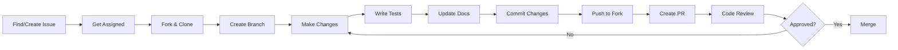
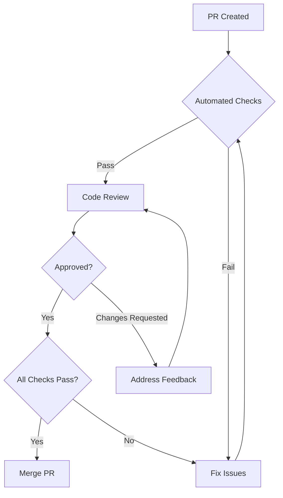
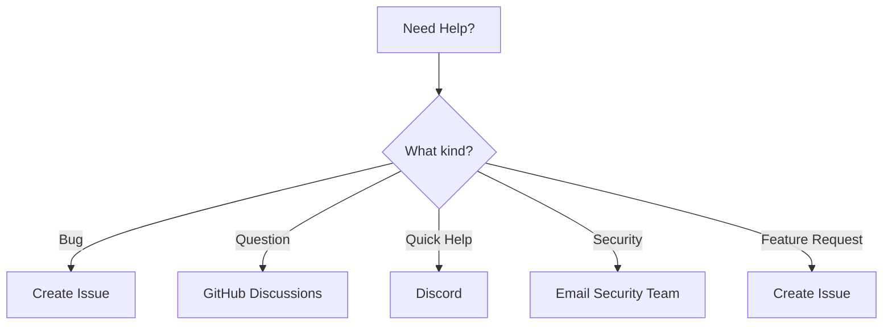

# Contributing to Fabric Management System

<p align="center">
  
  
  
</p>

First off, **THANK YOU** for considering contributing to Fabric Management System! 🎉 It's people like you who make this project amazing. Every contribution, no matter how small, makes a difference.

## 📋 Table of Contents

- [Code of Conduct](#-code-of-conduct)
- [Getting Started](#-getting-started)
- [Development Environment Setup](#-development-environment-setup)
- [How Can I Contribute?](#-how-can-i-contribute)
- [Development Process](#-development-process)
- [Coding Standards](#-coding-standards)
- [Commit Guidelines](#-commit-guidelines)
- [Pull Request Process](#-pull-request-process)
- [Testing Guidelines](#-testing-guidelines)
- [Documentation Standards](#-documentation-standards)
- [Security Guidelines](#-security-guidelines)
- [Community](#-community)
- [Recognition](#-recognition)

## 📜 Code of Conduct

### Our Pledge

We as members, contributors, and leaders pledge to make participation in our community a harassment-free experience for everyone, regardless of age, body size, visible or invisible disability, ethnicity, sex characteristics, gender identity and expression, level of experience, education, socio-economic status, nationality, personal appearance, race, caste, color, religion, or sexual identity and orientation.

### Our Standards

**Examples of behavior that contributes to a positive environment:**

- 🤝 Using welcoming and inclusive language
- 🎯 Being respectful of differing viewpoints and experiences
- 📝 Gracefully accepting constructive criticism
- 💡 Focusing on what is best for the community
- ❤️ Showing empathy towards other community members
- 🎉 Celebrating diversity and inclusion

**Examples of unacceptable behavior:**

- ❌ The use of sexualized language or imagery
- ❌ Trolling, insulting/derogatory comments, and personal attacks
- ❌ Public or private harassment
- ❌ Publishing others' private information without permission
- ❌ Other conduct which could reasonably be considered inappropriate

### Enforcement

Instances of abusive, harassing, or otherwise unacceptable behavior may be reported by contacting the project team at **conduct@fabricmanagement.com**. All complaints will be reviewed and investigated promptly and fairly.

## 🚀 Getting Started

### Prerequisites Checklist

Before you begin, ensure you have:

- [ ] Java 21 or higher installed
- [ ] Docker Desktop 4.0+ installed
- [ ] Maven 3.8+ installed
- [ ] Git configured with your GitHub account
- [ ] Your favorite IDE (IntelliJ IDEA recommended)
- [ ] At least 8GB RAM available
- [ ] 10GB free disk space

### Initial Setup

#### 1️⃣ Fork the Repository


Click the **Fork** button in the top-right corner of the [main repository](https://github.com/fabric-management/fabric-system).

#### 2️⃣ Clone Your Fork

```bash
# Clone your fork
git clone https://github.com/YOUR_USERNAME/fabric-management-system.git

# Navigate to the project directory
cd fabric-management-system

# Add upstream remote
git remote add upstream https://github.com/fabric-management/fabric-system.git

# Verify remotes
git remote -v
```

#### 3️⃣ Set Up Git Hooks

```bash
# Install pre-commit hooks
./scripts/install-hooks.sh

# This will set up:
# - Commit message validation
# - Code formatting check
# - Test execution before push
```

#### 4️⃣ Create Your Branch

```bash
# Sync with upstream
git fetch upstream
git checkout main
git merge upstream/main

# Create feature branch
git checkout -b feature/amazing-feature

# For bugs
git checkout -b fix/bug-description

# For docs
git checkout -b docs/update-description
```

## 🛠️ Development Environment Setup

### Quick Start

```bash
# 1. Install dependencies
./mvnw clean install

# 2. Start infrastructure services
docker-compose up -d postgres-user redis rabbitmq

# 3. Run database migrations
./mvnw flyway:migrate -pl services/user-service

# 4. Start the service
cd services/user-service
../../mvnw spring-boot:run

# 5. Verify everything is working
curl http://localhost:8081/actuator/health
```

### IDE Configuration

#### IntelliJ IDEA Setup

1. **Import Project**
    - File → Open → Select project root
    - Import as Maven project

2. **Enable Annotation Processing**
    - Settings → Build, Execution, Deployment → Compiler → Annotation Processors
    - ✅ Enable annotation processing

3. **Install Plugins**
    - Lombok Plugin
    - Spring Boot Plugin
    - SonarLint
    - CheckStyle-IDEA

4. **Configure Code Style**
    - Settings → Editor → Code Style → Java
    - Import: `config/intellij-java-google-style.xml`

#### VS Code Setup

```json
// .vscode/settings.json
{
  "java.configuration.updateBuildConfiguration": "automatic",
  "java.compile.nullAnalysis.mode": "automatic",
  "java.format.settings.url": "config/eclipse-java-google-style.xml",
  "editor.formatOnSave": true,
  "java.saveActions.organizeImports": true
}
```

### Environment Variables

```bash
# Create .env file from template
cp .env.example .env

# Edit with your values
nano .env
```

## 💡 How Can I Contribute?

### 🐛 Reporting Bugs

Before creating a bug report, please check [existing issues](https://github.com/fabric-management/fabric-system/issues) to avoid duplicates.

#### Bug Report Template

```markdown
### Description
Clear and concise description of the bug.

### Steps to Reproduce
1. Go to '...'
2. Click on '...'
3. Scroll down to '...'
4. See error

### Expected Behavior
What you expected to happen.

### Actual Behavior
What actually happened.

### Screenshots
If applicable, add screenshots.

### Environment
- OS: [e.g., macOS 13.0]
- Java Version: [e.g., 21.0.1]
- Docker Version: [e.g., 24.0.6]
- Service Version: [e.g., 1.0.0]

### Additional Context
Any other context about the problem.
```

### ✨ Suggesting Enhancements

#### Enhancement Request Template

```markdown
### Problem Statement
What problem does this solve?

### Proposed Solution
How would you solve it?

### Alternatives Considered
What other solutions did you consider?

### Additional Context
Any mockups, examples, or references?
```

### 📝 Your First Code Contribution

#### Good First Issues

Look for issues labeled:
- `good first issue` - Simple issues perfect for beginners
- `help wanted` - Issues where we need community help
- `documentation` - Documentation improvements
- `beginner friendly` - Suitable for newcomers

#### Step-by-Step First Contribution

1. **Find an Issue**
   ```bash
   # Visit: https://github.com/fabric-management/fabric-system/labels/good%20first%20issue
   ```

2. **Claim the Issue**
    - Comment: "I'd like to work on this!"
    - Wait for assignment

3. **Work on Your Solution**
    - Follow coding standards
    - Write tests
    - Update documentation

4. **Submit PR**
    - Reference the issue
    - Describe your changes
    - Request review

### 🌍 Translations

Help us reach more developers by translating documentation:

1. Create new file: `docs/README_[LANG_CODE].md`
2. Translate content maintaining structure
3. Add link to main README
4. Submit PR with title: `docs: add [Language] translation`

## 🔄 Development Process

### Workflow Overview



### Branch Naming Convention

| Type | Pattern | Example |
|------|---------|---------|
| **Feature** | `feature/description` | `feature/user-authentication` |
| **Bug Fix** | `fix/description` | `fix/memory-leak` |
| **Hotfix** | `hotfix/description` | `hotfix/critical-security-patch` |
| **Documentation** | `docs/description` | `docs/api-guide` |
| **Performance** | `perf/description` | `perf/query-optimization` |
| **Refactoring** | `refactor/description` | `refactor/user-service` |
| **Test** | `test/description` | `test/integration-tests` |
| **Chore** | `chore/description` | `chore/update-dependencies` |

## 📏 Coding Standards

### Java Code Style

We follow the [Google Java Style Guide](https://google.github.io/styleguide/javaguide.html) with these specifics:

#### Class Structure

```java
package com.fabricmanagement.user.domain.model;

import java.util.UUID;  // Java imports first
import javax.persistence.Entity;  // Then javax

import org.springframework.stereotype.Component;  // Third-party

import com.fabricmanagement.common.domain.BaseEntity;  // Project imports

/**
 * Represents a user in the system.
 * 
 * @author Your Name
 * @since 1.0.0
 */
@Entity
public class User extends BaseEntity {
    
    // 1. Constants
    private static final int MAX_NAME_LENGTH = 100;
    
    // 2. Static fields
    private static Long instanceCount = 0L;
    
    // 3. Instance fields (in order: public, protected, package, private)
    private final UUID id;
    private String firstName;
    private String lastName;
    
    // 4. Constructors
    public User(String firstName, String lastName) {
        this.id = UUID.randomUUID();
        this.firstName = firstName;
        this.lastName = lastName;
        instanceCount++;
    }
    
    // 5. Factory methods
    public static User create(String firstName, String lastName) {
        validateName(firstName);
        validateName(lastName);
        return new User(firstName, lastName);
    }
    
    // 6. Public methods
    public void updateName(String firstName, String lastName) {
        this.firstName = firstName;
        this.lastName = lastName;
        publishEvent(new UserNameUpdatedEvent(this.id));
    }
    
    // 7. Protected methods
    protected void validate() {
        // Validation logic
    }
    
    // 8. Private methods
    private static void validateName(String name) {
        if (name == null || name.length() > MAX_NAME_LENGTH) {
            throw new IllegalArgumentException("Invalid name");
        }
    }
    
    // 9. Getters and Setters
    public UUID getId() {
        return id;
    }
    
    public String getFirstName() {
        return firstName;
    }
    
    // 10. equals, hashCode, toString
    @Override
    public boolean equals(Object o) {
        // Implementation
    }
    
    @Override
    public int hashCode() {
        // Implementation
    }
    
    @Override
    public String toString() {
        return "User{" +
               "id=" + id +
               ", firstName='" + firstName + '\'' +
               '}';
    }
    
    // 11. Inner classes
    private static class UserNameUpdatedEvent {
        private final UUID userId;
        
        UserNameUpdatedEvent(UUID userId) {
            this.userId = userId;
        }
    }
}
```

### Architecture Principles

#### Clean Architecture Layers

```java
// ✅ GOOD: Domain doesn't depend on infrastructure
package com.fabricmanagement.user.domain.repository;

public interface UserRepository {
    User save(User user);
}

// ❌ BAD: Domain depends on Spring
package com.fabricmanagement.user.domain.repository;

import org.springframework.data.jpa.repository.JpaRepository;

public interface UserRepository extends JpaRepository<User, UUID> {
}
```

#### SOLID Principles

```java
// Single Responsibility
public class UserService {
    // Only handles user business logic
}

// Open/Closed
public interface PaymentProcessor {
    void process(Payment payment);
}

public class CreditCardProcessor implements PaymentProcessor { }
public class PayPalProcessor implements PaymentProcessor { }

// Liskov Substitution
public class Rectangle {
    protected int width;
    protected int height;
}

// Interface Segregation
public interface Readable {
    String read();
}

public interface Writable {
    void write(String data);
}

// Dependency Inversion
public class UserService {
    private final UserRepository repository;  // Depend on abstraction
    
    public UserService(UserRepository repository) {
        this.repository = repository;
    }
}
```

### Naming Conventions

| Element | Convention | Good Example | Bad Example |
|---------|------------|--------------|-------------|
| **Package** | lowercase | `com.fabric.user` | `com.Fabric.User` |
| **Class** | PascalCase | `UserService` | `user_service` |
| **Interface** | PascalCase | `Readable` | `IReadable` |
| **Method** | camelCase | `getUserById()` | `GetUserById()` |
| **Variable** | camelCase | `firstName` | `first_name` |
| **Constant** | UPPER_SNAKE | `MAX_RETRY_COUNT` | `maxRetryCount` |
| **Type Parameter** | Single letter or PascalCase | `<T>`, `<UserType>` | `<user>` |
| **Enum** | PascalCase | `UserStatus` | `userStatus` |
| **Enum Value** | UPPER_SNAKE | `ACTIVE`, `INACTIVE` | `active` |

## 📝 Commit Guidelines

We use [Conventional Commits](https://www.conventionalcommits.org/) specification.

### Commit Message Format

```
<type>(<scope>): <subject>

<body>

<footer>
```

### Types

| Type | Description | Example |
|------|-------------|---------|
| **feat** | New feature | `feat(user): add email verification` |
| **fix** | Bug fix | `fix(auth): resolve token expiration issue` |
| **docs** | Documentation | `docs: update API documentation` |
| **style** | Code style (no logic change) | `style: format code with prettier` |
| **refactor** | Code refactoring | `refactor(user): extract validation logic` |
| **perf** | Performance improvement | `perf(db): add index to user table` |
| **test** | Tests | `test(user): add integration tests` |
| **build** | Build system | `build: update Maven dependencies` |
| **ci** | CI/CD | `ci: add GitHub Actions workflow` |
| **chore** | Maintenance | `chore: update .gitignore` |
| **revert** | Revert commit | `revert: revert commit abc123` |

### Scope Examples

- `user-service` - User service changes
- `auth` - Authentication module
- `api` - API changes
- `db` - Database changes
- `docker` - Docker configuration
- `deps` - Dependencies

### Commit Message Examples

#### Simple Feature
```bash
feat(user): add user profile endpoint

Add GET /users/{id}/profile endpoint to retrieve
detailed user profile information including preferences
and settings.
```

#### Bug Fix with Issue
```bash
fix(auth): prevent JWT token replay attacks

Add jti (JWT ID) claim to tokens and maintain a blacklist
of used tokens to prevent replay attacks.

Fixes #234
```

#### Breaking Change
```bash
feat(api)!: change user response format

BREAKING CHANGE: User response now returns nested
address object instead of flat fields.

Before:
{
  "street": "123 Main St",
  "city": "New York"
}

After:
{
  "address": {
    "street": "123 Main St",
    "city": "New York"
  }
}
```

### Commit Hooks

```bash
# Pre-commit hook validates:
- Commit message format
- Code formatting
- No sensitive data
- Tests pass
```

## 🔄 Pull Request Process

### Before Creating a PR

#### Checklist
- [ ] I have read the contributing guidelines
- [ ] I have searched for similar PRs
- [ ] I have updated from upstream main
- [ ] All tests pass locally
- [ ] Code follows style guidelines
- [ ] I have added/updated tests
- [ ] I have updated documentation
- [ ] No sensitive data is included

#### Pre-PR Commands

```bash
# 1. Update from upstream
git fetch upstream
git rebase upstream/main

# 2. Run tests
./mvnw clean test

# 3. Check code style
./mvnw spotless:check

# 4. Check test coverage
./mvnw clean test jacoco:report

# 5. Security scan
./mvnw dependency-check:check

# 6. Build project
./mvnw clean install
```

### PR Template

```markdown
## 📋 Description
Brief description of changes and why they're needed.

## 🔗 Related Issue
Fixes #(issue number)

## 📸 Screenshots
If applicable, add screenshots or GIFs.

## 🧪 Testing
- [ ] Unit tests pass
- [ ] Integration tests pass
- [ ] Manual testing completed

## 📝 Checklist
- [ ] My code follows the style guidelines
- [ ] I have performed self-review
- [ ] I have commented complex code
- [ ] I have updated documentation
- [ ] My changes generate no warnings
- [ ] I have added tests for my changes
- [ ] All tests pass locally
- [ ] I have updated CHANGELOG.md

## 🔄 Type of Change
- [ ] 🐛 Bug fix (non-breaking)
- [ ] ✨ New feature (non-breaking)
- [ ] 💥 Breaking change
- [ ] 📚 Documentation update
- [ ] 🎨 Style update
- [ ] ♻️ Code refactoring
- [ ] ⚡ Performance improvement
- [ ] ✅ Test update
- [ ] 🔧 Configuration change

## 💬 Additional Notes
Any additional information for reviewers.
```

### Review Process



### Review Response Times

| PR Type | Target Response Time |
|---------|---------------------|
| 🔥 Hotfix | < 2 hours |
| 🐛 Bug Fix | < 24 hours |
| ✨ Feature | < 48 hours |
| 📚 Documentation | < 72 hours |

## 🧪 Testing Guidelines

### Test Coverage Requirements

| Layer | Minimum Coverage | Target Coverage |
|-------|-----------------|-----------------|
| **Domain** | 90% | 95% |
| **Application** | 80% | 90% |
| **Infrastructure** | 70% | 80% |
| **Overall** | 80% | 85% |

### Test Categories

#### Unit Tests

```java
@Test
@DisplayName("Should create user with valid data")
void shouldCreateUser_WhenValidDataProvided() {
    // Given (Arrange)
    String firstName = "John";
    String lastName = "Doe";
    TenantId tenantId = TenantId.generate();
    
    // When (Act)
    User user = User.create(firstName, lastName, "johndoe", tenantId);
    
    // Then (Assert)
    assertThat(user)
        .isNotNull()
        .satisfies(u -> {
            assertThat(u.getFirstName()).isEqualTo(firstName);
            assertThat(u.getLastName()).isEqualTo(lastName);
            assertThat(u.getStatus()).isEqualTo(UserStatus.PENDING);
        });
}
```

#### Integration Tests

```java
@SpringBootTest
@AutoConfigureMockMvc
@TestPropertySource(locations = "classpath:application-test.yml")
class UserControllerIntegrationTest {
    
    @Autowired
    private MockMvc mockMvc;
    
    @Test
    @Sql("/test-data/users.sql")
    @DisplayName("Should create user via REST API")
    void shouldCreateUser_WhenValidRequest() throws Exception {
        // Given
        String userJson = """
            {
                "firstName": "Jane",
                "lastName": "Doe",
                "username": "janedoe"
            }
            """;
        
        // When & Then
        mockMvc.perform(post("/api/v1/users")
                .header("X-Tenant-ID", "test-tenant")
                .contentType(MediaType.APPLICATION_JSON)
                .content(userJson))
                .andExpect(status().isCreated())
                .andExpect(jsonPath("$.data.username").value("janedoe"));
    }
}
```

#### Architecture Tests

```java
@ArchTest
static final ArchRule domainShouldNotDependOnInfrastructure = 
    noClasses()
        .that().resideInAPackage("..domain..")
        .should().dependOnClassesThat()
        .resideInAPackage("..infrastructure..")
        .because("Domain should not depend on infrastructure");

@ArchTest
static final ArchRule controllersShouldBeAnnotated =
    classes()
        .that().resideInAPackage("..controller..")
        .should().beAnnotatedWith(RestController.class)
        .because("All controllers should be annotated with @RestController");
```

### Test Data Builders

```java
public class UserTestDataBuilder {
    private String firstName = "John";
    private String lastName = "Doe";
    private String username = "johndoe";
    private UserStatus status = UserStatus.PENDING;
    
    public static UserTestDataBuilder aUser() {
        return new UserTestDataBuilder();
    }
    
    public UserTestDataBuilder withFirstName(String firstName) {
        this.firstName = firstName;
        return this;
    }
    
    public UserTestDataBuilder active() {
        this.status = UserStatus.ACTIVE;
        return this;
    }
    
    public User build() {
        User user = User.create(firstName, lastName, username, TenantId.generate());
        if (status == UserStatus.ACTIVE) {
            user.activate();
        }
        return user;
    }
}

// Usage
User activeUser = aUser()
    .withFirstName("Jane")
    .active()
    .build();
```

## 📚 Documentation Standards

### JavaDoc Requirements

```java
/**
 * Service responsible for user management operations.
 * <p>
 * This service implements the business logic for creating,
 * updating, and managing users in the system.
 * </p>
 * 
 * @author John Doe
 * @since 1.0.0
 * @see UserRepository
 * @see User
 */
@Service
public class UserService {
    
    /**
     * Creates a new user with the provided information.
     * <p>
     * This method validates the input, checks for duplicate
     * usernames, creates the user, and publishes a domain event.
     * </p>
     * 
     * @param command the command containing user creation data
     * @return the created user response
     * @throws DuplicateUsernameException if username already exists
     * @throws ValidationException if input validation fails
     * 
     * @example
     * <pre>{@code
     * CreateUserCommand command = new CreateUserCommand("John", "Doe", "johndoe");
     * UserResponse response = userService.createUser(command);
     * }</pre>
     */
    public UserResponse createUser(CreateUserCommand command) {
        // Implementation
    }
}
```

### API Documentation

```java
@RestController
@RequestMapping("/api/v1/users")
@Tag(name = "User Management", description = "Operations related to user management")
public class UserController {
    
    @PostMapping
    @Operation(
        summary = "Create a new user",
        description = "Creates a new user with the provided information",
        responses = {
            @ApiResponse(
                responseCode = "201",
                description = "User created successfully",
                content = @Content(
                    mediaType = "application/json",
                    schema = @Schema(implementation = UserResponse.class)
                )
            ),
            @ApiResponse(
                responseCode = "400",
                description = "Invalid input",
                content = @Content(
                    mediaType = "application/json",
                    schema = @Schema(implementation = ErrorResponse.class)
                )
            ),
            @ApiResponse(
                responseCode = "409",
                description = "Username already exists"
            )
        }
    )
    public ResponseEntity<ApiResponse<UserResponse>> createUser(
            @Valid @RequestBody CreateUserRequest request,
            @RequestHeader("X-Tenant-ID") @NotNull String tenantId) {
        // Implementation
    }
}
```

### README Updates

When adding new features:

```markdown
## Features

### User Management ✨ NEW
- Create, update, and delete users
- User activation and deactivation
- Bulk operations support
- Advanced search capabilities
```

## 🔒 Security Guidelines

### Security Checklist

- [ ] No hardcoded credentials
- [ ] No sensitive data in logs
- [ ] Input validation implemented
- [ ] SQL injection prevention
- [ ] XSS protection
- [ ] CSRF protection
- [ ] Rate limiting considered
- [ ] Authentication/Authorization proper
- [ ] Dependencies scanned for vulnerabilities

### Reporting Security Issues

⚠️ **Please do not report security vulnerabilities through public GitHub issues.**

Email: security@fabricmanagement.com
PGP Key: [Download](https://fabricmanagement.com/pgp-key.asc)

## 👥 Community

### Communication Channels

| Channel | Purpose | Link |
|---------|---------|------|
| 💬 **Discord** | Real-time chat, quick questions | [Join Server](https://discord.gg/fabric) |
| 💭 **GitHub Discussions** | Long-form discussions, RFCs | [View Discussions](https://github.com/fabric-management/fabric-system/discussions) |
| 📧 **Mailing List** | Announcements, newsletter | [Subscribe](https://groups.google.com/g/fabric-dev) |
| 🐦 **Twitter** | Updates, announcements | [@FabricMgmt](https://twitter.com/FabricMgmt) |
| 📺 **YouTube** | Tutorials, demos | [Channel](https://youtube.com/@FabricManagement) |

### Getting Help



## 🏆 Recognition

### Contributors Wall of Fame

All contributors are recognized in:

- 📝 [README.md](README.md#contributors) - Contributors section
- 📰 [Release Notes](CHANGELOG.md) - Per-release contributors
- 🌐 [Project Website](https://fabricmanagement.com/contributors)
- 🏅 Special badges for regular contributors

### Contribution Levels

| Level | Requirements | Badge |
|-------|-------------|-------|
| 🥉 **Bronze** | 1-5 merged PRs |  |
| 🥈 **Silver** | 6-15 merged PRs |  |
| 🥇 **Gold** | 16-30 merged PRs |  |
| 💎 **Diamond** | 31+ merged PRs |  |
| 🌟 **Core** | Core team member |  |

### Monthly Recognition

Each month we recognize:
- 🏆 **Contributor of the Month** - Most impactful contributions
- 🐛 **Bug Hunter** - Most bugs fixed
- 📚 **Documentation Hero** - Best documentation improvements
- 🎨 **Code Quality Champion** - Best code quality improvements

## 📜 License

By contributing to Fabric Management System, you agree that your contributions will be licensed under the [MIT License](LICENSE.md).

## 🙏 Thank You!

Thank you for taking the time to contribute to Fabric Management System! Every contribution makes a difference, and we're grateful for your support.

<p align="center">
  
</p>

<p align="center">
  Made with ❤️ by the Fabric Management Community
</p>

---

**Questions?** Feel free to reach out:
- 📧 Email: contributors@fabricmanagement.com
- 💬 Discord: [Join our server](https://discord.gg/fabric)
- 💭 Discussions: [Start a discussion](https://github.com/fabric-management/fabric-system/discussions)

**Happy Contributing!** 🚀