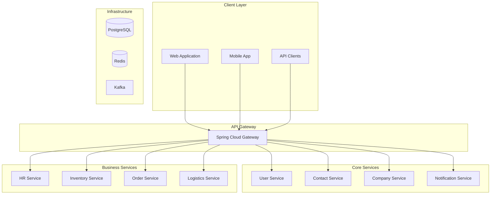

# 🏭 Fabric Management System

[](https://openjdk.java.net/projects/jdk/21/)
[](https://spring.io/projects/spring-boot)
[](https://spring.io/projects/spring-cloud)
[](LICENSE)
[]()

> **Modern, scalable, and enterprise-ready microservice architecture for fabric management**

## 🎯 Overview

The Fabric Management System is a comprehensive, multi-tenant microservice platform built with modern Java technologies. It provides end-to-end solutions for fabric manufacturing, inventory management, order processing, and business analytics.

### ✨ Key Features

- 🏗️ **Microservice Architecture** - Scalable, maintainable, and fault-tolerant
- 🔐 **Enterprise Security** - JWT-based authentication with OAuth2 support
- 📊 **Real-time Analytics** - Business intelligence and reporting
- 🚀 **Event-Driven** - CQRS and Event Sourcing patterns
- 🌐 **Multi-tenant** - Isolated tenant data and configurations
- 📱 **RESTful APIs** - OpenAPI 3.0 compliant
- 🐳 **Containerized** - Docker and Kubernetes ready
- 📈 **Observability** - Full monitoring, tracing, and logging

## 🏗️ Architecture



## 🚀 Quick Start

### Prerequisites

- **Java 21** or higher
- **Maven 3.9+**
- **Docker** and **Docker Compose**
- **PostgreSQL 16**
- **Redis 7**

### 🐳 Docker Setup (Recommended)

```bash
# Clone the repository
git clone https://github.com/your-org/fabric-management-backend.git
cd fabric-management-backend

# Start all services with Docker Compose
docker-compose up -d

# Check service health
docker-compose ps
```

### 🛠️ Local Development

```bash
# Build all modules
mvn clean install

# Start infrastructure services
docker-compose up -d postgres-db redis kafka

# Start individual services
cd services/user-service
mvn spring-boot:run
```

## 📚 Documentation

| Document                                    | Description                                 |
| ------------------------------------------- | ------------------------------------------- |
| [🏗️ Architecture Guide](docs/architecture/) | System architecture and design patterns     |
| [🔌 API Documentation](docs/api/)           | REST API specifications and examples        |
| [👨‍💻 Development Guide](docs/development/)   | Setup, coding standards, and best practices |
| [🚀 Deployment Guide](docs/deployment/)     | Production deployment and operations        |
| [🧪 Testing Guide](docs/testing/)           | Testing strategies and automation           |

## 🏢 Services

### Core Services

- **[User Service](services/user-service/)** - Authentication, user profiles, and session management
- **[Contact Service](services/contact-service/)** - Contact information and communication preferences
- **[Company Service](services/company-service/)** - Company management and multi-tenancy
- **[Notification Service](services/notification-service/)** - Email, SMS, and push notifications

### Business Services

- **[HR Service](services/hr-service/)** - Human resources, payroll, and leave management
- **[Inventory Service](services/inventory-service/)** - Stock management and product catalog
- **[Order Service](services/order-service/)** - Order processing and fulfillment
- **[Logistics Service](services/logistics-service/)** - Shipping and delivery management

### Infrastructure Services

- **[API Gateway](infrastructure/api-gateway/)** - Request routing and load balancing
- **[Service Discovery](infrastructure/service-discovery/)** - Service registry and health checks
- **[Config Server](infrastructure/config-server/)** - Centralized configuration management

## 🛠️ Technology Stack

### Backend

- **Java 21** - Latest LTS version
- **Spring Boot 3.5.5** - Application framework
- **Spring Cloud 2025.0.0** - Microservice tools
- **Spring Security 6.1.4** - Security framework

### Database & Persistence

- **PostgreSQL 16** - Primary database
- **Redis 7** - Caching and session store
- **Flyway** - Database migrations
- **Hibernate 6.4** - ORM framework

### Messaging & Events

- **Apache Kafka 3.5.1** - Event streaming
- **Schema Registry** - Event schema management
- **Event Sourcing** - Event-driven architecture

### Observability

- **Micrometer** - Metrics collection
- **Prometheus** - Metrics storage
- **Grafana** - Visualization
- **Jaeger** - Distributed tracing

### DevOps

- **Docker** - Containerization
- **Kubernetes** - Orchestration
- **Helm** - Package management
- **Terraform** - Infrastructure as Code

## 🧪 Testing

```bash
# Run all tests
mvn test

# Run integration tests
mvn verify

# Generate test coverage report
mvn jacoco:report
```

## 📊 Monitoring

Access monitoring dashboards:

- **API Gateway**: http://localhost:8080/actuator
- **Service Health**: http://localhost:8080/actuator/health
- **Metrics**: http://localhost:9090 (Prometheus)
- **Dashboards**: http://localhost:3000 (Grafana)
- **Tracing**: http://localhost:16686 (Jaeger)

## 🤝 Contributing

We welcome contributions! Please see our [Contributing Guide](docs/development/contributing.md) for details.

### Development Workflow

1. Fork the repository
2. Create a feature branch (`git checkout -b feature/amazing-feature`)
3. Commit your changes (`git commit -m 'Add amazing feature'`)
4. Push to the branch (`git push origin feature/amazing-feature`)
5. Open a Pull Request

## 📄 License

This project is licensed under the MIT License - see the [LICENSE](LICENSE) file for details.

## 🆘 Support

- 📧 **Email**: support@fabricmanagement.com
- 💬 **Discord**: [Join our community](https://discord.gg/fabric-management)
- 📖 **Documentation**: [docs.fabricmanagement.com](https://docs.fabricmanagement.com)
- 🐛 **Issues**: [GitHub Issues](https://github.com/your-org/fabric-management-backend/issues)

## 🙏 Acknowledgments

- Spring Framework team for the amazing ecosystem
- Apache Kafka community for event streaming
- PostgreSQL team for the robust database
- All contributors and maintainers

---

<div align="center">

**Built with ❤️ by the Fabric Management Team**

[⭐ Star this repo](https://github.com/your-org/fabric-management-backend) • [🐛 Report Bug](https://github.com/your-org/fabric-management-backend/issues) • [💡 Request Feature](https://github.com/your-org/fabric-management-backend/issues)

</div>
