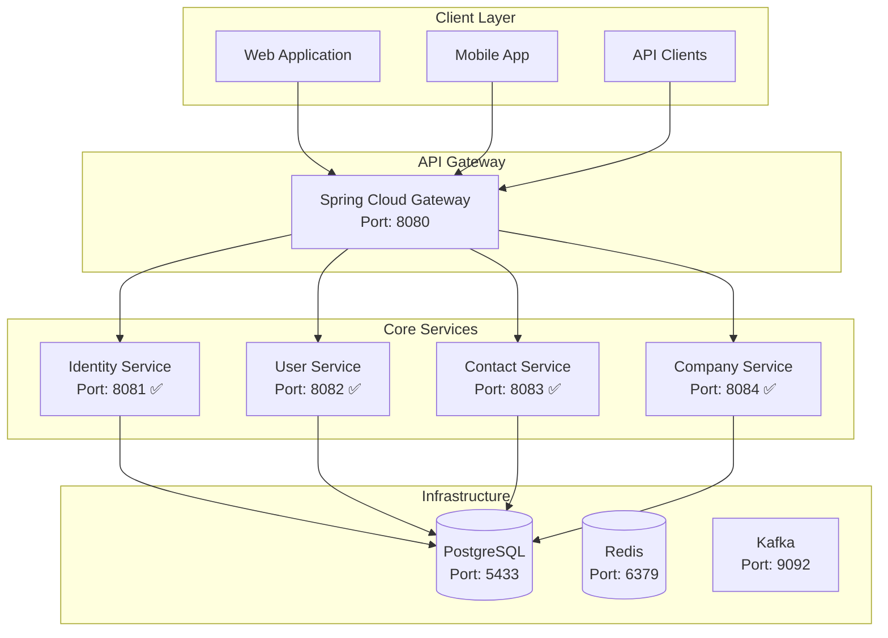

# 🏭 Fabric Management System

<div align="center">


**A comprehensive multi-tenant fabric management system built with microservices architecture**

[](https://github.com/yourusername/fabric-management-system)
[](https://github.com/yourusername/fabric-management-system)
[](LICENSE)

</div>

## 📋 Table of Contents

- [🎯 Overview](#-overview)
- [🏗️ Architecture](#️-architecture)
- [🚀 Quick Start](#-quick-start)
- [📚 Documentation Hub](#-documentation-hub)
- [🛠️ Technology Stack](#️-technology-stack)
- [📦 Project Structure](#-project-structure)
- [🔧 Development](#-development)
- [🧪 Testing](#-testing)
- [🚀 Deployment](#-deployment)
- [📊 Service Status](#-service-status)
- [🎯 Roadmap](#-roadmap)
- [🤝 Contributing](#-contributing)
- [📞 Support](#-support)

## 🎯 Overview

Fabric Management System is a **comprehensive enterprise-grade solution** designed for fabric manufacturing companies. Built with modern microservices architecture, it provides complete business process management from raw material procurement to finished product delivery.

### ✨ Key Features

- **🏢 Multi-Tenant Architecture**: Support for multiple companies
- **🔐 Enterprise Security**: JWT-based authentication with RBAC
- **📊 Real-time Analytics**: AI-powered insights and reporting
- **🔄 Event-Driven**: Asynchronous communication with Kafka
- **📱 Modern UI**: Responsive web and mobile applications
- **☁️ Cloud-Ready**: Docker and Kubernetes deployment
- **🔍 Observability**: Comprehensive monitoring and tracing

### 🎯 Business Domains

| Domain                  | Services                                          | Status      |
| ----------------------- | ------------------------------------------------- | ----------- |
| **👤 Identity & Users** | Identity, User, Contact, Company                  | ✅ Complete |
| **👥 HR Management**    | HR, Payroll, Leave, Performance                   | 🚧 Planned  |
| **📦 Inventory**        | Inventory, Catalog, Pricing, Procurement, Quality | 🚧 Planned  |
| **📋 Orders**           | Order, Logistics, Production                      | 🚧 Planned  |
| **💰 Finance**          | Accounting, Invoice, Payment, Billing             | 🚧 Planned  |
| **🤖 AI & Analytics**   | AI, Reporting, Notification                       | 🚧 Planned  |

## 🏗️ Architecture

This project implements **modern software architecture principles**:

- **🏛️ Microservices Architecture**: Independent, scalable services
- **🎯 Domain-Driven Design (DDD)**: Business logic at the center
- **🧹 Clean Architecture**: Clear separation of concerns
- **🔌 Hexagonal Architecture**: Ports and Adapters pattern
- **📊 CQRS**: Command Query Responsibility Segregation
- **🔄 Event-Driven**: Asynchronous communication patterns

### 📊 System Overview



## 🚀 Quick Start

### Prerequisites

- **Java 21** or higher
- **Docker & Docker Compose**
- **Maven 3.8+**
- **Git**

### 🏃‍♂️ Running the Application

1. **Clone the repository:**

```bash
git clone https://github.com/yourusername/fabric-management-system.git
cd fabric-management-system
```

2. **Start infrastructure services:**

```bash
docker-compose up -d postgres-db redis kafka
```

3. **Build the project:**

```bash
./mvnw clean install
```

4. **Run services:**

```bash
# Identity Service (Port: 8081)
cd services/identity-service && ../../mvnw spring-boot:run

# User Service (Port: 8082)
cd services/user-service && ../../mvnw spring-boot:run

# Contact Service (Port: 8083)
cd services/contact-service && ../../mvnw spring-boot:run

# Company Service (Port: 8084)
cd services/company-service && ../../mvnw spring-boot:run
```

5. **Access the services:**

- **Identity Service**: http://localhost:8081/api/identity
- **User Service**: http://localhost:8082/api/v1/users
- **Contact Service**: http://localhost:8083/api/v1/contacts
- **Company Service**: http://localhost:8084/api/v1/companies

## 📚 Documentation Hub

### 🏛️ Architecture Documentation

| Document                                                                             | Description                         | Status      |
| ------------------------------------------------------------------------------------ | ----------------------------------- | ----------- |
| [📋 Architecture Overview](docs/architecture/README.md)                              | Complete architecture documentation | ✅ Complete |
| [🏗️ System Architecture](docs/architecture/FABRIC_MANAGEMENT_SYSTEM_ARCHITECTURE.md) | Visual system overview              | ✅ Complete |
| [🔄 Service Relationships](docs/architecture/SERVICE_RELATIONSHIPS_DIAGRAM.md)       | Service communication patterns      | ✅ Complete |
| [🚨 Port Configuration](docs/architecture/PORT_CONFIGURATION_DIAGRAM.md)             | Port allocation and conflicts       | ✅ Complete |
| [🎯 Optimized Protocol](docs/architecture/OPTIMIZED_MICROSERVICE_PROTOCOL.md)        | Best practices and standards        | ✅ Complete |

### 🛠️ Development Documentation

| Document                                                          | Description                    | Status      |
| ----------------------------------------------------------------- | ------------------------------ | ----------- |
| [🚀 Getting Started](docs/development/getting-started.md)         | Setup and installation guide   | ✅ Complete |
| [📦 Project Structure](docs/development/project-structure.md)     | Code organization and patterns | ✅ Complete |
| [⚙️ Configuration Guide](docs/development/configuration-guide.md) | Environment configuration      | ✅ Complete |
| [🔧 Contributing](docs/development/contributing.md)               | Development guidelines         | ✅ Complete |

### 📖 API Documentation

| Service              | API Documentation                                          | Status      |
| -------------------- | ---------------------------------------------------------- | ----------- |
| **Identity Service** | [API Docs](docs/api/core-services/identity-service-api.md) | ✅ Complete |
| **User Service**     | [API Docs](docs/api/core-services/user-service-api.md)     | ✅ Complete |
| **Contact Service**  | [API Docs](docs/api/core-services/contact-service-api.md)  | ✅ Complete |
| **Company Service**  | [API Docs](docs/api/core-services/company-service-api.md)  | ✅ Complete |

### 🚀 Deployment Documentation

| Document                                                   | Description            | Status      |
| ---------------------------------------------------------- | ---------------------- | ----------- |
| [🐳 Docker Setup](docs/deployment/docker-setup.md)         | Container deployment   | ✅ Complete |
| [☸️ Kubernetes](docs/deployment/k8s/)                      | K8s deployment configs | ✅ Complete |
| [🔧 Production Setup](docs/deployment/production-setup.md) | Production deployment  | 🚧 Planned  |

### 🔗 Integration Documentation

| Document                                                                      | Description                  | Status      |
| ----------------------------------------------------------------------------- | ---------------------------- | ----------- |
| [🔗 Service Integration](docs/integration/README.md)                          | Inter-service communication  | ✅ Complete |
| [🔄 Event Flows](docs/integration/INTER_SERVICE_EVENT_FLOWS.md)               | Event-driven architecture    | ✅ Complete |
| [👤 Identity-User Integration](docs/integration/identity-user-integration.md) | Service integration patterns | ✅ Complete |

### 🧪 Testing Documentation

| Document                                                  | Description                  | Status      |
| --------------------------------------------------------- | ---------------------------- | ----------- |
| [🧪 Testing Guide](docs/testing/README.md)                | Testing strategies and tools | ✅ Complete |
| [🔄 UUID Migration](docs/testing/UUID_MIGRATION_GUIDE.md) | Database migration guide     | ✅ Complete |

### 📊 Quality & Metrics

| Document                                             | Description              | Status      |
| ---------------------------------------------------- | ------------------------ | ----------- |
| [📊 Quality Metrics](docs/QUALITY_METRICS_REPORT.md) | Code quality and metrics | ✅ Complete |

## 🛠️ Technology Stack

### 🎯 Core Technologies

| Technology          | Version  | Purpose                 |
| ------------------- | -------- | ----------------------- |
| **Java**            | 21       | Programming language    |
| **Spring Boot**     | 3.5.5    | Application framework   |
| **Spring Cloud**    | 2025.0.0 | Microservices framework |
| **Spring Security** | 6.1.4    | Security framework      |
| **Maven**           | 3.8+     | Build tool              |

### 🗄️ Data & Storage

| Technology     | Version | Purpose            |
| -------------- | ------- | ------------------ |
| **PostgreSQL** | 15      | Primary database   |
| **Redis**      | 7       | Caching layer      |
| **Flyway**     | 10.15.0 | Database migration |
| **Hibernate**  | 6.x     | ORM framework      |

### 🔄 Messaging & Communication

| Technology       | Version | Purpose               |
| ---------------- | ------- | --------------------- |
| **Apache Kafka** | 3.5.1   | Message broker        |
| **Spring Kafka** | 3.x     | Kafka integration     |
| **OpenFeign**    | 4.x     | Service communication |

### 🐳 Infrastructure

| Technology         | Version | Purpose                 |
| ------------------ | ------- | ----------------------- |
| **Docker**         | Latest  | Containerization        |
| **Docker Compose** | Latest  | Local development       |
| **Kubernetes**     | 1.28+   | Container orchestration |
| **Helm**           | 3.x     | K8s package manager     |

### 📊 Monitoring & Observability

| Technology     | Version | Purpose             |
| -------------- | ------- | ------------------- |
| **Prometheus** | Latest  | Metrics collection  |
| **Grafana**    | Latest  | Dashboards          |
| **Jaeger**     | Latest  | Distributed tracing |
| **Micrometer** | Latest  | Metrics abstraction |

## 📦 Project Structure

```
fabric-management-backend/
├── 📚 docs/                           # Complete documentation
│   ├── 📋 README.md                   # This file
│   ├── 🏛️ architecture/              # Architecture docs
│   ├── 🛠️ development/               # Development guides
│   ├── 📖 api/                        # API documentation
│   ├── 🚀 deployment/                 # Deployment guides
│   ├── 🔗 integration/                # Integration docs
│   ├── 🧪 testing/                    # Testing guides
│   └── 📊 quality/                    # Quality metrics
├── 🔧 common/                         # Shared libraries
│   ├── common-core/                   # Core utilities
│   └── common-security/               # Security utilities
├── 🏭 services/                        # Microservices
│   ├── identity-service/              # Authentication & Authorization
│   ├── user-service/                   # User management
│   ├── contact-service/                # Contact management
│   ├── company-service/                 # Company management
│   ├── hr-service/                     # HR management (planned)
│   ├── inventory-service/              # Inventory management (planned)
│   ├── order-service/                  # Order management (planned)
│   ├── logistics-service/               # Logistics management (planned)
│   ├── production-service/              # Production management (planned)
│   ├── accounting-service/              # Accounting (planned)
│   ├── ai-service/                     # AI & Analytics (planned)
│   └── notification-service/            # Notifications (planned)
├── 🚀 deployment/                      # Deployment configs
│   ├── docker/                        # Docker configurations
│   └── k8s/                           # Kubernetes configurations
├── 📝 scripts/                        # Utility scripts
├── 🐳 docker-compose.yml              # Local development
├── 📋 pom.xml                         # Maven configuration
└── 📄 README.md                       # This file
```

## 🔧 Development

### 🏗️ Building the Project

```bash
# Clean build all modules
./mvnw clean install

# Build specific service
./mvnw clean install -pl services/user-service -am

# Skip tests during build
./mvnw clean install -DskipTests

# Build with specific profile
./mvnw clean install -Pprod
```

### 🏃‍♂️ Running Services

```bash
# Run all services with Docker Compose
docker-compose up -d

# Run specific service
docker-compose up user-service

# Run service locally
cd services/user-service
../../mvnw spring-boot:run
```

### 🔧 Development Tools

```bash
# Code formatting
./mvnw spotless:apply

# Dependency updates
./mvnw versions:display-dependency-updates

# Database migration
./mvnw flyway:migrate -pl services/user-service

# Generate API documentation
./mvnw springdoc-openapi:generate
```

## 🧪 Testing

### 🧪 Test Types

| Test Type             | Command                     | Coverage   |
| --------------------- | --------------------------- | ---------- |
| **Unit Tests**        | `./mvnw test`               | ✅ 80%+    |
| **Integration Tests** | `./mvnw verify`             | ✅ 70%+    |
| **Contract Tests**    | `./mvnw test -Pcontract`    | 🚧 Planned |
| **Performance Tests** | `./mvnw test -Pperformance` | 🚧 Planned |

### 🧪 Running Tests

```bash
# Run all tests
./mvnw test

# Run tests with coverage
./mvnw clean test jacoco:report

# Run specific test class
./mvnw test -Dtest=UserServiceTest

# Run integration tests
./mvnw verify

# Run tests in parallel
./mvnw test -T 4
```

### 📊 Test Reports

- **Coverage Report**: `target/site/jacoco/index.html`
- **Test Results**: `target/surefire-reports/`
- **Integration Results**: `target/failsafe-reports/`

## 🚀 Deployment

### 🐳 Docker Deployment

```bash
# Build all images
docker-compose build

# Deploy to production
docker-compose -f docker-compose.prod.yml up -d

# Scale services
docker-compose up -d --scale user-service=3
```

### ☸️ Kubernetes Deployment

```bash
# Deploy to Kubernetes
kubectl apply -f deployment/k8s/

# Check deployment status
kubectl get pods -n fabric-management

# View logs
kubectl logs -f deployment/user-service -n fabric-management
```

### 🔧 Environment Configuration

| Environment     | Configuration             | Status      |
| --------------- | ------------------------- | ----------- |
| **Local**       | `application-local.yml`   | ✅ Complete |
| **Development** | `application-dev.yml`     | ✅ Complete |
| **Staging**     | `application-staging.yml` | 🚧 Planned  |
| **Production**  | `application-prod.yml`    | 🚧 Planned  |

## 📊 Service Status

### ✅ Completed Services (4/24)

| Service              | Port | Status      | Documentation                                              |
| -------------------- | ---- | ----------- | ---------------------------------------------------------- |
| **Identity Service** | 8081 | ✅ Complete | [API Docs](docs/api/core-services/identity-service-api.md) |
| **User Service**     | 8082 | ✅ Complete | [API Docs](docs/api/core-services/user-service-api.md)     |
| **Contact Service**  | 8083 | ✅ Complete | [API Docs](docs/api/core-services/contact-service-api.md)  |
| **Company Service**  | 8084 | ✅ Complete | [API Docs](docs/api/core-services/company-service-api.md)  |

### 🚧 Planned Services (20/24)

| Category           | Services                                          | Priority  | Timeline    |
| ------------------ | ------------------------------------------------- | --------- | ----------- |
| **HR Management**  | HR, Payroll, Leave, Performance                   | 🔴 High   | Weeks 5-6   |
| **Inventory**      | Inventory, Catalog, Pricing, Procurement, Quality | 🔴 High   | Weeks 7-8   |
| **Business**       | Order, Logistics, Production                      | 🔴 High   | Weeks 9-10  |
| **Finance**        | Accounting, Invoice, Payment, Billing             | 🔴 High   | Weeks 11-12 |
| **AI & Analytics** | AI, Reporting, Notification                       | 🟡 Medium | Weeks 13-14 |

### 🚨 Critical Issues

| Issue                   | Priority    | Status        | Solution                                                                   |
| ----------------------- | ----------- | ------------- | -------------------------------------------------------------------------- |
| **Port Conflicts**      | 🔴 Critical | ⚠️ Identified | [Port Configuration](docs/architecture/PORT_CONFIGURATION_DIAGRAM.md)      |
| **Missing API Gateway** | 🔴 High     | ❌ Missing    | [Optimized Protocol](docs/architecture/OPTIMIZED_MICROSERVICE_PROTOCOL.md) |
| **Security Hardening**  | 🔴 High     | ⚠️ Partial    | [Security Protocol](docs/architecture/OPTIMIZED_MICROSERVICE_PROTOCOL.md)  |
| **Monitoring Setup**    | 🟡 Medium   | ❌ Missing    | [Monitoring Guide](docs/deployment/monitoring-setup.md)                    |

## 🎯 Roadmap

### 🎯 Phase 1: Critical Fixes (Week 1) 🔥

- [ ] **Port Conflict Resolution**

  - Fix Contact Service port: 8083
  - Fix Company Service port: 8084
  - Update all configuration files

- [ ] **Configuration Standardization**
  - Environment-based configuration
  - Standardized application.yml templates
  - Docker Compose updates

### 🏗️ Phase 2: Infrastructure (Week 2) 🏗️

- [ ] **API Gateway Implementation**

  - Spring Cloud Gateway setup
  - Route configuration
  - Rate limiting and circuit breakers

- [ ] **Service Discovery**
  - Eureka Server implementation
  - Service registration and health checks

### 🔒 Phase 3: Security (Week 3) 🔒

- [ ] **JWT Enhancement**

  - Secure JWT secret management
  - Token refresh mechanism
  - Multi-tenant JWT claims

- [ ] **Authentication Service**
  - Centralized authentication
  - OAuth2/OpenID Connect
  - Role-based access control

### 📊 Phase 4: Monitoring (Week 4) 📊

- [ ] **Metrics Collection**

  - Prometheus setup
  - Custom business metrics
  - Performance monitoring

- [ ] **Distributed Tracing**
  - Jaeger implementation
  - Request tracing
  - Performance analysis

### 🚀 Phase 5: Service Implementation (Weeks 5-12) 🚀

- [ ] **HR Services** (Weeks 5-6)
- [ ] **Inventory Services** (Weeks 7-8)
- [ ] **Business Services** (Weeks 9-10)
- [ ] **Financial Services** (Weeks 11-12)

## 🤝 Contributing

We welcome contributions! Please read our [Contributing Guide](docs/development/contributing.md) for details.

### 🚀 Quick Contribution Guide

1. **Fork the repository**
2. **Create a feature branch**: `git checkout -b feature/amazing-feature`
3. **Make your changes**
4. **Write tests** for your changes
5. **Run tests**: `./mvnw test`
6. **Commit changes**: `git commit -m 'Add amazing feature'`
7. **Push to branch**: `git push origin feature/amazing-feature`
8. **Open a Pull Request**

### 📋 Development Guidelines

- Follow [Clean Architecture](docs/development/project-structure.md) principles
- Write comprehensive tests (80%+ coverage)
- Use [Common Modules](docs/common/COMMON_MODULES_APPROACH.md) approach
- Follow [API Standards](docs/architecture/OPTIMIZED_MICROSERVICE_PROTOCOL.md)
- Update documentation for new features

## 📞 Support

### 🆘 Getting Help

- **📖 Documentation**: Check our [Documentation Hub](#-documentation-hub)
- **🐛 Bug Reports**: [Create an issue](https://github.com/yourusername/fabric-management-system/issues)
- **💡 Feature Requests**: [Create an issue](https://github.com/yourusername/fabric-management-system/issues)
- **💬 Discussions**: [GitHub Discussions](https://github.com/yourusername/fabric-management-system/discussions)

### 📧 Contact

- **Email**: support@fabricmanagement.com
- **GitHub**: [@yourusername](https://github.com/yourusername)
- **LinkedIn**: [Your Profile](https://linkedin.com/in/yourprofile)

## 📄 License

This project is licensed under the **MIT License** - see the [LICENSE](LICENSE) file for details.

## 🙏 Acknowledgments

- **Spring Boot Team** for the excellent framework
- **Domain-Driven Design Community** for architectural guidance
- **Clean Architecture** principles by Robert C. Martin
- **Microservices Patterns** by Chris Richardson
- **Open Source Community** for amazing tools and libraries

---

<div align="center">

**Made with ❤️ by the Fabric Management Team**

[](https://github.com/yourusername/fabric-management-system)
[](docs/README.md)
[](docs/development/contributing.md)

</div>
