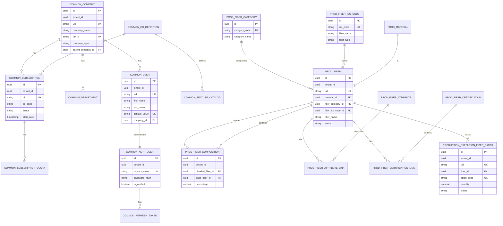

# Database Schema Visualization

Bu dökümantasyon, Fabric Management sisteminin veritabanı yapısını ve tablo ilişkilerini gösterir.

## Schema Yapısı

### 1. Common Platform Schemas

#### `common_company` - Şirket ve Abonelik Yönetimi

- **common_company**: Şirket bilgileri
- **common_department**: Departmanlar
- **common_os_definition**: OS tanımları (YarnOS, LoomOS, vb.)
- **common_subscription**: Kiracı abonelikleri
- **common_feature_catalog**: Özellik kataloğu
- **common_subscription_quota**: Abonelik kotaları

#### `common_user` - Kullanıcı Yönetimi

- **common_user**: Platform kullanıcıları

#### `common_auth` - Kimlik Doğrulama

- **common_auth_user**: Kimlik doğrulama bilgileri
- **common_refresh_token**: JWT yenileme tokenları
- **common_verification_code**: Doğrulama kodları

#### `common_policy` - Yetkilendirme

- **common_policy**: Politika tanımları (RBAC/ABAC)

#### `common_audit` - Denetim

- Denetim logları

### 2. Production Schemas

#### Fiber Master Data (Reference)

- **prod_fiber_category**: Fiber kategorileri (NATURAL_PLANT, NATURAL_ANIMAL, vb.)
- **prod_fiber_attribute**: Fiber özellikleri (durable, biodegradable, vb.)
- **prod_fiber_certification**: Sertifikalar (GOTS, OEKO-TEX, vb.)
- **prod_fiber_iso_code**: ISO 2076 kodları (CO, PES, PA, vb.)

#### Fiber Business Data

- **prod_material**: Material catalog (base table)
- **prod_fiber**: Fiber örnekleri (pure veya blend)
- **prod_fiber_composition**: Fiber karışım bileşimi (Many-to-Many)
- **prod_fiber_attribute_link**: Fiber-özellik ilişkisi (Many-to-Many)
- **prod_fiber_certification_link**: Fiber-sertifika ilişkisi (Many-to-Many)

#### Production Execution

- **production_execution_fiber_batch**: Fiber lot/parti takibi

## Relationship Diagram



## Tablo İlişkileri Detayları

### 1. Common Platform Hierarchy

```
common_company (Company)
  ├─ common_user (Users)
  │   └─ common_auth_user (Authentication)
  ├─ common_department (Departments)
  └─ common_subscription (Subscriptions)
      └─ common_subscription_quota (Quotas)
```

### 2. Fiber Domain Hierarchy

```
prod_fiber_category (Reference)
prod_fiber_attribute (Reference)
prod_fiber_certification (Reference)
prod_fiber_iso_code (Reference)
    ↓
prod_material (Base Catalog)
    ↓
prod_fiber (Concrete Fiber Instances)
  ├─ prod_fiber_composition (Blend Composition)
  ├─ prod_fiber_attribute_link (Attributes)
  ├─ prod_fiber_certification_link (Certifications)
  └─ production_execution_fiber_batch (Physical Batches)
```

## Foreign Key Relationships

### Production Execution → Fiber Master Data

```sql
-- Fiber Batch references Fiber Master Data
production_execution_fiber_batch.fiber_id
  → prod_fiber.id
```

### Fiber → Material

```sql
-- Each fiber is a material
prod_fiber.material_id
  → prod_material.id (1:1)
```

### Fiber Composition

```sql
-- Many-to-Many: Blended fibers contain base fibers
prod_fiber_composition.blended_fiber_id
  → prod_fiber.id

prod_fiber_composition.base_fiber_id
  → prod_fiber.id
```

### Fiber Attributes

```sql
-- Many-to-Many: Fibers have attributes
prod_fiber_attribute_link.fiber_id
  → prod_fiber.id

prod_fiber_attribute_link.attribute_id
  → prod_fiber_attribute.id
```

### Fiber Certifications

```sql
-- Many-to-Many: Fibers have certifications
prod_fiber_certification_link.fiber_id
  → prod_fiber.id

prod_fiber_certification_link.certification_id
  → prod_fiber_certification.id
```

## Schema Bazlı Gruplama

### Common Schemas (Platform Layer)

- **common_company**: Şirket yönetimi
- **common_user**: Kullanıcı yönetimi
- **common_auth**: Kimlik doğrulama
- **common_policy**: Yetkilendirme
- **common_audit**: Denetim

### Production Schemas (Business Layer)

- **prod*fiber*\***: Fiber referans tabloları
- **prod_fiber**: Fiber iş verileri
- **production*execution*\***: Üretim yürütme

## Tenant Isolation

Tüm tablolarda `tenant_id` sütunu bulunur:

- Multi-tenant yapı
- Veri izolasyonu
- Özel olarak işaretlenen `SYSTEM_TENANT_ID = 00000000-0000-0000-0000-000000000000` platform seviyesi referans verileri için

## Indexes

Her tabloda yaygın indeksler:

- `idx_{table}_tenant_id`: Tenant bazlı sorgular
- `idx_{table}_tenant_id_active`: Aktif kayıtlar için composite index
- Unique constraints: `uid`, `contact_value`, vb.
- Foreign key indexes: FK sütunları için
