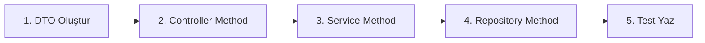

# 🚀 Developer Handbook - Hızlı Başlangıç Kılavuzu

## 📍 Neredeyim? Ne Yapacağım?

Bu doküman, projede çalışmaya başlayan her developer için **tek kaynak** kılavuzdur. Aşağıdaki adımları takip ederek hızlıca üretime geçebilirsiniz.

---

## 🎯 1. İlk 30 Dakika - Kurulum

### Gereksinimler

```bash
# Kontrol et
java -version      # Java 21+
mvn -version       # Maven 3.9+
docker --version   # Docker 20+
```

### Projeyi Başlat

```bash
# 1. Clone
git clone <repo-url>
cd fabric-management-backend

# 2. Infrastructure'ı başlat
./scripts/deploy.sh --infra-only

# 3. Build
mvn clean install

# 4. Servisleri başlat
./scripts/deploy.sh --services-only
```

✅ **Tebrikler!** Sistem http://localhost:8080 adresinde çalışıyor.

---

## 📂 2. Kod Nereye Yazılır?

### 🎨 Yeni Feature Eklerken

#### A. Controller (API Endpoint)

```java
// 📍 NEREYE: services/[servis-adı]/src/main/java/.../api/controller/
@RestController
@RequestMapping("/api/v1/users")
public class UserController {

    @PostMapping
    public ResponseEntity<ApiResponse<UserDTO>> createUser(
            @Valid @RequestBody CreateUserRequest request) {
        UserDTO user = userService.createUser(request);
        return ResponseEntity.ok(ApiResponse.success(user));
    }
}
```

#### B. Service (İş Mantığı)

```java
// 📍 NEREYE: services/[servis-adı]/src/main/java/.../application/service/
@Service
@RequiredArgsConstructor
@Transactional
public class UserService {
    private final UserRepository userRepository;
    private final UserMapper userMapper;

    public UserDTO createUser(CreateUserRequest request) {
        // İş mantığı burada
        User user = userMapper.toEntity(request);
        user = userRepository.save(user);
        return userMapper.toDTO(user);
    }
}
```

#### C. Repository (Veri Erişimi)

```java
// 📍 NEREYE: services/[servis-adı]/src/main/java/.../infrastructure/persistence/
@Repository
public interface UserRepository extends JpaRepository<User, UUID> {
    Optional<User> findByEmail(String email);
    boolean existsByEmail(String email);
}
```

#### D. Entity (Veritabanı Tablosu)

```java
// 📍 NEREYE: services/[servis-adı]/src/main/java/.../domain/entity/
@Entity
@Table(name = "users")
@Data
@EqualsAndHashCode(callSuper = true)
public class User extends BaseEntity {

    @Column(nullable = false, unique = true)
    private String email;

    @Column(nullable = false)
    private String firstName;

    private String lastName;
}
```

#### E. DTO (Data Transfer)

```java
// 📍 NEREYE: services/[servis-adı]/src/main/java/.../api/dto/
@Data
@Builder
public class UserDTO {
    private UUID id;
    private String email;
    private String firstName;
    private String lastName;
}
```

#### F. Mapper (Dönüşüm)

```java
// 📍 NEREYE: services/[servis-adı]/src/main/java/.../application/mapper/
@Mapper(componentModel = "spring")
public interface UserMapper {
    UserDTO toDTO(User user);
    User toEntity(CreateUserRequest request);
}
```

---

## 🔄 3. Tipik İş Akışları

### 🆕 Yeni Endpoint Ekleme



**Adım Adım:**

1. **Request/Response DTO**

```java
// api/dto/CreateProductRequest.java
@Data
@Builder
public class CreateProductRequest {
    @NotBlank
    private String name;

    @Positive
    private BigDecimal price;
}
```

2. **Controller Endpoint**

```java
// api/controller/ProductController.java
@PostMapping("/products")
public ResponseEntity<ApiResponse<ProductDTO>> createProduct(
        @Valid @RequestBody CreateProductRequest request) {
    return ResponseEntity.ok(
        ApiResponse.success(productService.createProduct(request))
    );
}
```

3. **Service Logic**

```java
// application/service/ProductService.java
public ProductDTO createProduct(CreateProductRequest request) {
    // Validation
    if (productRepository.existsByName(request.getName())) {
        throw new DuplicateEntityException("Product already exists");
    }

    // Create & Save
    Product product = productMapper.toEntity(request);
    product = productRepository.save(product);

    // Return DTO
    return productMapper.toDTO(product);
}
```

4. **Test**

```java
// src/test/java/.../ProductServiceTest.java
@Test
void shouldCreateProduct() {
    // Given
    CreateProductRequest request = CreateProductRequest.builder()
        .name("Test Product")
        .price(BigDecimal.valueOf(99.99))
        .build();

    // When
    ProductDTO result = productService.createProduct(request);

    // Then
    assertNotNull(result);
    assertEquals("Test Product", result.getName());
}
```

---

## 🗄️ 4. Database İşlemleri

### Migration Ekleme

```sql
-- 📍 NEREYE: services/[servis-adı]/src/main/resources/db/migration/V2__add_product_table.sql
CREATE TABLE products (
    id UUID PRIMARY KEY DEFAULT gen_random_uuid(),
    name VARCHAR(255) NOT NULL UNIQUE,
    price DECIMAL(10,2) NOT NULL,
    created_at TIMESTAMP DEFAULT CURRENT_TIMESTAMP,
    updated_at TIMESTAMP DEFAULT CURRENT_TIMESTAMP
);

CREATE INDEX idx_products_name ON products(name);
```

### Migration Çalıştırma

```bash
./scripts/run-migrations.sh [servis-adı]
```

---

## 🔗 5. Servisler Arası İletişim

### Senkron (REST)

```java
// 📍 NEREYE: infrastructure/client/
@FeignClient(name = "user-service")
public interface UserServiceClient {
    @GetMapping("/api/v1/users/{id}")
    UserDTO getUser(@PathVariable UUID id);
}
```

### Asenkron (Kafka)

```java
// 📍 NEREYE: infrastructure/messaging/
@Component
public class UserEventPublisher {
    @Autowired
    private KafkaTemplate<String, Object> kafkaTemplate;

    public void publishUserCreated(UserCreatedEvent event) {
        kafkaTemplate.send("user-events", event);
    }
}
```

---

## ✅ 6. Kontrol Listesi

### Her Feature İçin

- [ ] DTO oluşturuldu
- [ ] Controller endpoint eklendi
- [ ] Service method yazıldı
- [ ] Repository method eklendi (gerekiyorsa)
- [ ] Mapper tanımlandı
- [ ] Unit test yazıldı
- [ ] Integration test yazıldı
- [ ] API dokümantasyonu eklendi
- [ ] Migration yazıldı (gerekiyorsa)

### Commit Öncesi

- [ ] `mvn clean test` başarılı
- [ ] `mvn spotless:apply` çalıştırıldı
- [ ] Linter hataları yok
- [ ] Branch güncel (rebase/merge)

---

## 🐛 7. Troubleshooting

### Sık Karşılaşılan Sorunlar

#### 1. "Connection refused" hatası

```bash
# Çözüm: Infrastructure'ı kontrol et
docker-compose ps
./scripts/deploy.sh --infra-only
```

#### 2. "Bean not found" hatası

```java
// Çözüm: Component scan'i kontrol et
@SpringBootApplication
@ComponentScan(basePackages = "com.fabricmanagement")
```

#### 3. "Table not found" hatası

```bash
# Çözüm: Migration'ları çalıştır
./scripts/run-migrations.sh
```

#### 4. Test failures

```bash
# Çözüm: Test containers'ı kontrol et
docker ps | grep testcontainers
mvn clean test -Dspring.profiles.active=test
```

---

## 📚 8. Hızlı Referanslar

### Komutlar

```bash
# Build
mvn clean install

# Test
mvn test

# Specific service
cd services/user-service && mvn spring-boot:run

# Docker
docker-compose up -d
docker-compose logs -f [service-name]

# Database
psql -h localhost -p 5433 -U fabric_user -d fabric_management
```

### Portlar

- **8080**: API Gateway
- **5433**: PostgreSQL
- **6379**: Redis
- **9092**: Kafka
- **3000**: Prometheus
- **3001**: Grafana

### Environment Variables

```bash
export SPRING_PROFILES_ACTIVE=local
export DB_HOST=localhost
export DB_PORT=5433
export KAFKA_BOOTSTRAP_SERVERS=localhost:9092
```

---

## 🎓 9. Öğrenme Kaynakları

### Proje Dokümanları

- [Architecture Overview](architecture/README.md) - Sistem mimarisi
- [Development Principles](development/PRINCIPLES.md) - Kodlama standartları
- [API Documentation](api/README.md) - API referansı
- [Database Guide](database/DATABASE_GUIDE.md) - Veritabanı kılavuzu

### Best Practices

- [Spring Boot Analysis](analysis/SPRING_BOOT_BEST_PRACTICES_ANALYSIS.md)
- [Microservice Analysis](analysis/MICROSERVICE_DEVELOPMENT_ANALYSIS.md)

---

## 💡 10. Pro Tips

### 🚀 Hızlı Geliştirme

```bash
# Hot reload için
mvn spring-boot:run -Dspring-boot.run.fork=false

# Sadece değişen servisi build et
mvn install -pl services/user-service -am

# Parallel test execution
mvn test -T 4
```

### 🔍 Debug

```java
// Application.yml'e ekle
logging:
  level:
    com.fabricmanagement: DEBUG
    org.springframework.web: DEBUG
```

### 📊 Performance

```java
// Yavaş query'leri bul
spring.jpa.properties.hibernate.generate_statistics=true
spring.jpa.properties.hibernate.format_sql=true
```

---

## ⚡ Özet: 5 Dakikada Başla

1. **Clone & Build**

```bash
git clone <repo> && cd fabric-management-backend
./scripts/deploy.sh --all
```

2. **Yeni Feature**

```bash
# 1. Branch oluştur
git checkout -b feature/my-feature

# 2. Kod yaz (yukarıdaki şablonları kullan)
# 3. Test et
mvn test

# 4. Commit & Push
git add .
git commit -m "feat: add my feature"
git push origin feature/my-feature
```

3. **PR Aç**

- GitHub'da PR oluştur
- CI/CD pipeline'ı bekle
- Review al
- Merge!

---

## 🆘 Yardım

- **Slack**: #fabric-dev
- **Email**: dev-team@fabric.com
- **Wiki**: [Internal Wiki](https://wiki.fabric.com)
- **Office Hours**: Salı & Perşembe 14:00

---

**Son Güncelleme**: October 2025
**Versiyon**: 1.0.0
