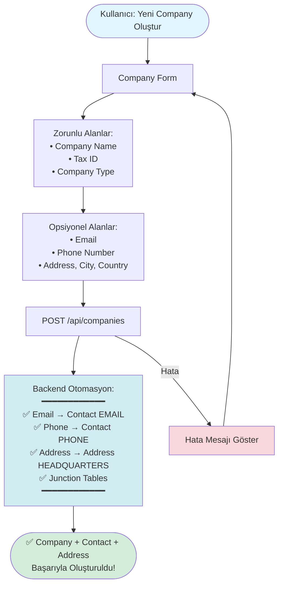

# 🎨 Frontend Form Guidelines - User & Company Creation

## 📋 Genel Bakış

**USER-FRIENDLY DESIGN:** Kullanıcı minimum bilgi girer, sistem otomatik olarak Contact, Address ve diğer ilişkili entity'leri oluşturur.

---

## 🏢 Company Oluşturma Formu

### **Akış Diyagramı**



---

### **Form Yapısı**

```
┌─────────────────────────────────────────────────────────────┐
│  📝 Company Oluştur Formu                                    │
├─────────────────────────────────────────────────────────────┤
│                                                               │
│  ┌─────────────────────────────────────────────────────┐   │
│  │ Company Name *                                        │   │
│  │ ╭───────────────────────────────────────────╮       │   │
│  │ │ ACME Corporation                           │       │   │
│  │ ╰───────────────────────────────────────────╯       │   │
│  └─────────────────────────────────────────────────────┘   │
│                                                               │
│  ┌─────────────────────────────────────────────────────┐   │
│  │ Tax ID *                                             │   │
│  │ ╭───────────────────────────────────────────╮       │   │
│  │ │ 1234567890                                │       │   │
│  │ ╰───────────────────────────────────────────╯       │   │
│  │ ℹ️ Vergi numarası (benzersiz olmalı)                │   │
│  └─────────────────────────────────────────────────────┘   │
│                                                               │
│  ┌─────────────────────────────────────────────────────┐   │
│  │ Company Type *                                       │   │
│  │ ╭───────────────────────────────────────────╮       │   │
│  │ │ Vertical Mill ▼                          │       │   │
│  │ ╰───────────────────────────────────────────╯       │   │
│  │ [Vertical Mill, Horizontal Mill, Manufacturer, ...] │   │
│  └─────────────────────────────────────────────────────┘   │
│                                                               │
│  ┌─────────────────────────────────────────────────────┐   │
│  │ Parent Company (Opsiyonel)                           │   │
│  │ ╭───────────────────────────────────────────╮       │   │
│  │ │ [Seçiniz ▼]                               │       │   │
│  │ ╰───────────────────────────────────────────╯       │   │
│  │ Ana şirketi seçin (alt şirket için)                  │   │
│  └─────────────────────────────────────────────────────┘   │
│                                                               │
│  ┌─────────────────────────────────────────────────────┐   │
│  │ 💬 İletişim Bilgileri (Opsiyonel - Otomatik Oluştur) │   │
│  ├─────────────────────────────────────────────────────┤   │
│  │                                                      │   │
│  │ Email:                                               │   │
│  │ ╭───────────────────────────────────────────╮       │   │
│  │ │ info@acme.com                              │       │   │
│  │ ╰───────────────────────────────────────────╯       │   │
│  │ ℹ️ Otomatik: Contact (EMAIL) + CompanyContact      │   │
│  │                                                      │   │
│  │ Phone Number:                                        │   │
│  │ ╭───────────────────────────────────────────╮       │   │
│  │ │ +905551234567                             │       │   │
│  │ ╰───────────────────────────────────────────╯       │   │
│  │ ℹ️ Format: E.164 (+90...)                           │   │
│  │ ℹ️ Otomatik: Contact (PHONE) + CompanyContact      │   │
│  │                                                      │   │
│  │ [İletişim Bilgilerini Gizle/Göster]                 │   │
│  └─────────────────────────────────────────────────────┘   │
│                                                               │
│  ┌─────────────────────────────────────────────────────┐   │
│  │ 📍 Adres Bilgileri (Opsiyonel - Otomatik Oluştur)    │   │
│  ├─────────────────────────────────────────────────────┤   │
│  │                                                      │   │
│  │ Street Address:                                      │   │
│  │ ╭───────────────────────────────────────────╮       │   │
│  │ │ 123 Main Street, Levent                    │       │   │
│  │ ╰───────────────────────────────────────────╯       │   │
│  │                                                      │   │
│  │ City:                                               │   │
│  │ ╭───────────────────────────────────────────╮       │   │
│  │ │ Istanbul                                    │       │   │
│  │ ╰───────────────────────────────────────────╯       │   │
│  │                                                      │   │
│  │ Country:                                             │   │
│  │ ╭───────────────────────────────────────────╮       │   │
│  │ │ Turkey ▼                                  │       │   │
│  │ ╰───────────────────────────────────────────╯       │   │
│  │                                                      │   │
│  │ ℹ️ Otomatik: Address (HEADQUARTERS) + CompanyAddress │   │
│  │                                                      │   │
│  │ [Adres Bilgilerini Gizle/Göster]                    │   │
│  └─────────────────────────────────────────────────────┘   │
│                                                               │
│  [İptal]  [Company Oluştur →]                               │
│                                                               │
│  * Zorunlu Alanlar                                          │
│  ℹ️ Otomatik oluşturulacaklar                               │
└─────────────────────────────────────────────────────────────┘
```

---

### **API Request Örneği**

```typescript
interface CreateCompanyRequest {
  companyName: string;        // Required
  taxId: string;              // Required
  companyType: CompanyType;   // Required
  parentCompanyId?: UUID;     // Optional
  
  // Optional - Auto-creates Contact
  email?: string;
  phoneNumber?: string;
  
  // Optional - Auto-creates Address
  address?: string;
  city?: string;
  country?: string;
}

// Example Request
POST /api/companies
{
  "companyName": "ACME Corporation",
  "taxId": "1234567890",
  "companyType": "MANUFACTURER",
  "email": "info@acme.com",
  "phoneNumber": "+905551234567",
  "address": "123 Main Street",
  "city": "Istanbul",
  "country": "Turkey"
}

// Backend automatically creates:
// ✅ Contact (EMAIL) → CompanyContact
// ✅ Contact (PHONE) → CompanyContact
// ✅ Address (HEADQUARTERS) → CompanyAddress
```

---

### **Form Validasyonu**

#### **Zorunlu Alanlar:**
- ✅ Company Name: `required`, `minLength: 2`, `maxLength: 255`
- ✅ Tax ID: `required`, `minLength: 10`, unique check
- ✅ Company Type: `required`, dropdown selection

#### **Opsiyonel Alanlar (Otomatik Oluştur):**
- Email: `email` format validation (if provided)
- Phone Number: E.164 format validation (if provided)
- Address: No strict validation (if provided, creates Address)

#### **UX Önerileri:**
1. **Collapsible Sections:**
   - İletişim Bilgileri → Başlangıçta kapalı (collapsed)
   - Adres Bilgileri → Başlangıçta kapalı (collapsed)

2. **Real-time Validation:**
   - Email format kontrolü (real-time)
   - Phone format kontrolü (real-time)
   - Tax ID uniqueness check (debounced, async)

3. **Auto-fill Hints:**
   - Email girişinde → "Contact otomatik oluşturulacak" bilgisi
   - Phone girişinde → "Contact otomatik oluşturulacak" bilgisi
   - Address girişinde → "Address (HEADQUARTERS) otomatik oluşturulacak" bilgisi

---

## 👤 User Oluşturma Formu

### **Akış Diyagramı**

```mermaid
flowchart TD
    Start([Kullanıcı: Yeni User Oluştur]) --> Form[User Form]
    
    Form --> Required[Zorunlu Alanlar:<br/>• First Name<br/>• Last Name<br/>• Email<br/>• Company]
    
    Required --> Optional[Opsiyonel:<br/>• Department]
    
    Optional --> Submit[POST /api/users]
    
    Submit --> Auto[Backend Otomasyon:<br/>━━━━━━━━━━━━<br/>✅ Contact EMAIL<br/>✅ UserContact junction<br/>✅ displayName: firstName + lastName<br/>✅ UserAddress WORK<br/>  (Company'nin Address'i kopyalanır)<br/>━━━━━━━━━━━━]
    
    Auto --> Success([✅ User + Contact + Address<br/>Başarıyla Oluşturuldu!])
    
    Submit -->|Hata| Error[Hata Mesajı Göster]
    Error --> Form
    
    style Start fill:#e1f5ff
    style Success fill:#d4edda
    style Auto fill:#d1ecf1
    style Error fill:#f8d7da
```

---

### **Form Yapısı**

```
┌─────────────────────────────────────────────────────────────┐
│  📝 User Oluştur Formu                                       │
├─────────────────────────────────────────────────────────────┤
│                                                               │
│  ┌─────────────────────────────────────────────────────┐   │
│  │ First Name *                                         │   │
│  │ ╭───────────────────────────────────────────╮       │   │
│  │ │ John                                       │       │   │
│  │ ╰───────────────────────────────────────────╯       │   │
│  └─────────────────────────────────────────────────────┘   │
│                                                               │
│  ┌─────────────────────────────────────────────────────┐   │
│  │ Last Name *                                          │   │
│  │ ╭───────────────────────────────────────────╮       │   │
│  │ │ Doe                                       │       │   │
│  │ ╰───────────────────────────────────────────╯       │   │
│  └─────────────────────────────────────────────────────┘   │
│                                                               │
│  ┌─────────────────────────────────────────────────────┐   │
│  │ Email * (Authentication)                              │   │
│  │ ╭───────────────────────────────────────────╮       │   │
│  │ │ john.doe@acme.com                        │       │   │
│  │ ╰───────────────────────────────────────────╯       │   │
│  │ ℹ️ Otomatik: Contact (EMAIL) + UserContact         │   │
│  │ ℹ️ Login için kullanılacak                          │   │
│  └─────────────────────────────────────────────────────┘   │
│                                                               │
│  ┌─────────────────────────────────────────────────────┐   │
│  │ Company *                                            │   │
│  │ ╭───────────────────────────────────────────╮       │   │
│  │ │ ACME Corporation ▼                        │       │   │
│  │ ╰───────────────────────────────────────────╯       │   │
│  │ [Arama: ________________]                            │   │
│  │                                                      │   │
│  │ ℹ️ Otomatik: Company'nin Address'i User Address     │   │
│  │   (WORK) olarak kopyalanacak                         │   │
│  └─────────────────────────────────────────────────────┘   │
│                                                               │
│  ┌─────────────────────────────────────────────────────┐   │
│  │ Department (Opsiyonel)                               │   │
│  │ ╭───────────────────────────────────────────╮       │   │
│  │ │ Production ▼                             │       │   │
│  │ ╰───────────────────────────────────────────╯       │   │
│  │ [Production, Planning, Finance, ...]                 │   │
│  └─────────────────────────────────────────────────────┘   │
│                                                               │
│  ┌─────────────────────────────────────────────────────┐   │
│  │ ℹ️ Otomatik Oluşturulacaklar:                         │   │
│  │                                                      │   │
│  │ ✅ Contact (EMAIL)                                   │   │
│  │ ✅ UserContact junction (authentication contact)     │   │
│  │ ✅ displayName: "John Doe" (firstName + lastName)     │   │
│  │ ✅ UserAddress (WORK) - Company'nin Address'i        │   │
│  │                                                      │   │
│  │ [Otomatik Oluşturulacakları Gizle/Göster]           │   │
│  └─────────────────────────────────────────────────────┘   │
│                                                               │
│  [İptal]  [User Oluştur →]                                 │
│                                                               │
│  * Zorunlu Alanlar                                          │
└─────────────────────────────────────────────────────────────┘
```

---

### **API Request Örneği**

```typescript
interface CreateUserRequest {
  firstName: string;          // Required
  lastName: string;           // Required
  contactValue: string;       // Required (email)
  contactType: ContactType;  // Required (EMAIL)
  companyId: UUID;           // Required
  department?: string;       // Optional
}

// Example Request
POST /api/users
{
  "firstName": "John",
  "lastName": "Doe",
  "contactValue": "john.doe@acme.com",
  "contactType": "EMAIL",
  "companyId": "xxx-xxx-xxx",
  "department": "Production"
}

// Backend automatically creates:
// ✅ Contact (EMAIL) → UserContact (isForAuthentication=true)
// ✅ displayName: "John Doe"
// ✅ UserAddress (WORK) → Company'nin primary address'i kopyalanır
```

---

### **Form Validasyonu**

#### **Zorunlu Alanlar:**
- ✅ First Name: `required`, `minLength: 2`, `maxLength: 100`
- ✅ Last Name: `required`, `minLength: 2`, `maxLength: 100`
- ✅ Email: `required`, `email` format, uniqueness check (global)
- ✅ Company: `required`, dropdown selection with search

#### **Otomatik Oluşturulanlar:**
- ✅ displayName: `firstName + " " + lastName` (read-only, auto-generated)
- ✅ Contact: Email'den otomatik oluşturulur
- ✅ UserAddress: Company'nin primary address'i varsa otomatik kopyalanır

#### **UX Önerileri:**
1. **Company Dropdown:**
   - Searchable dropdown (async search)
   - Company bilgilerini göster (name, type, taxId)
   - Real-time availability check

2. **Email Validation:**
   - Real-time format check
   - Uniqueness check (debounced, async)
   - "Contact otomatik oluşturulacak" hint

3. **Display Name Preview:**
   - Real-time preview: "John Doe"
   - Read-only, auto-generated badge

4. **Address Preview (if Company has address):**
   - Show: "Work address: Company's address will be copied"
   - Icon: 📍

---

## 🧵 Fiber Oluşturma Formu (Güncellendi)

### **Akış Diyagramı**

```mermaid
flowchart TD
    Start([Kullanıcı: Pamuk Fiber Oluştur]) --> Form[Fiber Form]
    
    Form --> Fields[Form Alanları:<br/>• Unit: kg<br/>• Category: Natural<br/>• Fiber Name: Cotton<br/>• Material ID: Optional]
    
    Fields --> Submit[POST /api/fibers]
    
    Submit --> Auto[Backend Otomasyon:<br/>━━━━━━━━━━━━<br/>✅ Material yoksa otomatik oluştur<br/>  (FIBER, unit=kg)<br/>✅ Fiber oluştur<br/>✅ Material-Fiber ilişkisi<br/>━━━━━━━━━━━━]
    
    Auto --> Success([✅ Material + Fiber<br/>Başarıyla Oluşturuldu!])
    
    Submit -->|Hata| Error[Hata Mesajı Göster]
    Error --> Form
    
    style Start fill:#e1f5ff
    style Success fill:#d4edda
    style Auto fill:#d1ecf1
    style Error fill:#f8d7da
```

---

### **Form Yapısı (Güncellenmiş)**

```
┌─────────────────────────────────────────────────────────────┐
│  📝 Fiber Oluştur Formu                                      │
├─────────────────────────────────────────────────────────────┤
│                                                               │
│  ┌─────────────────────────────────────────────────────┐   │
│  │ Unit (Material için) *                                │   │
│  │ ╭───────────────────────────────────────────╮       │   │
│  │ │ kg ▼                                      │       │   │
│  │ ╰───────────────────────────────────────────╯       │   │
│  │ [kg, ton] (Fiber için genellikle kg)              │   │
│  │                                                    │   │
│  │ ℹ️ Material otomatik oluşturulacak (FIBER, kg)    │   │
│  └─────────────────────────────────────────────────────┘   │
│                                                               │
│  ┌─────────────────────────────────────────────────────┐   │
│  │ Material ID (Opsiyonel - Mevcut Material kullan)    │   │
│  │ ╭───────────────────────────────────────────╮       │   │
│  │ │ [Seçiniz ▼] veya boş bırakın             │       │   │
│  │ ╰───────────────────────────────────────────╯       │   │
│  │ [Arama: ________________]                            │   │
│  │                                                      │   │
│  │ ℹ️ Boş bırakırsanız Material otomatik oluşturulur  │   │
│  │ ℹ️ Varsa mevcut Material'ı kullanın                 │   │
│  └─────────────────────────────────────────────────────┘   │
│                                                               │
│  ┌─────────────────────────────────────────────────────┐   │
│  │ Fiber Category *                                      │   │
│  │ ╭───────────────────────────────────────────╮       │   │
│  │ │ Natural ▼                                   │       │   │
│  │ ╰───────────────────────────────────────────╯       │   │
│  │ [Natural, Synthetic, Artificial, ...]                │   │
│  └─────────────────────────────────────────────────────┘   │
│                                                               │
│  ┌─────────────────────────────────────────────────────┐   │
│  │ Fiber Name *                                         │   │
│  │ ╭───────────────────────────────────────────╮       │   │
│  │ │ Cotton                                      │       │   │
│  │ ╰───────────────────────────────────────────╯       │   │
│  │ Örnek: "Cotton", "Premium Cotton", "Organic Cotton" │   │
│  └─────────────────────────────────────────────────────┘   │
│                                                               │
│  ┌─────────────────────────────────────────────────────┐   │
│  │ Teknik Özellikler (Opsiyonel)                        │   │
│  │ [Aç/Gizle ▼]                                        │   │
│  ├─────────────────────────────────────────────────────┤   │
│  │ Fiber Grade:    [_________]                         │   │
│  │ Fineness:      [_________] dtex                    │   │
│  │ Length:        [_________] mm                      │   │
│  │ Strength:       [_________] cN/dtex                 │   │
│  │ Elongation:     [_________] %                       │   │
│  └─────────────────────────────────────────────────────┘   │
│                                                               │
│  ┌─────────────────────────────────────────────────────┐   │
│  │ Remarks (Opsiyonel)                                  │   │
│  │ ╭───────────────────────────────────────────╮       │   │
│  │ │                                             │       │   │
│  │ │                                             │       │   │
│  │ ╰───────────────────────────────────────────╯       │   │
│  └─────────────────────────────────────────────────────┘   │
│                                                               │
│  ┌─────────────────────────────────────────────────────┐   │
│  │ ℹ️ Otomatik Oluşturulacaklar:                        │   │
│  │                                                      │   │
│  │ ✅ Material (FIBER, unit) - Eğer materialId yoksa   │   │
│  │ ✅ Fiber                                               │   │
│  │ ✅ Material-Fiber ilişkisi                           │   │
│  │                                                      │   │
│  │ [Otomatik Oluşturulacakları Gizle/Göster]           │   │
│  └─────────────────────────────────────────────────────┘   │
│                                                               │
│  [← Geri]  [İptal]  [Fiber Oluştur →]                      │
│                                                               │
│  * Zorunlu Alanlar                                          │
└─────────────────────────────────────────────────────────────┘
```

---

### **API Request Örneği**

```typescript
interface CreateFiberRequest {
  materialId?: UUID;         // Optional - if null, Material auto-created
  unit?: string;             // Required if materialId is null
  fiberCategoryId: UUID;     // Required
  fiberName: string;         // Required
  fiberIsoCodeId?: UUID;     // Optional
  fiberGrade?: string;       // Optional
  fineness?: number;         // Optional
  lengthMm?: number;         // Optional
  strengthCndTex?: number;   // Optional
  elongationPercent?: number; // Optional
  remarks?: string;          // Optional
}

// Example Request 1: Auto-create Material
POST /api/production/fibers
{
  "unit": "kg",
  "fiberCategoryId": "xxx",
  "fiberName": "Cotton",
  "fiberGrade": "Premium"
}

// Backend automatically:
// ✅ Material.create(FIBER, "kg")
// ✅ Fiber.create(material, ...)
// ✅ Material-Fiber relationship

// Example Request 2: Use existing Material
POST /api/production/fibers
{
  "materialId": "xxx",
  "fiberCategoryId": "xxx",
  "fiberName": "Cotton"
}

// Backend:
// ✅ Uses existing Material
// ✅ Fiber.create(material, ...)
```

---

## 🎨 UI/UX Best Practices

### **1. Form State Management**

```typescript
// Example: React Hook Form
const form = useForm<CreateCompanyRequest>({
  defaultValues: {
    companyType: CompanyType.VERTICAL_MILL,
    // Optional fields start empty
  },
  mode: 'onBlur', // Real-time validation
});

// Auto-show hints when optional fields filled
const emailValue = form.watch('email');
const showEmailHint = emailValue && isValidEmail(emailValue);
```

### **2. Collapsible Sections**

```typescript
// Example: Accordion pattern
const [showContactInfo, setShowContactInfo] = useState(false);
const [showAddressInfo, setShowAddressInfo] = useState(false);

// Auto-expand if user starts typing
useEffect(() => {
  if (email || phoneNumber) {
    setShowContactInfo(true);
  }
}, [email, phoneNumber]);
```

### **3. Real-time Validation**

```typescript
// Email validation
const validateEmail = (email: string) => {
  if (!email) return 'Email is required';
  if (!isValidEmail(email)) return 'Invalid email format';
  
  // Async uniqueness check
  return checkEmailUniqueness(email).then(unique => 
    unique ? 'Email already exists' : undefined
  );
};

// Phone validation (E.164 format)
const validatePhone = (phone: string) => {
  if (!phone) return; // Optional field
  if (!/^\+[1-9]\d{1,14}$/.test(phone)) {
    return 'Phone must be in E.164 format (+90...)';
  }
};
```

### **4. Auto-fill Suggestions**

```typescript
// Company address → User address preview
const company = form.watch('companyId');
const companyAddress = useCompanyAddress(company);

// Show preview if company has address
{companyAddress && (
  <InfoBox>
    📍 Work address will be auto-created: {companyAddress.city}
  </InfoBox>
)}
```

### **5. Loading States**

```typescript
// Submit button states
const [isSubmitting, setIsSubmitting] = useState(false);

const handleSubmit = async (data) => {
  setIsSubmitting(true);
  try {
    const response = await createCompany(data);
    // Show success with details
    toast.success(`Company created! Contact and Address auto-created.`);
  } finally {
    setIsSubmitting(false);
  }
};

// Button
<Button 
  disabled={isSubmitting || !isValid}
  loading={isSubmitting}
>
  {isSubmitting ? 'Creating...' : 'Create Company'}
</Button>
```

### **6. Success Feedback**

```typescript
// Success message with details
const SuccessMessage = ({ company, contact, address }) => (
  <div className="success-message">
    <h3>✅ Company created successfully!</h3>
    <ul>
      <li>Company: {company.name} ({company.uid})</li>
      {contact && <li>Contact: {contact.type} - {maskContact(contact.value)}</li>}
      {address && <li>Address: {address.city}, {address.country}</li>}
    </ul>
  </div>
);
```

---

## 📱 Responsive Design

### **Desktop (>1024px):**
- 2-column layout (form + preview)
- Sidebar with progress indicator
- Inline validation messages

### **Tablet (768px - 1024px):**
- Single column, full width
- Sticky header with progress
- Collapsible sections

### **Mobile (<768px):**
- Single column, full width
- Bottom sheet for dropdowns
- Floating action button for submit
- Simplified validation (show only errors)

---

## ⚠️ Error Handling

### **Validation Errors:**

```typescript
interface ValidationError {
  field: string;
  message: string;
  code: string;
}

// Example errors
{
  field: "email",
  message: "Email already exists",
  code: "EMAIL_EXISTS"
}

{
  field: "taxId",
  message: "Tax ID already exists in your organization",
  code: "TAX_ID_EXISTS"
}

{
  field: "companyId",
  message: "Company not found",
  code: "COMPANY_NOT_FOUND"
}
```

### **Error Display:**

```typescript
// Field-level errors
<FormField error={errors.email}>
  <Input {...register('email')} />
  {errors.email && (
    <ErrorMessage>{errors.email.message}</ErrorMessage>
  )}
</FormField>

// Global errors (toast/notification)
{apiError && (
  <Alert severity="error">
    {apiError.message}
    {apiError.suggestions && (
      <ul>
        {apiError.suggestions.map(s => <li>{s}</li>)}
      </ul>
    )}
  </Alert>
)}
```

---

## 🎯 Form Completion Checklist

### **Before Submit:**
- ✅ All required fields filled
- ✅ Email format valid (if provided)
- ✅ Phone format valid (if provided)
- ✅ Company selected (for User form)
- ✅ Tax ID unique check passed
- ✅ No validation errors

### **After Submit:**
- ✅ Show success message with created entities
- ✅ Show auto-created Contact/Address info
- ✅ Option to view created entity
- ✅ Option to create another

---

## 📊 Example User Flows

### **Flow 1: Simple Company Creation**

```
User Action:
  1. Fill: Name, Tax ID, Type
  2. Click "Create Company"
  
System Response:
  ✅ Company created
  ℹ️ No Contact/Address (user didn't provide)
  
User can add Contact/Address later if needed.
```

### **Flow 2: Complete Company Creation**

```
User Action:
  1. Fill: Name, Tax ID, Type
  2. Expand "İletişim Bilgileri"
  3. Fill: Email, Phone
  4. Expand "Adres Bilgileri"
  5. Fill: Address, City, Country
  6. Click "Create Company"
  
System Response:
  ✅ Company created
  ✅ Contact (EMAIL) auto-created
  ✅ Contact (PHONE) auto-created
  ✅ Address (HEADQUARTERS) auto-created
  
Success Message:
  "Company created! 2 contacts and 1 address auto-created."
```

### **Flow 3: User Creation (Company has Address)**

```
User Action:
  1. Fill: First Name, Last Name, Email
  2. Select Company (ACME Corp)
  3. System shows: "Work address will be copied from company"
  4. Click "Create User"
  
System Response:
  ✅ User created
  ✅ Contact (EMAIL) auto-created
  ✅ displayName: "John Doe" auto-generated
  ✅ UserAddress (WORK) auto-created from Company
  
Success Message:
  "User created! Contact and work address auto-created."
```

---

## 🚀 İleri Seviye Özellikler

### **1. Smart Defaults:**
```typescript
// Auto-select default values based on context
const getDefaultCompanyType = (userRole) => {
  if (userRole === 'MANUFACTURER') return CompanyType.MANUFACTURER;
  return CompanyType.VERTICAL_MILL;
};

// Auto-fill country from user's location
const getDefaultCountry = () => {
  return navigator.language.includes('tr') ? 'Turkey' : '';
};
```

### **2. Auto-save Draft:**
```typescript
// Save form state to localStorage
useEffect(() => {
  const draft = localStorage.getItem('companyDraft');
  if (draft) {
    form.reset(JSON.parse(draft));
  }
}, []);

// Auto-save on change (debounced)
useDebouncedEffect(() => {
  localStorage.setItem('companyDraft', JSON.stringify(form.getValues()));
}, [form.watch()], 1000);
```

### **3. Bulk Creation:**
```typescript
// Bulk user creation from CSV
const handleBulkUpload = async (csvFile) => {
  const users = parseCSV(csvFile);
  
  // Validate all
  const validUsers = users.filter(validateUser);
  
  // Create in batch
  await Promise.all(validUsers.map(createUser));
  
  // Show summary
  showSummary({
    total: users.length,
    created: validUsers.length,
    errors: users.length - validUsers.length
  });
};
```

---

## ✅ Sonuç

Bu guidelerle frontend:
1. ✅ **Kullanıcı dostu:** Minimum bilgi, maksimum otomasyon
2. ✅ **Hata azaltıcı:** Validasyon ve otomatik doldurma
3. ✅ **Hızlı:** Tek form, tek API call
4. ✅ **Tutarlı:** Aynı pattern (Material-Fiber, Company-Contact, User-Address)
5. ✅ **Responsive:** Tüm cihazlarda çalışır

**Manifesto'ya Uyum:** ✅ Kullanıcıya az sorumluluk, sistem otomasyonu maksimum!

