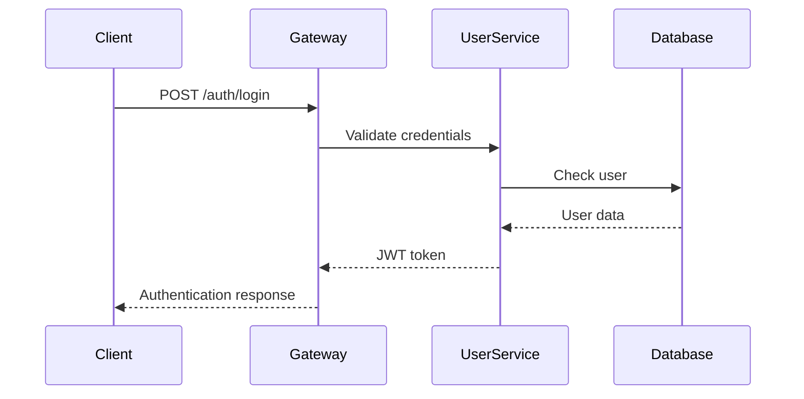

# 🔌 API Documentation

## 📋 Overview

The Fabric Management System provides comprehensive REST APIs following OpenAPI 3.0 specifications. All APIs are designed with modern best practices including versioning, pagination, filtering, and comprehensive error handling.

## 🎯 API Standards

### Base URL

```
Production: https://api.fabricmanagement.com/v1
Staging: https://staging-api.fabricmanagement.com/v1
Local: http://localhost:8080/api/v1
```

### Authentication

All APIs require JWT-based authentication:

```http
Authorization: Bearer <jwt_token>
X-Tenant-ID: <tenant_uuid>
```

### Response Format

All APIs return responses in the following format:

```json
{
  "success": true,
  "message": "Operation completed successfully",
  "data": { ... },
  "timestamp": "2024-01-15T10:30:00Z",
  "requestId": "req_123456789"
}
```

### Error Format

```json
{
  "success": false,
  "message": "Error description",
  "errorCode": "ERROR_CODE",
  "errors": ["Detailed error messages"],
  "timestamp": "2024-01-15T10:30:00Z",
  "requestId": "req_123456789"
}
```

## 🏗️ Service APIs

### Core Services

#### User Service API

**Base URL**: `/api/v1/users`

| Endpoint        | Method | Description            |
| --------------- | ------ | ---------------------- |
| `/auth/login`   | POST   | User authentication    |
| `/auth/logout`  | POST   | User logout            |
| `/auth/refresh` | POST   | Refresh JWT token      |
| `/auth/me`      | GET    | Get current user info  |
| `/users`        | GET    | List users (paginated) |
| `/users/{id}`   | GET    | Get user by ID         |
| `/users`        | POST   | Create new user        |
| `/users/{id}`   | PUT    | Update user            |
| `/users/{id}`   | DELETE | Delete user            |

**Example Request**:

```http
POST /api/v1/users/auth/login
Content-Type: application/json

{
  "contactValue": "john.doe@company.com",
  "password": "securePassword123"
}
```

**Note**: Authentication uses contact info (email or phone). No username field exists.

**Example Response**:

```json
{
  "success": true,
  "message": "Login successful",
  "data": {
    "accessToken": "eyJhbGciOiJIUzI1NiIsInR5cCI6IkpXVCJ9...",
    "refreshToken": "eyJhbGciOiJIUzI1NiIsInR5cCI6IkpXVCJ9...",
    "expiresIn": 3600,
    "userId": "123e4567-e89b-12d3-a456-426614174000",
    "tenantId": "7c9e6679-7425-40de-963d-42a6ee08cd6c"
  }
}
```

#### Contact Service API

**Base URL**: `/api/v1/contacts`

| Endpoint                        | Method | Description               |
| ------------------------------- | ------ | ------------------------- |
| `/contacts`                     | GET    | List contacts (paginated) |
| `/contacts/{id}`                | GET    | Get contact by ID         |
| `/contacts`                     | POST   | Create new contact        |
| `/contacts/{id}`                | PUT    | Update contact            |
| `/contacts/{id}`                | DELETE | Delete contact            |
| `/contacts/user/{userId}`       | GET    | Get user contacts         |
| `/contacts/company/{companyId}` | GET    | Get company contacts      |

**Example Request**:

```http
POST /api/v1/contacts
Content-Type: application/json

{
  "contactType": "USER",
  "userId": "123e4567-e89b-12d3-a456-426614174000",
  "personalEmail": "john.doe@company.com",
  "personalPhone": "+1234567890",
  "homeAddress": {
    "street": "123 Main St",
    "city": "New York",
    "state": "NY",
    "postalCode": "10001",
    "country": "USA"
  }
}
```

#### Company Service API

**Base URL**: `/api/v1/companies`

| Endpoint                   | Method | Description                |
| -------------------------- | ------ | -------------------------- |
| `/companies`               | GET    | List companies (paginated) |
| `/companies/{id}`          | GET    | Get company by ID          |
| `/companies`               | POST   | Create new company         |
| `/companies/{id}`          | PUT    | Update company             |
| `/companies/{id}`          | DELETE | Delete company             |
| `/companies/{id}/users`    | GET    | Get company users          |
| `/companies/{id}/settings` | GET    | Get company settings       |

#### Notification Service API

**Base URL**: `/api/v1/notifications`

| Endpoint                        | Method | Description                    |
| ------------------------------- | ------ | ------------------------------ |
| `/notifications`                | GET    | List notifications (paginated) |
| `/notifications/{id}`           | GET    | Get notification by ID         |
| `/notifications`                | POST   | Send notification              |
| `/notifications/{id}/mark-read` | PUT    | Mark as read                   |
| `/notifications/templates`      | GET    | List notification templates    |
| `/notifications/templates`      | POST   | Create template                |

### Business Services

#### HR Service API

**Base URL**: `/api/v1/hr`

| Endpoint          | Method | Description              |
| ----------------- | ------ | ------------------------ |
| `/employees`      | GET    | List employees           |
| `/employees/{id}` | GET    | Get employee by ID       |
| `/employees`      | POST   | Create employee          |
| `/payroll`        | GET    | List payroll records     |
| `/payroll`        | POST   | Process payroll          |
| `/leaves`         | GET    | List leave requests      |
| `/leaves`         | POST   | Create leave request     |
| `/performance`    | GET    | List performance reviews |

#### Inventory Service API

**Base URL**: `/api/v1/inventory`

| Endpoint         | Method | Description        |
| ---------------- | ------ | ------------------ |
| `/products`      | GET    | List products      |
| `/products/{id}` | GET    | Get product by ID  |
| `/products`      | POST   | Create product     |
| `/stock`         | GET    | List stock levels  |
| `/stock`         | POST   | Update stock       |
| `/catalog`       | GET    | List catalog items |
| `/pricing`       | GET    | List pricing rules |

#### Order Service API

**Base URL**: `/api/v1/orders`

| Endpoint              | Method | Description             |
| --------------------- | ------ | ----------------------- |
| `/orders`             | GET    | List orders (paginated) |
| `/orders/{id}`        | GET    | Get order by ID         |
| `/orders`             | POST   | Create order            |
| `/orders/{id}`        | PUT    | Update order            |
| `/orders/{id}/status` | PUT    | Update order status     |
| `/orders/{id}/items`  | GET    | Get order items         |
| `/orders/{id}/items`  | POST   | Add order item          |

**Example Request**:

```http
POST /api/v1/orders
Content-Type: application/json

{
  "customerId": "123e4567-e89b-12d3-a456-426614174000",
  "items": [
    {
      "productId": "456e7890-e89b-12d3-a456-426614174000",
      "quantity": 10,
      "unitPrice": 25.50
    }
  ],
  "shippingAddress": {
    "street": "456 Oak Ave",
    "city": "Los Angeles",
    "state": "CA",
    "postalCode": "90210",
    "country": "USA"
  },
  "notes": "Rush delivery requested"
}
```

#### Logistics Service API

**Base URL**: `/api/v1/logistics`

| Endpoint                | Method | Description          |
| ----------------------- | ------ | -------------------- |
| `/shipments`            | GET    | List shipments       |
| `/shipments/{id}`       | GET    | Get shipment by ID   |
| `/shipments`            | POST   | Create shipment      |
| `/shipments/{id}/track` | GET    | Track shipment       |
| `/deliveries`           | GET    | List deliveries      |
| `/routes`               | GET    | List delivery routes |

### Financial Services

#### Financial Service API

**Base URL**: `/api/v1/financial`

| Endpoint         | Method | Description        |
| ---------------- | ------ | ------------------ |
| `/accounts`      | GET    | List accounts      |
| `/accounts/{id}` | GET    | Get account by ID  |
| `/transactions`  | GET    | List transactions  |
| `/transactions`  | POST   | Create transaction |
| `/invoices`      | GET    | List invoices      |
| `/invoices/{id}` | GET    | Get invoice by ID  |
| `/invoices`      | POST   | Create invoice     |

#### Payment Service API

**Base URL**: `/api/v1/payments`

| Endpoint                | Method | Description          |
| ----------------------- | ------ | -------------------- |
| `/payments`             | GET    | List payments        |
| `/payments/{id}`        | GET    | Get payment by ID    |
| `/payments`             | POST   | Process payment      |
| `/payments/{id}/refund` | POST   | Process refund       |
| `/methods`              | GET    | List payment methods |
| `/methods`              | POST   | Add payment method   |

## 📊 Common Patterns

### Pagination

All list endpoints support pagination:

```http
GET /api/v1/users?page=0&size=20&sort=firstName,asc
```

**Response**:

```json
{
  "success": true,
  "data": {
    "content": [...],
    "page": {
      "number": 0,
      "size": 20,
      "totalElements": 150,
      "totalPages": 8,
      "first": true,
      "last": false
    }
  }
}
```

### Filtering

Support for dynamic filtering:

```http
GET /api/v1/users?filter=firstName:John,status:ACTIVE
```

### Sorting

Multiple field sorting:

```http
GET /api/v1/users?sort=lastName,asc&sort=firstName,desc
```

### Search

Full-text search support:

```http
GET /api/v1/users?search=John&fields=firstName,lastName,email
```

## 🔒 Security

### Authentication Flow



### Authorization Levels

| Role        | Permissions           |
| ----------- | --------------------- |
| **ADMIN**   | Full system access    |
| **MANAGER** | Department management |
| **USER**    | Basic operations      |
| **VIEWER**  | Read-only access      |

### Rate Limiting

| Endpoint Type  | Rate Limit          |
| -------------- | ------------------- |
| Authentication | 5 requests/minute   |
| General APIs   | 100 requests/minute |
| File Upload    | 10 requests/minute  |
| Reports        | 20 requests/minute  |

## 📈 Performance

### Response Times

| Operation       | Target  | SLA   |
| --------------- | ------- | ----- |
| Authentication  | < 200ms | 99.9% |
| CRUD Operations | < 500ms | 99.5% |
| Search Queries  | < 1s    | 99%   |
| Reports         | < 5s    | 95%   |

### Caching Strategy

- **User Data**: 5 minutes
- **Company Data**: 10 minutes
- **Product Catalog**: 1 hour
- **Static Data**: 24 hours

## 🧪 Testing

### API Testing Tools

- **Postman Collection**: [Download](postman-collection.json)
- **OpenAPI Spec**: [View](openapi.yaml)
- **Swagger UI**: http://localhost:8080/swagger-ui.html

### Test Environment

```bash
# Start test environment
docker-compose -f docker-compose.test.yml up -d

# Run API tests
mvn test -Dtest=*ApiTest

# Generate test report
mvn surefire-report:report
```

## 📚 SDKs and Libraries

### Java SDK

```xml
<dependency>
    <groupId>com.fabricmanagement</groupId>
    <artifactId>fabric-management-sdk</artifactId>
    <version>1.0.0</version>
</dependency>
```

### JavaScript SDK

```bash
npm install @fabricmanagement/sdk
```

### Python SDK

```bash
pip install fabric-management-sdk
```

## 🔧 Development Tools

### API Client Generation

```bash
# Generate Java client
openapi-generator generate -i openapi.yaml -g java -o clients/java

# Generate TypeScript client
openapi-generator generate -i openapi.yaml -g typescript-axios -o clients/typescript
```

### Mock Server

```bash
# Start Prism mock server
prism mock openapi.yaml --port 3000
```

## 📞 Support

- **API Documentation**: [docs.fabricmanagement.com/api](https://docs.fabricmanagement.com/api)
- **Developer Portal**: [developers.fabricmanagement.com](https://developers.fabricmanagement.com)
- **Support Email**: api-support@fabricmanagement.com
- **Status Page**: [status.fabricmanagement.com](https://status.fabricmanagement.com)

---

**Last Updated:** 2025-10-09 20:15 UTC+1  
**Version:** 1.0.0  
**Status:** ✅ Active  
**API Version:** v1
