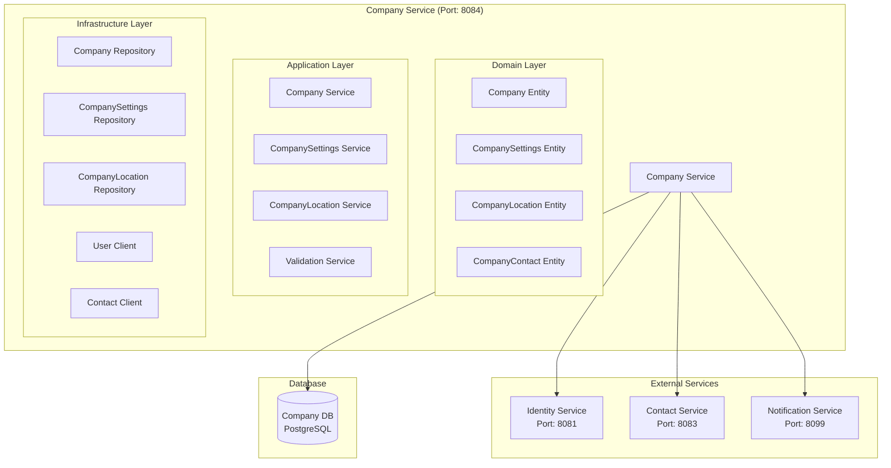

# Company Service Architecture

## 📋 Overview

Company Service, fabric management sisteminde company management, company settings ve company-related business logic için tasarlanmış core microservice'dir. Bu servis, şirket bilgilerini yönetir ve diğer servisler için company data sağlar.

## 🎯 Service Responsibilities

### **Primary Responsibilities**

- **Company Management**: Company CRUD operations
- **Company Settings**: Company configuration and settings
- **Company Profile**: Company profile management
- **Company Validation**: Company data validation
- **Company Search**: Company search and filtering

### **Secondary Responsibilities**

- **Company Integration**: Integration with other services
- **Company Analytics**: Company usage analytics
- **Company Notifications**: Company-related notifications

## 🏗️ Service Architecture



## 📊 Database Schema

```sql
-- Companies table
CREATE TABLE companies (
    id UUID PRIMARY KEY,
    tenant_id UUID NOT NULL,
    company_name VARCHAR(200) NOT NULL,
    legal_name VARCHAR(200),
    tax_number VARCHAR(50),
    registration_number VARCHAR(50),
    company_type VARCHAR(50), -- CORPORATION, LLC, PARTNERSHIP, SOLE_PROPRIETORSHIP
    industry VARCHAR(100),
    website VARCHAR(200),
    description TEXT,
    logo_url VARCHAR(500),
    status VARCHAR(20) DEFAULT 'ACTIVE',
    created_at TIMESTAMP DEFAULT CURRENT_TIMESTAMP,
    updated_at TIMESTAMP DEFAULT CURRENT_TIMESTAMP,
    created_by VARCHAR(100),
    updated_by VARCHAR(100)
);

-- Company settings table
CREATE TABLE company_settings (
    id UUID PRIMARY KEY,
    company_id UUID NOT NULL,
    currency VARCHAR(3) DEFAULT 'USD',
    timezone VARCHAR(50) DEFAULT 'UTC',
    language VARCHAR(10) DEFAULT 'en',
    date_format VARCHAR(20) DEFAULT 'MM/dd/yyyy',
    time_format VARCHAR(10) DEFAULT '12h',
    fiscal_year_start DATE,
    business_hours JSONB,
    notification_preferences JSONB,
    created_at TIMESTAMP DEFAULT CURRENT_TIMESTAMP,
    updated_at TIMESTAMP DEFAULT CURRENT_TIMESTAMP,

    CONSTRAINT fk_company_settings_company FOREIGN KEY (company_id) REFERENCES companies(id)
);

-- Company locations table
CREATE TABLE company_locations (
    id UUID PRIMARY KEY,
    company_id UUID NOT NULL,
    location_name VARCHAR(100),
    address_type VARCHAR(20) DEFAULT 'HEADQUARTERS', -- HEADQUARTERS, BRANCH, WAREHOUSE, OFFICE
    street VARCHAR(200),
    city VARCHAR(100),
    state VARCHAR(100),
    postal_code VARCHAR(20),
    country VARCHAR(100),
    phone VARCHAR(20),
    email VARCHAR(100),
    is_primary BOOLEAN DEFAULT FALSE,
    is_active BOOLEAN DEFAULT TRUE,
    created_at TIMESTAMP DEFAULT CURRENT_TIMESTAMP,
    updated_at TIMESTAMP DEFAULT CURRENT_TIMESTAMP,

    CONSTRAINT fk_company_location_company FOREIGN KEY (company_id) REFERENCES companies(id)
);

-- Company contacts table
CREATE TABLE company_contacts (
    id UUID PRIMARY KEY,
    company_id UUID NOT NULL,
    contact_id UUID NOT NULL,
    contact_type VARCHAR(20) DEFAULT 'PRIMARY', -- PRIMARY, SECONDARY, BILLING, SHIPPING
    is_primary BOOLEAN DEFAULT FALSE,
    created_at TIMESTAMP DEFAULT CURRENT_TIMESTAMP,

    CONSTRAINT fk_company_contact_company FOREIGN KEY (company_id) REFERENCES companies(id),
    CONSTRAINT fk_company_contact_contact FOREIGN KEY (contact_id) REFERENCES contacts(id)
);
```

## 🔧 Service Implementation

### **Minimalist Common Modules Integration**

Company Service, over-engineering'den kaçınarak sadece gerekli common modülleri kullanır:

#### **✅ Kullanılan Common Bileşenler:**

- **BaseEntity**: Company, CompanySettings, CompanyLocation entity'leri için audit trail ve soft delete
- **ApiResponse**: Standart response formatı
- **GlobalExceptionHandler**: Tutarlı hata yönetimi
- **Common Exceptions**: EntityNotFoundException, BusinessRuleViolationException
- **SecurityContextUtil**: Current user bilgileri için

#### **❌ Kullanılmayan Bileşenler:**

- **BaseService**: Business logic kısıtlaması
- **BaseController**: Generic CRUD kısıtlaması
- **BaseRepository**: JPA zaten sağlıyor

```java
@Service
@Transactional
public class CompanyService {

    private final CompanyRepository companyRepository;
    private final CompanySettingsRepository companySettingsRepository;
    private final CompanyLocationRepository companyLocationRepository;
    private final IdentityServiceClient identityServiceClient;
    private final ContactServiceClient contactServiceClient;
    private final SecurityContextUtil securityContextUtil; // Common Security

    public CompanyResponse createCompany(CreateCompanyRequest request) {
        // Validate company data
        validateCompanyData(request);

        // Get current user info from security context
        UUID currentUserId = securityContextUtil.getCurrentUserId();
        UUID tenantId = securityContextUtil.getCurrentTenantId();

        // Create company entity
        Company company = Company.builder()
            .tenantId(tenantId)
            .companyName(request.getCompanyName())
            .legalName(request.getLegalName())
            .taxNumber(request.getTaxNumber())
            .registrationNumber(request.getRegistrationNumber())
            .companyType(request.getCompanyType())
            .industry(request.getIndustry())
            .website(request.getWebsite())
            .description(request.getDescription())
            .status(CompanyStatus.ACTIVE)
            .createdBy(currentUserId.toString())
            .build();

        Company savedCompany = companyRepository.save(company);

        // Create default company settings
        CompanySettings settings = CompanySettings.builder()
            .companyId(savedCompany.getId())
            .currency(request.getCurrency())
            .timezone(request.getTimezone())
            .language(request.getLanguage())
            .dateFormat(request.getDateFormat())
            .timeFormat(request.getTimeFormat())
            .fiscalYearStart(request.getFiscalYearStart())
            .businessHours(request.getBusinessHours())
            .notificationPreferences(new HashMap<>())
            .build();

        companySettingsRepository.save(settings);

        // Create primary location if provided
        if (request.getPrimaryLocation() != null) {
            createCompanyLocation(savedCompany.getId(), request.getPrimaryLocation(), true);
        }

        // Publish company created event
        publishCompanyCreatedEvent(savedCompany);

        return mapToCompanyResponse(savedCompany);
    }

    public CompanyResponse updateCompany(UUID companyId, UpdateCompanyRequest request) {
        Company company = companyRepository.findById(companyId)
            .orElseThrow(() -> new EntityNotFoundException("Company not found"));

        // Get current user info
        String currentUsername = securityContextUtil.getCurrentUsername();

        // Update company fields
        if (request.getCompanyName() != null) {
            company.setCompanyName(request.getCompanyName());
        }
        if (request.getLegalName() != null) {
            company.setLegalName(request.getLegalName());
        }
        if (request.getTaxNumber() != null) {
            company.setTaxNumber(request.getTaxNumber());
        }
        if (request.getWebsite() != null) {
            company.setWebsite(request.getWebsite());
        }
        if (request.getDescription() != null) {
            company.setDescription(request.getDescription());
        }

        company.setUpdatedBy(currentUsername);
        Company updatedCompany = companyRepository.save(company);

        // Publish company updated event
        publishCompanyUpdatedEvent(updatedCompany);

        return mapToCompanyResponse(updatedCompany);
    }

    public CompanyLocationResponse addCompanyLocation(UUID companyId, CreateCompanyLocationRequest request) {
        Company company = companyRepository.findById(companyId)
            .orElseThrow(() -> new EntityNotFoundException("Company not found"));

        CompanyLocation location = CompanyLocation.builder()
            .companyId(companyId)
            .locationName(request.getLocationName())
            .addressType(request.getAddressType())
            .street(request.getStreet())
            .city(request.getCity())
            .state(request.getState())
            .postalCode(request.getPostalCode())
            .country(request.getCountry())
            .phone(request.getPhone())
            .email(request.getEmail())
            .isPrimary(request.getIsPrimary())
            .isActive(true)
            .build();

        // If this is set as primary, unset other primary locations
        if (request.getIsPrimary()) {
            companyLocationRepository.unsetPrimaryLocations(companyId);
        }

        CompanyLocation savedLocation = companyLocationRepository.save(location);

        return mapToCompanyLocationResponse(savedLocation);
    }
}
```

## 📊 API Endpoints

```java
@RestController
@RequestMapping("/api/v1/companies")
@Validated
public class CompanyController {

    private final CompanyService companyService;

    public CompanyController(CompanyService companyService) {
        this.companyService = companyService;
    }

    @PostMapping
    public ResponseEntity<ApiResponse<CompanyResponse>> createCompany(@Valid @RequestBody CreateCompanyRequest request) {
        CompanyResponse response = companyService.createCompany(request);
        return ResponseEntity.status(HttpStatus.CREATED)
            .body(ApiResponse.success(response, "Company created successfully"));
    }

    @GetMapping("/{companyId}")
    public ResponseEntity<ApiResponse<CompanyResponse>> getCompany(@PathVariable UUID companyId) {
        CompanyResponse response = companyService.getCompany(companyId);
        return ResponseEntity.ok(ApiResponse.success(response));
    }

    @PutMapping("/{companyId}")
    public ResponseEntity<ApiResponse<CompanyResponse>> updateCompany(
        @PathVariable UUID companyId,
        @Valid @RequestBody UpdateCompanyRequest request) {
        CompanyResponse response = companyService.updateCompany(companyId, request);
        return ResponseEntity.ok(ApiResponse.success(response, "Company updated successfully"));
    }

    @DeleteMapping("/{companyId}")
    public ResponseEntity<ApiResponse<Void>> deleteCompany(@PathVariable UUID companyId) {
        companyService.deleteCompany(companyId);
        return ResponseEntity.ok(ApiResponse.success("Company deleted successfully"));
    }

    @GetMapping("/search")
    public ResponseEntity<ApiResponse<List<CompanyResponse>>> searchCompanies(
        @RequestParam String query,
        @RequestParam(defaultValue = "0") int page,
        @RequestParam(defaultValue = "20") int size) {
        List<CompanyResponse> response = companyService.searchCompanies(query, page, size);
        return ResponseEntity.ok(ApiResponse.success(response));
    }

    @PostMapping("/{companyId}/locations")
    public ResponseEntity<ApiResponse<CompanyLocationResponse>> addCompanyLocation(
        @PathVariable UUID companyId,
        @Valid @RequestBody CreateCompanyLocationRequest request) {
        CompanyLocationResponse response = companyService.addCompanyLocation(companyId, request);
        return ResponseEntity.ok(ApiResponse.success(response, "Location added successfully"));
    }

    @GetMapping("/{companyId}/locations")
    public ResponseEntity<ApiResponse<List<CompanyLocationResponse>>> getCompanyLocations(@PathVariable UUID companyId) {
        List<CompanyLocationResponse> response = companyService.getCompanyLocations(companyId);
        return ResponseEntity.ok(ApiResponse.success(response));
    }

    @GetMapping("/{companyId}/settings")
    public ResponseEntity<ApiResponse<CompanySettingsResponse>> getCompanySettings(@PathVariable UUID companyId) {
        CompanySettingsResponse response = companyService.getCompanySettings(companyId);
        return ResponseEntity.ok(ApiResponse.success(response));
    }

    @PutMapping("/{companyId}/settings")
    public ResponseEntity<ApiResponse<CompanySettingsResponse>> updateCompanySettings(
        @PathVariable UUID companyId,
        @Valid @RequestBody UpdateCompanySettingsRequest request) {
        CompanySettingsResponse response = companyService.updateCompanySettings(companyId, request);
        return ResponseEntity.ok(ApiResponse.success(response, "Settings updated successfully"));
    }
}
```

## 🔐 Security Configuration

```java
@Configuration
@EnableWebSecurity
public class SecurityConfig {

    @Bean
    public SecurityFilterChain filterChain(HttpSecurity http) throws Exception {
        http
            .csrf().disable()
            .sessionManagement().sessionCreationPolicy(SessionCreationPolicy.STATELESS)
            .and()
            .authorizeHttpRequests(authz -> authz
                .requestMatchers("/api/v1/companies/search").hasRole("USER")
                .requestMatchers("/api/v1/companies/**").hasRole("ADMIN")
                .anyRequest().authenticated()
            )
            .addFilterBefore(jwtAuthenticationFilter(), UsernamePasswordAuthenticationFilter.class);

        return http.build();
    }
}
```

## 🚀 Deployment Configuration

```yaml
apiVersion: apps/v1
kind: Deployment
metadata:
  name: company-service
spec:
  replicas: 2
  selector:
    matchLabels:
      app: company-service
  template:
    metadata:
      labels:
        app: company-service
    spec:
      containers:
        - name: company-service
          image: fabric-management/company-service:latest
          ports:
            - containerPort: 8084
          env:
            - name: SPRING_PROFILES_ACTIVE
              value: "prod"
            - name: POSTGRES_HOST
              value: "postgres-core"
            - name: IDENTITY_SERVICE_URL
              value: "http://identity-service:8081"
            - name: CONTACT_SERVICE_URL
              value: "http://contact-service:8083"
          resources:
            requests:
              memory: "512Mi"
              cpu: "250m"
            limits:
              memory: "1Gi"
              cpu: "500m"
```

## 📈 Performance Considerations

- **Database Indexing**: Company name, tenant_id, tax_number indexes
- **Caching**: Company data caching with Redis
- **Search Optimization**: Full-text search for company names
- **Pagination**: Efficient pagination for company lists
- **Connection Pooling**: Database connection pooling

## 🎯 Business Value

- **Centralized Company Management**: Merkezi şirket yönetimi
- **Data Consistency**: Tutarlı şirket verisi
- **Integration**: Diğer servislerle seamless entegrasyon
- **Scalability**: Yüksek performanslı company operations
