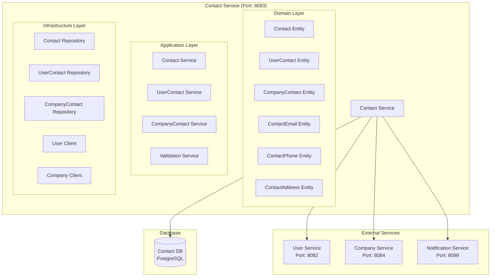

# Contact Service Architecture

## 📋 Overview

Contact Service, fabric management sisteminde contact information management, communication preferences ve contact-related business logic için tasarlanmış core microservice'dir. Bu servis, kullanıcı ve şirket iletişim bilgilerini yönetir.

## 🎯 Service Responsibilities

### **Primary Responsibilities**

- **Contact Management**: Contact CRUD operations
- **Contact Types**: User contacts, company contacts
- **Communication Preferences**: Email, phone, address management
- **Contact Validation**: Contact data validation
- **Contact Search**: Contact search and filtering

### **Secondary Responsibilities**

- **Contact Integration**: Integration with other services
- **Contact Analytics**: Contact usage analytics
- **Contact Notifications**: Contact-related notifications

## 🏗️ Service Architecture



## 📊 Database Schema

```sql
-- Base contact table
CREATE TABLE contacts (
    id UUID PRIMARY KEY,
    tenant_id UUID NOT NULL,
    contact_type VARCHAR(20) NOT NULL, -- USER, COMPANY
    status VARCHAR(20) DEFAULT 'ACTIVE',
    first_name VARCHAR(50),
    last_name VARCHAR(50),
    display_name VARCHAR(100),
    notes TEXT,
    created_at TIMESTAMP DEFAULT CURRENT_TIMESTAMP,
    updated_at TIMESTAMP DEFAULT CURRENT_TIMESTAMP,
    created_by VARCHAR(100),
    updated_by VARCHAR(100)
);

-- User contacts table
CREATE TABLE user_contacts (
    id UUID PRIMARY KEY,
    contact_id UUID NOT NULL,
    user_id UUID NOT NULL,
    user_display_name VARCHAR(100),
    personal_email VARCHAR(100),
    personal_phone VARCHAR(20),
    alternate_email VARCHAR(100),
    alternate_phone VARCHAR(20),
    home_address JSONB,

    CONSTRAINT fk_user_contact_contact FOREIGN KEY (contact_id) REFERENCES contacts(id)
);

-- Company contacts table
CREATE TABLE company_contacts (
    id UUID PRIMARY KEY,
    contact_id UUID NOT NULL,
    company_id UUID NOT NULL,
    company_name VARCHAR(200),
    website VARCHAR(200),
    main_contact_person VARCHAR(100),
    main_contact_email VARCHAR(100),
    main_contact_phone VARCHAR(20),
    business_hours JSONB,

    CONSTRAINT fk_company_contact_contact FOREIGN KEY (contact_id) REFERENCES contacts(id)
);

-- Contact emails table
CREATE TABLE contact_emails (
    id UUID PRIMARY KEY,
    contact_id UUID NOT NULL,
    email VARCHAR(100) NOT NULL,
    email_type VARCHAR(20) DEFAULT 'PRIMARY', -- PRIMARY, SECONDARY, WORK, PERSONAL
    is_primary BOOLEAN DEFAULT FALSE,
    is_verified BOOLEAN DEFAULT FALSE,
    created_at TIMESTAMP DEFAULT CURRENT_TIMESTAMP,

    CONSTRAINT fk_contact_email_contact FOREIGN KEY (contact_id) REFERENCES contacts(id)
);

-- Contact phones table
CREATE TABLE contact_phones (
    id UUID PRIMARY KEY,
    contact_id UUID NOT NULL,
    phone VARCHAR(20) NOT NULL,
    phone_type VARCHAR(20) DEFAULT 'PRIMARY', -- PRIMARY, SECONDARY, WORK, PERSONAL, MOBILE
    is_primary BOOLEAN DEFAULT FALSE,
    is_verified BOOLEAN DEFAULT FALSE,
    created_at TIMESTAMP DEFAULT CURRENT_TIMESTAMP,

    CONSTRAINT fk_contact_phone_contact FOREIGN KEY (contact_id) REFERENCES contacts(id)
);

-- Contact addresses table
CREATE TABLE contact_addresses (
    id UUID PRIMARY KEY,
    contact_id UUID NOT NULL,
    address_type VARCHAR(20) DEFAULT 'HOME', -- HOME, WORK, BILLING, SHIPPING
    street VARCHAR(200),
    city VARCHAR(100),
    state VARCHAR(100),
    postal_code VARCHAR(20),
    country VARCHAR(100),
    is_primary BOOLEAN DEFAULT FALSE,
    created_at TIMESTAMP DEFAULT CURRENT_TIMESTAMP,

    CONSTRAINT fk_contact_address_contact FOREIGN KEY (contact_id) REFERENCES contacts(id)
);
```

## 🔧 Service Implementation

```java
@Service
@Transactional
public class ContactService {

    private final ContactRepository contactRepository;
    private final UserContactRepository userContactRepository;
    private final CompanyContactRepository companyContactRepository;
    private final UserServiceClient userServiceClient;
    private final CompanyServiceClient companyServiceClient;

    public ContactResponse createUserContact(CreateUserContactRequest request) {
        // Validate user exists
        UserResponse user = userServiceClient.getUserById(request.getUserId());

        // Create base contact
        Contact contact = Contact.builder()
            .tenantId(request.getTenantId())
            .contactType(ContactType.USER)
            .firstName(request.getFirstName())
            .lastName(request.getLastName())
            .displayName(request.getDisplayName())
            .status(ContactStatus.ACTIVE)
            .build();

        Contact savedContact = contactRepository.save(contact);

        // Create user contact
        UserContact userContact = UserContact.builder()
            .contactId(savedContact.getId())
            .userId(request.getUserId())
            .userDisplayName(user.getDisplayName())
            .personalEmail(request.getPersonalEmail())
            .personalPhone(request.getPersonalPhone())
            .alternateEmail(request.getAlternateEmail())
            .alternatePhone(request.getAlternatePhone())
            .homeAddress(request.getHomeAddress())
            .build();

        userContactRepository.save(userContact);

        // Create contact emails
        if (request.getPersonalEmail() != null) {
            createContactEmail(savedContact.getId(), request.getPersonalEmail(), EmailType.PERSONAL, true);
        }
        if (request.getAlternateEmail() != null) {
            createContactEmail(savedContact.getId(), request.getAlternateEmail(), EmailType.SECONDARY, false);
        }

        // Create contact phones
        if (request.getPersonalPhone() != null) {
            createContactPhone(savedContact.getId(), request.getPersonalPhone(), PhoneType.PERSONAL, true);
        }
        if (request.getAlternatePhone() != null) {
            createContactPhone(savedContact.getId(), request.getAlternatePhone(), PhoneType.SECONDARY, false);
        }

        return mapToContactResponse(savedContact, userContact);
    }

    public ContactResponse createCompanyContact(CreateCompanyContactRequest request) {
        // Validate company exists
        CompanyResponse company = companyServiceClient.getCompanyById(request.getCompanyId());

        // Create base contact
        Contact contact = Contact.builder()
            .tenantId(request.getTenantId())
            .contactType(ContactType.COMPANY)
            .displayName(request.getCompanyName())
            .status(ContactStatus.ACTIVE)
            .build();

        Contact savedContact = contactRepository.save(contact);

        // Create company contact
        CompanyContact companyContact = CompanyContact.builder()
            .contactId(savedContact.getId())
            .companyId(request.getCompanyId())
            .companyName(request.getCompanyName())
            .website(request.getWebsite())
            .mainContactPerson(request.getMainContactPerson())
            .mainContactEmail(request.getMainContactEmail())
            .mainContactPhone(request.getMainContactPhone())
            .businessHours(request.getBusinessHours())
            .build();

        companyContactRepository.save(companyContact);

        // Create contact emails
        if (request.getMainContactEmail() != null) {
            createContactEmail(savedContact.getId(), request.getMainContactEmail(), EmailType.WORK, true);
        }

        // Create contact phones
        if (request.getMainContactPhone() != null) {
            createContactPhone(savedContact.getId(), request.getMainContactPhone(), PhoneType.WORK, true);
        }

        return mapToContactResponse(savedContact, companyContact);
    }
}
```

## 📊 API Endpoints

```java
@RestController
@RequestMapping("/api/v1/contacts")
public class ContactController {

    @PostMapping("/user")
    public ResponseEntity<ContactResponse> createUserContact(@RequestBody CreateUserContactRequest request) {
        ContactResponse response = contactService.createUserContact(request);
        return ResponseEntity.ok(response);
    }

    @PostMapping("/company")
    public ResponseEntity<ContactResponse> createCompanyContact(@RequestBody CreateCompanyContactRequest request) {
        ContactResponse response = contactService.createCompanyContact(request);
        return ResponseEntity.ok(response);
    }

    @GetMapping("/{contactId}")
    public ResponseEntity<ContactResponse> getContact(@PathVariable UUID contactId) {
        ContactResponse response = contactService.getContact(contactId);
        return ResponseEntity.ok(response);
    }

    @GetMapping("/user/{userId}")
    public ResponseEntity<List<ContactResponse>> getUserContacts(@PathVariable UUID userId) {
        List<ContactResponse> response = contactService.getUserContacts(userId);
        return ResponseEntity.ok(response);
    }

    @GetMapping("/company/{companyId}")
    public ResponseEntity<List<ContactResponse>> getCompanyContacts(@PathVariable UUID companyId) {
        List<ContactResponse> response = contactService.getCompanyContacts(companyId);
        return ResponseEntity.ok(response);
    }

    @PutMapping("/{contactId}")
    public ResponseEntity<ContactResponse> updateContact(
        @PathVariable UUID contactId,
        @RequestBody UpdateContactRequest request) {
        ContactResponse response = contactService.updateContact(contactId, request);
        return ResponseEntity.ok(response);
    }

    @DeleteMapping("/{contactId}")
    public ResponseEntity<Void> deleteContact(@PathVariable UUID contactId) {
        contactService.deleteContact(contactId);
        return ResponseEntity.ok().build();
    }
}
```

## 🔐 Security Configuration

```java
@Configuration
@EnableWebSecurity
public class SecurityConfig {

    @Bean
    public SecurityFilterChain filterChain(HttpSecurity http) throws Exception {
        http
            .csrf().disable()
            .sessionManagement().sessionCreationPolicy(SessionCreationPolicy.STATELESS)
            .and()
            .authorizeHttpRequests(authz -> authz
                .requestMatchers("/api/v1/contacts/**").hasRole("USER")
                .anyRequest().authenticated()
            )
            .addFilterBefore(jwtAuthenticationFilter(), UsernamePasswordAuthenticationFilter.class);

        return http.build();
    }
}
```

## 🚀 Deployment Configuration

```yaml
apiVersion: apps/v1
kind: Deployment
metadata:
  name: contact-service
spec:
  replicas: 2
  selector:
    matchLabels:
      app: contact-service
  template:
    metadata:
      labels:
        app: contact-service
    spec:
      containers:
        - name: contact-service
          image: fabric-management/contact-service:latest
          ports:
            - containerPort: 8083
          env:
            - name: SPRING_PROFILES_ACTIVE
              value: "prod"
            - name: POSTGRES_HOST
              value: "postgres-core"
            - name: USER_SERVICE_URL
              value: "http://user-service:8082"
            - name: COMPANY_SERVICE_URL
              value: "http://company-service:8084"
          resources:
            requests:
              memory: "512Mi"
              cpu: "250m"
            limits:
              memory: "1Gi"
              cpu: "500m"
```

## 📈 Performance Considerations

- **Database Indexing**: Contact type, user_id, company_id indexes
- **Caching**: Contact data caching with Redis
- **Search Optimization**: Full-text search for contact names
- **Pagination**: Efficient pagination for contact lists
- **Connection Pooling**: Database connection pooling

## 🎯 Business Value

- **Centralized Contact Management**: Merkezi iletişim bilgisi yönetimi
- **Data Consistency**: Tutarlı iletişim verisi
- **Integration**: Diğer servislerle seamless entegrasyon
- **Scalability**: Yüksek performanslı contact operations
