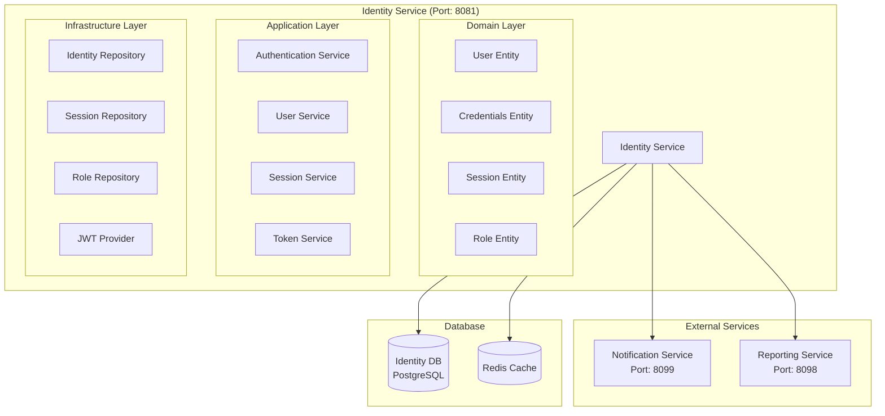

# Identity Service Architecture

## 📋 Overview

Identity Service, fabric management sisteminde authentication, authorization ve user identity yönetimi için tasarlanmış core microservice'dir. Bu servis, sistem genelinde güvenlik ve kimlik doğrulama işlemlerini merkezi olarak yönetir.

## 🎯 Service Responsibilities

### **Primary Responsibilities**

- **Authentication**: Login, logout, password management
- **Authorization**: JWT token management, role-based access control
- **User Identity**: User identity verification and management
- **Session Management**: User session tracking and management
- **Two-Factor Authentication**: 2FA implementation and management
- **Password Security**: Password policies and security

### **Secondary Responsibilities**

- **User Registration**: New user registration process
- **Password Reset**: Password reset and recovery
- **Account Lockout**: Security-based account locking
- **Audit Logging**: Security event logging

## 🏗️ Service Architecture



## 📊 Database Schema

```sql
-- Users table
CREATE TABLE users (
    id UUID PRIMARY KEY,
    tenant_id UUID NOT NULL,
    username VARCHAR(50) UNIQUE NOT NULL,
    email VARCHAR(100) UNIQUE NOT NULL,
    phone VARCHAR(20),
    password_hash VARCHAR(255),
    password_must_change BOOLEAN DEFAULT FALSE,
    failed_login_attempts INTEGER DEFAULT 0,
    locked_until TIMESTAMP,
    last_login_at TIMESTAMP,
    last_login_ip VARCHAR(45),
    two_factor_enabled BOOLEAN DEFAULT FALSE,
    two_factor_secret VARCHAR(255),
    status VARCHAR(20) DEFAULT 'ACTIVE',
    role VARCHAR(20) DEFAULT 'USER',
    created_at TIMESTAMP DEFAULT CURRENT_TIMESTAMP,
    updated_at TIMESTAMP DEFAULT CURRENT_TIMESTAMP,
    created_by VARCHAR(100),
    updated_by VARCHAR(100)
);

-- Sessions table
CREATE TABLE sessions (
    id UUID PRIMARY KEY,
    user_id UUID NOT NULL,
    access_token VARCHAR(500),
    refresh_token VARCHAR(500),
    expires_at TIMESTAMP,
    created_at TIMESTAMP DEFAULT CURRENT_TIMESTAMP,
    last_accessed_at TIMESTAMP DEFAULT CURRENT_TIMESTAMP,
    ip_address VARCHAR(45),
    user_agent TEXT,
    is_active BOOLEAN DEFAULT TRUE,

    CONSTRAINT fk_session_user FOREIGN KEY (user_id) REFERENCES users(id)
);

-- Roles table
CREATE TABLE roles (
    id UUID PRIMARY KEY,
    tenant_id UUID NOT NULL,
    name VARCHAR(50) NOT NULL,
    description TEXT,
    permissions JSONB,
    is_active BOOLEAN DEFAULT TRUE,
    created_at TIMESTAMP DEFAULT CURRENT_TIMESTAMP,
    updated_at TIMESTAMP DEFAULT CURRENT_TIMESTAMP
);

-- User roles table
CREATE TABLE user_roles (
    id UUID PRIMARY KEY,
    user_id UUID NOT NULL,
    role_id UUID NOT NULL,
    assigned_at TIMESTAMP DEFAULT CURRENT_TIMESTAMP,
    assigned_by VARCHAR(100),

    CONSTRAINT fk_user_role_user FOREIGN KEY (user_id) REFERENCES users(id),
    CONSTRAINT fk_user_role_role FOREIGN KEY (role_id) REFERENCES roles(id),
    UNIQUE(user_id, role_id)
);
```

## 🔧 Service Implementation

### **Common Modules Integration**

Identity Service, common modüllerini kullanarak tutarlı bir yapı sağlar:

```java
@Service
@Transactional
public class AuthenticationService extends BaseService<AuthResponse, UUID> {

    private final UserRepository userRepository;
    private final SessionRepository sessionRepository;
    private final JwtTokenProvider jwtTokenProvider; // Common Security
    private final PasswordEncoder passwordEncoder;
    private final NotificationServiceClient notificationServiceClient;
    private final SecurityContextUtil securityContextUtil; // Common Security

    public AuthResponse login(LoginRequest request) {
        // Validate user credentials
        User user = userRepository.findByUsernameAndDeletedFalse(request.getUsername())
            .orElseThrow(() -> new EntityNotFoundException("Invalid credentials"));

        // Check account status
        if (user.isAccountLocked()) {
            throw new BusinessRuleViolationException("Account is locked");
        }

        // Verify password
        if (!passwordEncoder.matches(request.getPassword(), user.getPasswordHash())) {
            incrementFailedAttempts(user);
            throw new AuthenticationException("Invalid credentials");
        }

        // Reset failed attempts on successful login
        resetFailedAttempts(user);

        // Generate tokens using Common Security
        String accessToken = jwtTokenProvider.createToken(user.getId().toString());
        String refreshToken = jwtTokenProvider.createToken(user.getId().toString());

        // Create session
        Session session = createSession(user, accessToken, refreshToken, request.getIpAddress());

        // Update last login
        user.setLastLoginAt(LocalDateTime.now());
        user.setLastLoginIp(request.getIpAddress());
        userRepository.save(user);

        return AuthResponse.builder()
            .accessToken(accessToken)
            .refreshToken(refreshToken)
            .expiresIn(jwtTokenProvider.getValidity())
            .user(mapToUserResponse(user))
            .build();
    }

    public void logout(String refreshToken) {
        Session session = sessionRepository.findByRefreshToken(refreshToken)
            .orElseThrow(() -> new EntityNotFoundException("Session not found"));

        session.setActive(false);
        sessionRepository.save(session);
    }

    // BaseService implementation
    @Override
    public AuthResponse create(AuthResponse dto) {
        // Implementation for BaseService
        return dto;
    }

    @Override
    public AuthResponse getById(UUID id) {
        Session session = sessionRepository.findActiveById(id)
            .orElseThrow(() -> new EntityNotFoundException("Session not found"));
        return mapToAuthResponse(session);
    }
}
```

## 📊 API Endpoints

```java
@RestController
@RequestMapping("/api/v1/auth")
@Validated
public class AuthenticationController extends BaseController<AuthResponse, UUID, AuthenticationService> {

    public AuthenticationController(AuthenticationService authenticationService) {
        super(authenticationService);
    }

    @PostMapping("/login")
    public ResponseEntity<ApiResponse<AuthResponse>> login(@Valid @RequestBody LoginRequest request) {
        AuthResponse response = authenticationService.login(request);
        return ResponseEntity.ok(ApiResponse.success(response, "Login successful"));
    }

    @PostMapping("/logout")
    public ResponseEntity<ApiResponse<Void>> logout(@RequestHeader("Authorization") String token) {
        authenticationService.logout(token);
        return ResponseEntity.ok(ApiResponse.success("Logout successful"));
    }

    @PostMapping("/refresh")
    public ResponseEntity<ApiResponse<AuthResponse>> refreshToken(@Valid @RequestBody RefreshTokenRequest request) {
        AuthResponse response = authenticationService.refreshToken(request.getRefreshToken());
        return ResponseEntity.ok(ApiResponse.success(response, "Token refreshed successfully"));
    }

    @PostMapping("/change-password")
    public ResponseEntity<ApiResponse<Void>> changePassword(
        @RequestHeader("Authorization") String token,
        @Valid @RequestBody ChangePasswordRequest request) {
        authenticationService.changePassword(token, request);
        return ResponseEntity.ok(ApiResponse.success("Password changed successfully"));
    }

    @GetMapping("/me")
    public ResponseEntity<ApiResponse<UserResponse>> getCurrentUser() {
        UserResponse user = authenticationService.getCurrentUser();
        return ResponseEntity.ok(ApiResponse.success(user));
    }
}
```

## 🔐 Security Configuration

```java
@Configuration
@EnableWebSecurity
@EnableMethodSecurity
public class SecurityConfig {

    @Autowired
    private JwtAuthenticationFilter jwtAuthenticationFilter; // Common Security

    @Bean
    public SecurityFilterChain filterChain(HttpSecurity http) throws Exception {
        http
            .csrf().disable()
            .sessionManagement().sessionCreationPolicy(SessionCreationPolicy.STATELESS)
            .and()
            .authorizeHttpRequests(authz -> authz
                .requestMatchers("/api/v1/auth/login", "/api/v1/auth/register").permitAll()
                .requestMatchers("/api/v1/auth/**").authenticated()
                .anyRequest().authenticated()
            )
            .addFilterBefore(jwtAuthenticationFilter, UsernamePasswordAuthenticationFilter.class);

        return http.build();
    }

    @Bean
    public PasswordEncoder passwordEncoder() {
        return new BCryptPasswordEncoder();
    }

    // JwtAuthenticationFilter Common Security modülünden gelir
}
```

## 🚀 Deployment Configuration

```yaml
apiVersion: apps/v1
kind: Deployment
metadata:
  name: identity-service
spec:
  replicas: 2
  selector:
    matchLabels:
      app: identity-service
  template:
    metadata:
      labels:
        app: identity-service
    spec:
      containers:
        - name: identity-service
          image: fabric-management/identity-service:latest
          ports:
            - containerPort: 8081
          env:
            - name: SPRING_PROFILES_ACTIVE
              value: "prod"
            - name: POSTGRES_HOST
              value: "postgres-core"
            - name: REDIS_HOST
              value: "redis"
            - name: JWT_SECRET
              valueFrom:
                secretKeyRef:
                  name: jwt-secret
                  key: secret
          resources:
            requests:
              memory: "512Mi"
              cpu: "250m"
            limits:
              memory: "1Gi"
              cpu: "500m"
```

## 📈 Performance Considerations

- **JWT Token Caching**: Redis ile token validation cache
- **Session Management**: Distributed session storage
- **Password Hashing**: BCrypt ile güvenli password hashing
- **Rate Limiting**: Login attempt rate limiting
- **Database Indexing**: Username, email, session token indexes

## 🎯 Business Value

- **Centralized Security**: Merkezi güvenlik yönetimi
- **Scalable Authentication**: Yüksek performanslı authentication
- **Compliance**: Security compliance ve audit logging
- **User Experience**: Seamless login/logout experience

## 🔧 Common Modules Integration

### **Dependencies**

```xml
<dependency>
    <groupId>com.fabricmanagement</groupId>
    <artifactId>common-core</artifactId>
    <version>1.0.0-SNAPSHOT</version>
</dependency>

<dependency>
    <groupId>com.fabricmanagement</groupId>
    <artifactId>common-security</artifactId>
    <version>1.0.0-SNAPSHOT</version>
</dependency>
```

### **Key Components Used**

- **BaseEntity**: User, Session, Role entity'leri için
- **BaseRepository**: UserRepository, SessionRepository için
- **BaseService**: AuthenticationService için
- **BaseController**: AuthenticationController için
- **ApiResponse**: Tüm endpoint'lerde standart response
- **JwtTokenProvider**: Token yönetimi için
- **SecurityContextUtil**: Current user bilgileri için
- **GlobalExceptionHandler**: Hata yönetimi için

### **Benefits**

- **Code Consistency**: Tutarlı kod yapısı
- **Reduced Boilerplate**: Tekrarlayan kod azalması
- **Standardized Security**: Standart güvenlik yapısı
- **Easier Maintenance**: Kolay bakım
- **Better Testing**: Daha iyi test edilebilirlik
