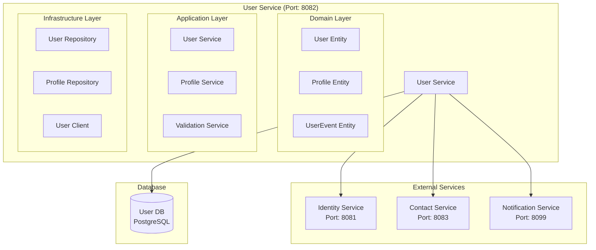

# User Service Architecture

## 📋 Overview

User Service, fabric management sisteminde user profile management, user preferences ve user-related business logic için tasarlanmış core microservice'dir. Bu servis, kullanıcı profil bilgilerini yönetir ve diğer servisler için user data sağlar.

## 🔧 Common Modules Integration

### **Minimalist Approach - Sadece Gerekli Bileşenler**

User Service, over-engineering'den kaçınarak sadece gerekli common modülleri kullanır:

#### **✅ Kullanılan Common Bileşenler:**

- **BaseEntity**: User entity'si için audit trail ve soft delete
- **ApiResponse**: Standart response formatı
- **GlobalExceptionHandler**: Tutarlı hata yönetimi
- **Common Exceptions**: EntityNotFoundException, BusinessRuleViolationException
- **SecurityContextUtil**: Current user bilgileri

#### **❌ Kullanılmayan Bileşenler:**

- **BaseController**: Generic CRUD kısıtlaması
- **BaseService**: Business logic kısıtlaması
- **BaseRepository**: JPA zaten sağlıyor
- **BaseDto**: Inheritance karmaşıklığı

## 🎯 Service Responsibilities

### **Primary Responsibilities**

- **User Profile Management**: User profile CRUD operations
- **User Preferences**: User settings and preferences
- **User Status Management**: User status tracking
- **User Data Validation**: User data validation and business rules
- **User Search**: User search and filtering capabilities

### **Secondary Responsibilities**

- **User Analytics**: User behavior analytics
- **User Notifications**: User notification preferences
- **User Integration**: Integration with other services

## 🏗️ Service Implementation

### **Entity Development with BaseEntity**

```java
@Entity
@Table(name = "users")
public class User extends BaseEntity {

    @Column(nullable = false, unique = true)
    private String username;

    @Column(nullable = false, unique = true)
    private String email;

    @Column(name = "first_name")
    private String firstName;

    @Column(name = "last_name")
    private String lastName;

    @Enumerated(EnumType.STRING)
    private UserStatus status;

    @Column(name = "last_login_at")
    private LocalDateTime lastLoginAt;

    // BaseEntity'den gelen alanlar otomatik:
    // id, createdAt, updatedAt, createdBy, updatedBy, version, deleted
}
```

### **Repository Development**

```java
@Repository
public interface UserRepository extends JpaRepository<User, UUID> {

    // Custom query methods
    Optional<User> findByUsernameAndDeletedFalse(String username);
    Optional<User> findByEmailAndDeletedFalse(String email);
    boolean existsByUsernameAndDeletedFalse(String username);
    boolean existsByEmailAndDeletedFalse(String email);

    // Active users only
    @Query("SELECT u FROM User u WHERE u.deleted = false")
    List<User> findAllActive();

    @Query("SELECT u FROM User u WHERE u.deleted = false AND u.id = :id")
    Optional<User> findActiveById(@Param("id") UUID id);

    @Query("SELECT u FROM User u WHERE u.deleted = false AND u.status = :status")
    List<User> findByStatusAndDeletedFalse(@Param("status") UserStatus status);

    // Pagination support
    @Query("SELECT u FROM User u WHERE u.deleted = false")
    Page<User> findAllActive(Pageable pageable);
}
```

### **Service Implementation**

```java
@Service
@Transactional
public class UserService {

    private final UserRepository userRepository;
    private final UserMapper userMapper;
    private final SecurityContextUtil securityContextUtil; // Common Security

    public UserResponse createUser(CreateUserRequest request) {
        // Validate unique constraints
        if (userRepository.existsByUsernameAndDeletedFalse(request.getUsername())) {
            throw new BusinessRuleViolationException("Username already exists");
        }

        if (userRepository.existsByEmailAndDeletedFalse(request.getEmail())) {
            throw new BusinessRuleViolationException("Email already exists");
        }

        // Get current user info from security context
        UUID currentUserId = securityContextUtil.getCurrentUserId();
        UUID tenantId = securityContextUtil.getCurrentTenantId();

        // Create user
        User user = User.builder()
            .username(request.getUsername())
            .email(request.getEmail())
            .firstName(request.getFirstName())
            .lastName(request.getLastName())
            .status(UserStatus.ACTIVE)
            .tenantId(tenantId)
            .createdBy(currentUserId.toString())
            .build();

        User savedUser = userRepository.save(user);

        // Publish user created event
        publishUserCreatedEvent(savedUser);

        return userMapper.toDto(savedUser);
    }

    public UserResponse getUser(UUID userId) {
        User user = userRepository.findActiveById(userId)
            .orElseThrow(() -> new EntityNotFoundException("User not found"));

        return userMapper.toDto(user);
    }

    public UserResponse updateUser(UUID userId, UpdateUserRequest request) {
        User user = userRepository.findActiveById(userId)
            .orElseThrow(() -> new EntityNotFoundException("User not found"));

        // Get current user info
        String currentUsername = securityContextUtil.getCurrentUsername();

        // Update fields
        user.setFirstName(request.getFirstName());
        user.setLastName(request.getLastName());
        user.setEmail(request.getEmail());
        user.setUpdatedBy(currentUsername);

        User updatedUser = userRepository.save(user);

        return userMapper.toDto(updatedUser);
    }

    public void deleteUser(UUID userId) {
        User user = userRepository.findActiveById(userId)
            .orElseThrow(() -> new EntityNotFoundException("User not found"));

        // Soft delete using BaseEntity method
        user.markAsDeleted();
        userRepository.save(user);
    }

    public List<UserResponse> getUsersByStatus(UserStatus status) {
        List<User> users = userRepository.findByStatusAndDeletedFalse(status);
        return users.stream()
            .map(userMapper::toDto)
            .collect(Collectors.toList());
    }

    public PageResponse<UserResponse> getUsers(PageRequest pageRequest) {
        Pageable pageable = PageRequest.of(pageRequest.getPage(), pageRequest.getSize());
        Page<User> userPage = userRepository.findAllActive(pageable);

        List<UserResponse> userDtos = userPage.getContent().stream()
            .map(userMapper::toDto)
            .collect(Collectors.toList());

        return PageResponse.<UserResponse>builder()
            .content(userDtos)
            .page(userPage.getNumber())
            .size(userPage.getSize())
            .totalElements(userPage.getTotalElements())
            .totalPages(userPage.getTotalPages())
            .first(userPage.isFirst())
            .last(userPage.isLast())
            .build();
    }
}
```

### **Controller Implementation**

```java
@RestController
@RequestMapping("/api/v1/users")
@Validated
public class UserController {

    private final UserService userService;

    public UserController(UserService userService) {
        this.userService = userService;
    }

    @PostMapping
    public ResponseEntity<ApiResponse<UserResponse>> createUser(@Valid @RequestBody CreateUserRequest request) {
        UserResponse user = userService.createUser(request);
        return ResponseEntity.status(HttpStatus.CREATED)
            .body(ApiResponse.success(user, "User created successfully"));
    }

    @GetMapping("/{userId}")
    public ResponseEntity<ApiResponse<UserResponse>> getUser(@PathVariable UUID userId) {
        UserResponse user = userService.getUser(userId);
        return ResponseEntity.ok(ApiResponse.success(user));
    }

    @PutMapping("/{userId}")
    public ResponseEntity<ApiResponse<UserResponse>> updateUser(
        @PathVariable UUID userId,
        @Valid @RequestBody UpdateUserRequest request) {
        UserResponse user = userService.updateUser(userId, request);
        return ResponseEntity.ok(ApiResponse.success(user, "User updated successfully"));
    }

    @DeleteMapping("/{userId}")
    public ResponseEntity<ApiResponse<Void>> deleteUser(@PathVariable UUID userId) {
        userService.deleteUser(userId);
        return ResponseEntity.ok(ApiResponse.success("User deleted successfully"));
    }

    @GetMapping
    public ResponseEntity<ApiResponse<PageResponse<UserResponse>>> getUsers(
        @RequestParam(defaultValue = "0") int page,
        @RequestParam(defaultValue = "20") int size) {

        PageRequest pageRequest = PageRequest.builder()
            .page(page)
            .size(size)
            .build();

        PageResponse<UserResponse> users = userService.getUsers(pageRequest);
        return ResponseEntity.ok(ApiResponse.success(users));
    }

    @GetMapping("/status/{status}")
    public ResponseEntity<ApiResponse<List<UserResponse>>> getUsersByStatus(@PathVariable UserStatus status) {
        List<UserResponse> users = userService.getUsersByStatus(status);
        return ResponseEntity.ok(ApiResponse.success(users));
    }
}
```

## 🏗️ Service Architecture



## 📊 Database Schema

```sql
-- Users table
CREATE TABLE users (
    id UUID PRIMARY KEY,
    tenant_id UUID NOT NULL,
    username VARCHAR(50) UNIQUE NOT NULL,
    email VARCHAR(100) UNIQUE NOT NULL,
    first_name VARCHAR(50),
    last_name VARCHAR(50),
    display_name VARCHAR(100),
    phone VARCHAR(20),
    avatar_url VARCHAR(500),
    date_of_birth DATE,
    gender VARCHAR(10),
    language VARCHAR(10) DEFAULT 'en',
    timezone VARCHAR(50) DEFAULT 'UTC',
    status VARCHAR(20) DEFAULT 'ACTIVE',
    last_login_at TIMESTAMP,
    created_at TIMESTAMP DEFAULT CURRENT_TIMESTAMP,
    updated_at TIMESTAMP DEFAULT CURRENT_TIMESTAMP,
    created_by VARCHAR(100),
    updated_by VARCHAR(100)
);

-- User profiles table
CREATE TABLE user_profiles (
    id UUID PRIMARY KEY,
    user_id UUID NOT NULL,
    bio TEXT,
    location VARCHAR(100),
    website VARCHAR(200),
    social_links JSONB,
    preferences JSONB,
    created_at TIMESTAMP DEFAULT CURRENT_TIMESTAMP,
    updated_at TIMESTAMP DEFAULT CURRENT_TIMESTAMP,

    CONSTRAINT fk_profile_user FOREIGN KEY (user_id) REFERENCES users(id)
);

-- User events table
CREATE TABLE user_events (
    id UUID PRIMARY KEY,
    user_id UUID NOT NULL,
    event_type VARCHAR(50) NOT NULL,
    event_data JSONB,
    created_at TIMESTAMP DEFAULT CURRENT_TIMESTAMP,

    CONSTRAINT fk_event_user FOREIGN KEY (user_id) REFERENCES users(id)
);
```

## 🔧 Service Implementation

```java
@Service
@Transactional
public class UserService {

    private final UserRepository userRepository;
    private final ProfileRepository profileRepository;
    private final IdentityServiceClient identityServiceClient;
    private final ContactServiceClient contactServiceClient;

    public UserResponse createUser(CreateUserRequest request) {
        // Validate user data
        validateUserData(request);

        // Create user entity
        User user = User.builder()
            .tenantId(request.getTenantId())
            .username(request.getUsername())
            .email(request.getEmail())
            .firstName(request.getFirstName())
            .lastName(request.getLastName())
            .displayName(request.getDisplayName())
            .phone(request.getPhone())
            .status(UserStatus.ACTIVE)
            .build();

        // Save user
        User savedUser = userRepository.save(user);

        // Create profile
        Profile profile = Profile.builder()
            .userId(savedUser.getId())
            .preferences(new HashMap<>())
            .build();

        profileRepository.save(profile);

        // Publish user created event
        publishUserCreatedEvent(savedUser);

        return mapToUserResponse(savedUser);
    }

    public UserResponse updateUser(UUID userId, UpdateUserRequest request) {
        User user = userRepository.findById(userId)
            .orElseThrow(() -> new UserNotFoundException("User not found"));

        // Update user fields
        if (request.getFirstName() != null) {
            user.setFirstName(request.getFirstName());
        }
        if (request.getLastName() != null) {
            user.setLastName(request.getLastName());
        }
        if (request.getDisplayName() != null) {
            user.setDisplayName(request.getDisplayName());
        }
        if (request.getPhone() != null) {
            user.setPhone(request.getPhone());
        }

        user.setUpdatedAt(LocalDateTime.now());
        User updatedUser = userRepository.save(user);

        // Publish user updated event
        publishUserUpdatedEvent(updatedUser);

        return mapToUserResponse(updatedUser);
    }
}
```

## 📊 API Endpoints

```java
@RestController
@RequestMapping("/api/v1/users")
public class UserController {

    @PostMapping
    public ResponseEntity<UserResponse> createUser(@RequestBody CreateUserRequest request) {
        UserResponse response = userService.createUser(request);
        return ResponseEntity.ok(response);
    }

    @GetMapping("/{userId}")
    public ResponseEntity<UserResponse> getUser(@PathVariable UUID userId) {
        UserResponse response = userService.getUser(userId);
        return ResponseEntity.ok(response);
    }

    @PutMapping("/{userId}")
    public ResponseEntity<UserResponse> updateUser(
        @PathVariable UUID userId,
        @RequestBody UpdateUserRequest request) {
        UserResponse response = userService.updateUser(userId, request);
        return ResponseEntity.ok(response);
    }

    @DeleteMapping("/{userId}")
    public ResponseEntity<Void> deleteUser(@PathVariable UUID userId) {
        userService.deleteUser(userId);
        return ResponseEntity.ok().build();
    }

    @GetMapping("/search")
    public ResponseEntity<List<UserResponse>> searchUsers(
        @RequestParam String query,
        @RequestParam(defaultValue = "0") int page,
        @RequestParam(defaultValue = "20") int size) {
        List<UserResponse> response = userService.searchUsers(query, page, size);
        return ResponseEntity.ok(response);
    }
}
```

## 🔐 Security Configuration

```java
@Configuration
@EnableWebSecurity
public class SecurityConfig {

    @Bean
    public SecurityFilterChain filterChain(HttpSecurity http) throws Exception {
        http
            .csrf().disable()
            .sessionManagement().sessionCreationPolicy(SessionCreationPolicy.STATELESS)
            .and()
            .authorizeHttpRequests(authz -> authz
                .requestMatchers("/api/v1/users/search").hasRole("USER")
                .requestMatchers("/api/v1/users/**").hasRole("ADMIN")
                .anyRequest().authenticated()
            )
            .addFilterBefore(jwtAuthenticationFilter(), UsernamePasswordAuthenticationFilter.class);

        return http.build();
    }
}
```

## 🚀 Deployment Configuration

```yaml
apiVersion: apps/v1
kind: Deployment
metadata:
  name: user-service
spec:
  replicas: 2
  selector:
    matchLabels:
      app: user-service
  template:
    metadata:
      labels:
        app: user-service
    spec:
      containers:
        - name: user-service
          image: fabric-management/user-service:latest
          ports:
            - containerPort: 8082
          env:
            - name: SPRING_PROFILES_ACTIVE
              value: "prod"
            - name: POSTGRES_HOST
              value: "postgres-core"
            - name: IDENTITY_SERVICE_URL
              value: "http://identity-service:8081"
            - name: CONTACT_SERVICE_URL
              value: "http://contact-service:8083"
          resources:
            requests:
              memory: "512Mi"
              cpu: "250m"
            limits:
              memory: "1Gi"
              cpu: "500m"
```

## 📈 Performance Considerations

- **Database Indexing**: Username, email, tenant_id indexes
- **Caching**: User profile caching with Redis
- **Search Optimization**: Full-text search indexes
- **Pagination**: Efficient pagination for user lists
- **Connection Pooling**: Database connection pooling

## 🎯 Business Value

- **User Experience**: Comprehensive user profile management
- **Data Consistency**: Centralized user data management
- **Integration**: Seamless integration with other services

## 🔧 Common Modules Integration

### **Dependencies**

```xml
<dependency>
    <groupId>com.fabricmanagement</groupId>
    <artifactId>common-core</artifactId>
    <version>1.0.0-SNAPSHOT</version>
</dependency>

<dependency>
    <groupId>com.fabricmanagement</groupId>
    <artifactId>common-security</artifactId>
    <version>1.0.0-SNAPSHOT</version>
</dependency>
```

### **Key Components Used**

- **BaseEntity**: User entity'si için audit trail ve soft delete
- **ApiResponse**: Tüm endpoint'lerde standart response
- **GlobalExceptionHandler**: Hata yönetimi için
- **Common Exceptions**: EntityNotFoundException, BusinessRuleViolationException
- **SecurityContextUtil**: Current user bilgileri için

### **Benefits**

- **Code Consistency**: Tutarlı kod yapısı
- **Reduced Boilerplate**: Tekrarlayan kod azalması
- **Standardized Security**: Standart güvenlik yapısı
- **Easier Maintenance**: Kolay bakım
- **Better Testing**: Daha iyi test edilebilirlik

### **Testing Benefits**

```java
@ExtendWith(MockitoExtension.class)
class UserServiceTest {

    @Mock
    private UserRepository userRepository;

    @Mock
    private SecurityContextUtil securityContextUtil;

    @InjectMocks
    private UserService userService;

    @Test
    void shouldCreateUser() {
        // Given
        CreateUserRequest request = new CreateUserRequest();
        when(userRepository.existsByUsernameAndDeletedFalse(any())).thenReturn(false);
        when(securityContextUtil.getCurrentUserId()).thenReturn(UUID.randomUUID());

        // When
        UserResponse result = userService.createUser(request);

        // Then
        assertThat(result).isNotNull();
        verify(userRepository).save(any(User.class));
    }
}
```

- **Scalability**: High-performance user operations
