# Fabric Management System - Complete Architecture Diagram

## 🏗️ Complete Microservice Architecture Overview

Bu diagram, Fabric Management System'in tüm 24 mikroservisini ve aralarındaki ilişkileri gösterir.

```mermaid
graph TB
    subgraph "Client Layer"
        WEB[Web Application<br/>React/Angular]
        MOB[Mobile App<br/>iOS/Android]
        API_CLIENT[API Clients<br/>Third Party]
    end

    subgraph "API Gateway Layer"
        GATEWAY[API Gateway<br/>Spring Cloud Gateway<br/>Port: 8080]
    end

    subgraph "Core Services Layer"
        IDENTITY[Identity Service<br/>🔐 Authentication & Authorization<br/>Port: 8081<br/>Status: ✅ Complete]
        USER[User Service<br/>👤 User Management<br/>Port: 8082<br/>Status: ✅ Complete]
        CONTACT[Contact Service<br/>📞 Contact Information<br/>Port: 8083<br/>Status: ✅ Complete]
        COMPANY[Company Service<br/>🏢 Company Management<br/>Port: 8084<br/>Status: ✅ Complete]
    end

    subgraph "HR Management Services"
        HR[HR Service<br/>👥 Human Resources<br/>Port: 8085<br/>Status: ❌ Missing]
        PAYROLL[Payroll Service<br/>💰 Salary Management<br/>Port: 8086<br/>Status: ❌ Missing]
        LEAVE[Leave Service<br/>🏖️ Leave Management<br/>Port: 8087<br/>Status: ❌ Missing]
        PERFORMANCE[Performance Service<br/>📊 Performance Reviews<br/>Port: 8088<br/>Status: ❌ Missing]
    end

    subgraph "Inventory Management Services"
        INVENTORY[Inventory Service<br/>📦 Stock Management<br/>Port: 8089<br/>Status: ❌ Missing]
        CATALOG[Catalog Service<br/>📋 Product Catalog<br/>Port: 8090<br/>Status: ❌ Missing]
        PRICING[Pricing Service<br/>💲 Price Management<br/>Port: 8091<br/>Status: ❌ Missing]
        PROCUREMENT[Procurement Service<br/>🛒 Purchase Orders<br/>Port: 8092<br/>Status: ❌ Missing]
        QUALITY_CONTROL[Quality Control Service<br/>🔍 Quality Management<br/>Port: 8093<br/>Status: ❌ Missing]
    end

    subgraph "Order Management Services"
        ORDER[Order Service<br/>📋 Order Processing<br/>Port: 8094<br/>Status: ❌ Missing]
    end

    subgraph "Logistics Services"
        LOGISTICS[Logistics Service<br/>🚚 Shipping & Delivery<br/>Port: 8095<br/>Status: ❌ Missing]
    end

    subgraph "Production Services"
        PRODUCTION[Production Service<br/>🏭 Manufacturing<br/>Port: 8096<br/>Status: ❌ Missing]
    end

    subgraph "Financial Services"
        ACCOUNTING[Accounting Service<br/>📊 Financial Records<br/>Port: 8097<br/>Status: ❌ Missing]
        INVOICE[Invoice Service<br/>🧾 Invoice Management<br/>Port: 8098<br/>Status: ❌ Missing]
        PAYMENT[Payment Service<br/>💳 Payment Processing<br/>Port: 8099<br/>Status: ❌ Missing]
        BILLING[Billing Service<br/>💸 Billing Management<br/>Port: 8100<br/>Status: ❌ Missing]
    end

    subgraph "AI & Analytics Services"
        AI[AI Service<br/>🤖 AI Analytics<br/>Port: 8101<br/>Status: ❌ Missing]
        REPORTING[Reporting Service<br/>📈 Reports & Dashboards<br/>Port: 8102<br/>Status: ❌ Missing]
        NOTIFICATION[Notification Service<br/>📧 Email/SMS/Push<br/>Port: 8103<br/>Status: ❌ Missing]
    end

    subgraph "Infrastructure Services"
        POSTGRES[(PostgreSQL<br/>Database<br/>Port: 5433)]
        REDIS[(Redis<br/>Cache<br/>Port: 6379)]
        KAFKA[Kafka<br/>Message Broker<br/>Port: 9092]
        ZOOKEEPER[Zookeeper<br/>Coordination<br/>Port: 2181]
    end

    subgraph "Monitoring & Observability"
        PROMETHEUS[Prometheus<br/>Metrics<br/>Port: 9090<br/>Status: ❌ Missing]
        GRAFANA[Grafana<br/>Dashboards<br/>Port: 3000<br/>Status: ❌ Missing]
        JAEGER[Jaeger<br/>Tracing<br/>Port: 16686<br/>Status: ❌ Missing]
    end

    %% Client connections
    WEB --> GATEWAY
    MOB --> GATEWAY
    API_CLIENT --> GATEWAY

    %% Gateway to services
    GATEWAY --> IDENTITY
    GATEWAY --> USER
    GATEWAY --> CONTACT
    GATEWAY --> COMPANY
    GATEWAY --> HR
    GATEWAY --> PAYROLL
    GATEWAY --> LEAVE
    GATEWAY --> PERFORMANCE
    GATEWAY --> INVENTORY
    GATEWAY --> CATALOG
    GATEWAY --> PRICING
    GATEWAY --> PROCUREMENT
    GATEWAY --> QUALITY_CONTROL
    GATEWAY --> ORDER
    GATEWAY --> LOGISTICS
    GATEWAY --> PRODUCTION
    GATEWAY --> ACCOUNTING
    GATEWAY --> INVOICE
    GATEWAY --> PAYMENT
    GATEWAY --> BILLING
    GATEWAY --> AI
    GATEWAY --> REPORTING
    GATEWAY --> NOTIFICATION

    %% Core service dependencies
    USER --> IDENTITY
    CONTACT --> IDENTITY
    CONTACT --> USER
    COMPANY --> IDENTITY
    COMPANY --> CONTACT

    %% HR service dependencies
    HR --> IDENTITY
    HR --> USER
    HR --> COMPANY
    HR --> CONTACT
    PAYROLL --> HR
    PAYROLL --> ACCOUNTING
    PAYROLL --> NOTIFICATION
    LEAVE --> HR
    LEAVE --> USER
    LEAVE --> NOTIFICATION
    PERFORMANCE --> HR
    PERFORMANCE --> USER
    PERFORMANCE --> LEAVE

    %% Inventory service dependencies
    INVENTORY --> IDENTITY
    INVENTORY --> COMPANY
    CATALOG --> IDENTITY
    CATALOG --> COMPANY
    PRICING --> IDENTITY
    PRICING --> COMPANY
    PRICING --> CATALOG
    PROCUREMENT --> COMPANY
    PROCUREMENT --> CONTACT
    PROCUREMENT --> INVENTORY
    QUALITY_CONTROL --> IDENTITY
    QUALITY_CONTROL --> INVENTORY
    QUALITY_CONTROL --> COMPANY

    %% Order service dependencies
    ORDER --> IDENTITY
    ORDER --> COMPANY
    ORDER --> INVENTORY
    ORDER --> CATALOG
    ORDER --> PRICING

    %% Logistics service dependencies
    LOGISTICS --> IDENTITY
    LOGISTICS --> COMPANY
    LOGISTICS --> ORDER

    %% Production service dependencies
    PRODUCTION --> IDENTITY
    PRODUCTION --> COMPANY
    PRODUCTION --> INVENTORY
    PRODUCTION --> ORDER
    PRODUCTION --> LOGISTICS

    %% Financial service dependencies
    ACCOUNTING --> IDENTITY
    ACCOUNTING --> COMPANY
    ACCOUNTING --> INVENTORY
    INVOICE --> ACCOUNTING
    INVOICE --> PROCUREMENT
    INVOICE --> COMPANY
    PAYMENT --> INVOICE
    PAYMENT --> ACCOUNTING
    PAYMENT --> NOTIFICATION
    BILLING --> ACCOUNTING
    BILLING --> INVOICE
    BILLING --> PAYMENT

    %% AI & Analytics dependencies
    AI --> IDENTITY
    AI --> PERFORMANCE
    AI --> QUALITY_CONTROL
    REPORTING --> IDENTITY
    REPORTING --> USER
    REPORTING --> AI
    REPORTING --> HR
    REPORTING --> ACCOUNTING
    REPORTING --> INVENTORY
    REPORTING --> QUALITY_CONTROL
    NOTIFICATION --> IDENTITY
    NOTIFICATION --> CONTACT

    %% Infrastructure connections
    IDENTITY --> POSTGRES
    IDENTITY --> REDIS
    IDENTITY --> KAFKA
    USER --> POSTGRES
    USER --> REDIS
    USER --> KAFKA
    CONTACT --> POSTGRES
    CONTACT --> REDIS
    CONTACT --> KAFKA
    COMPANY --> POSTGRES
    COMPANY --> REDIS
    COMPANY --> KAFKA

    %% Monitoring connections
    PROMETHEUS --> IDENTITY
    PROMETHEUS --> USER
    PROMETHEUS --> CONTACT
    PROMETHEUS --> COMPANY
    GRAFANA --> PROMETHEUS
    JAEGER --> GATEWAY

    %% Styling
    classDef completed fill:#d4edda,stroke:#155724,stroke-width:2px,color:#155724
    classDef missing fill:#f8d7da,stroke:#721c24,stroke-width:2px,color:#721c24
    classDef infrastructure fill:#d1ecf1,stroke:#0c5460,stroke-width:2px,color:#0c5460
    classDef gateway fill:#fff3cd,stroke:#856404,stroke-width:2px,color:#856404
    classDef client fill:#e2e3e5,stroke:#383d41,stroke-width:2px,color:#383d41

    class IDENTITY,USER,CONTACT,COMPANY completed
    class HR,PAYROLL,LEAVE,PERFORMANCE,INVENTORY,CATALOG,PRICING,PROCUREMENT,QUALITY_CONTROL,ORDER,LOGISTICS,PRODUCTION,ACCOUNTING,INVOICE,PAYMENT,BILLING,AI,REPORTING,NOTIFICATION,PROMETHEUS,GRAFANA,JAEGER missing
    class POSTGRES,REDIS,KAFKA,ZOOKEEPER infrastructure
    class GATEWAY gateway
    class WEB,MOB,API_CLIENT client
```

## 📊 Service Status Summary

### ✅ **Completed Services (4/24)**

- **Identity Service** (Port: 8081) - Authentication & Authorization
- **User Service** (Port: 8082) - User Management
- **Contact Service** (Port: 8083) - Contact Information
- **Company Service** (Port: 8084) - Company Management

### ❌ **Missing Services (20/24)**

- **HR Services** (4) - HR, Payroll, Leave, Performance
- **Inventory Services** (5) - Inventory, Catalog, Pricing, Procurement, Quality Control
- **Order Services** (1) - Order
- **Logistics Services** (1) - Logistics
- **Production Services** (1) - Production
- **Financial Services** (4) - Accounting, Invoice, Payment, Billing
- **AI & Analytics Services** (3) - AI, Reporting, Notification

### 🔧 **Infrastructure Services**

- **PostgreSQL** (Port: 5433) - Primary Database
- **Redis** (Port: 6379) - Caching Layer
- **Kafka** (Port: 9092) - Message Broker
- **Zookeeper** (Port: 2181) - Coordination Service

### 📈 **Monitoring & Observability (Missing)**

- **Prometheus** (Port: 9090) - Metrics Collection
- **Grafana** (Port: 3000) - Dashboards
- **Jaeger** (Port: 16686) - Distributed Tracing

## 🔗 **Service Dependencies Matrix**

### **High Dependency Services (Many Dependencies)**

- **Identity Service**: Used by ALL services (24 dependencies)
- **Company Service**: Used by 15+ services
- **User Service**: Used by 8+ services
- **Contact Service**: Used by 6+ services

### **Medium Dependency Services**

- **Accounting Service**: Used by 5+ services
- **Inventory Service**: Used by 4+ services
- **Notification Service**: Used by 8+ services

### **Low Dependency Services**

- **AI Service**: Used by 2 services
- **Reporting Service**: Used by 1 service
- **Quality Control Service**: Used by 2 services

## 🎯 **Implementation Priority**

### **Phase 1: Critical Infrastructure (Week 1-2)**

1. API Gateway Implementation
2. Service Discovery (Eureka)
3. Monitoring Stack (Prometheus + Grafana)

### **Phase 2: Core Business Services (Week 3-6)**

1. HR Services (4 services)
2. Inventory Services (5 services)
3. Order & Logistics Services (2 services)

### **Phase 3: Advanced Services (Week 7-10)**

1. Production Service
2. Financial Services (4 services)
3. AI & Analytics Services (3 services)

### **Phase 4: Enterprise Features (Week 11-12)**

1. Advanced Monitoring
2. CI/CD Pipeline
3. Kubernetes Deployment

## 🚨 **Critical Issues Identified**

### **1. Port Conflicts**

- Contact Service: 8083 vs 8084 (docker-compose.yml conflict)
- Company Service: 8084 vs 8083 (docker-compose.yml conflict)

### **2. Missing Infrastructure**

- API Gateway not implemented
- Service Discovery missing
- Monitoring & Observability missing

### **3. Security Concerns**

- Default JWT secrets in production
- No centralized authentication
- Missing rate limiting

### **4. Service Communication**

- No circuit breakers
- No retry mechanisms
- No load balancing

## 📋 **Next Steps**

1. **Fix port conflicts** in docker-compose.yml
2. **Implement API Gateway** with Spring Cloud Gateway
3. **Add monitoring** with Prometheus + Grafana
4. **Implement missing services** following the priority order
5. **Add security hardening** and authentication
6. **Implement CI/CD pipeline** for automated deployment

---

**Last Updated**: 2024-01-XX  
**Version**: 1.0.0  
**Status**: 4/24 Services Complete (16.7%)
