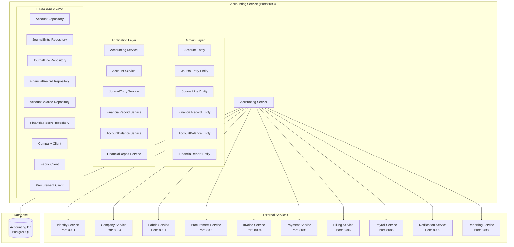

# Accounting Service Architecture

## 📋 Overview

Accounting Service, fabric management sisteminde accounting management, financial records ve accounting-related business logic için tasarlanmış specialized microservice'dir. Bu servis, genel muhasebe, hesap planı ve mali kayıtları yönetir.

## 🎯 Service Responsibilities

### **Primary Responsibilities**

- **Accounting Management**: General ledger management
- **Chart of Accounts**: Account structure management
- **Journal Entries**: Journal entry processing
- **Financial Records**: Financial transaction records
- **Account Balances**: Account balance tracking
- **Financial Reports**: Financial reports and statements

### **Secondary Responsibilities**

- **Accounting Integration**: Integration with other financial systems
- **Accounting Notifications**: Accounting-related notifications
- **Accounting Analytics**: Financial analytics and insights
- **Compliance**: Accounting compliance and audit trails

## 🏗️ Service Architecture



## 📊 Database Schema

```sql
-- Chart of accounts table
CREATE TABLE chart_of_accounts (
    id UUID PRIMARY KEY,
    tenant_id UUID NOT NULL,
    company_id UUID NOT NULL,
    account_code VARCHAR(20) NOT NULL,
    account_name VARCHAR(200) NOT NULL,
    account_type VARCHAR(50) NOT NULL, -- ASSET, LIABILITY, EQUITY, REVENUE, EXPENSE
    account_category VARCHAR(100) NOT NULL, -- CURRENT_ASSET, FIXED_ASSET, CURRENT_LIABILITY, etc.
    parent_account_id UUID,
    account_level INTEGER NOT NULL, -- 1, 2, 3, 4, 5
    is_active BOOLEAN DEFAULT TRUE,
    is_leaf_account BOOLEAN DEFAULT FALSE,
    normal_balance VARCHAR(10) NOT NULL, -- DEBIT, CREDIT
    description TEXT,
    created_at TIMESTAMP DEFAULT CURRENT_TIMESTAMP,
    updated_at TIMESTAMP DEFAULT CURRENT_TIMESTAMP,
    created_by VARCHAR(100),
    updated_by VARCHAR(100),

    CONSTRAINT fk_account_company FOREIGN KEY (company_id) REFERENCES companies(id),
    CONSTRAINT fk_account_parent FOREIGN KEY (parent_account_id) REFERENCES chart_of_accounts(id),
    UNIQUE(company_id, account_code)
);

-- Journal entries table
CREATE TABLE journal_entries (
    id UUID PRIMARY KEY,
    tenant_id UUID NOT NULL,
    company_id UUID NOT NULL,
    entry_number VARCHAR(100) UNIQUE NOT NULL,
    entry_date DATE NOT NULL,
    entry_type VARCHAR(50) NOT NULL, -- MANUAL, AUTOMATIC, ADJUSTMENT, CLOSING
    reference_type VARCHAR(50), -- PURCHASE_ORDER, INVOICE, PAYMENT, PAYROLL
    reference_id UUID, -- Reference to source document
    description TEXT NOT NULL,
    total_debit DECIMAL(15,2) NOT NULL,
    total_credit DECIMAL(15,2) NOT NULL,
    status VARCHAR(20) DEFAULT 'DRAFT', -- DRAFT, POSTED, REVERSED
    posted_by UUID,
    posted_at TIMESTAMP,
    created_at TIMESTAMP DEFAULT CURRENT_TIMESTAMP,
    updated_at TIMESTAMP DEFAULT CURRENT_TIMESTAMP,
    created_by VARCHAR(100),
    updated_by VARCHAR(100),

    CONSTRAINT fk_entry_company FOREIGN KEY (company_id) REFERENCES companies(id),
    CONSTRAINT fk_entry_posted FOREIGN KEY (posted_by) REFERENCES employees(id)
);

-- Journal entry lines table
CREATE TABLE journal_entry_lines (
    id UUID PRIMARY KEY,
    journal_entry_id UUID NOT NULL,
    account_id UUID NOT NULL,
    line_number INTEGER NOT NULL,
    description TEXT,
    debit_amount DECIMAL(15,2) DEFAULT 0,
    credit_amount DECIMAL(15,2) DEFAULT 0,
    currency VARCHAR(3) DEFAULT 'USD',
    exchange_rate DECIMAL(10,6) DEFAULT 1.0,
    base_debit_amount DECIMAL(15,2) DEFAULT 0,
    base_credit_amount DECIMAL(15,2) DEFAULT 0,
    created_at TIMESTAMP DEFAULT CURRENT_TIMESTAMP,

    CONSTRAINT fk_line_entry FOREIGN KEY (journal_entry_id) REFERENCES journal_entries(id),
    CONSTRAINT fk_line_account FOREIGN KEY (account_id) REFERENCES chart_of_accounts(id)
);

-- Account balances table
CREATE TABLE account_balances (
    id UUID PRIMARY KEY,
    account_id UUID NOT NULL,
    balance_date DATE NOT NULL,
    debit_balance DECIMAL(15,2) DEFAULT 0,
    credit_balance DECIMAL(15,2) DEFAULT 0,
    net_balance DECIMAL(15,2) DEFAULT 0,
    currency VARCHAR(3) DEFAULT 'USD',
    created_at TIMESTAMP DEFAULT CURRENT_TIMESTAMP,
    updated_at TIMESTAMP DEFAULT CURRENT_TIMESTAMP,

    CONSTRAINT fk_balance_account FOREIGN KEY (account_id) REFERENCES chart_of_accounts(id),
    UNIQUE(account_id, balance_date)
);

-- Financial records table
CREATE TABLE financial_records (
    id UUID PRIMARY KEY,
    tenant_id UUID NOT NULL,
    company_id UUID NOT NULL,
    record_type VARCHAR(50) NOT NULL, -- TRANSACTION, ADJUSTMENT, CLOSING
    record_date DATE NOT NULL,
    reference_type VARCHAR(50), -- PURCHASE_ORDER, INVOICE, PAYMENT, PAYROLL
    reference_id UUID,
    description TEXT,
    amount DECIMAL(15,2) NOT NULL,
    currency VARCHAR(3) DEFAULT 'USD',
    exchange_rate DECIMAL(10,6) DEFAULT 1.0,
    base_amount DECIMAL(15,2) NOT NULL,
    status VARCHAR(20) DEFAULT 'PENDING', -- PENDING, POSTED, REVERSED
    created_at TIMESTAMP DEFAULT CURRENT_TIMESTAMP,
    updated_at TIMESTAMP DEFAULT CURRENT_TIMESTAMP,
    created_by VARCHAR(100),
    updated_by VARCHAR(100),

    CONSTRAINT fk_record_company FOREIGN KEY (company_id) REFERENCES companies(id)
);

-- Trial balance table
CREATE TABLE trial_balance (
    id UUID PRIMARY KEY,
    company_id UUID NOT NULL,
    balance_date DATE NOT NULL,
    account_id UUID NOT NULL,
    account_code VARCHAR(20) NOT NULL,
    account_name VARCHAR(200) NOT NULL,
    debit_balance DECIMAL(15,2) DEFAULT 0,
    credit_balance DECIMAL(15,2) DEFAULT 0,
    net_balance DECIMAL(15,2) DEFAULT 0,
    created_at TIMESTAMP DEFAULT CURRENT_TIMESTAMP,

    CONSTRAINT fk_trial_company FOREIGN KEY (company_id) REFERENCES companies(id),
    CONSTRAINT fk_trial_account FOREIGN KEY (account_id) REFERENCES chart_of_accounts(id),
    UNIQUE(company_id, balance_date, account_id)
);

-- Financial statements table
CREATE TABLE financial_statements (
    id UUID PRIMARY KEY,
    company_id UUID NOT NULL,
    statement_type VARCHAR(50) NOT NULL, -- BALANCE_SHEET, INCOME_STATEMENT, CASH_FLOW
    statement_date DATE NOT NULL,
    period_start DATE NOT NULL,
    period_end DATE NOT NULL,
    statement_data JSONB, -- Statement data in JSON format
    total_assets DECIMAL(15,2),
    total_liabilities DECIMAL(15,2),
    total_equity DECIMAL(15,2),
    total_revenue DECIMAL(15,2),
    total_expenses DECIMAL(15,2),
    net_income DECIMAL(15,2),
    status VARCHAR(20) DEFAULT 'DRAFT', -- DRAFT, FINAL, AUDITED
    created_at TIMESTAMP DEFAULT CURRENT_TIMESTAMP,
    updated_at TIMESTAMP DEFAULT CURRENT_TIMESTAMP,
    created_by VARCHAR(100),
    updated_by VARCHAR(100),

    CONSTRAINT fk_statement_company FOREIGN KEY (company_id) REFERENCES companies(id)
);

-- Accounting reports table
CREATE TABLE accounting_reports (
    id UUID PRIMARY KEY,
    report_type VARCHAR(50) NOT NULL, -- TRIAL_BALANCE, GENERAL_LEDGER, FINANCIAL_STATEMENT
    report_name VARCHAR(200) NOT NULL,
    report_period_start DATE NOT NULL,
    report_period_end DATE NOT NULL,
    report_data JSONB, -- Report data in JSON format
    generated_by UUID NOT NULL,
    generated_at TIMESTAMP DEFAULT CURRENT_TIMESTAMP,
    report_status VARCHAR(20) DEFAULT 'GENERATED', -- GENERATED, SENT, VIEWED
    report_url VARCHAR(500), -- Link to generated report

    CONSTRAINT fk_report_generated FOREIGN KEY (generated_by) REFERENCES employees(id)
);
```

## 🔧 Service Implementation

```java
@Service
@Transactional
public class AccountingService {

    private final ChartOfAccountsRepository chartOfAccountsRepository;
    private final JournalEntryRepository journalEntryRepository;
    private final JournalEntryLineRepository journalEntryLineRepository;
    private final AccountBalanceRepository accountBalanceRepository;
    private final FinancialRecordRepository financialRecordRepository;
    private final TrialBalanceRepository trialBalanceRepository;
    private final FinancialStatementRepository financialStatementRepository;
    private final IdentityServiceClient identityServiceClient;
    private final CompanyServiceClient companyServiceClient;
    private final FabricServiceClient fabricServiceClient;
    private final ProcurementServiceClient procurementServiceClient;

    public AccountResponse createAccount(CreateAccountRequest request) {
        // Validate company exists
        CompanyResponse company = companyServiceClient.getCompanyById(request.getCompanyId());

        // Validate parent account if provided
        if (request.getParentAccountId() != null) {
            Account parentAccount = chartOfAccountsRepository.findById(request.getParentAccountId())
                .orElseThrow(() -> new AccountNotFoundException("Parent account not found"));
        }

        // Create account
        Account account = Account.builder()
            .tenantId(request.getTenantId())
            .companyId(request.getCompanyId())
            .accountCode(request.getAccountCode())
            .accountName(request.getAccountName())
            .accountType(request.getAccountType())
            .accountCategory(request.getAccountCategory())
            .parentAccountId(request.getParentAccountId())
            .accountLevel(request.getAccountLevel())
            .isActive(true)
            .isLeafAccount(request.getIsLeafAccount())
            .normalBalance(request.getNormalBalance())
            .description(request.getDescription())
            .build();

        Account savedAccount = chartOfAccountsRepository.save(account);

        // Publish account created event
        publishAccountCreatedEvent(savedAccount);

        return mapToAccountResponse(savedAccount);
    }

    public JournalEntryResponse createJournalEntry(CreateJournalEntryRequest request) {
        // Validate company exists
        CompanyResponse company = companyServiceClient.getCompanyById(request.getCompanyId());

        // Generate entry number
        String entryNumber = generateEntryNumber(request.getCompanyId());

        // Create journal entry
        JournalEntry journalEntry = JournalEntry.builder()
            .tenantId(request.getTenantId())
            .companyId(request.getCompanyId())
            .entryNumber(entryNumber)
            .entryDate(request.getEntryDate())
            .entryType(request.getEntryType())
            .referenceType(request.getReferenceType())
            .referenceId(request.getReferenceId())
            .description(request.getDescription())
            .totalDebit(BigDecimal.ZERO)
            .totalCredit(BigDecimal.ZERO)
            .status(JournalEntryStatus.DRAFT)
            .build();

        JournalEntry savedEntry = journalEntryRepository.save(journalEntry);

        // Create journal entry lines
        BigDecimal totalDebit = BigDecimal.ZERO;
        BigDecimal totalCredit = BigDecimal.ZERO;

        for (CreateJournalEntryLineRequest lineRequest : request.getLines()) {
            JournalEntryLine line = createJournalEntryLine(savedEntry.getId(), lineRequest);
            totalDebit = totalDebit.add(line.getDebitAmount());
            totalCredit = totalCredit.add(line.getCreditAmount());
        }

        // Update totals
        savedEntry.setTotalDebit(totalDebit);
        savedEntry.setTotalCredit(totalCredit);
        journalEntryRepository.save(savedEntry);

        // Publish journal entry created event
        publishJournalEntryCreatedEvent(savedEntry);

        return mapToJournalEntryResponse(savedEntry);
    }

    public JournalEntryResponse postJournalEntry(UUID journalEntryId, PostJournalEntryRequest request) {
        JournalEntry journalEntry = journalEntryRepository.findById(journalEntryId)
            .orElseThrow(() -> new JournalEntryNotFoundException("Journal entry not found"));

        // Validate debits equal credits
        if (journalEntry.getTotalDebit().compareTo(journalEntry.getTotalCredit()) != 0) {
            throw new InvalidJournalEntryException("Total debits must equal total credits");
        }

        // Update journal entry status
        journalEntry.setStatus(JournalEntryStatus.POSTED);
        journalEntry.setPostedBy(request.getPostedBy());
        journalEntry.setPostedAt(LocalDateTime.now());
        journalEntry.setUpdatedAt(LocalDateTime.now());

        JournalEntry savedEntry = journalEntryRepository.save(journalEntry);

        // Update account balances
        updateAccountBalances(savedEntry);

        // Create financial records
        createFinancialRecords(savedEntry);

        // Publish journal entry posted event
        publishJournalEntryPostedEvent(savedEntry);

        return mapToJournalEntryResponse(savedEntry);
    }

    public AccountBalanceResponse getAccountBalance(UUID accountId, LocalDate balanceDate) {
        Account account = chartOfAccountsRepository.findById(accountId)
            .orElseThrow(() -> new AccountNotFoundException("Account not found"));

        AccountBalance balance = accountBalanceRepository.findByAccountIdAndBalanceDate(accountId, balanceDate)
            .orElse(AccountBalance.builder()
                .accountId(accountId)
                .balanceDate(balanceDate)
                .debitBalance(BigDecimal.ZERO)
                .creditBalance(BigDecimal.ZERO)
                .netBalance(BigDecimal.ZERO)
                .build());

        return AccountBalanceResponse.builder()
            .accountId(accountId)
            .accountCode(account.getAccountCode())
            .accountName(account.getAccountName())
            .balanceDate(balanceDate)
            .debitBalance(balance.getDebitBalance())
            .creditBalance(balance.getCreditBalance())
            .netBalance(balance.getNetBalance())
            .build();
    }

    public TrialBalanceResponse generateTrialBalance(GenerateTrialBalanceRequest request) {
        // Generate trial balance data
        List<TrialBalanceData> trialBalanceData = generateTrialBalanceData(request);

        // Create trial balance records
        for (TrialBalanceData data : trialBalanceData) {
            TrialBalance trialBalance = TrialBalance.builder()
                .companyId(request.getCompanyId())
                .balanceDate(request.getBalanceDate())
                .accountId(data.getAccountId())
                .accountCode(data.getAccountCode())
                .accountName(data.getAccountName())
                .debitBalance(data.getDebitBalance())
                .creditBalance(data.getCreditBalance())
                .netBalance(data.getNetBalance())
                .build();

            trialBalanceRepository.save(trialBalance);
        }

        return TrialBalanceResponse.builder()
            .companyId(request.getCompanyId())
            .balanceDate(request.getBalanceDate())
            .trialBalanceData(trialBalanceData)
            .totalDebits(trialBalanceData.stream().mapToDouble(d -> d.getDebitBalance().doubleValue()).sum())
            .totalCredits(trialBalanceData.stream().mapToDouble(d -> d.getCreditBalance().doubleValue()).sum())
            .build();
    }

    public FinancialStatementResponse generateFinancialStatement(GenerateFinancialStatementRequest request) {
        // Generate financial statement data
        FinancialStatementData statementData = generateFinancialStatementData(request);

        // Create financial statement
        FinancialStatement financialStatement = FinancialStatement.builder()
            .companyId(request.getCompanyId())
            .statementType(request.getStatementType())
            .statementDate(request.getStatementDate())
            .periodStart(request.getPeriodStart())
            .periodEnd(request.getPeriodEnd())
            .statementData(statementData)
            .totalAssets(statementData.getTotalAssets())
            .totalLiabilities(statementData.getTotalLiabilities())
            .totalEquity(statementData.getTotalEquity())
            .totalRevenue(statementData.getTotalRevenue())
            .totalExpenses(statementData.getTotalExpenses())
            .netIncome(statementData.getNetIncome())
            .status(FinancialStatementStatus.DRAFT)
            .build();

        FinancialStatement savedStatement = financialStatementRepository.save(financialStatement);

        return mapToFinancialStatementResponse(savedStatement);
    }

    public AccountingReportResponse generateAccountingReport(GenerateAccountingReportRequest request) {
        // Generate report data based on report type
        AccountingReportData reportData = generateAccountingReportData(request);

        // Create accounting report
        AccountingReport accountingReport = AccountingReport.builder()
            .reportType(request.getReportType())
            .reportName(request.getReportName())
            .reportPeriodStart(request.getStartDate())
            .reportPeriodEnd(request.getEndDate())
            .reportData(reportData)
            .generatedBy(request.getGeneratedBy())
            .reportStatus(ReportStatus.GENERATED)
            .build();

        AccountingReport savedReport = accountingReportRepository.save(accountingReport);

        return mapToAccountingReportResponse(savedReport);
    }
}
```

## 📊 API Endpoints

```java
@RestController
@RequestMapping("/api/v1/accounting")
public class AccountingController {

    @PostMapping("/accounts")
    public ResponseEntity<AccountResponse> createAccount(@RequestBody CreateAccountRequest request) {
        AccountResponse response = accountingService.createAccount(request);
        return ResponseEntity.ok(response);
    }

    @GetMapping("/accounts/{accountId}")
    public ResponseEntity<AccountResponse> getAccount(@PathVariable UUID accountId) {
        AccountResponse response = accountingService.getAccount(accountId);
        return ResponseEntity.ok(response);
    }

    @GetMapping("/accounts")
    public ResponseEntity<List<AccountResponse>> getAccounts(
        @RequestParam UUID companyId,
        @RequestParam(defaultValue = "0") int page,
        @RequestParam(defaultValue = "20") int size) {
        List<AccountResponse> response = accountingService.getAccounts(companyId, page, size);
        return ResponseEntity.ok(response);
    }

    @PostMapping("/journal-entries")
    public ResponseEntity<JournalEntryResponse> createJournalEntry(@RequestBody CreateJournalEntryRequest request) {
        JournalEntryResponse response = accountingService.createJournalEntry(request);
        return ResponseEntity.ok(response);
    }

    @GetMapping("/journal-entries/{entryId}")
    public ResponseEntity<JournalEntryResponse> getJournalEntry(@PathVariable UUID entryId) {
        JournalEntryResponse response = accountingService.getJournalEntry(entryId);
        return ResponseEntity.ok(response);
    }

    @PostMapping("/journal-entries/{entryId}/post")
    public ResponseEntity<JournalEntryResponse> postJournalEntry(
        @PathVariable UUID entryId,
        @RequestBody PostJournalEntryRequest request) {
        JournalEntryResponse response = accountingService.postJournalEntry(entryId, request);
        return ResponseEntity.ok(response);
    }

    @GetMapping("/journal-entries")
    public ResponseEntity<List<JournalEntryResponse>> getJournalEntries(
        @RequestParam UUID companyId,
        @RequestParam @DateTimeFormat(iso = DateTimeFormat.ISO.DATE) LocalDate startDate,
        @RequestParam @DateTimeFormat(iso = DateTimeFormat.ISO.DATE) LocalDate endDate) {
        List<JournalEntryResponse> response = accountingService.getJournalEntries(companyId, startDate, endDate);
        return ResponseEntity.ok(response);
    }

    @GetMapping("/accounts/{accountId}/balance")
    public ResponseEntity<AccountBalanceResponse> getAccountBalance(
        @PathVariable UUID accountId,
        @RequestParam @DateTimeFormat(iso = DateTimeFormat.ISO.DATE) LocalDate balanceDate) {
        AccountBalanceResponse response = accountingService.getAccountBalance(accountId, balanceDate);
        return ResponseEntity.ok(response);
    }

    @PostMapping("/trial-balance")
    public ResponseEntity<TrialBalanceResponse> generateTrialBalance(@RequestBody GenerateTrialBalanceRequest request) {
        TrialBalanceResponse response = accountingService.generateTrialBalance(request);
        return ResponseEntity.ok(response);
    }

    @PostMapping("/financial-statements")
    public ResponseEntity<FinancialStatementResponse> generateFinancialStatement(@RequestBody GenerateFinancialStatementRequest request) {
        FinancialStatementResponse response = accountingService.generateFinancialStatement(request);
        return ResponseEntity.ok(response);
    }

    @PostMapping("/reports")
    public ResponseEntity<AccountingReportResponse> generateAccountingReport(@RequestBody GenerateAccountingReportRequest request) {
        AccountingReportResponse response = accountingService.generateAccountingReport(request);
        return ResponseEntity.ok(response);
    }
}
```

## 🔐 Security Configuration

```java
@Configuration
@EnableWebSecurity
public class SecurityConfig {

    @Bean
    public SecurityFilterChain filterChain(HttpSecurity http) throws Exception {
        http
            .csrf().disable()
            .sessionManagement().sessionCreationPolicy(SessionCreationPolicy.STATELESS)
            .and()
            .authorizeHttpRequests(authz -> authz
                .requestMatchers("/api/v1/accounting/**").hasRole("ACCOUNTING_USER")
                .anyRequest().authenticated()
            )
            .addFilterBefore(jwtAuthenticationFilter(), UsernamePasswordAuthenticationFilter.class);

        return http.build();
    }
}
```

## 🚀 Deployment Configuration

```yaml
apiVersion: apps/v1
kind: Deployment
metadata:
  name: accounting-service
spec:
  replicas: 2
  selector:
    matchLabels:
      app: accounting-service
  template:
    metadata:
      labels:
        app: accounting-service
    spec:
      containers:
        - name: accounting-service
          image: fabric-management/accounting-service:latest
          ports:
            - containerPort: 8093
          env:
            - name: SPRING_PROFILES_ACTIVE
              value: "prod"
            - name: POSTGRES_HOST
              value: "postgres-financial"
            - name: IDENTITY_SERVICE_URL
              value: "http://identity-service:8081"
            - name: COMPANY_SERVICE_URL
              value: "http://company-service:8084"
            - name: FABRIC_SERVICE_URL
              value: "http://fabric-service:8091"
            - name: PROCUREMENT_SERVICE_URL
              value: "http://procurement-service:8092"
          resources:
            requests:
              memory: "512Mi"
              cpu: "250m"
            limits:
              memory: "1Gi"
              cpu: "500m"
```

## 📈 Performance Considerations

- **Database Indexing**: Account_code, entry_date, balance_date indexes
- **Caching**: Account balances caching with Redis
- **Batch Processing**: Efficient batch operations for journal entries
- **Pagination**: Efficient pagination for financial records
- **Connection Pooling**: Database connection pooling

## 🎯 Business Value

- **Financial Control**: Mali kontrol ve yönetim
- **Compliance**: Muhasebe uyumluluğu
- **Reporting**: Mali raporlama
- **Audit Trail**: Denetim izi
- **Cost Management**: Maliyet yönetimi
