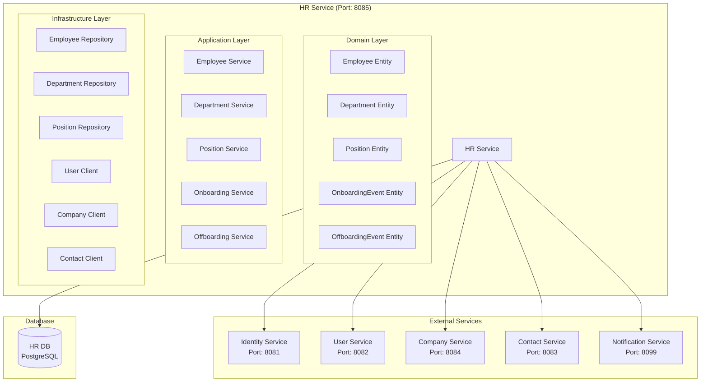

# HR Service Architecture

## 📋 Overview

HR Service, fabric management sisteminde human resources management, employee management ve HR-related business logic için tasarlanmış specialized microservice'dir. Bu servis, çalışan yönetimi, departman yönetimi ve HR süreçlerini yönetir.

## 🔧 Common Modules Integration

### **Minimalist Approach - Sadece Gerekli Bileşenler**

HR Service, over-engineering'den kaçınarak sadece gerekli common modülleri kullanır:

#### **✅ Kullanılan Common Bileşenler:**

- **BaseEntity**: Employee, Department entity'leri için audit trail ve soft delete
- **ApiResponse**: Standart response formatı
- **GlobalExceptionHandler**: Tutarlı hata yönetimi
- **Common Exceptions**: EntityNotFoundException, BusinessRuleViolationException
- **SecurityContextUtil**: Current user bilgileri

#### **❌ Kullanılmayan Bileşenler:**

- **BaseController**: Generic CRUD kısıtlaması
- **BaseService**: Business logic kısıtlaması
- **BaseRepository**: JPA zaten sağlıyor
- **BaseDto**: Inheritance karmaşıklığı

## 🎯 Service Responsibilities

### **Primary Responsibilities**

- **Employee Management**: Employee CRUD operations
- **Department Management**: Department structure management
- **Position Management**: Job positions and roles
- **Employee Onboarding**: New employee onboarding process
- **Employee Offboarding**: Employee exit process
- **HR Policies**: HR policy management

### **Secondary Responsibilities**

- **Employee Search**: Employee search and filtering
- **HR Analytics**: HR metrics and analytics
- **HR Reports**: HR reporting and dashboards
- **HR Integration**: Integration with other services

## 🏗️ Service Implementation

### **Entity Development with BaseEntity**

```java
@Entity
@Table(name = "employees")
public class Employee extends BaseEntity {

    @Column(name = "employee_number", unique = true)
    private String employeeNumber;

    @Column(name = "first_name", nullable = false)
    private String firstName;

    @Column(name = "last_name", nullable = false)
    private String lastName;

    @Column(name = "email", unique = true)
    private String email;

    @Column(name = "phone")
    private String phone;

    @Column(name = "hire_date")
    private LocalDate hireDate;

    @Enumerated(EnumType.STRING)
    private EmployeeStatus status;

    @ManyToOne(fetch = FetchType.LAZY)
    @JoinColumn(name = "department_id")
    private Department department;

    // BaseEntity'den gelen alanlar otomatik:
    // id, createdAt, updatedAt, createdBy, updatedBy, version, deleted
}

@Entity
@Table(name = "departments")
public class Department extends BaseEntity {

    @Column(name = "department_name", nullable = false)
    private String departmentName;

    @Column(name = "department_code", unique = true)
    private String departmentCode;

    @Column(name = "description")
    private String description;

    // BaseEntity'den gelen alanlar otomatik
}
```

### **Repository Development**

```java
@Repository
public interface EmployeeRepository extends JpaRepository<Employee, UUID> {

    // Custom query methods
    Optional<Employee> findByEmployeeNumberAndDeletedFalse(String employeeNumber);
    Optional<Employee> findByEmailAndDeletedFalse(String email);
    boolean existsByEmployeeNumberAndDeletedFalse(String employeeNumber);
    boolean existsByEmailAndDeletedFalse(String email);

    // Active employees only
    @Query("SELECT e FROM Employee e WHERE e.deleted = false")
    List<Employee> findAllActive();

    @Query("SELECT e FROM Employee e WHERE e.deleted = false AND e.id = :id")
    Optional<Employee> findActiveById(@Param("id") UUID id);

    @Query("SELECT e FROM Employee e WHERE e.deleted = false AND e.department.id = :departmentId")
    List<Employee> findByDepartmentIdAndDeletedFalse(@Param("departmentId") UUID departmentId);

    @Query("SELECT e FROM Employee e WHERE e.deleted = false AND e.status = :status")
    List<Employee> findByStatusAndDeletedFalse(@Param("status") EmployeeStatus status);
}

@Repository
public interface DepartmentRepository extends JpaRepository<Department, UUID> {

    Optional<Department> findByDepartmentCodeAndDeletedFalse(String departmentCode);
    boolean existsByDepartmentCodeAndDeletedFalse(String departmentCode);

    @Query("SELECT d FROM Department d WHERE d.deleted = false")
    List<Department> findAllActive();
}
```

### **Service Implementation**

```java
@Service
@Transactional
public class HRService {

    private final EmployeeRepository employeeRepository;
    private final DepartmentRepository departmentRepository;
    private final EmployeeMapper employeeMapper;
    private final DepartmentMapper departmentMapper;
    private final SecurityContextUtil securityContextUtil; // Common Security

    public EmployeeResponse createEmployee(CreateEmployeeRequest request) {
        // Validate unique constraints
        if (employeeRepository.existsByEmployeeNumberAndDeletedFalse(request.getEmployeeNumber())) {
            throw new BusinessRuleViolationException("Employee number already exists");
        }

        if (employeeRepository.existsByEmailAndDeletedFalse(request.getEmail())) {
            throw new BusinessRuleViolationException("Email already exists");
        }

        // Get current user info from security context
        UUID currentUserId = securityContextUtil.getCurrentUserId();
        UUID tenantId = securityContextUtil.getCurrentTenantId();

        // Create employee
        Employee employee = Employee.builder()
            .employeeNumber(request.getEmployeeNumber())
            .firstName(request.getFirstName())
            .lastName(request.getLastName())
            .email(request.getEmail())
            .phone(request.getPhone())
            .hireDate(request.getHireDate())
            .status(EmployeeStatus.ACTIVE)
            .tenantId(tenantId)
            .createdBy(currentUserId.toString())
            .build();

        Employee savedEmployee = employeeRepository.save(employee);

        return employeeMapper.toDto(savedEmployee);
    }

    public EmployeeResponse getEmployee(UUID employeeId) {
        Employee employee = employeeRepository.findActiveById(employeeId)
            .orElseThrow(() -> new EntityNotFoundException("Employee not found"));

        return employeeMapper.toDto(employee);
    }

    public void deleteEmployee(UUID employeeId) {
        Employee employee = employeeRepository.findActiveById(employeeId)
            .orElseThrow(() -> new EntityNotFoundException("Employee not found"));

        // Soft delete using BaseEntity method
        employee.markAsDeleted();
        employeeRepository.save(employee);
    }
}
```

### **Controller Implementation**

```java
@RestController
@RequestMapping("/api/v1/hr")
@Validated
public class HRController {

    private final HRService hrService;

    public HRController(HRService hrService) {
        this.hrService = hrService;
    }

    @PostMapping("/employees")
    public ResponseEntity<ApiResponse<EmployeeResponse>> createEmployee(@Valid @RequestBody CreateEmployeeRequest request) {
        EmployeeResponse employee = hrService.createEmployee(request);
        return ResponseEntity.status(HttpStatus.CREATED)
            .body(ApiResponse.success(employee, "Employee created successfully"));
    }

    @GetMapping("/employees/{employeeId}")
    public ResponseEntity<ApiResponse<EmployeeResponse>> getEmployee(@PathVariable UUID employeeId) {
        EmployeeResponse employee = hrService.getEmployee(employeeId);
        return ResponseEntity.ok(ApiResponse.success(employee));
    }

    @DeleteMapping("/employees/{employeeId}")
    public ResponseEntity<ApiResponse<Void>> deleteEmployee(@PathVariable UUID employeeId) {
        hrService.deleteEmployee(employeeId);
        return ResponseEntity.ok(ApiResponse.success("Employee deleted successfully"));
    }
}
```

## 🏗️ Service Architecture



## 📊 Database Schema

```sql
-- Employees table
CREATE TABLE employees (
    id UUID PRIMARY KEY,
    tenant_id UUID NOT NULL,
    user_id UUID NOT NULL,
    employee_number VARCHAR(50) UNIQUE NOT NULL,
    company_id UUID NOT NULL,
    department_id UUID,
    position_id UUID,
    manager_id UUID,
    employment_type VARCHAR(20) NOT NULL, -- FULL_TIME, PART_TIME, CONTRACT, INTERN
    employment_status VARCHAR(20) DEFAULT 'ACTIVE', -- ACTIVE, INACTIVE, TERMINATED, ON_LEAVE
    hire_date DATE NOT NULL,
    termination_date DATE,
    salary DECIMAL(10,2),
    currency VARCHAR(3) DEFAULT 'USD',
    work_schedule JSONB, -- Working hours and schedule
    benefits JSONB, -- Benefits information
    emergency_contact JSONB, -- Emergency contact information
    created_at TIMESTAMP DEFAULT CURRENT_TIMESTAMP,
    updated_at TIMESTAMP DEFAULT CURRENT_TIMESTAMP,
    created_by VARCHAR(100),
    updated_by VARCHAR(100)
);

-- Departments table
CREATE TABLE departments (
    id UUID PRIMARY KEY,
    tenant_id UUID NOT NULL,
    company_id UUID NOT NULL,
    department_name VARCHAR(100) NOT NULL,
    department_code VARCHAR(20) UNIQUE NOT NULL,
    parent_department_id UUID,
    department_head_id UUID,
    description TEXT,
    budget DECIMAL(15,2),
    cost_center VARCHAR(50),
    is_active BOOLEAN DEFAULT TRUE,
    created_at TIMESTAMP DEFAULT CURRENT_TIMESTAMP,
    updated_at TIMESTAMP DEFAULT CURRENT_TIMESTAMP,
    created_by VARCHAR(100),
    updated_by VARCHAR(100),

    CONSTRAINT fk_department_company FOREIGN KEY (company_id) REFERENCES companies(id),
    CONSTRAINT fk_department_parent FOREIGN KEY (parent_department_id) REFERENCES departments(id),
    CONSTRAINT fk_department_head FOREIGN KEY (department_head_id) REFERENCES employees(id)
);

-- Positions table
CREATE TABLE positions (
    id UUID PRIMARY KEY,
    tenant_id UUID NOT NULL,
    company_id UUID NOT NULL,
    position_title VARCHAR(100) NOT NULL,
    position_code VARCHAR(20) UNIQUE NOT NULL,
    department_id UUID,
    position_level INTEGER, -- 1-10 hierarchy level
    job_description TEXT,
    required_skills JSONB, -- Required skills array
    required_qualifications JSONB, -- Required qualifications
    salary_range_min DECIMAL(10,2),
    salary_range_max DECIMAL(10,2),
    currency VARCHAR(3) DEFAULT 'USD',
    is_active BOOLEAN DEFAULT TRUE,
    created_at TIMESTAMP DEFAULT CURRENT_TIMESTAMP,
    updated_at TIMESTAMP DEFAULT CURRENT_TIMESTAMP,
    created_by VARCHAR(100),
    updated_by VARCHAR(100),

    CONSTRAINT fk_position_company FOREIGN KEY (company_id) REFERENCES companies(id),
    CONSTRAINT fk_position_department FOREIGN KEY (department_id) REFERENCES departments(id)
);

-- Employee assignments table
CREATE TABLE employee_assignments (
    id UUID PRIMARY KEY,
    employee_id UUID NOT NULL,
    department_id UUID NOT NULL,
    position_id UUID NOT NULL,
    assignment_type VARCHAR(20) DEFAULT 'PRIMARY', -- PRIMARY, SECONDARY, TEMPORARY
    start_date DATE NOT NULL,
    end_date DATE,
    is_active BOOLEAN DEFAULT TRUE,
    created_at TIMESTAMP DEFAULT CURRENT_TIMESTAMP,
    updated_at TIMESTAMP DEFAULT CURRENT_TIMESTAMP,

    CONSTRAINT fk_assignment_employee FOREIGN KEY (employee_id) REFERENCES employees(id),
    CONSTRAINT fk_assignment_department FOREIGN KEY (department_id) REFERENCES departments(id),
    CONSTRAINT fk_assignment_position FOREIGN KEY (position_id) REFERENCES positions(id)
);

-- Onboarding events table
CREATE TABLE onboarding_events (
    id UUID PRIMARY KEY,
    employee_id UUID NOT NULL,
    event_type VARCHAR(50) NOT NULL, -- DOCUMENT_COLLECTION, ORIENTATION, TRAINING, EQUIPMENT_SETUP
    event_status VARCHAR(20) DEFAULT 'PENDING', -- PENDING, IN_PROGRESS, COMPLETED, CANCELLED
    scheduled_date DATE,
    completed_date DATE,
    assigned_to UUID, -- Person responsible for the event
    notes TEXT,
    created_at TIMESTAMP DEFAULT CURRENT_TIMESTAMP,
    updated_at TIMESTAMP DEFAULT CURRENT_TIMESTAMP,

    CONSTRAINT fk_onboarding_employee FOREIGN KEY (employee_id) REFERENCES employees(id),
    CONSTRAINT fk_onboarding_assigned FOREIGN KEY (assigned_to) REFERENCES employees(id)
);

-- Offboarding events table
CREATE TABLE offboarding_events (
    id UUID PRIMARY KEY,
    employee_id UUID NOT NULL,
    event_type VARCHAR(50) NOT NULL, -- EXIT_INTERVIEW, EQUIPMENT_RETURN, ACCESS_REVOCATION, FINAL_PAYMENT
    event_status VARCHAR(20) DEFAULT 'PENDING', -- PENDING, IN_PROGRESS, COMPLETED, CANCELLED
    scheduled_date DATE,
    completed_date DATE,
    assigned_to UUID, -- Person responsible for the event
    notes TEXT,
    created_at TIMESTAMP DEFAULT CURRENT_TIMESTAMP,
    updated_at TIMESTAMP DEFAULT CURRENT_TIMESTAMP,

    CONSTRAINT fk_offboarding_employee FOREIGN KEY (employee_id) REFERENCES employees(id),
    CONSTRAINT fk_offboarding_assigned FOREIGN KEY (assigned_to) REFERENCES employees(id)
);
```

## 🔧 Service Implementation

```java
@Service
@Transactional
public class EmployeeService {

    private final EmployeeRepository employeeRepository;
    private final DepartmentRepository departmentRepository;
    private final PositionRepository positionRepository;
    private final OnboardingEventRepository onboardingEventRepository;
    private final UserServiceClient userServiceClient;
    private final CompanyServiceClient companyServiceClient;
    private final ContactServiceClient contactServiceClient;

    public EmployeeResponse createEmployee(CreateEmployeeRequest request) {
        // Validate user exists
        UserResponse user = userServiceClient.getUserById(request.getUserId());

        // Validate company exists
        CompanyResponse company = companyServiceClient.getCompanyById(request.getCompanyId());

        // Validate department exists
        Department department = departmentRepository.findById(request.getDepartmentId())
            .orElseThrow(() -> new DepartmentNotFoundException("Department not found"));

        // Validate position exists
        Position position = positionRepository.findById(request.getPositionId())
            .orElseThrow(() -> new PositionNotFoundException("Position not found"));

        // Generate employee number
        String employeeNumber = generateEmployeeNumber(request.getCompanyId());

        // Create employee entity
        Employee employee = Employee.builder()
            .tenantId(request.getTenantId())
            .userId(request.getUserId())
            .employeeNumber(employeeNumber)
            .companyId(request.getCompanyId())
            .departmentId(request.getDepartmentId())
            .positionId(request.getPositionId())
            .managerId(request.getManagerId())
            .employmentType(request.getEmploymentType())
            .employmentStatus(EmploymentStatus.ACTIVE)
            .hireDate(request.getHireDate())
            .salary(request.getSalary())
            .currency(request.getCurrency())
            .workSchedule(request.getWorkSchedule())
            .benefits(request.getBenefits())
            .emergencyContact(request.getEmergencyContact())
            .build();

        Employee savedEmployee = employeeRepository.save(employee);

        // Create employee assignment
        createEmployeeAssignment(savedEmployee.getId(), request.getDepartmentId(), request.getPositionId());

        // Create onboarding events
        createOnboardingEvents(savedEmployee.getId());

        // Publish employee created event
        publishEmployeeCreatedEvent(savedEmployee);

        return mapToEmployeeResponse(savedEmployee);
    }

    public EmployeeResponse updateEmployee(UUID employeeId, UpdateEmployeeRequest request) {
        Employee employee = employeeRepository.findById(employeeId)
            .orElseThrow(() -> new EmployeeNotFoundException("Employee not found"));

        // Update employee fields
        if (request.getDepartmentId() != null) {
            employee.setDepartmentId(request.getDepartmentId());
        }
        if (request.getPositionId() != null) {
            employee.setPositionId(request.getPositionId());
        }
        if (request.getManagerId() != null) {
            employee.setManagerId(request.getManagerId());
        }
        if (request.getSalary() != null) {
            employee.setSalary(request.getSalary());
        }
        if (request.getWorkSchedule() != null) {
            employee.setWorkSchedule(request.getWorkSchedule());
        }
        if (request.getBenefits() != null) {
            employee.setBenefits(request.getBenefits());
        }

        employee.setUpdatedAt(LocalDateTime.now());
        Employee updatedEmployee = employeeRepository.save(employee);

        // Update employee assignment if department or position changed
        if (request.getDepartmentId() != null || request.getPositionId() != null) {
            updateEmployeeAssignment(employeeId, request.getDepartmentId(), request.getPositionId());
        }

        // Publish employee updated event
        publishEmployeeUpdatedEvent(updatedEmployee);

        return mapToEmployeeResponse(updatedEmployee);
    }

    public void terminateEmployee(UUID employeeId, TerminateEmployeeRequest request) {
        Employee employee = employeeRepository.findById(employeeId)
            .orElseThrow(() -> new EmployeeNotFoundException("Employee not found"));

        // Update employment status
        employee.setEmploymentStatus(EmploymentStatus.TERMINATED);
        employee.setTerminationDate(request.getTerminationDate());
        employee.setUpdatedAt(LocalDateTime.now());

        employeeRepository.save(employee);

        // Create offboarding events
        createOffboardingEvents(employeeId);

        // Publish employee terminated event
        publishEmployeeTerminatedEvent(employee);
    }

    public List<EmployeeResponse> getEmployeesByDepartment(UUID departmentId) {
        List<Employee> employees = employeeRepository.findByDepartmentIdAndEmploymentStatus(departmentId, EmploymentStatus.ACTIVE);
        return employees.stream()
            .map(this::mapToEmployeeResponse)
            .collect(Collectors.toList());
    }

    public EmployeeHierarchyResponse getEmployeeHierarchy(UUID employeeId) {
        Employee employee = employeeRepository.findById(employeeId)
            .orElseThrow(() -> new EmployeeNotFoundException("Employee not found"));

        // Get direct reports
        List<Employee> directReports = employeeRepository.findByManagerId(employeeId);

        // Get manager chain
        List<Employee> managerChain = getManagerChain(employee.getManagerId());

        return EmployeeHierarchyResponse.builder()
            .employee(mapToEmployeeResponse(employee))
            .directReports(directReports.stream()
                .map(this::mapToEmployeeResponse)
                .collect(Collectors.toList()))
            .managerChain(managerChain.stream()
                .map(this::mapToEmployeeResponse)
                .collect(Collectors.toList()))
            .build();
    }
}
```

## 📊 API Endpoints

```java
@RestController
@RequestMapping("/api/v1/hr/employees")
public class EmployeeController {

    @PostMapping
    public ResponseEntity<EmployeeResponse> createEmployee(@RequestBody CreateEmployeeRequest request) {
        EmployeeResponse response = employeeService.createEmployee(request);
        return ResponseEntity.ok(response);
    }

    @GetMapping("/{employeeId}")
    public ResponseEntity<EmployeeResponse> getEmployee(@PathVariable UUID employeeId) {
        EmployeeResponse response = employeeService.getEmployee(employeeId);
        return ResponseEntity.ok(response);
    }

    @PutMapping("/{employeeId}")
    public ResponseEntity<EmployeeResponse> updateEmployee(
        @PathVariable UUID employeeId,
        @RequestBody UpdateEmployeeRequest request) {
        EmployeeResponse response = employeeService.updateEmployee(employeeId, request);
        return ResponseEntity.ok(response);
    }

    @PostMapping("/{employeeId}/terminate")
    public ResponseEntity<Void> terminateEmployee(
        @PathVariable UUID employeeId,
        @RequestBody TerminateEmployeeRequest request) {
        employeeService.terminateEmployee(employeeId, request);
        return ResponseEntity.ok().build();
    }

    @GetMapping("/department/{departmentId}")
    public ResponseEntity<List<EmployeeResponse>> getEmployeesByDepartment(@PathVariable UUID departmentId) {
        List<EmployeeResponse> response = employeeService.getEmployeesByDepartment(departmentId);
        return ResponseEntity.ok(response);
    }

    @GetMapping("/{employeeId}/hierarchy")
    public ResponseEntity<EmployeeHierarchyResponse> getEmployeeHierarchy(@PathVariable UUID employeeId) {
        EmployeeHierarchyResponse response = employeeService.getEmployeeHierarchy(employeeId);
        return ResponseEntity.ok(response);
    }

    @GetMapping("/search")
    public ResponseEntity<List<EmployeeResponse>> searchEmployees(
        @RequestParam String query,
        @RequestParam(defaultValue = "0") int page,
        @RequestParam(defaultValue = "20") int size) {
        List<EmployeeResponse> response = employeeService.searchEmployees(query, page, size);
        return ResponseEntity.ok(response);
    }
}

@RestController
@RequestMapping("/api/v1/hr/departments")
public class DepartmentController {

    @PostMapping
    public ResponseEntity<DepartmentResponse> createDepartment(@RequestBody CreateDepartmentRequest request) {
        DepartmentResponse response = departmentService.createDepartment(request);
        return ResponseEntity.ok(response);
    }

    @GetMapping("/{departmentId}")
    public ResponseEntity<DepartmentResponse> getDepartment(@PathVariable UUID departmentId) {
        DepartmentResponse response = departmentService.getDepartment(departmentId);
        return ResponseEntity.ok(response);
    }

    @PutMapping("/{departmentId}")
    public ResponseEntity<DepartmentResponse> updateDepartment(
        @PathVariable UUID departmentId,
        @RequestBody UpdateDepartmentRequest request) {
        DepartmentResponse response = departmentService.updateDepartment(departmentId, request);
        return ResponseEntity.ok(response);
    }

    @GetMapping("/company/{companyId}")
    public ResponseEntity<List<DepartmentResponse>> getDepartmentsByCompany(@PathVariable UUID companyId) {
        List<DepartmentResponse> response = departmentService.getDepartmentsByCompany(companyId);
        return ResponseEntity.ok(response);
    }
}

@RestController
@RequestMapping("/api/v1/hr/positions")
public class PositionController {

    @PostMapping
    public ResponseEntity<PositionResponse> createPosition(@RequestBody CreatePositionRequest request) {
        PositionResponse response = positionService.createPosition(request);
        return ResponseEntity.ok(response);
    }

    @GetMapping("/{positionId}")
    public ResponseEntity<PositionResponse> getPosition(@PathVariable UUID positionId) {
        PositionResponse response = positionService.getPosition(positionId);
        return ResponseEntity.ok(response);
    }

    @PutMapping("/{positionId}")
    public ResponseEntity<PositionResponse> updatePosition(
        @PathVariable UUID positionId,
        @RequestBody UpdatePositionRequest request) {
        PositionResponse response = positionService.updatePosition(positionId, request);
        return ResponseEntity.ok(response);
    }

    @GetMapping("/department/{departmentId}")
    public ResponseEntity<List<PositionResponse>> getPositionsByDepartment(@PathVariable UUID departmentId) {
        List<PositionResponse> response = positionService.getPositionsByDepartment(departmentId);
        return ResponseEntity.ok(response);
    }
}
```

## 🔐 Security Configuration

```java
@Configuration
@EnableWebSecurity
public class SecurityConfig {

    @Bean
    public SecurityFilterChain filterChain(HttpSecurity http) throws Exception {
        http
            .csrf().disable()
            .sessionManagement().sessionCreationPolicy(SessionCreationPolicy.STATELESS)
            .and()
            .authorizeHttpRequests(authz -> authz
                .requestMatchers("/api/v1/hr/employees/search").hasRole("HR_USER")
                .requestMatchers("/api/v1/hr/**").hasRole("HR_ADMIN")
                .anyRequest().authenticated()
            )
            .addFilterBefore(jwtAuthenticationFilter(), UsernamePasswordAuthenticationFilter.class);

        return http.build();
    }
}
```

## 🚀 Deployment Configuration

```yaml
apiVersion: apps/v1
kind: Deployment
metadata:
  name: hr-service
spec:
  replicas: 2
  selector:
    matchLabels:
      app: hr-service
  template:
    metadata:
      labels:
        app: hr-service
    spec:
      containers:
        - name: hr-service
          image: fabric-management/hr-service:latest
          ports:
            - containerPort: 8085
          env:
            - name: SPRING_PROFILES_ACTIVE
              value: "prod"
            - name: POSTGRES_HOST
              value: "postgres-hr"
            - name: IDENTITY_SERVICE_URL
              value: "http://identity-service:8081"
            - name: USER_SERVICE_URL
              value: "http://user-service:8082"
            - name: COMPANY_SERVICE_URL
              value: "http://company-service:8084"
            - name: CONTACT_SERVICE_URL
              value: "http://contact-service:8083"
          resources:
            requests:
              memory: "512Mi"
              cpu: "250m"
            limits:
              memory: "1Gi"
              cpu: "500m"
```

## 📈 Performance Considerations

- **Database Indexing**: Employee number, company_id, department_id indexes
- **Caching**: Employee data caching with Redis
- **Search Optimization**: Full-text search for employee names
- **Pagination**: Efficient pagination for employee lists
- **Connection Pooling**: Database connection pooling

## 🎯 Business Value

- **Centralized HR Management**: Merkezi insan kaynakları yönetimi
- **Employee Lifecycle**: Çalışan yaşam döngüsü yönetimi
- **Organizational Structure**: Organizasyon yapısı yönetimi
- **Compliance**: HR compliance ve audit logging

## 🔧 Common Modules Integration

### **Dependencies**

```xml
<dependency>
    <groupId>com.fabricmanagement</groupId>
    <artifactId>common-core</artifactId>
    <version>1.0.0-SNAPSHOT</version>
</dependency>

<dependency>
    <groupId>com.fabricmanagement</groupId>
    <artifactId>common-security</artifactId>
    <version>1.0.0-SNAPSHOT</version>
</dependency>
```

### **Key Components Used**

- **BaseEntity**: Employee, Department entity'leri için audit trail ve soft delete
- **ApiResponse**: Tüm endpoint'lerde standart response
- **GlobalExceptionHandler**: Hata yönetimi için
- **Common Exceptions**: EntityNotFoundException, BusinessRuleViolationException
- **SecurityContextUtil**: Current user bilgileri için

### **Benefits**

- **Code Consistency**: Tutarlı kod yapısı
- **Reduced Boilerplate**: Tekrarlayan kod azalması
- **Standardized Security**: Standart güvenlik yapısı
- **Easier Maintenance**: Kolay bakım
- **Better Testing**: Daha iyi test edilebilirlik

### **Testing Benefits**

```java
@ExtendWith(MockitoExtension.class)
class HRServiceTest {

    @Mock
    private EmployeeRepository employeeRepository;

    @Mock
    private SecurityContextUtil securityContextUtil;

    @InjectMocks
    private HRService hrService;

    @Test
    void shouldCreateEmployee() {
        // Given
        CreateEmployeeRequest request = new CreateEmployeeRequest();
        when(employeeRepository.existsByEmployeeNumberAndDeletedFalse(any())).thenReturn(false);
        when(securityContextUtil.getCurrentUserId()).thenReturn(UUID.randomUUID());

        // When
        EmployeeResponse result = hrService.createEmployee(request);

        // Then
        assertThat(result).isNotNull();
        verify(employeeRepository).save(any(Employee.class));
    }
}
```
