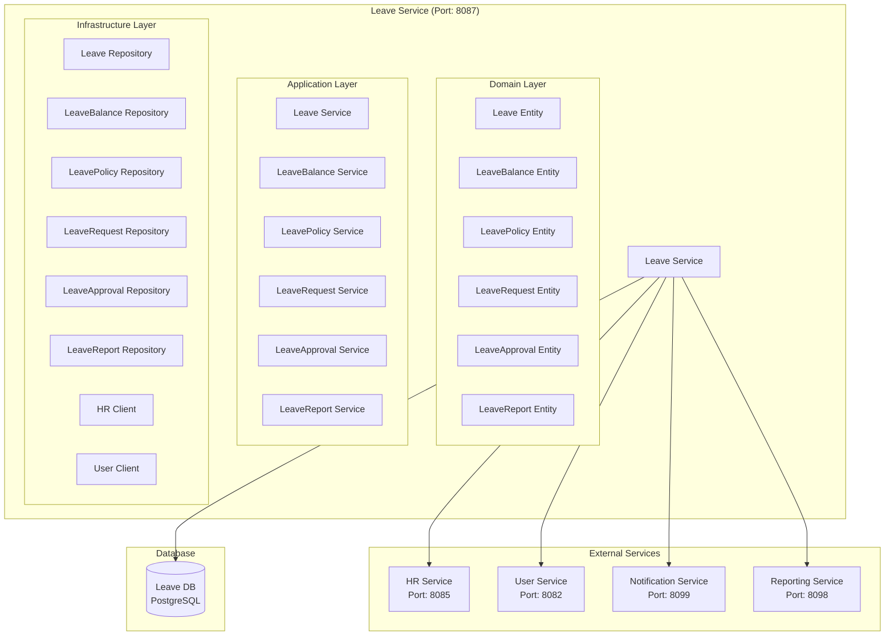

# Leave Service Architecture

## 📋 Overview

Leave Service, fabric management sisteminde leave management, vacation tracking ve leave-related business logic için tasarlanmış specialized microservice'dir. Bu servis, izin talepleri, izin bakiye takibi ve izin onay süreçlerini yönetir.

## 🎯 Service Responsibilities

### **Primary Responsibilities**

- **Leave Management**: Leave request CRUD operations
- **Leave Balance Tracking**: Employee leave balance management
- **Leave Approval**: Leave approval workflow
- **Leave Types**: Different types of leave management
- **Leave Policies**: Leave policy configuration
- **Leave Reports**: Leave reports and analytics

### **Secondary Responsibilities**

- **Leave Integration**: Integration with HR and payroll systems
- **Leave Notifications**: Leave-related notifications
- **Leave Analytics**: Leave usage analytics
- **Leave Compliance**: Leave compliance tracking

## 🏗️ Service Architecture



## 📊 Database Schema

```sql
-- Leave types table
CREATE TABLE leave_types (
    id UUID PRIMARY KEY,
    tenant_id UUID NOT NULL,
    company_id UUID NOT NULL,
    leave_type_name VARCHAR(50) NOT NULL, -- ANNUAL, SICK, MATERNITY, PATERNITY, EMERGENCY, UNPAID
    leave_type_code VARCHAR(20) UNIQUE NOT NULL,
    description TEXT,
    is_paid BOOLEAN DEFAULT TRUE,
    max_days_per_year INTEGER,
    max_consecutive_days INTEGER,
    requires_approval BOOLEAN DEFAULT TRUE,
    advance_notice_days INTEGER DEFAULT 0,
    is_active BOOLEAN DEFAULT TRUE,
    created_at TIMESTAMP DEFAULT CURRENT_TIMESTAMP,
    updated_at TIMESTAMP DEFAULT CURRENT_TIMESTAMP,
    created_by VARCHAR(100),
    updated_by VARCHAR(100)
);

-- Leave policies table
CREATE TABLE leave_policies (
    id UUID PRIMARY KEY,
    tenant_id UUID NOT NULL,
    company_id UUID NOT NULL,
    policy_name VARCHAR(100) NOT NULL,
    policy_description TEXT,
    applicable_leave_types JSONB, -- Array of leave type IDs
    applicable_employees JSONB, -- Employee criteria
    policy_rules JSONB, -- Policy rules and conditions
    effective_date DATE NOT NULL,
    end_date DATE,
    is_active BOOLEAN DEFAULT TRUE,
    created_at TIMESTAMP DEFAULT CURRENT_TIMESTAMP,
    updated_at TIMESTAMP DEFAULT CURRENT_TIMESTAMP,
    created_by VARCHAR(100),
    updated_by VARCHAR(100)
);

-- Employee leave balances table
CREATE TABLE employee_leave_balances (
    id UUID PRIMARY KEY,
    employee_id UUID NOT NULL,
    leave_type_id UUID NOT NULL,
    year INTEGER NOT NULL,
    total_entitlement DECIMAL(5,2) NOT NULL, -- Total days entitled
    used_days DECIMAL(5,2) DEFAULT 0, -- Days used
    pending_days DECIMAL(5,2) DEFAULT 0, -- Days pending approval
    remaining_days DECIMAL(5,2) NOT NULL, -- Remaining days
    carry_forward_days DECIMAL(5,2) DEFAULT 0, -- Days carried forward
    created_at TIMESTAMP DEFAULT CURRENT_TIMESTAMP,
    updated_at TIMESTAMP DEFAULT CURRENT_TIMESTAMP,

    CONSTRAINT fk_balance_employee FOREIGN KEY (employee_id) REFERENCES employees(id),
    CONSTRAINT fk_balance_leave_type FOREIGN KEY (leave_type_id) REFERENCES leave_types(id),
    UNIQUE(employee_id, leave_type_id, year)
);

-- Leave requests table
CREATE TABLE leave_requests (
    id UUID PRIMARY KEY,
    employee_id UUID NOT NULL,
    leave_type_id UUID NOT NULL,
    start_date DATE NOT NULL,
    end_date DATE NOT NULL,
    total_days DECIMAL(5,2) NOT NULL,
    reason TEXT,
    emergency_contact VARCHAR(100),
    emergency_phone VARCHAR(20),
    status VARCHAR(20) DEFAULT 'PENDING', -- PENDING, APPROVED, REJECTED, CANCELLED
    requested_at TIMESTAMP DEFAULT CURRENT_TIMESTAMP,
    approved_at TIMESTAMP,
    rejected_at TIMESTAMP,
    cancelled_at TIMESTAMP,
    created_at TIMESTAMP DEFAULT CURRENT_TIMESTAMP,
    updated_at TIMESTAMP DEFAULT CURRENT_TIMESTAMP,

    CONSTRAINT fk_request_employee FOREIGN KEY (employee_id) REFERENCES employees(id),
    CONSTRAINT fk_request_leave_type FOREIGN KEY (leave_type_id) REFERENCES leave_types(id)
);

-- Leave approvals table
CREATE TABLE leave_approvals (
    id UUID PRIMARY KEY,
    leave_request_id UUID NOT NULL,
    approver_id UUID NOT NULL,
    approval_level INTEGER NOT NULL, -- 1, 2, 3, etc.
    approval_status VARCHAR(20) NOT NULL, -- PENDING, APPROVED, REJECTED
    approval_notes TEXT,
    approved_at TIMESTAMP,
    created_at TIMESTAMP DEFAULT CURRENT_TIMESTAMP,

    CONSTRAINT fk_approval_request FOREIGN KEY (leave_request_id) REFERENCES leave_requests(id),
    CONSTRAINT fk_approval_approver FOREIGN KEY (approver_id) REFERENCES employees(id)
);

-- Leave reports table
CREATE TABLE leave_reports (
    id UUID PRIMARY KEY,
    report_type VARCHAR(50) NOT NULL, -- EMPLOYEE, DEPARTMENT, COMPANY, LEAVE_TYPE
    report_name VARCHAR(200) NOT NULL,
    report_period_start DATE NOT NULL,
    report_period_end DATE NOT NULL,
    report_data JSONB, -- Report data in JSON format
    generated_by UUID NOT NULL,
    generated_at TIMESTAMP DEFAULT CURRENT_TIMESTAMP,
    report_status VARCHAR(20) DEFAULT 'GENERATED', -- GENERATED, SENT, VIEWED
    report_url VARCHAR(500), -- Link to generated report

    CONSTRAINT fk_report_generated FOREIGN KEY (generated_by) REFERENCES employees(id)
);

-- Leave calendar table
CREATE TABLE leave_calendar (
    id UUID PRIMARY KEY,
    employee_id UUID NOT NULL,
    leave_request_id UUID NOT NULL,
    leave_date DATE NOT NULL,
    leave_type_id UUID NOT NULL,
    is_half_day BOOLEAN DEFAULT FALSE,
    half_day_type VARCHAR(10), -- MORNING, AFTERNOON
    created_at TIMESTAMP DEFAULT CURRENT_TIMESTAMP,

    CONSTRAINT fk_calendar_employee FOREIGN KEY (employee_id) REFERENCES employees(id),
    CONSTRAINT fk_calendar_request FOREIGN KEY (leave_request_id) REFERENCES leave_requests(id),
    CONSTRAINT fk_calendar_leave_type FOREIGN KEY (leave_type_id) REFERENCES leave_types(id)
);
```

## 🔧 Service Implementation

```java
@Service
@Transactional
public class LeaveService {

    private final LeaveRequestRepository leaveRequestRepository;
    private final LeaveBalanceRepository leaveBalanceRepository;
    private final LeaveTypeRepository leaveTypeRepository;
    private final LeavePolicyRepository leavePolicyRepository;
    private final LeaveApprovalRepository leaveApprovalRepository;
    private final LeaveCalendarRepository leaveCalendarRepository;
    private final HRServiceClient hrServiceClient;
    private final UserServiceClient userServiceClient;

    public LeaveRequestResponse createLeaveRequest(CreateLeaveRequestRequest request) {
        // Validate employee exists
        EmployeeResponse employee = hrServiceClient.getEmployeeById(request.getEmployeeId());

        // Validate leave type exists
        LeaveType leaveType = leaveTypeRepository.findById(request.getLeaveTypeId())
            .orElseThrow(() -> new LeaveTypeNotFoundException("Leave type not found"));

        // Validate leave policy
        validateLeavePolicy(employee.getId(), request.getLeaveTypeId(), request.getStartDate(), request.getEndDate());

        // Calculate total days
        BigDecimal totalDays = calculateLeaveDays(request.getStartDate(), request.getEndDate(), request.getIsHalfDay());

        // Check leave balance
        checkLeaveBalance(employee.getId(), request.getLeaveTypeId(), totalDays);

        // Create leave request
        LeaveRequest leaveRequest = LeaveRequest.builder()
            .employeeId(request.getEmployeeId())
            .leaveTypeId(request.getLeaveTypeId())
            .startDate(request.getStartDate())
            .endDate(request.getEndDate())
            .totalDays(totalDays)
            .reason(request.getReason())
            .emergencyContact(request.getEmergencyContact())
            .emergencyPhone(request.getEmergencyPhone())
            .status(LeaveRequestStatus.PENDING)
            .build();

        LeaveRequest savedRequest = leaveRequestRepository.save(leaveRequest);

        // Create leave calendar entries
        createLeaveCalendarEntries(savedRequest);

        // Create approval workflow
        createApprovalWorkflow(savedRequest);

        // Update leave balance (pending days)
        updateLeaveBalance(employee.getId(), request.getLeaveTypeId(), totalDays, true);

        // Publish leave request created event
        publishLeaveRequestCreatedEvent(savedRequest);

        return mapToLeaveRequestResponse(savedRequest);
    }

    public LeaveRequestResponse approveLeaveRequest(UUID leaveRequestId, ApproveLeaveRequestRequest request) {
        LeaveRequest leaveRequest = leaveRequestRepository.findById(leaveRequestId)
            .orElseThrow(() -> new LeaveRequestNotFoundException("Leave request not found"));

        // Update approval
        LeaveApproval approval = leaveApprovalRepository.findByLeaveRequestIdAndApproverId(leaveRequestId, request.getApproverId())
            .orElseThrow(() -> new LeaveApprovalNotFoundException("Leave approval not found"));

        approval.setApprovalStatus(ApprovalStatus.APPROVED);
        approval.setApprovalNotes(request.getApprovalNotes());
        approval.setApprovedAt(LocalDateTime.now());

        leaveApprovalRepository.save(approval);

        // Check if all approvals are complete
        if (isAllApprovalsComplete(leaveRequestId)) {
            // Approve the leave request
            leaveRequest.setStatus(LeaveRequestStatus.APPROVED);
            leaveRequest.setApprovedAt(LocalDateTime.now());
            leaveRequestRepository.save(leaveRequest);

            // Update leave balance (move from pending to used)
            updateLeaveBalance(leaveRequest.getEmployeeId(), leaveRequest.getLeaveTypeId(),
                leaveRequest.getTotalDays(), false);

            // Publish leave request approved event
            publishLeaveRequestApprovedEvent(leaveRequest);
        }

        return mapToLeaveRequestResponse(leaveRequest);
    }

    public LeaveRequestResponse rejectLeaveRequest(UUID leaveRequestId, RejectLeaveRequestRequest request) {
        LeaveRequest leaveRequest = leaveRequestRepository.findById(leaveRequestId)
            .orElseThrow(() -> new LeaveRequestNotFoundException("Leave request not found"));

        // Update approval
        LeaveApproval approval = leaveApprovalRepository.findByLeaveRequestIdAndApproverId(leaveRequestId, request.getApproverId())
            .orElseThrow(() -> new LeaveApprovalNotFoundException("Leave approval not found"));

        approval.setApprovalStatus(ApprovalStatus.REJECTED);
        approval.setApprovalNotes(request.getRejectionReason());
        approval.setApprovedAt(LocalDateTime.now());

        leaveApprovalRepository.save(approval);

        // Reject the leave request
        leaveRequest.setStatus(LeaveRequestStatus.REJECTED);
        leaveRequest.setRejectedAt(LocalDateTime.now());
        leaveRequestRepository.save(leaveRequest);

        // Update leave balance (remove pending days)
        updateLeaveBalance(leaveRequest.getEmployeeId(), leaveRequest.getLeaveTypeId(),
            leaveRequest.getTotalDays().negate(), true);

        // Publish leave request rejected event
        publishLeaveRequestRejectedEvent(leaveRequest);

        return mapToLeaveRequestResponse(leaveRequest);
    }

    public LeaveBalanceResponse getEmployeeLeaveBalance(UUID employeeId, Integer year) {
        List<LeaveBalance> balances = leaveBalanceRepository.findByEmployeeIdAndYear(employeeId, year);

        return LeaveBalanceResponse.builder()
            .employeeId(employeeId)
            .year(year)
            .leaveBalances(balances.stream()
                .map(this::mapToLeaveBalanceDetail)
                .collect(Collectors.toList()))
            .build();
    }

    public LeaveCalendarResponse getLeaveCalendar(UUID employeeId, LocalDate startDate, LocalDate endDate) {
        List<LeaveCalendar> calendarEntries = leaveCalendarRepository
            .findByEmployeeIdAndLeaveDateBetween(employeeId, startDate, endDate);

        return LeaveCalendarResponse.builder()
            .employeeId(employeeId)
            .startDate(startDate)
            .endDate(endDate)
            .leaveEntries(calendarEntries.stream()
                .map(this::mapToLeaveCalendarEntry)
                .collect(Collectors.toList()))
            .build();
    }

    public LeaveReportResponse generateLeaveReport(GenerateLeaveReportRequest request) {
        // Generate report data based on report type
        LeaveReportData reportData = generateLeaveReportData(request);

        // Create leave report
        LeaveReport leaveReport = LeaveReport.builder()
            .reportType(request.getReportType())
            .reportName(request.getReportName())
            .reportPeriodStart(request.getStartDate())
            .reportPeriodEnd(request.getEndDate())
            .reportData(reportData)
            .generatedBy(request.getGeneratedBy())
            .reportStatus(ReportStatus.GENERATED)
            .build();

        LeaveReport savedReport = leaveReportRepository.save(leaveReport);

        return mapToLeaveReportResponse(savedReport);
    }
}
```

## 📊 API Endpoints

```java
@RestController
@RequestMapping("/api/v1/leave")
public class LeaveController {

    @PostMapping("/requests")
    public ResponseEntity<LeaveRequestResponse> createLeaveRequest(@RequestBody CreateLeaveRequestRequest request) {
        LeaveRequestResponse response = leaveService.createLeaveRequest(request);
        return ResponseEntity.ok(response);
    }

    @GetMapping("/requests/{requestId}")
    public ResponseEntity<LeaveRequestResponse> getLeaveRequest(@PathVariable UUID requestId) {
        LeaveRequestResponse response = leaveService.getLeaveRequest(requestId);
        return ResponseEntity.ok(response);
    }

    @PostMapping("/requests/{requestId}/approve")
    public ResponseEntity<LeaveRequestResponse> approveLeaveRequest(
        @PathVariable UUID requestId,
        @RequestBody ApproveLeaveRequestRequest request) {
        LeaveRequestResponse response = leaveService.approveLeaveRequest(requestId, request);
        return ResponseEntity.ok(response);
    }

    @PostMapping("/requests/{requestId}/reject")
    public ResponseEntity<LeaveRequestResponse> rejectLeaveRequest(
        @PathVariable UUID requestId,
        @RequestBody RejectLeaveRequestRequest request) {
        LeaveRequestResponse response = leaveService.rejectLeaveRequest(requestId, request);
        return ResponseEntity.ok(response);
    }

    @GetMapping("/requests/employee/{employeeId}")
    public ResponseEntity<List<LeaveRequestResponse>> getEmployeeLeaveRequests(
        @PathVariable UUID employeeId,
        @RequestParam @DateTimeFormat(iso = DateTimeFormat.ISO.DATE) LocalDate startDate,
        @RequestParam @DateTimeFormat(iso = DateTimeFormat.ISO.DATE) LocalDate endDate) {
        List<LeaveRequestResponse> response = leaveService.getEmployeeLeaveRequests(employeeId, startDate, endDate);
        return ResponseEntity.ok(response);
    }

    @GetMapping("/balance/{employeeId}")
    public ResponseEntity<LeaveBalanceResponse> getEmployeeLeaveBalance(
        @PathVariable UUID employeeId,
        @RequestParam(defaultValue = "2024") Integer year) {
        LeaveBalanceResponse response = leaveService.getEmployeeLeaveBalance(employeeId, year);
        return ResponseEntity.ok(response);
    }

    @GetMapping("/calendar/{employeeId}")
    public ResponseEntity<LeaveCalendarResponse> getLeaveCalendar(
        @PathVariable UUID employeeId,
        @RequestParam @DateTimeFormat(iso = DateTimeFormat.ISO.DATE) LocalDate startDate,
        @RequestParam @DateTimeFormat(iso = DateTimeFormat.ISO.DATE) LocalDate endDate) {
        LeaveCalendarResponse response = leaveService.getLeaveCalendar(employeeId, startDate, endDate);
        return ResponseEntity.ok(response);
    }

    @PostMapping("/reports")
    public ResponseEntity<LeaveReportResponse> generateLeaveReport(@RequestBody GenerateLeaveReportRequest request) {
        LeaveReportResponse response = leaveService.generateLeaveReport(request);
        return ResponseEntity.ok(response);
    }

    @GetMapping("/types")
    public ResponseEntity<List<LeaveTypeResponse>> getLeaveTypes() {
        List<LeaveTypeResponse> response = leaveService.getLeaveTypes();
        return ResponseEntity.ok(response);
    }

    @PostMapping("/types")
    public ResponseEntity<LeaveTypeResponse> createLeaveType(@RequestBody CreateLeaveTypeRequest request) {
        LeaveTypeResponse response = leaveService.createLeaveType(request);
        return ResponseEntity.ok(response);
    }
}
```

## 🔐 Security Configuration

```java
@Configuration
@EnableWebSecurity
public class SecurityConfig {

    @Bean
    public SecurityFilterChain filterChain(HttpSecurity http) throws Exception {
        http
            .csrf().disable()
            .sessionManagement().sessionCreationPolicy(SessionCreationPolicy.STATELESS)
            .and()
            .authorizeHttpRequests(authz -> authz
                .requestMatchers("/api/v1/leave/balance/*", "/api/v1/leave/calendar/*").hasRole("EMPLOYEE")
                .requestMatchers("/api/v1/leave/**").hasRole("HR_USER")
                .anyRequest().authenticated()
            )
            .addFilterBefore(jwtAuthenticationFilter(), UsernamePasswordAuthenticationFilter.class);

        return http.build();
    }
}
```

## 🚀 Deployment Configuration

```yaml
apiVersion: apps/v1
kind: Deployment
metadata:
  name: leave-service
spec:
  replicas: 2
  selector:
    matchLabels:
      app: leave-service
  template:
    metadata:
      labels:
        app: leave-service
    spec:
      containers:
        - name: leave-service
          image: fabric-management/leave-service:latest
          ports:
            - containerPort: 8087
          env:
            - name: SPRING_PROFILES_ACTIVE
              value: "prod"
            - name: POSTGRES_HOST
              value: "postgres-hr"
            - name: HR_SERVICE_URL
              value: "http://hr-service:8085"
            - name: USER_SERVICE_URL
              value: "http://user-service:8082"
          resources:
            requests:
              memory: "512Mi"
              cpu: "250m"
            limits:
              memory: "1Gi"
              cpu: "500m"
```

## 📈 Performance Considerations

- **Database Indexing**: Employee_id, leave_type_id, start_date, end_date indexes
- **Caching**: Leave balance caching with Redis
- **Calendar Optimization**: Efficient calendar queries
- **Pagination**: Efficient pagination for leave requests
- **Connection Pooling**: Database connection pooling

## 🎯 Business Value

- **Automated Leave Management**: Otomatik izin yönetimi
- **Compliance**: Yasal izin hakları uyumluluğu
- **Workforce Planning**: İş gücü planlaması
- **Employee Satisfaction**: Çalışan memnuniyeti
- **Cost Control**: İzin maliyetlerinin kontrolü
