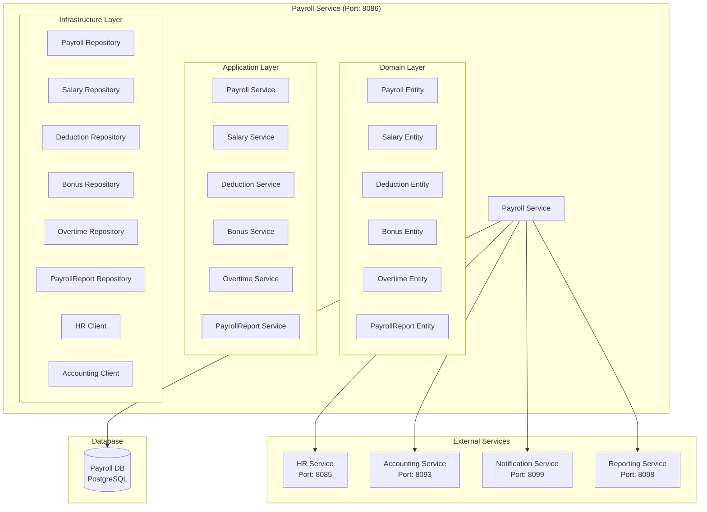

# Payroll Service Architecture

## 📋 Overview

Payroll Service, fabric management sisteminde payroll processing, salary management ve payroll-related business logic için tasarlanmış specialized microservice'dir. Bu servis, maaş hesaplamaları, bordro işlemleri ve ödeme yönetimini sağlar.

## 🎯 Service Responsibilities

### **Primary Responsibilities**

- **Payroll Processing**: Monthly payroll calculations
- **Salary Management**: Salary structure and components
- **Deduction Management**: Tax, insurance, and other deductions
- **Bonus Management**: Performance bonuses and incentives
- **Overtime Calculation**: Overtime hours and payments
- **Payroll Reports**: Payroll reports and statements

### **Secondary Responsibilities**

- **Tax Calculation**: Tax calculations and compliance
- **Benefits Administration**: Employee benefits management
- **Payroll Integration**: Integration with accounting systems
- **Payroll Analytics**: Payroll metrics and analytics

## 🏗️ Service Architecture



## 📊 Database Schema

```sql
-- Payroll periods table
CREATE TABLE payroll_periods (
    id UUID PRIMARY KEY,
    tenant_id UUID NOT NULL,
    company_id UUID NOT NULL,
    period_name VARCHAR(50) NOT NULL, -- "2024-01", "2024-01-15"
    period_type VARCHAR(20) NOT NULL, -- MONTHLY, BI_WEEKLY, WEEKLY
    start_date DATE NOT NULL,
    end_date DATE NOT NULL,
    pay_date DATE NOT NULL,
    status VARCHAR(20) DEFAULT 'DRAFT', -- DRAFT, PROCESSING, COMPLETED, CANCELLED
    total_employees INTEGER DEFAULT 0,
    total_gross_pay DECIMAL(15,2) DEFAULT 0,
    total_deductions DECIMAL(15,2) DEFAULT 0,
    total_net_pay DECIMAL(15,2) DEFAULT 0,
    created_at TIMESTAMP DEFAULT CURRENT_TIMESTAMP,
    updated_at TIMESTAMP DEFAULT CURRENT_TIMESTAMP,
    created_by VARCHAR(100),
    updated_by VARCHAR(100)
);

-- Employee salaries table
CREATE TABLE employee_salaries (
    id UUID PRIMARY KEY,
    employee_id UUID NOT NULL,
    salary_type VARCHAR(20) NOT NULL, -- BASE, HOURLY, COMMISSION, BONUS
    base_salary DECIMAL(10,2) NOT NULL,
    hourly_rate DECIMAL(8,2),
    currency VARCHAR(3) DEFAULT 'USD',
    effective_date DATE NOT NULL,
    end_date DATE,
    is_active BOOLEAN DEFAULT TRUE,
    created_at TIMESTAMP DEFAULT CURRENT_TIMESTAMP,
    updated_at TIMESTAMP DEFAULT CURRENT_TIMESTAMP,

    CONSTRAINT fk_salary_employee FOREIGN KEY (employee_id) REFERENCES employees(id)
);

-- Payroll records table
CREATE TABLE payroll_records (
    id UUID PRIMARY KEY,
    payroll_period_id UUID NOT NULL,
    employee_id UUID NOT NULL,
    gross_pay DECIMAL(10,2) NOT NULL,
    basic_pay DECIMAL(10,2) NOT NULL,
    overtime_pay DECIMAL(10,2) DEFAULT 0,
    bonus_pay DECIMAL(10,2) DEFAULT 0,
    commission_pay DECIMAL(10,2) DEFAULT 0,
    total_deductions DECIMAL(10,2) DEFAULT 0,
    net_pay DECIMAL(10,2) NOT NULL,
    hours_worked DECIMAL(5,2) DEFAULT 0,
    overtime_hours DECIMAL(5,2) DEFAULT 0,
    status VARCHAR(20) DEFAULT 'PENDING', -- PENDING, APPROVED, PAID, CANCELLED
    payment_method VARCHAR(20) DEFAULT 'BANK_TRANSFER', -- BANK_TRANSFER, CHECK, CASH
    payment_reference VARCHAR(100),
    created_at TIMESTAMP DEFAULT CURRENT_TIMESTAMP,
    updated_at TIMESTAMP DEFAULT CURRENT_TIMESTAMP,

    CONSTRAINT fk_payroll_period FOREIGN KEY (payroll_period_id) REFERENCES payroll_periods(id),
    CONSTRAINT fk_payroll_employee FOREIGN KEY (employee_id) REFERENCES employees(id)
);

-- Deductions table
CREATE TABLE deductions (
    id UUID PRIMARY KEY,
    payroll_record_id UUID NOT NULL,
    deduction_type VARCHAR(50) NOT NULL, -- TAX, INSURANCE, RETIREMENT, LOAN, OTHER
    deduction_name VARCHAR(100) NOT NULL,
    deduction_amount DECIMAL(10,2) NOT NULL,
    deduction_percentage DECIMAL(5,2), -- Percentage of gross pay
    is_mandatory BOOLEAN DEFAULT FALSE,
    created_at TIMESTAMP DEFAULT CURRENT_TIMESTAMP,

    CONSTRAINT fk_deduction_payroll FOREIGN KEY (payroll_record_id) REFERENCES payroll_records(id)
);

-- Bonuses table
CREATE TABLE bonuses (
    id UUID PRIMARY KEY,
    payroll_record_id UUID NOT NULL,
    bonus_type VARCHAR(50) NOT NULL, -- PERFORMANCE, ANNUAL, PROJECT, REFERRAL, OTHER
    bonus_name VARCHAR(100) NOT NULL,
    bonus_amount DECIMAL(10,2) NOT NULL,
    bonus_percentage DECIMAL(5,2), -- Percentage of base salary
    bonus_reason TEXT,
    approved_by UUID,
    approved_at TIMESTAMP,
    created_at TIMESTAMP DEFAULT CURRENT_TIMESTAMP,

    CONSTRAINT fk_bonus_payroll FOREIGN KEY (payroll_record_id) REFERENCES payroll_records(id),
    CONSTRAINT fk_bonus_approved FOREIGN KEY (approved_by) REFERENCES employees(id)
);

-- Overtime records table
CREATE TABLE overtime_records (
    id UUID PRIMARY KEY,
    payroll_record_id UUID NOT NULL,
    overtime_date DATE NOT NULL,
    overtime_hours DECIMAL(5,2) NOT NULL,
    overtime_rate DECIMAL(8,2) NOT NULL, -- 1.5x, 2x, etc.
    overtime_amount DECIMAL(10,2) NOT NULL,
    overtime_reason TEXT,
    approved_by UUID,
    approved_at TIMESTAMP,
    created_at TIMESTAMP DEFAULT CURRENT_TIMESTAMP,

    CONSTRAINT fk_overtime_payroll FOREIGN KEY (payroll_record_id) REFERENCES payroll_records(id),
    CONSTRAINT fk_overtime_approved FOREIGN KEY (approved_by) REFERENCES employees(id)
);

-- Payroll reports table
CREATE TABLE payroll_reports (
    id UUID PRIMARY KEY,
    payroll_period_id UUID NOT NULL,
    report_type VARCHAR(50) NOT NULL, -- SUMMARY, DETAILED, TAX, DEPARTMENT
    report_name VARCHAR(200) NOT NULL,
    report_data JSONB, -- Report data in JSON format
    generated_by UUID NOT NULL,
    generated_at TIMESTAMP DEFAULT CURRENT_TIMESTAMP,
    report_status VARCHAR(20) DEFAULT 'GENERATED', -- GENERATED, SENT, VIEWED
    report_url VARCHAR(500), -- Link to generated report

    CONSTRAINT fk_report_payroll FOREIGN KEY (payroll_period_id) REFERENCES payroll_periods(id),
    CONSTRAINT fk_report_generated FOREIGN KEY (generated_by) REFERENCES employees(id)
);
```

## 🔧 Service Implementation

```java
@Service
@Transactional
public class PayrollService {

    private final PayrollPeriodRepository payrollPeriodRepository;
    private final PayrollRecordRepository payrollRecordRepository;
    private final EmployeeSalaryRepository employeeSalaryRepository;
    private final DeductionRepository deductionRepository;
    private final BonusRepository bonusRepository;
    private final OvertimeRecordRepository overtimeRecordRepository;
    private final HRServiceClient hrServiceClient;
    private final AccountingServiceClient accountingServiceClient;

    public PayrollPeriodResponse createPayrollPeriod(CreatePayrollPeriodRequest request) {
        // Validate company exists
        CompanyResponse company = companyServiceClient.getCompanyById(request.getCompanyId());

        // Create payroll period
        PayrollPeriod payrollPeriod = PayrollPeriod.builder()
            .tenantId(request.getTenantId())
            .companyId(request.getCompanyId())
            .periodName(request.getPeriodName())
            .periodType(request.getPeriodType())
            .startDate(request.getStartDate())
            .endDate(request.getEndDate())
            .payDate(request.getPayDate())
            .status(PayrollStatus.DRAFT)
            .build();

        PayrollPeriod savedPeriod = payrollPeriodRepository.save(payrollPeriod);

        // Publish payroll period created event
        publishPayrollPeriodCreatedEvent(savedPeriod);

        return mapToPayrollPeriodResponse(savedPeriod);
    }

    public PayrollRecordResponse processPayroll(UUID payrollPeriodId) {
        PayrollPeriod payrollPeriod = payrollPeriodRepository.findById(payrollPeriodId)
            .orElseThrow(() -> new PayrollPeriodNotFoundException("Payroll period not found"));

        // Get all active employees for the company
        List<EmployeeResponse> employees = hrServiceClient.getEmployeesByCompany(payrollPeriod.getCompanyId());

        List<PayrollRecord> payrollRecords = new ArrayList<>();

        for (EmployeeResponse employee : employees) {
            // Calculate payroll for each employee
            PayrollRecord payrollRecord = calculateEmployeePayroll(employee, payrollPeriod);
            payrollRecords.add(payrollRecord);
        }

        // Save all payroll records
        List<PayrollRecord> savedRecords = payrollRecordRepository.saveAll(payrollRecords);

        // Update payroll period totals
        updatePayrollPeriodTotals(payrollPeriod, savedRecords);

        // Publish payroll processed event
        publishPayrollProcessedEvent(payrollPeriod, savedRecords);

        return PayrollRecordResponse.builder()
            .payrollPeriodId(payrollPeriodId)
            .totalEmployees(savedRecords.size())
            .totalGrossPay(savedRecords.stream().mapToDouble(PayrollRecord::getGrossPay).sum())
            .totalNetPay(savedRecords.stream().mapToDouble(PayrollRecord::getNetPay).sum())
            .build();
    }

    private PayrollRecord calculateEmployeePayroll(EmployeeResponse employee, PayrollPeriod payrollPeriod) {
        // Get employee salary
        EmployeeSalary salary = employeeSalaryRepository.findActiveByEmployeeId(employee.getId())
            .orElseThrow(() -> new SalaryNotFoundException("Employee salary not found"));

        // Calculate basic pay
        BigDecimal basicPay = calculateBasicPay(salary, payrollPeriod);

        // Calculate overtime pay
        BigDecimal overtimePay = calculateOvertimePay(employee.getId(), payrollPeriod);

        // Calculate bonus pay
        BigDecimal bonusPay = calculateBonusPay(employee.getId(), payrollPeriod);

        // Calculate total gross pay
        BigDecimal grossPay = basicPay.add(overtimePay).add(bonusPay);

        // Calculate deductions
        BigDecimal totalDeductions = calculateDeductions(employee.getId(), grossPay, payrollPeriod);

        // Calculate net pay
        BigDecimal netPay = grossPay.subtract(totalDeductions);

        return PayrollRecord.builder()
            .payrollPeriodId(payrollPeriod.getId())
            .employeeId(employee.getId())
            .grossPay(grossPay)
            .basicPay(basicPay)
            .overtimePay(overtimePay)
            .bonusPay(bonusPay)
            .totalDeductions(totalDeductions)
            .netPay(netPay)
            .status(PayrollRecordStatus.PENDING)
            .build();
    }

    public PayrollRecordResponse approvePayroll(UUID payrollPeriodId, ApprovePayrollRequest request) {
        PayrollPeriod payrollPeriod = payrollPeriodRepository.findById(payrollPeriodId)
            .orElseThrow(() -> new PayrollPeriodNotFoundException("Payroll period not found"));

        // Update payroll period status
        payrollPeriod.setStatus(PayrollStatus.APPROVED);
        payrollPeriod.setUpdatedAt(LocalDateTime.now());
        payrollPeriod.setUpdatedBy(request.getApprovedBy());

        payrollPeriodRepository.save(payrollPeriod);

        // Update all payroll records status
        List<PayrollRecord> payrollRecords = payrollRecordRepository.findByPayrollPeriodId(payrollPeriodId);
        payrollRecords.forEach(record -> {
            record.setStatus(PayrollRecordStatus.APPROVED);
            record.setUpdatedAt(LocalDateTime.now());
        });

        payrollRecordRepository.saveAll(payrollRecords);

        // Create accounting entries
        createAccountingEntries(payrollPeriod, payrollRecords);

        // Publish payroll approved event
        publishPayrollApprovedEvent(payrollPeriod, payrollRecords);

        return PayrollRecordResponse.builder()
            .payrollPeriodId(payrollPeriodId)
            .status("APPROVED")
            .totalEmployees(payrollRecords.size())
            .totalGrossPay(payrollRecords.stream().mapToDouble(PayrollRecord::getGrossPay).sum())
            .totalNetPay(payrollRecords.stream().mapToDouble(PayrollRecord::getNetPay).sum())
            .build();
    }

    public PayrollReportResponse generatePayrollReport(UUID payrollPeriodId, GeneratePayrollReportRequest request) {
        PayrollPeriod payrollPeriod = payrollPeriodRepository.findById(payrollPeriodId)
            .orElseThrow(() -> new PayrollPeriodNotFoundException("Payroll period not found"));

        List<PayrollRecord> payrollRecords = payrollRecordRepository.findByPayrollPeriodId(payrollPeriodId);

        // Generate report data based on report type
        PayrollReportData reportData = generateReportData(payrollPeriod, payrollRecords, request.getReportType());

        // Create payroll report
        PayrollReport payrollReport = PayrollReport.builder()
            .payrollPeriodId(payrollPeriodId)
            .reportType(request.getReportType())
            .reportName(request.getReportName())
            .reportData(reportData)
            .generatedBy(request.getGeneratedBy())
            .reportStatus(ReportStatus.GENERATED)
            .build();

        PayrollReport savedReport = payrollReportRepository.save(payrollReport);

        return mapToPayrollReportResponse(savedReport);
    }
}
```

## 📊 API Endpoints

```java
@RestController
@RequestMapping("/api/v1/payroll")
public class PayrollController {

    @PostMapping("/periods")
    public ResponseEntity<PayrollPeriodResponse> createPayrollPeriod(@RequestBody CreatePayrollPeriodRequest request) {
        PayrollPeriodResponse response = payrollService.createPayrollPeriod(request);
        return ResponseEntity.ok(response);
    }

    @GetMapping("/periods/{periodId}")
    public ResponseEntity<PayrollPeriodResponse> getPayrollPeriod(@PathVariable UUID periodId) {
        PayrollPeriodResponse response = payrollService.getPayrollPeriod(periodId);
        return ResponseEntity.ok(response);
    }

    @PostMapping("/periods/{periodId}/process")
    public ResponseEntity<PayrollRecordResponse> processPayroll(@PathVariable UUID periodId) {
        PayrollRecordResponse response = payrollService.processPayroll(periodId);
        return ResponseEntity.ok(response);
    }

    @PostMapping("/periods/{periodId}/approve")
    public ResponseEntity<PayrollRecordResponse> approvePayroll(
        @PathVariable UUID periodId,
        @RequestBody ApprovePayrollRequest request) {
        PayrollRecordResponse response = payrollService.approvePayroll(periodId, request);
        return ResponseEntity.ok(response);
    }

    @GetMapping("/periods/{periodId}/records")
    public ResponseEntity<List<PayrollRecordResponse>> getPayrollRecords(@PathVariable UUID periodId) {
        List<PayrollRecordResponse> response = payrollService.getPayrollRecords(periodId);
        return ResponseEntity.ok(response);
    }

    @GetMapping("/employees/{employeeId}/records")
    public ResponseEntity<List<PayrollRecordResponse>> getEmployeePayrollRecords(
        @PathVariable UUID employeeId,
        @RequestParam @DateTimeFormat(iso = DateTimeFormat.ISO.DATE) LocalDate startDate,
        @RequestParam @DateTimeFormat(iso = DateTimeFormat.ISO.DATE) LocalDate endDate) {
        List<PayrollRecordResponse> response = payrollService.getEmployeePayrollRecords(employeeId, startDate, endDate);
        return ResponseEntity.ok(response);
    }

    @PostMapping("/reports")
    public ResponseEntity<PayrollReportResponse> generatePayrollReport(@RequestBody GeneratePayrollReportRequest request) {
        PayrollReportResponse response = payrollService.generatePayrollReport(request.getPayrollPeriodId(), request);
        return ResponseEntity.ok(response);
    }

    @GetMapping("/reports/{reportId}")
    public ResponseEntity<PayrollReportResponse> getPayrollReport(@PathVariable UUID reportId) {
        PayrollReportResponse response = payrollService.getPayrollReport(reportId);
        return ResponseEntity.ok(response);
    }
}
```

## 🔐 Security Configuration

```java
@Configuration
@EnableWebSecurity
public class SecurityConfig {

    @Bean
    public SecurityFilterChain filterChain(HttpSecurity http) throws Exception {
        http
            .csrf().disable()
            .sessionManagement().sessionCreationPolicy(SessionCreationPolicy.STATELESS)
            .and()
            .authorizeHttpRequests(authz -> authz
                .requestMatchers("/api/v1/payroll/employees/*/records").hasRole("EMPLOYEE")
                .requestMatchers("/api/v1/payroll/**").hasRole("PAYROLL_ADMIN")
                .anyRequest().authenticated()
            )
            .addFilterBefore(jwtAuthenticationFilter(), UsernamePasswordAuthenticationFilter.class);

        return http.build();
    }
}
```

## 🚀 Deployment Configuration

```yaml
apiVersion: apps/v1
kind: Deployment
metadata:
  name: payroll-service
spec:
  replicas: 2
  selector:
    matchLabels:
      app: payroll-service
  template:
    metadata:
      labels:
        app: payroll-service
    spec:
      containers:
        - name: payroll-service
          image: fabric-management/payroll-service:latest
          ports:
            - containerPort: 8086
          env:
            - name: SPRING_PROFILES_ACTIVE
              value: "prod"
            - name: POSTGRES_HOST
              value: "postgres-hr"
            - name: HR_SERVICE_URL
              value: "http://hr-service:8085"
            - name: ACCOUNTING_SERVICE_URL
              value: "http://accounting-service:8093"
          resources:
            requests:
              memory: "512Mi"
              cpu: "250m"
            limits:
              memory: "1Gi"
              cpu: "500m"
```

## 📈 Performance Considerations

- **Database Indexing**: Employee_id, payroll_period_id, period_type indexes
- **Caching**: Payroll data caching with Redis
- **Batch Processing**: Efficient batch processing for large payrolls
- **Pagination**: Efficient pagination for payroll records
- **Connection Pooling**: Database connection pooling

## 🎯 Business Value

- **Automated Payroll**: Otomatik maaş hesaplamaları
- **Compliance**: Vergi ve yasal uyumluluk
- **Cost Control**: Maaş maliyetlerinin kontrolü
- **Employee Satisfaction**: Çalışan memnuniyeti
- **Financial Accuracy**: Mali doğruluk ve şeffaflık
