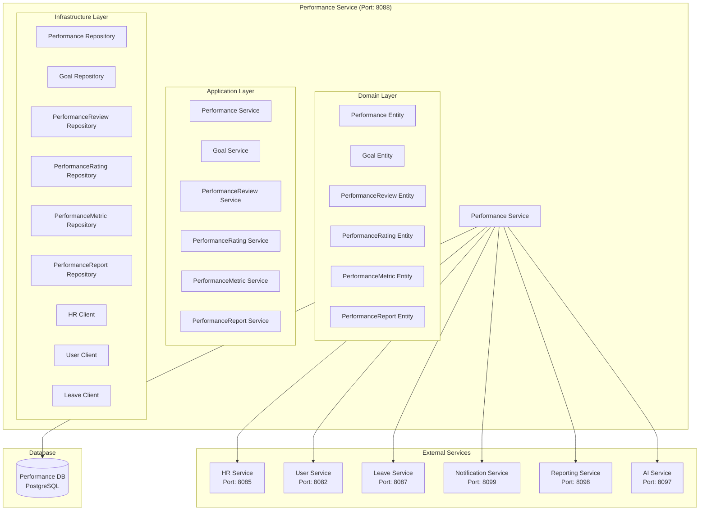

# Performance Service Architecture

## 📋 Overview

Performance Service, fabric management sisteminde performance management, goal setting ve performance-related business logic için tasarlanmış specialized microservice'dir. Bu servis, performans değerlendirmeleri, hedef belirleme ve performans takibini yönetir.

## 🎯 Service Responsibilities

### **Primary Responsibilities**

- **Performance Management**: Performance review CRUD operations
- **Goal Setting**: Employee goal management
- **Performance Tracking**: Performance metrics tracking
- **Performance Reviews**: Performance review cycles
- **Performance Ratings**: Performance rating system
- **Performance Reports**: Performance reports and analytics

### **Secondary Responsibilities**

- **Performance Integration**: Integration with HR and payroll systems
- **Performance Notifications**: Performance-related notifications
- **Performance Analytics**: Performance analytics and insights
- **Performance Compliance**: Performance compliance tracking

## 🏗️ Service Architecture



## 📊 Database Schema

```sql
-- Performance cycles table
CREATE TABLE performance_cycles (
    id UUID PRIMARY KEY,
    tenant_id UUID NOT NULL,
    company_id UUID NOT NULL,
    cycle_name VARCHAR(100) NOT NULL, -- "Q1 2024", "Annual 2024"
    cycle_type VARCHAR(20) NOT NULL, -- QUARTERLY, ANNUAL, PROJECT_BASED
    start_date DATE NOT NULL,
    end_date DATE NOT NULL,
    review_period_start DATE NOT NULL,
    review_period_end DATE NOT NULL,
    status VARCHAR(20) DEFAULT 'DRAFT', -- DRAFT, ACTIVE, COMPLETED, CANCELLED
    description TEXT,
    created_at TIMESTAMP DEFAULT CURRENT_TIMESTAMP,
    updated_at TIMESTAMP DEFAULT CURRENT_TIMESTAMP,
    created_by VARCHAR(100),
    updated_by VARCHAR(100)
);

-- Performance goals table
CREATE TABLE performance_goals (
    id UUID PRIMARY KEY,
    employee_id UUID NOT NULL,
    performance_cycle_id UUID NOT NULL,
    goal_title VARCHAR(200) NOT NULL,
    goal_description TEXT,
    goal_type VARCHAR(50) NOT NULL, -- OBJECTIVE, KEY_RESULT, DEVELOPMENT, BEHAVIORAL
    goal_category VARCHAR(50), -- SALES, OPERATIONAL, DEVELOPMENT, LEADERSHIP
    target_value DECIMAL(10,2),
    target_unit VARCHAR(50), -- PERCENTAGE, COUNT, CURRENCY, DAYS
    current_value DECIMAL(10,2) DEFAULT 0,
    weight DECIMAL(5,2) DEFAULT 1.0, -- Weight in overall performance
    start_date DATE NOT NULL,
    target_date DATE NOT NULL,
    status VARCHAR(20) DEFAULT 'ACTIVE', -- ACTIVE, COMPLETED, CANCELLED, ON_HOLD
    progress_percentage DECIMAL(5,2) DEFAULT 0,
    created_at TIMESTAMP DEFAULT CURRENT_TIMESTAMP,
    updated_at TIMESTAMP DEFAULT CURRENT_TIMESTAMP,
    created_by VARCHAR(100),
    updated_by VARCHAR(100),

    CONSTRAINT fk_goal_employee FOREIGN KEY (employee_id) REFERENCES employees(id),
    CONSTRAINT fk_goal_cycle FOREIGN KEY (performance_cycle_id) REFERENCES performance_cycles(id)
);

-- Performance reviews table
CREATE TABLE performance_reviews (
    id UUID PRIMARY KEY,
    employee_id UUID NOT NULL,
    reviewer_id UUID NOT NULL,
    performance_cycle_id UUID NOT NULL,
    review_type VARCHAR(20) NOT NULL, -- SELF, MANAGER, PEER, UPWARD, 360
    review_status VARCHAR(20) DEFAULT 'PENDING', -- PENDING, IN_PROGRESS, COMPLETED, CANCELLED
    review_date DATE,
    overall_rating DECIMAL(3,2), -- 1.0 - 5.0
    strengths TEXT,
    areas_for_improvement TEXT,
    development_plan TEXT,
    career_goals TEXT,
    reviewer_comments TEXT,
    employee_comments TEXT,
    created_at TIMESTAMP DEFAULT CURRENT_TIMESTAMP,
    updated_at TIMESTAMP DEFAULT CURRENT_TIMESTAMP,

    CONSTRAINT fk_review_employee FOREIGN KEY (employee_id) REFERENCES employees(id),
    CONSTRAINT fk_review_reviewer FOREIGN KEY (reviewer_id) REFERENCES employees(id),
    CONSTRAINT fk_review_cycle FOREIGN KEY (performance_cycle_id) REFERENCES performance_cycles(id)
);

-- Performance ratings table
CREATE TABLE performance_ratings (
    id UUID PRIMARY KEY,
    performance_review_id UUID NOT NULL,
    rating_category VARCHAR(50) NOT NULL, -- TECHNICAL_SKILLS, COMMUNICATION, LEADERSHIP, TEAMWORK
    rating_value DECIMAL(3,2) NOT NULL, -- 1.0 - 5.0
    rating_description TEXT,
    evidence TEXT, -- Evidence supporting the rating
    created_at TIMESTAMP DEFAULT CURRENT_TIMESTAMP,

    CONSTRAINT fk_rating_review FOREIGN KEY (performance_review_id) REFERENCES performance_reviews(id)
);

-- Performance metrics table
CREATE TABLE performance_metrics (
    id UUID PRIMARY KEY,
    employee_id UUID NOT NULL,
    metric_name VARCHAR(100) NOT NULL,
    metric_type VARCHAR(50) NOT NULL, -- QUANTITATIVE, QUALITATIVE, BEHAVIORAL
    metric_category VARCHAR(50), -- SALES, PRODUCTIVITY, QUALITY, CUSTOMER_SATISFACTION
    metric_value DECIMAL(10,4) NOT NULL,
    metric_unit VARCHAR(50), -- PERCENTAGE, COUNT, CURRENCY, DAYS
    measurement_date DATE NOT NULL,
    performance_cycle_id UUID,
    target_value DECIMAL(10,4),
    created_at TIMESTAMP DEFAULT CURRENT_TIMESTAMP,

    CONSTRAINT fk_metric_employee FOREIGN KEY (employee_id) REFERENCES employees(id),
    CONSTRAINT fk_metric_cycle FOREIGN KEY (performance_cycle_id) REFERENCES performance_cycles(id)
);

-- Performance improvement plans table
CREATE TABLE performance_improvement_plans (
    id UUID PRIMARY KEY,
    employee_id UUID NOT NULL,
    performance_review_id UUID NOT NULL,
    plan_title VARCHAR(200) NOT NULL,
    plan_description TEXT,
    improvement_areas JSONB, -- Areas that need improvement
    action_items JSONB, -- Specific action items
    target_date DATE NOT NULL,
    review_date DATE,
    status VARCHAR(20) DEFAULT 'ACTIVE', -- ACTIVE, COMPLETED, CANCELLED
    created_at TIMESTAMP DEFAULT CURRENT_TIMESTAMP,
    updated_at TIMESTAMP DEFAULT CURRENT_TIMESTAMP,
    created_by VARCHAR(100),
    updated_by VARCHAR(100),

    CONSTRAINT fk_pip_employee FOREIGN KEY (employee_id) REFERENCES employees(id),
    CONSTRAINT fk_pip_review FOREIGN KEY (performance_review_id) REFERENCES performance_reviews(id)
);

-- Performance reports table
CREATE TABLE performance_reports (
    id UUID PRIMARY KEY,
    report_type VARCHAR(50) NOT NULL, -- EMPLOYEE, DEPARTMENT, COMPANY, GOAL_PROGRESS
    report_name VARCHAR(200) NOT NULL,
    report_period_start DATE NOT NULL,
    report_period_end DATE NOT NULL,
    report_data JSONB, -- Report data in JSON format
    generated_by UUID NOT NULL,
    generated_at TIMESTAMP DEFAULT CURRENT_TIMESTAMP,
    report_status VARCHAR(20) DEFAULT 'GENERATED', -- GENERATED, SENT, VIEWED
    report_url VARCHAR(500), -- Link to generated report

    CONSTRAINT fk_report_generated FOREIGN KEY (generated_by) REFERENCES employees(id)
);
```

## 🔧 Service Implementation

```java
@Service
@Transactional
public class PerformanceService {

    private final PerformanceCycleRepository performanceCycleRepository;
    private final PerformanceGoalRepository performanceGoalRepository;
    private final PerformanceReviewRepository performanceReviewRepository;
    private final PerformanceRatingRepository performanceRatingRepository;
    private final PerformanceMetricRepository performanceMetricRepository;
    private final PerformanceImprovementPlanRepository performanceImprovementPlanRepository;
    private final HRServiceClient hrServiceClient;
    private final UserServiceClient userServiceClient;
    private final LeaveServiceClient leaveServiceClient;

    public PerformanceCycleResponse createPerformanceCycle(CreatePerformanceCycleRequest request) {
        // Validate company exists
        CompanyResponse company = companyServiceClient.getCompanyById(request.getCompanyId());

        // Create performance cycle
        PerformanceCycle performanceCycle = PerformanceCycle.builder()
            .tenantId(request.getTenantId())
            .companyId(request.getCompanyId())
            .cycleName(request.getCycleName())
            .cycleType(request.getCycleType())
            .startDate(request.getStartDate())
            .endDate(request.getEndDate())
            .reviewPeriodStart(request.getReviewPeriodStart())
            .reviewPeriodEnd(request.getReviewPeriodEnd())
            .status(PerformanceCycleStatus.DRAFT)
            .description(request.getDescription())
            .build();

        PerformanceCycle savedCycle = performanceCycleRepository.save(performanceCycle);

        // Publish performance cycle created event
        publishPerformanceCycleCreatedEvent(savedCycle);

        return mapToPerformanceCycleResponse(savedCycle);
    }

    public PerformanceGoalResponse createPerformanceGoal(CreatePerformanceGoalRequest request) {
        // Validate employee exists
        EmployeeResponse employee = hrServiceClient.getEmployeeById(request.getEmployeeId());

        // Validate performance cycle exists
        PerformanceCycle performanceCycle = performanceCycleRepository.findById(request.getPerformanceCycleId())
            .orElseThrow(() -> new PerformanceCycleNotFoundException("Performance cycle not found"));

        // Create performance goal
        PerformanceGoal performanceGoal = PerformanceGoal.builder()
            .employeeId(request.getEmployeeId())
            .performanceCycleId(request.getPerformanceCycleId())
            .goalTitle(request.getGoalTitle())
            .goalDescription(request.getGoalDescription())
            .goalType(request.getGoalType())
            .goalCategory(request.getGoalCategory())
            .targetValue(request.getTargetValue())
            .targetUnit(request.getTargetUnit())
            .weight(request.getWeight())
            .startDate(request.getStartDate())
            .targetDate(request.getTargetDate())
            .status(GoalStatus.ACTIVE)
            .build();

        PerformanceGoal savedGoal = performanceGoalRepository.save(performanceGoal);

        // Publish performance goal created event
        publishPerformanceGoalCreatedEvent(savedGoal);

        return mapToPerformanceGoalResponse(savedGoal);
    }

    public PerformanceGoalResponse updateGoalProgress(UUID goalId, UpdateGoalProgressRequest request) {
        PerformanceGoal goal = performanceGoalRepository.findById(goalId)
            .orElseThrow(() -> new PerformanceGoalNotFoundException("Performance goal not found"));

        // Update current value
        goal.setCurrentValue(request.getCurrentValue());

        // Calculate progress percentage
        if (goal.getTargetValue() != null && goal.getTargetValue().compareTo(BigDecimal.ZERO) > 0) {
            BigDecimal progressPercentage = request.getCurrentValue()
                .divide(goal.getTargetValue(), 4, RoundingMode.HALF_UP)
                .multiply(BigDecimal.valueOf(100));
            goal.setProgressPercentage(progressPercentage);
        }

        // Check if goal is completed
        if (goal.getProgressPercentage().compareTo(BigDecimal.valueOf(100)) >= 0) {
            goal.setStatus(GoalStatus.COMPLETED);
        }

        goal.setUpdatedAt(LocalDateTime.now());
        PerformanceGoal updatedGoal = performanceGoalRepository.save(goal);

        // Publish goal progress updated event
        publishGoalProgressUpdatedEvent(updatedGoal);

        return mapToPerformanceGoalResponse(updatedGoal);
    }

    public PerformanceReviewResponse createPerformanceReview(CreatePerformanceReviewRequest request) {
        // Validate employee exists
        EmployeeResponse employee = hrServiceClient.getEmployeeById(request.getEmployeeId());

        // Validate reviewer exists
        EmployeeResponse reviewer = hrServiceClient.getEmployeeById(request.getReviewerId());

        // Validate performance cycle exists
        PerformanceCycle performanceCycle = performanceCycleRepository.findById(request.getPerformanceCycleId())
            .orElseThrow(() -> new PerformanceCycleNotFoundException("Performance cycle not found"));

        // Create performance review
        PerformanceReview performanceReview = PerformanceReview.builder()
            .employeeId(request.getEmployeeId())
            .reviewerId(request.getReviewerId())
            .performanceCycleId(request.getPerformanceCycleId())
            .reviewType(request.getReviewType())
            .reviewStatus(ReviewStatus.PENDING)
            .reviewDate(request.getReviewDate())
            .build();

        PerformanceReview savedReview = performanceReviewRepository.save(performanceReview);

        // Publish performance review created event
        publishPerformanceReviewCreatedEvent(savedReview);

        return mapToPerformanceReviewResponse(savedReview);
    }

    public PerformanceReviewResponse completePerformanceReview(UUID reviewId, CompletePerformanceReviewRequest request) {
        PerformanceReview review = performanceReviewRepository.findById(reviewId)
            .orElseThrow(() -> new PerformanceReviewNotFoundException("Performance review not found"));

        // Update review details
        review.setOverallRating(request.getOverallRating());
        review.setStrengths(request.getStrengths());
        review.setAreasForImprovement(request.getAreasForImprovement());
        review.setDevelopmentPlan(request.getDevelopmentPlan());
        review.setCareerGoals(request.getCareerGoals());
        review.setReviewerComments(request.getReviewerComments());
        review.setReviewStatus(ReviewStatus.COMPLETED);
        review.setUpdatedAt(LocalDateTime.now());

        PerformanceReview savedReview = performanceReviewRepository.save(review);

        // Create performance ratings
        if (request.getPerformanceRatings() != null) {
            createPerformanceRatings(savedReview.getId(), request.getPerformanceRatings());
        }

        // Create performance improvement plan if needed
        if (request.getOverallRating() < 3.0) {
            createPerformanceImprovementPlan(savedReview);
        }

        // Publish performance review completed event
        publishPerformanceReviewCompletedEvent(savedReview);

        return mapToPerformanceReviewResponse(savedReview);
    }

    public PerformanceMetricResponse recordPerformanceMetric(CreatePerformanceMetricRequest request) {
        // Validate employee exists
        EmployeeResponse employee = hrServiceClient.getEmployeeById(request.getEmployeeId());

        // Create performance metric
        PerformanceMetric performanceMetric = PerformanceMetric.builder()
            .employeeId(request.getEmployeeId())
            .metricName(request.getMetricName())
            .metricType(request.getMetricType())
            .metricCategory(request.getMetricCategory())
            .metricValue(request.getMetricValue())
            .metricUnit(request.getMetricUnit())
            .measurementDate(request.getMeasurementDate())
            .performanceCycleId(request.getPerformanceCycleId())
            .targetValue(request.getTargetValue())
            .build();

        PerformanceMetric savedMetric = performanceMetricRepository.save(performanceMetric);

        // Publish performance metric recorded event
        publishPerformanceMetricRecordedEvent(savedMetric);

        return mapToPerformanceMetricResponse(savedMetric);
    }

    public PerformanceReportResponse generatePerformanceReport(GeneratePerformanceReportRequest request) {
        // Generate report data based on report type
        PerformanceReportData reportData = generatePerformanceReportData(request);

        // Create performance report
        PerformanceReport performanceReport = PerformanceReport.builder()
            .reportType(request.getReportType())
            .reportName(request.getReportName())
            .reportPeriodStart(request.getStartDate())
            .reportPeriodEnd(request.getEndDate())
            .reportData(reportData)
            .generatedBy(request.getGeneratedBy())
            .reportStatus(ReportStatus.GENERATED)
            .build();

        PerformanceReport savedReport = performanceReportRepository.save(performanceReport);

        return mapToPerformanceReportResponse(savedReport);
    }
}
```

## 📊 API Endpoints

```java
@RestController
@RequestMapping("/api/v1/performance")
public class PerformanceController {

    @PostMapping("/cycles")
    public ResponseEntity<PerformanceCycleResponse> createPerformanceCycle(@RequestBody CreatePerformanceCycleRequest request) {
        PerformanceCycleResponse response = performanceService.createPerformanceCycle(request);
        return ResponseEntity.ok(response);
    }

    @GetMapping("/cycles/{cycleId}")
    public ResponseEntity<PerformanceCycleResponse> getPerformanceCycle(@PathVariable UUID cycleId) {
        PerformanceCycleResponse response = performanceService.getPerformanceCycle(cycleId);
        return ResponseEntity.ok(response);
    }

    @PostMapping("/goals")
    public ResponseEntity<PerformanceGoalResponse> createPerformanceGoal(@RequestBody CreatePerformanceGoalRequest request) {
        PerformanceGoalResponse response = performanceService.createPerformanceGoal(request);
        return ResponseEntity.ok(response);
    }

    @GetMapping("/goals/{goalId}")
    public ResponseEntity<PerformanceGoalResponse> getPerformanceGoal(@PathVariable UUID goalId) {
        PerformanceGoalResponse response = performanceService.getPerformanceGoal(goalId);
        return ResponseEntity.ok(response);
    }

    @PutMapping("/goals/{goalId}/progress")
    public ResponseEntity<PerformanceGoalResponse> updateGoalProgress(
        @PathVariable UUID goalId,
        @RequestBody UpdateGoalProgressRequest request) {
        PerformanceGoalResponse response = performanceService.updateGoalProgress(goalId, request);
        return ResponseEntity.ok(response);
    }

    @GetMapping("/goals/employee/{employeeId}")
    public ResponseEntity<List<PerformanceGoalResponse>> getEmployeeGoals(
        @PathVariable UUID employeeId,
        @RequestParam UUID cycleId) {
        List<PerformanceGoalResponse> response = performanceService.getEmployeeGoals(employeeId, cycleId);
        return ResponseEntity.ok(response);
    }

    @PostMapping("/reviews")
    public ResponseEntity<PerformanceReviewResponse> createPerformanceReview(@RequestBody CreatePerformanceReviewRequest request) {
        PerformanceReviewResponse response = performanceService.createPerformanceReview(request);
        return ResponseEntity.ok(response);
    }

    @PostMapping("/reviews/{reviewId}/complete")
    public ResponseEntity<PerformanceReviewResponse> completePerformanceReview(
        @PathVariable UUID reviewId,
        @RequestBody CompletePerformanceReviewRequest request) {
        PerformanceReviewResponse response = performanceService.completePerformanceReview(reviewId, request);
        return ResponseEntity.ok(response);
    }

    @GetMapping("/reviews/{reviewId}")
    public ResponseEntity<PerformanceReviewResponse> getPerformanceReview(@PathVariable UUID reviewId) {
        PerformanceReviewResponse response = performanceService.getPerformanceReview(reviewId);
        return ResponseEntity.ok(response);
    }

    @PostMapping("/metrics")
    public ResponseEntity<PerformanceMetricResponse> recordPerformanceMetric(@RequestBody CreatePerformanceMetricRequest request) {
        PerformanceMetricResponse response = performanceService.recordPerformanceMetric(request);
        return ResponseEntity.ok(response);
    }

    @GetMapping("/metrics/employee/{employeeId}")
    public ResponseEntity<List<PerformanceMetricResponse>> getEmployeeMetrics(
        @PathVariable UUID employeeId,
        @RequestParam UUID cycleId) {
        List<PerformanceMetricResponse> response = performanceService.getEmployeeMetrics(employeeId, cycleId);
        return ResponseEntity.ok(response);
    }

    @PostMapping("/reports")
    public ResponseEntity<PerformanceReportResponse> generatePerformanceReport(@RequestBody GeneratePerformanceReportRequest request) {
        PerformanceReportResponse response = performanceService.generatePerformanceReport(request);
        return ResponseEntity.ok(response);
    }
}
```

## 🔐 Security Configuration

```java
@Configuration
@EnableWebSecurity
public class SecurityConfig {

    @Bean
    public SecurityFilterChain filterChain(HttpSecurity http) throws Exception {
        http
            .csrf().disable()
            .sessionManagement().sessionCreationPolicy(SessionCreationPolicy.STATELESS)
            .and()
            .authorizeHttpRequests(authz -> authz
                .requestMatchers("/api/v1/performance/goals/employee/*", "/api/v1/performance/metrics/employee/*").hasRole("EMPLOYEE")
                .requestMatchers("/api/v1/performance/**").hasRole("HR_USER")
                .anyRequest().authenticated()
            )
            .addFilterBefore(jwtAuthenticationFilter(), UsernamePasswordAuthenticationFilter.class);

        return http.build();
    }
}
```

## 🚀 Deployment Configuration

```yaml
apiVersion: apps/v1
kind: Deployment
metadata:
  name: performance-service
spec:
  replicas: 2
  selector:
    matchLabels:
      app: performance-service
  template:
    metadata:
      labels:
        app: performance-service
    spec:
      containers:
        - name: performance-service
          image: fabric-management/performance-service:latest
          ports:
            - containerPort: 8088
          env:
            - name: SPRING_PROFILES_ACTIVE
              value: "prod"
            - name: POSTGRES_HOST
              value: "postgres-hr"
            - name: HR_SERVICE_URL
              value: "http://hr-service:8085"
            - name: USER_SERVICE_URL
              value: "http://user-service:8082"
            - name: LEAVE_SERVICE_URL
              value: "http://leave-service:8087"
          resources:
            requests:
              memory: "512Mi"
              cpu: "250m"
            limits:
              memory: "1Gi"
              cpu: "500m"
```

## 📈 Performance Considerations

- **Database Indexing**: Employee_id, performance_cycle_id, review_type indexes
- **Caching**: Performance data caching with Redis
- **Goal Tracking**: Efficient goal progress tracking
- **Pagination**: Efficient pagination for performance reviews
- **Connection Pooling**: Database connection pooling

## 🎯 Business Value

- **Performance Management**: Kapsamlı performans yönetimi
- **Goal Alignment**: Hedef hizalaması ve takibi
- **Employee Development**: Çalışan gelişimi
- **Talent Management**: Yetenek yönetimi
- **Data-Driven Decisions**: Veri odaklı kararlar
