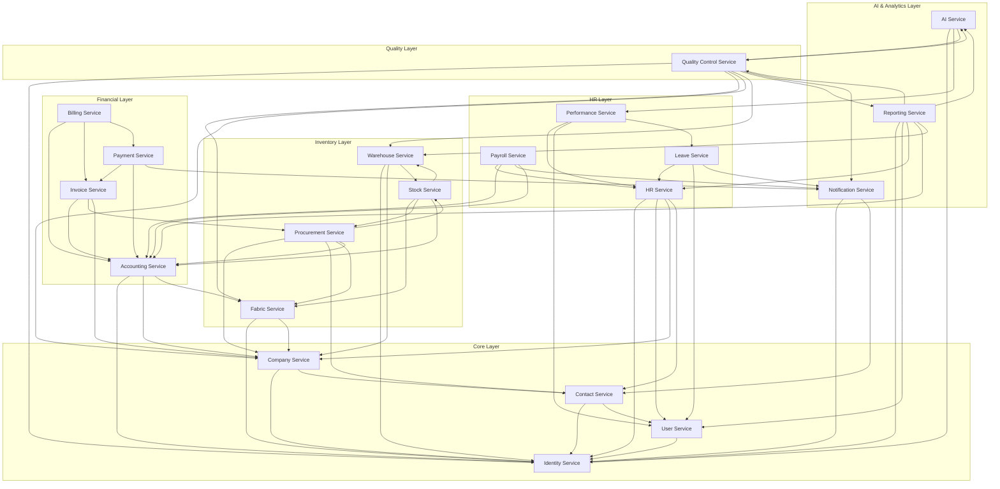

# Fabric Management System - Microservice Architecture Overview

## 📋 Overview

Bu dokümantasyon, Fabric Management System'deki 19 microservice'in detaylı mimarisini, sorumluluklarını ve birbirleriyle olan ilişkilerini açıklar.

## 🏗️ Complete Microservice Architecture

### **Core Services (4 Services)**

#### 1. **Identity Service** (Port: 8081) ✅

- **Status**: Dokümantasyon tamamlandı
- **Dependencies**: Notification Service, Reporting Service
- **Dependents**: Tüm servisler (authentication için)

#### 2. **User Service** (Port: 8082) ✅

- **Status**: Dokümantasyon tamamlandı
- **Dependencies**: Identity Service, Contact Service, Notification Service
- **Dependents**: HR Service, Performance Service, Reporting Service

#### 3. **Contact Service** (Port: 8083) ✅

- **Status**: Dokümantasyon tamamlandı
- **Dependencies**: User Service, Company Service, Notification Service
- **Dependents**: Company Service, HR Service, Procurement Service

#### 4. **Company Service** (Port: 8084) ❌

- **Status**: Dokümantasyon eksik
- **Dependencies**: Identity Service, Contact Service
- **Dependents**: HR Service, Warehouse Service, Procurement Service, Accounting Service, Quality Control Service

### **HR Management Services (4 Services)**

#### 5. **HR Service** (Port: 8085) ❌

- **Status**: Dokümantasyon eksik
- **Dependencies**: Identity Service, User Service, Company Service, Contact Service
- **Dependents**: Payroll Service, Leave Service, Performance Service

#### 6. **Payroll Service** (Port: 8086) ❌

- **Status**: Dokümantasyon eksik
- **Dependencies**: HR Service, Accounting Service, Notification Service
- **Dependents**: Accounting Service, Reporting Service

#### 7. **Leave Service** (Port: 8087) ❌

- **Status**: Dokümantasyon eksik
- **Dependencies**: HR Service, User Service, Notification Service
- **Dependents**: Reporting Service, Performance Service

#### 8. **Performance Service** (Port: 8088) ❌

- **Status**: Dokümantasyon eksik
- **Dependencies**: HR Service, User Service, Leave Service
- **Dependents**: Reporting Service, AI Service

### **Inventory Management Services (4 Services)**

#### 9. **Warehouse Service** (Port: 8089) ❌

- **Status**: Dokümantasyon eksik
- **Dependencies**: Identity Service, Company Service, Stock Service
- **Dependents**: Stock Service, Procurement Service, Quality Control Service

#### 10. **Stock Service** (Port: 8090) ❌

- **Status**: Dokümantasyon eksik
- **Dependencies**: Warehouse Service, Fabric Service, Procurement Service
- **Dependents**: Warehouse Service, Procurement Service, Accounting Service

#### 11. **Fabric Service** (Port: 8091) ❌

- **Status**: Dokümantasyon eksik
- **Dependencies**: Identity Service, Company Service
- **Dependents**: Stock Service, Procurement Service, Quality Control Service, Accounting Service

#### 12. **Procurement Service** (Port: 8092) ❌

- **Status**: Dokümantasyon eksik
- **Dependencies**: Company Service, Contact Service, Fabric Service, Stock Service
- **Dependents**: Accounting Service, Invoice Service, Quality Control Service

### **Financial Services (4 Services)**

#### 13. **Accounting Service** (Port: 8093) ❌

- **Status**: Dokümantasyon eksik
- **Dependencies**: Identity Service, Company Service, Fabric Service
- **Dependents**: Invoice Service, Payment Service, Billing Service, Payroll Service

#### 14. **Invoice Service** (Port: 8094) ❌

- **Status**: Dokümantasyon eksik
- **Dependencies**: Accounting Service, Procurement Service, Company Service
- **Dependents**: Payment Service, Billing Service, Reporting Service

#### 15. **Payment Service** (Port: 8095) ❌

- **Status**: Dokümantasyon eksik
- **Dependencies**: Invoice Service, Accounting Service, Notification Service
- **Dependents**: Billing Service, Reporting Service

#### 16. **Billing Service** (Port: 8096) ❌

- **Status**: Dokümantasyon eksik
- **Dependencies**: Accounting Service, Invoice Service, Payment Service
- **Dependents**: Reporting Service, Notification Service

### **AI & Analytics Services (3 Services)**

#### 17. **AI Service** (Port: 8097) ❌

- **Status**: Dokümantasyon eksik
- **Dependencies**: Identity Service, Performance Service, Quality Control Service
- **Dependents**: Reporting Service, Notification Service

#### 18. **Reporting Service** (Port: 8098) ❌

- **Status**: Dokümantasyon eksik
- **Dependencies**: Identity Service, User Service, AI Service, Tüm business servisler
- **Dependents**: Notification Service

#### 19. **Notification Service** (Port: 8099) ❌

- **Status**: Dokümantasyon eksik
- **Dependencies**: Identity Service, Contact Service
- **Dependents**: Tüm servisler (notification için)

### **Quality Management Services (1 Service)**

#### 20. **Quality Control Service** (Port: 8100) ✅

- **Status**: Dokümantasyon tamamlandı
- **Dependencies**: Identity Service, Fabric Service, Company Service
- **Dependents**: AI Service, Reporting Service, Notification Service

## 🔗 Service Interaction Matrix

### **High-Level Service Dependencies**

## 📊 Detailed Service Relationships

### **1. Company Service (Port: 8084)**

**Sorumluluklar:**

- Şirket profil yönetimi
- Şirket ayarları ve konfigürasyonları
- Multi-tenant yönetimi
- Şirket hiyerarşisi

**İlişkiler:**

- **→ HR Service**: Şirket çalışanları için referans
- **→ Warehouse Service**: Şirket depoları için referans
- **→ Procurement Service**: Şirket tedarikçileri için referans
- **→ Accounting Service**: Şirket muhasebe bilgileri için referans
- **→ Quality Control Service**: Şirket kalite performansı için referans

### **2. HR Service (Port: 8085)**

**Sorumluluklar:**

- Çalışan yönetimi
- Departman yönetimi
- Pozisyon yönetimi
- HR politikaları

**İlişkiler:**

- **← Company Service**: Şirket bilgileri
- **← User Service**: Kullanıcı profil bilgileri
- **← Contact Service**: Çalışan iletişim bilgileri
- **→ Payroll Service**: Çalışan maaş bilgileri
- **→ Leave Service**: Çalışan izin bilgileri
- **→ Performance Service**: Çalışan performans bilgileri

### **3. Payroll Service (Port: 8086)**

**Sorumluluklar:**

- Maaş yönetimi
- Bordro işlemleri
- Vergi hesaplamaları
- Yan haklar yönetimi

**İlişkiler:**

- **← HR Service**: Çalışan bilgileri
- **← Accounting Service**: Muhasebe kayıtları
- **← Notification Service**: Bordro bildirimleri
- **→ Accounting Service**: Bordro muhasebe kayıtları
- **→ Reporting Service**: Bordro raporları

### **4. Leave Service (Port: 8087)**

**Sorumluluklar:**

- İzin talebi yönetimi
- İzin bakiye takibi
- Onay workflow'u
- Tatil günleri yönetimi

**İlişkiler:**

- **← HR Service**: Çalışan bilgileri
- **← User Service**: Kullanıcı bilgileri
- **← Notification Service**: İzin bildirimleri
- **→ Reporting Service**: İzin raporları
- **→ Performance Service**: İzin performans etkisi

### **5. Performance Service (Port: 8088)**

**Sorumluluklar:**

- Performans değerlendirmeleri
- Hedef belirleme
- KPI yönetimi
- Terfi yönetimi

**İlişkiler:**

- **← HR Service**: Çalışan bilgileri
- **← User Service**: Kullanıcı bilgileri
- **← Leave Service**: İzin performans etkisi
- **→ Reporting Service**: Performans raporları
- **→ AI Service**: Performans analizi

### **6. Warehouse Service (Port: 8089)**

**Sorumluluklar:**

- Depo yönetimi
- Lokasyon yönetimi
- Depo operasyonları
- Envanter takibi

**İlişkiler:**

- **← Company Service**: Şirket bilgileri
- **← Stock Service**: Stok bilgileri
- **→ Stock Service**: Depo stok bilgileri
- **→ Procurement Service**: Depo tedarik bilgileri
- **→ Quality Control Service**: Depo kalite kontrolü

### **7. Stock Service (Port: 8090)**

**Sorumluluklar:**

- Stok yönetimi
- Stok hareketleri
- Stok uyarıları
- Stok değerleme

**İlişkiler:**

- **← Warehouse Service**: Depo bilgileri
- **← Fabric Service**: Kumaş bilgileri
- **← Procurement Service**: Tedarik bilgileri
- **→ Warehouse Service**: Stok durumu
- **→ Procurement Service**: Stok ihtiyaçları
- **→ Accounting Service**: Stok muhasebe kayıtları

### **8. Fabric Service (Port: 8091)**

**Sorumluluklar:**

- Kumaş türü yönetimi
- Kumaş özellikleri
- Kalite kontrol
- Kumaş spesifikasyonları

**İlişkiler:**

- **← Company Service**: Şirket bilgileri
- **→ Stock Service**: Kumaş stok bilgileri
- **→ Procurement Service**: Kumaş tedarik bilgileri
- **→ Quality Control Service**: Kumaş kalite kontrolü
- **→ Accounting Service**: Kumaş maliyet bilgileri

### **9. Procurement Service (Port: 8092)**

**Sorumluluklar:**

- Satın alma siparişi yönetimi
- Tedarikçi yönetimi
- Tedarik workflow'u
- Tedarikçi değerlendirmesi

**İlişkiler:**

- **← Company Service**: Şirket bilgileri
- **← Contact Service**: Tedarikçi iletişim bilgileri
- **← Fabric Service**: Kumaş bilgileri
- **← Stock Service**: Stok ihtiyaçları
- **→ Accounting Service**: Tedarik muhasebe kayıtları
- **→ Invoice Service**: Tedarik faturaları
- **→ Quality Control Service**: Tedarik kalite kontrolü

### **10. Accounting Service (Port: 8093)**

**Sorumluluklar:**

- Genel muhasebe
- Hesap planı
- Yevmiye kayıtları
- Mali raporlar

**İlişkiler:**

- **← Identity Service**: Kullanıcı bilgileri
- **← Company Service**: Şirket bilgileri
- **← Fabric Service**: Kumaş maliyet bilgileri
- **→ Invoice Service**: Muhasebe kayıtları
- **→ Payment Service**: Ödeme muhasebe kayıtları
- **→ Billing Service**: Faturalama muhasebe kayıtları
- **→ Payroll Service**: Bordro muhasebe kayıtları

### **11. Invoice Service (Port: 8094)**

**Sorumluluklar:**

- Fatura oluşturma
- Fatura yönetimi
- Fatura onayı
- Fatura takibi

**İlişkiler:**

- **← Accounting Service**: Muhasebe kayıtları
- **← Procurement Service**: Tedarik faturaları
- **← Company Service**: Şirket bilgileri
- **→ Payment Service**: Fatura ödemeleri
- **→ Billing Service**: Faturalama işlemleri
- **→ Reporting Service**: Fatura raporları

### **12. Payment Service (Port: 8095)**

**Sorumluluklar:**

- Ödeme işleme
- Ödeme yöntemleri
- Ödeme gateway entegrasyonu
- Ödeme takibi

**İlişkiler:**

- **← Invoice Service**: Fatura ödemeleri
- **← Accounting Service**: Muhasebe kayıtları
- **← Notification Service**: Ödeme bildirimleri
- **→ Billing Service**: Ödeme faturalama
- **→ Reporting Service**: Ödeme raporları

### **13. Billing Service (Port: 8096)**

**Sorumluluklar:**

- Faturalama yönetimi
- Faturalama döngüleri
- Faturalama kuralları
- Faturalama otomasyonu

**İlişkiler:**

- **← Accounting Service**: Muhasebe kayıtları
- **← Invoice Service**: Faturalama işlemleri
- **← Payment Service**: Ödeme faturalama
- **→ Reporting Service**: Faturalama raporları
- **→ Notification Service**: Faturalama bildirimleri

### **14. AI Service (Port: 8097)**

**Sorumluluklar:**

- ChatGPT entegrasyonu
- AI destekli analitik
- Tahmine dayalı analitik
- Makine öğrenmesi modelleri

**İlişkiler:**

- **← Identity Service**: Kullanıcı bilgileri
- **← Performance Service**: Performans analizi
- **← Quality Control Service**: Kalite analizi
- **→ Reporting Service**: AI raporları
- **→ Notification Service**: AI bildirimleri

### **15. Reporting Service (Port: 8098)**

**Sorumluluklar:**

- Rapor oluşturma
- Dashboard yönetimi
- Veri görselleştirme
- Özel raporlar

**İlişkiler:**

- **← Identity Service**: Kullanıcı bilgileri
- **← User Service**: Kullanıcı profil bilgileri
- **← AI Service**: AI raporları
- **← HR Service**: HR raporları
- **← Accounting Service**: Mali raporlar
- **← Warehouse Service**: Depo raporları
- **← Quality Control Service**: Kalite raporları
- **→ Notification Service**: Rapor bildirimleri

### **16. Notification Service (Port: 8099)**

**Sorumluluklar:**

- Email bildirimleri
- SMS bildirimleri
- Push bildirimleri
- Bildirim şablonları

**İlişkiler:**

- **← Identity Service**: Kullanıcı bilgileri
- **← Contact Service**: İletişim bilgileri
- **→ Tüm servisler**: Bildirim gönderimi

## 🎯 Implementation Priority

### **Phase 1: Core Services** (Tamamlandı ✅)

1. Identity Service
2. User Service
3. Contact Service
4. Company Service (Eksik ❌)

### **Phase 2: HR Management** (Eksik ❌)

5. HR Service
6. Payroll Service
7. Leave Service
8. Performance Service

### **Phase 3: Inventory Management** (Eksik ❌)

9. Warehouse Service
10. Stock Service
11. Fabric Service
12. Procurement Service

### **Phase 4: Financial Services** (Eksik ❌)

13. Accounting Service
14. Invoice Service
15. Payment Service
16. Billing Service

### **Phase 5: AI & Analytics** (Eksik ❌)

17. AI Service
18. Reporting Service
19. Notification Service

### **Phase 6: Quality Management** (Tamamlandı ✅)

20. Quality Control Service

## 📈 Business Value Matrix

| Service Category     | Business Impact | Technical Complexity | Priority |
| -------------------- | --------------- | -------------------- | -------- |
| Core Services        | High            | Medium               | High     |
| HR Management        | High            | Medium               | High     |
| Inventory Management | High            | High                 | High     |
| Financial Services   | High            | High                 | High     |
| AI & Analytics       | Medium          | High                 | Medium   |
| Quality Management   | High            | Medium               | High     |

Bu dokümantasyon, kalan 15 microservice'in detaylı mimarisini ve birbirleriyle olan ilişkilerini gösterir. Her servis için sorumluluklar, bağımlılıklar ve etkileşimler net bir şekilde tanımlanmıştır.
