# Fabric Management System - Port Configuration & Conflicts

## 🚨 Critical Port Conflicts Identified

Bu diagram, mevcut port çakışmalarını ve çözümlerini gösterir.

```mermaid
graph TB
    subgraph "Current Configuration (PROBLEMATIC)"
        subgraph "application.yml Files"
            APP_CONTACT[Contact Service<br/>application.yml<br/>Port: 8084 ❌]
            APP_COMPANY[Company Service<br/>application.yml<br/>Port: 8083 ❌]
        end

        subgraph "docker-compose.yml Files"
            DOCKER_CONTACT[Contact Service<br/>docker-compose.yml<br/>Port: 8083 ❌]
            DOCKER_COMPANY[Company Service<br/>docker-compose.yml<br/>Port: 8084 ❌]
        end

        subgraph "Kubernetes Files"
            K8S_CONTACT[Contact Service<br/>k8s yaml<br/>Port: 8083 ❌]
            K8S_COMPANY[Company Service<br/>k8s yaml<br/>Port: 8084 ❌]
        end
    end

    subgraph "Corrected Configuration (SOLUTION)"
        subgraph "Unified Port Assignment"
            CORRECT_IDENTITY[Identity Service<br/>Port: 8081 ✅]
            CORRECT_USER[User Service<br/>Port: 8082 ✅]
            CORRECT_CONTACT[Contact Service<br/>Port: 8083 ✅]
            CORRECT_COMPANY[Company Service<br/>Port: 8084 ✅]
        end

        subgraph "Future Services"
            FUTURE_HR[HR Service<br/>Port: 8085]
            FUTURE_PAYROLL[Payroll Service<br/>Port: 8086]
            FUTURE_LEAVE[Leave Service<br/>Port: 8087]
            FUTURE_PERFORMANCE[Performance Service<br/>Port: 8088]
            FUTURE_INVENTORY[Inventory Service<br/>Port: 8089]
            FUTURE_CATALOG[Catalog Service<br/>Port: 8090]
            FUTURE_PRICING[Pricing Service<br/>Port: 8091]
            FUTURE_PROCUREMENT[Procurement Service<br/>Port: 8092]
            FUTURE_QUALITY[Quality Control<br/>Port: 8093]
            FUTURE_ORDER[Order Service<br/>Port: 8094]
            FUTURE_LOGISTICS[Logistics Service<br/>Port: 8095]
            FUTURE_PRODUCTION[Production Service<br/>Port: 8096]
            FUTURE_ACCOUNTING[Accounting Service<br/>Port: 8097]
            FUTURE_INVOICE[Invoice Service<br/>Port: 8098]
            FUTURE_PAYMENT[Payment Service<br/>Port: 8099]
            FUTURE_BILLING[Billing Service<br/>Port: 8100]
            FUTURE_AI[AI Service<br/>Port: 8101]
            FUTURE_REPORTING[Reporting Service<br/>Port: 8102]
            FUTURE_NOTIFICATION[Notification Service<br/>Port: 8103]
        end
    end

    subgraph "Infrastructure Ports"
        POSTGRES_PORT[PostgreSQL<br/>Port: 5433 ✅]
        REDIS_PORT[Redis<br/>Port: 6379 ✅]
        KAFKA_PORT[Kafka<br/>Port: 9092 ✅]
        ZOOKEEPER_PORT[Zookeeper<br/>Port: 2181 ✅]
    end

    subgraph "Monitoring Ports (To Be Added)"
        PROMETHEUS_PORT[Prometheus<br/>Port: 9090]
        GRAFANA_PORT[Grafana<br/>Port: 3000]
        JAEGER_PORT[Jaeger<br/>Port: 16686]
        EUREKA_PORT[Eureka Server<br/>Port: 8761]
    end

    %% Conflict indicators
    APP_CONTACT -.->|CONFLICT| DOCKER_CONTACT
    APP_COMPANY -.->|CONFLICT| DOCKER_COMPANY

    %% Corrected flow
    CORRECT_IDENTITY --> CORRECT_USER
    CORRECT_USER --> CORRECT_CONTACT
    CORRECT_CONTACT --> CORRECT_COMPANY

    %% Future services flow
    CORRECT_COMPANY --> FUTURE_HR
    FUTURE_HR --> FUTURE_PAYROLL
    FUTURE_HR --> FUTURE_LEAVE
    FUTURE_HR --> FUTURE_PERFORMANCE

    CORRECT_COMPANY --> FUTURE_INVENTORY
    FUTURE_INVENTORY --> FUTURE_CATALOG
    FUTURE_CATALOG --> FUTURE_PRICING
    FUTURE_PRICING --> FUTURE_PROCUREMENT
    FUTURE_PROCUREMENT --> FUTURE_QUALITY

    FUTURE_INVENTORY --> FUTURE_ORDER
    FUTURE_ORDER --> FUTURE_LOGISTICS
    FUTURE_LOGISTICS --> FUTURE_PRODUCTION

    FUTURE_PRODUCTION --> FUTURE_ACCOUNTING
    FUTURE_ACCOUNTING --> FUTURE_INVOICE
    FUTURE_INVOICE --> FUTURE_PAYMENT
    FUTURE_PAYMENT --> FUTURE_BILLING

    FUTURE_PERFORMANCE --> FUTURE_AI
    FUTURE_QUALITY --> FUTURE_AI
    FUTURE_AI --> FUTURE_REPORTING
    FUTURE_REPORTING --> FUTURE_NOTIFICATION

    %% Infrastructure connections
    CORRECT_IDENTITY --> POSTGRES_PORT
    CORRECT_USER --> POSTGRES_PORT
    CORRECT_CONTACT --> POSTGRES_PORT
    CORRECT_COMPANY --> POSTGRES_PORT

    CORRECT_IDENTITY --> REDIS_PORT
    CORRECT_USER --> REDIS_PORT
    CORRECT_CONTACT --> REDIS_PORT
    CORRECT_COMPANY --> REDIS_PORT

    CORRECT_IDENTITY --> KAFKA_PORT
    CORRECT_USER --> KAFKA_PORT
    CORRECT_CONTACT --> KAFKA_PORT
    CORRECT_COMPANY --> KAFKA_PORT

    %% Monitoring connections
    PROMETHEUS_PORT --> CORRECT_IDENTITY
    PROMETHEUS_PORT --> CORRECT_USER
    PROMETHEUS_PORT --> CORRECT_CONTACT
    PROMETHEUS_PORT --> CORRECT_COMPANY

    GRAFANA_PORT --> PROMETHEUS_PORT
    JAEGER_PORT --> CORRECT_IDENTITY

    %% Styling
    classDef conflict fill:#f8d7da,stroke:#721c24,stroke-width:3px,color:#721c24
    classDef corrected fill:#d4edda,stroke:#155724,stroke-width:3px,color:#155724
    classDef future fill:#fff3cd,stroke:#856404,stroke-width:2px,color:#856404
    classDef infrastructure fill:#d1ecf1,stroke:#0c5460,stroke-width:2px,color:#0c5460
    classDef monitoring fill:#e2e3e5,stroke:#383d41,stroke-width:2px,color:#383d41

    class APP_CONTACT,APP_COMPANY,DOCKER_CONTACT,DOCKER_COMPANY,K8S_CONTACT,K8S_COMPANY conflict
    class CORRECT_IDENTITY,CORRECT_USER,CORRECT_CONTACT,CORRECT_COMPANY corrected
    class FUTURE_HR,FUTURE_PAYROLL,FUTURE_LEAVE,FUTURE_PERFORMANCE,FUTURE_INVENTORY,FUTURE_CATALOG,FUTURE_PRICING,FUTURE_PROCUREMENT,FUTURE_QUALITY,FUTURE_ORDER,FUTURE_LOGISTICS,FUTURE_PRODUCTION,FUTURE_ACCOUNTING,FUTURE_INVOICE,FUTURE_PAYMENT,FUTURE_BILLING,FUTURE_AI,FUTURE_REPORTING,FUTURE_NOTIFICATION future
    class POSTGRES_PORT,REDIS_PORT,KAFKA_PORT,ZOOKEEPER_PORT infrastructure
    class PROMETHEUS_PORT,GRAFANA_PORT,JAEGER_PORT,EUREKA_PORT monitoring
```



## 🚨 Port Conflict Details

### **Current Problem**

```yaml
# application.yml files
Contact Service:  port: 8084
Company Service:  port: 8083

# docker-compose.yml files
Contact Service:  port: 8083  # ❌ CONFLICT!
Company Service:  port: 8084  # ❌ CONFLICT!
```

### **Root Cause**

- **Inconsistent Configuration**: Different port assignments in different configuration files
- **Missing Standardization**: No centralized port management
- **Documentation Mismatch**: Architecture docs don't match actual implementation

## ✅ Solution Implementation

### **Step 1: Fix Configuration Files**

#### **Contact Service - application.yml**

```yaml
server:
  port: 8083 # ✅ CORRECTED
  servlet:
    context-path: /api/v1/contacts
```

#### **Company Service - application.yml**

```yaml
server:
  port: 8084 # ✅ CORRECTED
  servlet:
    context-path: /api/v1/companies
```

#### **docker-compose.yml**

```yaml
contact-service:
  ports:
    - "8083:8083" # ✅ CORRECTED

company-service:
  ports:
    - "8084:8084" # ✅ CORRECTED
```

#### **Kubernetes Services**

```yaml
# contact-service.yaml
spec:
  ports:
  - port: 8083
    targetPort: 8083
    name: http

# company-service.yaml
spec:
  ports:
  - port: 8084
    targetPort: 8084
    name: http
```

### **Step 2: Update API Gateway Configuration**

#### **nginx.conf**

```nginx
# Contact Service - Port 8083
location /api/v1/contacts/ {
    proxy_pass http://contact-service:8083/api/v1/contacts/;
}

# Company Service - Port 8084
location /api/v1/companies/ {
    proxy_pass http://company-service:8084/api/v1/companies/;
}
```

### **Step 3: Update Documentation**

#### **Architecture Documentation**

```markdown
## Service Port Assignment

- Identity Service: 8081 ✅
- User Service: 8082 ✅
- Contact Service: 8083 ✅
- Company Service: 8084 ✅
```

## 📋 Complete Port Allocation

### **Core Services (Completed)**

| Service          | Port | Status      | Context Path        |
| ---------------- | ---- | ----------- | ------------------- |
| Identity Service | 8081 | ✅ Complete | `/api/identity`     |
| User Service     | 8082 | ✅ Complete | `/api/v1/users`     |
| Contact Service  | 8083 | ✅ Complete | `/api/v1/contacts`  |
| Company Service  | 8084 | ✅ Complete | `/api/v1/companies` |

### **HR Services (Planned)**

| Service             | Port | Status     | Context Path          |
| ------------------- | ---- | ---------- | --------------------- |
| HR Service          | 8085 | ❌ Missing | `/api/v1/hr`          |
| Payroll Service     | 8086 | ❌ Missing | `/api/v1/payroll`     |
| Leave Service       | 8087 | ❌ Missing | `/api/v1/leave`       |
| Performance Service | 8088 | ❌ Missing | `/api/v1/performance` |

### **Inventory Services (Planned)**

| Service                 | Port | Status     | Context Path          |
| ----------------------- | ---- | ---------- | --------------------- |
| Inventory Service       | 8089 | ❌ Missing | `/api/v1/inventory`   |
| Catalog Service         | 8090 | ❌ Missing | `/api/v1/catalog`     |
| Pricing Service         | 8091 | ❌ Missing | `/api/v1/pricing`     |
| Procurement Service     | 8092 | ❌ Missing | `/api/v1/procurement` |
| Quality Control Service | 8093 | ❌ Missing | `/api/v1/quality`     |

### **Business Services (Planned)**

| Service            | Port | Status     | Context Path         |
| ------------------ | ---- | ---------- | -------------------- |
| Order Service      | 8094 | ❌ Missing | `/api/v1/orders`     |
| Logistics Service  | 8095 | ❌ Missing | `/api/v1/logistics`  |
| Production Service | 8096 | ❌ Missing | `/api/v1/production` |

### **Financial Services (Planned)**

| Service            | Port | Status     | Context Path         |
| ------------------ | ---- | ---------- | -------------------- |
| Accounting Service | 8097 | ❌ Missing | `/api/v1/accounting` |
| Invoice Service    | 8098 | ❌ Missing | `/api/v1/invoices`   |
| Payment Service    | 8099 | ❌ Missing | `/api/v1/payments`   |
| Billing Service    | 8100 | ❌ Missing | `/api/v1/billing`    |

### **AI & Analytics Services (Planned)**

| Service              | Port | Status     | Context Path            |
| -------------------- | ---- | ---------- | ----------------------- |
| AI Service           | 8101 | ❌ Missing | `/api/v1/ai`            |
| Reporting Service    | 8102 | ❌ Missing | `/api/v1/reports`       |
| Notification Service | 8103 | ❌ Missing | `/api/v1/notifications` |

### **Infrastructure Services**

| Service    | Port | Status    | Purpose          |
| ---------- | ---- | --------- | ---------------- |
| PostgreSQL | 5433 | ✅ Active | Primary Database |
| Redis      | 6379 | ✅ Active | Caching Layer    |
| Kafka      | 9092 | ✅ Active | Message Broker   |
| Zookeeper  | 2181 | ✅ Active | Coordination     |

### **Monitoring Services (To Be Added)**

| Service       | Port  | Status     | Purpose             |
| ------------- | ----- | ---------- | ------------------- |
| Prometheus    | 9090  | ❌ Missing | Metrics Collection  |
| Grafana       | 3000  | ❌ Missing | Dashboards          |
| Jaeger        | 16686 | ❌ Missing | Distributed Tracing |
| Eureka Server | 8761  | ❌ Missing | Service Discovery   |

## 🔧 Implementation Checklist

### **Immediate Actions (Day 1)**

- [ ] Fix Contact Service port from 8084 to 8083
- [ ] Fix Company Service port from 8083 to 8084
- [ ] Update docker-compose.yml port mappings
- [ ] Update Kubernetes service definitions
- [ ] Update API Gateway configuration
- [ ] Test all services start correctly

### **Documentation Updates (Day 2)**

- [ ] Update architecture documentation
- [ ] Update API documentation
- [ ] Update deployment guides
- [ ] Update developer setup instructions

### **Validation (Day 3)**

- [ ] Run integration tests
- [ ] Verify service communication
- [ ] Check API Gateway routing
- [ ] Validate health checks

## 🎯 Benefits of Corrected Configuration

### **1. Consistency**

- All configuration files use same port assignments
- Documentation matches implementation
- No confusion for developers

### **2. Scalability**

- Clear port allocation strategy
- Easy to add new services
- Predictable port ranges

### **3. Maintainability**

- Single source of truth for port assignments
- Easy to update and modify
- Clear separation of concerns

### **4. Production Readiness**

- No port conflicts in production
- Reliable service discovery
- Proper load balancing

---

**Last Updated**: 2024-01-XX  
**Version**: 1.0.0  
**Status**: Port Conflicts Identified and Solutions Provided
