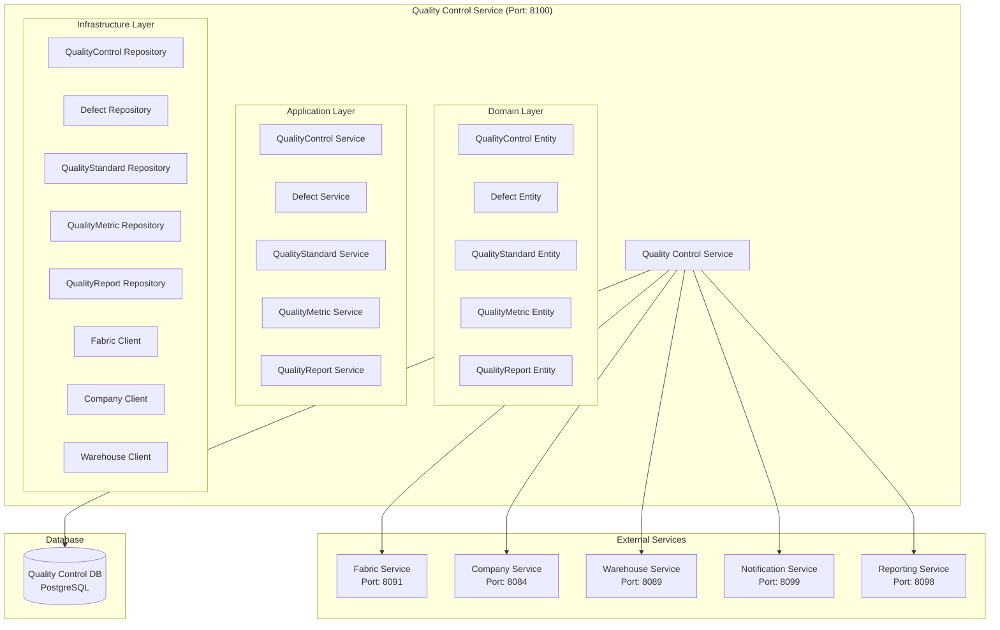

# Quality Control Service Architecture

## 📋 Overview

Quality Control Service, fabric management sisteminde kalite kontrol, hata yönetimi ve tedarikçi performans analizi için tasarlanmış specialized microservice'dir. Bu servis, kumaş kalitesi, hata tespiti ve tedarikçi karşılaştırması için kritik öneme sahiptir.

## 🎯 Service Responsibilities

### **Primary Responsibilities**

- **Quality Control Management**: Kalite kontrol süreçlerinin yönetimi
- **Defect Management**: Hata tespiti, kategorilendirme ve takibi
- **Supplier Performance Analysis**: Tedarikçi performans analizi
- **Quality Metrics**: Kalite metrikleri ve KPI'lar
- **Quality Reports**: Kalite raporları ve dashboard'lar

### **Secondary Responsibilities**

- **Quality Standards**: Kalite standartları yönetimi
- **Quality Training**: Kalite eğitim programları
- **Quality Compliance**: Kalite uyumluluk takibi
- **Quality Integration**: Diğer servislerle entegrasyon

## 🏗️ Service Architecture



## 📊 Database Schema

```sql
-- Quality control records table
CREATE TABLE quality_controls (
    id UUID PRIMARY KEY,
    tenant_id UUID NOT NULL,
    fabric_id UUID NOT NULL,
    company_id UUID NOT NULL,
    warehouse_id UUID NOT NULL,
    control_date DATE NOT NULL,
    control_type VARCHAR(50) NOT NULL, -- INCOMING, IN_PROCESS, FINAL, RANDOM
    inspector_id UUID NOT NULL,
    batch_number VARCHAR(100),
    lot_number VARCHAR(100),
    quantity_checked INTEGER NOT NULL,
    quantity_passed INTEGER NOT NULL,
    quantity_failed INTEGER NOT NULL,
    pass_rate DECIMAL(5,2) NOT NULL,
    status VARCHAR(20) DEFAULT 'PENDING', -- PENDING, APPROVED, REJECTED, UNDER_REVIEW
    notes TEXT,
    created_at TIMESTAMP DEFAULT CURRENT_TIMESTAMP,
    updated_at TIMESTAMP DEFAULT CURRENT_TIMESTAMP,
    created_by VARCHAR(100),
    updated_by VARCHAR(100)
);

-- Defects table
CREATE TABLE defects (
    id UUID PRIMARY KEY,
    quality_control_id UUID NOT NULL,
    defect_type VARCHAR(50) NOT NULL, -- COLOR_VARIATION, WEAVE_DEFECT, STAIN, TEAR, SHRINKAGE, PILLING
    defect_category VARCHAR(50) NOT NULL, -- CRITICAL, MAJOR, MINOR
    defect_severity VARCHAR(20) NOT NULL, -- HIGH, MEDIUM, LOW
    defect_location VARCHAR(100), -- Specific location on fabric
    defect_size VARCHAR(50), -- Size measurement
    defect_count INTEGER DEFAULT 1,
    defect_description TEXT,
    defect_image_url VARCHAR(500),
    is_repairable BOOLEAN DEFAULT FALSE,
    repair_cost DECIMAL(10,2),
    created_at TIMESTAMP DEFAULT CURRENT_TIMESTAMP,

    CONSTRAINT fk_defect_quality_control FOREIGN KEY (quality_control_id) REFERENCES quality_controls(id)
);

-- Quality standards table
CREATE TABLE quality_standards (
    id UUID PRIMARY KEY,
    tenant_id UUID NOT NULL,
    standard_name VARCHAR(100) NOT NULL,
    standard_type VARCHAR(50) NOT NULL, -- FABRIC, COLOR, WEAVE, FINISH
    standard_description TEXT,
    acceptance_criteria JSONB, -- Criteria for acceptance
    rejection_criteria JSONB, -- Criteria for rejection
    measurement_units VARCHAR(20), -- CM, MM, INCHES, PERCENTAGE
    tolerance_level DECIMAL(5,2), -- Tolerance percentage
    is_active BOOLEAN DEFAULT TRUE,
    created_at TIMESTAMP DEFAULT CURRENT_TIMESTAMP,
    updated_at TIMESTAMP DEFAULT CURRENT_TIMESTAMP,
    created_by VARCHAR(100),
    updated_by VARCHAR(100)
);

-- Quality metrics table
CREATE TABLE quality_metrics (
    id UUID PRIMARY KEY,
    tenant_id UUID NOT NULL,
    metric_name VARCHAR(100) NOT NULL,
    metric_type VARCHAR(50) NOT NULL, -- DEFECT_RATE, PASS_RATE, REJECTION_RATE, COST_OF_QUALITY
    metric_value DECIMAL(10,4) NOT NULL,
    metric_unit VARCHAR(20), -- PERCENTAGE, COUNT, CURRENCY
    measurement_date DATE NOT NULL,
    company_id UUID,
    fabric_id UUID,
    warehouse_id UUID,
    period_type VARCHAR(20) DEFAULT 'DAILY', -- DAILY, WEEKLY, MONTHLY, QUARTERLY, YEARLY
    created_at TIMESTAMP DEFAULT CURRENT_TIMESTAMP,

    CONSTRAINT fk_quality_metric_company FOREIGN KEY (company_id) REFERENCES companies(id),
    CONSTRAINT fk_quality_metric_fabric FOREIGN KEY (fabric_id) REFERENCES fabrics(id),
    CONSTRAINT fk_quality_metric_warehouse FOREIGN KEY (warehouse_id) REFERENCES warehouses(id)
);

-- Quality reports table
CREATE TABLE quality_reports (
    id UUID PRIMARY KEY,
    tenant_id UUID NOT NULL,
    report_name VARCHAR(200) NOT NULL,
    report_type VARCHAR(50) NOT NULL, -- SUMMARY, DETAILED, TREND, COMPARATIVE
    report_period_start DATE NOT NULL,
    report_period_end DATE NOT NULL,
    report_data JSONB, -- Report data in JSON format
    report_filters JSONB, -- Applied filters
    generated_by UUID NOT NULL,
    generated_at TIMESTAMP DEFAULT CURRENT_TIMESTAMP,
    report_status VARCHAR(20) DEFAULT 'GENERATED', -- GENERATED, SENT, VIEWED
    report_url VARCHAR(500), -- Link to generated report
    created_at TIMESTAMP DEFAULT CURRENT_TIMESTAMP
);

-- Supplier performance table
CREATE TABLE supplier_performance (
    id UUID PRIMARY KEY,
    tenant_id UUID NOT NULL,
    company_id UUID NOT NULL,
    fabric_id UUID NOT NULL,
    performance_period_start DATE NOT NULL,
    performance_period_end DATE NOT NULL,
    total_quantity INTEGER NOT NULL,
    total_defects INTEGER NOT NULL,
    defect_rate DECIMAL(5,2) NOT NULL,
    pass_rate DECIMAL(5,2) NOT NULL,
    rejection_rate DECIMAL(5,2) NOT NULL,
    average_defect_severity VARCHAR(20), -- HIGH, MEDIUM, LOW
    cost_of_quality DECIMAL(10,2), -- Cost associated with quality issues
    performance_score DECIMAL(5,2), -- Overall performance score
    performance_grade VARCHAR(5), -- A, B, C, D, F
    created_at TIMESTAMP DEFAULT CURRENT_TIMESTAMP,
    updated_at TIMESTAMP DEFAULT CURRENT_TIMESTAMP,

    CONSTRAINT fk_supplier_performance_company FOREIGN KEY (company_id) REFERENCES companies(id),
    CONSTRAINT fk_supplier_performance_fabric FOREIGN KEY (fabric_id) REFERENCES fabrics(id)
);
```

## 🔧 Service Implementation

```java
@Service
@Transactional
public class QualityControlService {

    private final QualityControlRepository qualityControlRepository;
    private final DefectRepository defectRepository;
    private final QualityStandardRepository qualityStandardRepository;
    private final QualityMetricRepository qualityMetricRepository;
    private final SupplierPerformanceRepository supplierPerformanceRepository;
    private final FabricServiceClient fabricServiceClient;
    private final CompanyServiceClient companyServiceClient;
    private final WarehouseServiceClient warehouseServiceClient;

    public QualityControlResponse createQualityControl(CreateQualityControlRequest request) {
        // Validate fabric exists
        FabricResponse fabric = fabricServiceClient.getFabricById(request.getFabricId());

        // Validate company exists
        CompanyResponse company = companyServiceClient.getCompanyById(request.getCompanyId());

        // Validate warehouse exists
        WarehouseResponse warehouse = warehouseServiceClient.getWarehouseById(request.getWarehouseId());

        // Create quality control record
        QualityControl qualityControl = QualityControl.builder()
            .tenantId(request.getTenantId())
            .fabricId(request.getFabricId())
            .companyId(request.getCompanyId())
            .warehouseId(request.getWarehouseId())
            .controlDate(request.getControlDate())
            .controlType(request.getControlType())
            .inspectorId(request.getInspectorId())
            .batchNumber(request.getBatchNumber())
            .lotNumber(request.getLotNumber())
            .quantityChecked(request.getQuantityChecked())
            .quantityPassed(request.getQuantityPassed())
            .quantityFailed(request.getQuantityFailed())
            .passRate(calculatePassRate(request.getQuantityPassed(), request.getQuantityChecked()))
            .status(QualityControlStatus.PENDING)
            .notes(request.getNotes())
            .build();

        QualityControl savedQualityControl = qualityControlRepository.save(qualityControl);

        // Create defects if any
        if (request.getDefects() != null && !request.getDefects().isEmpty()) {
            for (CreateDefectRequest defectRequest : request.getDefects()) {
                createDefect(savedQualityControl.getId(), defectRequest);
            }
        }

        // Calculate and save quality metrics
        calculateAndSaveQualityMetrics(savedQualityControl);

        // Update supplier performance
        updateSupplierPerformance(savedQualityControl);

        // Publish quality control created event
        publishQualityControlCreatedEvent(savedQualityControl);

        return mapToQualityControlResponse(savedQualityControl);
    }

    public DefectResponse createDefect(UUID qualityControlId, CreateDefectRequest request) {
        QualityControl qualityControl = qualityControlRepository.findById(qualityControlId)
            .orElseThrow(() -> new QualityControlNotFoundException("Quality control not found"));

        Defect defect = Defect.builder()
            .qualityControlId(qualityControlId)
            .defectType(request.getDefectType())
            .defectCategory(request.getDefectCategory())
            .defectSeverity(request.getDefectSeverity())
            .defectLocation(request.getDefectLocation())
            .defectSize(request.getDefectSize())
            .defectCount(request.getDefectCount())
            .defectDescription(request.getDefectDescription())
            .defectImageUrl(request.getDefectImageUrl())
            .isRepairable(request.getIsRepairable())
            .repairCost(request.getRepairCost())
            .build();

        Defect savedDefect = defectRepository.save(defect);

        // Update quality control status based on defect severity
        updateQualityControlStatus(qualityControl, savedDefect);

        return mapToDefectResponse(savedDefect);
    }

    public SupplierPerformanceResponse getSupplierPerformance(UUID companyId, UUID fabricId, LocalDate startDate, LocalDate endDate) {
        List<QualityControl> qualityControls = qualityControlRepository
            .findByCompanyIdAndFabricIdAndControlDateBetween(companyId, fabricId, startDate, endDate);

        if (qualityControls.isEmpty()) {
            throw new NoDataFoundException("No quality control data found for the specified period");
        }

        // Calculate performance metrics
        int totalQuantity = qualityControls.stream().mapToInt(QualityControl::getQuantityChecked).sum();
        int totalDefects = qualityControls.stream().mapToInt(QualityControl::getQuantityFailed).sum();
        int totalPassed = qualityControls.stream().mapToInt(QualityControl::getQuantityPassed).sum();

        double defectRate = (double) totalDefects / totalQuantity * 100;
        double passRate = (double) totalPassed / totalQuantity * 100;
        double rejectionRate = 100 - passRate;

        // Calculate average defect severity
        String averageDefectSeverity = calculateAverageDefectSeverity(qualityControls);

        // Calculate cost of quality
        BigDecimal costOfQuality = calculateCostOfQuality(qualityControls);

        // Calculate performance score
        double performanceScore = calculatePerformanceScore(defectRate, passRate, averageDefectSeverity);

        // Determine performance grade
        String performanceGrade = determinePerformanceGrade(performanceScore);

        return SupplierPerformanceResponse.builder()
            .companyId(companyId)
            .fabricId(fabricId)
            .performancePeriodStart(startDate)
            .performancePeriodEnd(endDate)
            .totalQuantity(totalQuantity)
            .totalDefects(totalDefects)
            .defectRate(defectRate)
            .passRate(passRate)
            .rejectionRate(rejectionRate)
            .averageDefectSeverity(averageDefectSeverity)
            .costOfQuality(costOfQuality)
            .performanceScore(performanceScore)
            .performanceGrade(performanceGrade)
            .build();
    }

    public List<CompanyComparisonResponse> compareSupplierPerformance(UUID fabricId, LocalDate startDate, LocalDate endDate) {
        List<QualityControl> qualityControls = qualityControlRepository
            .findByFabricIdAndControlDateBetween(fabricId, startDate, endDate);

        if (qualityControls.isEmpty()) {
            throw new NoDataFoundException("No quality control data found for the specified period");
        }

        // Group by company
        Map<UUID, List<QualityControl>> companyQualityControls = qualityControls.stream()
            .collect(Collectors.groupingBy(QualityControl::getCompanyId));

        List<CompanyComparisonResponse> comparisons = new ArrayList<>();

        for (Map.Entry<UUID, List<QualityControl>> entry : companyQualityControls.entrySet()) {
            UUID companyId = entry.getKey();
            List<QualityControl> companyControls = entry.getValue();

            // Calculate company performance
            SupplierPerformanceResponse performance = getSupplierPerformance(companyId, fabricId, startDate, endDate);

            // Get company details
            CompanyResponse company = companyServiceClient.getCompanyById(companyId);

            CompanyComparisonResponse comparison = CompanyComparisonResponse.builder()
                .companyId(companyId)
                .companyName(company.getCompanyName())
                .performanceScore(performance.getPerformanceScore())
                .performanceGrade(performance.getPerformanceGrade())
                .defectRate(performance.getDefectRate())
                .passRate(performance.getPassRate())
                .rejectionRate(performance.getRejectionRate())
                .costOfQuality(performance.getCostOfQuality())
                .build();

            comparisons.add(comparison);
        }

        // Sort by performance score (descending)
        comparisons.sort((a, b) -> Double.compare(b.getPerformanceScore(), a.getPerformanceScore()));

        return comparisons;
    }
}
```

## 📊 API Endpoints

```java
@RestController
@RequestMapping("/api/v1/quality-control")
public class QualityControlController {

    @PostMapping
    public ResponseEntity<QualityControlResponse> createQualityControl(@RequestBody CreateQualityControlRequest request) {
        QualityControlResponse response = qualityControlService.createQualityControl(request);
        return ResponseEntity.ok(response);
    }

    @GetMapping("/{qualityControlId}")
    public ResponseEntity<QualityControlResponse> getQualityControl(@PathVariable UUID qualityControlId) {
        QualityControlResponse response = qualityControlService.getQualityControl(qualityControlId);
        return ResponseEntity.ok(response);
    }

    @PostMapping("/{qualityControlId}/defects")
    public ResponseEntity<DefectResponse> createDefect(
        @PathVariable UUID qualityControlId,
        @RequestBody CreateDefectRequest request) {
        DefectResponse response = qualityControlService.createDefect(qualityControlId, request);
        return ResponseEntity.ok(response);
    }

    @GetMapping("/{qualityControlId}/defects")
    public ResponseEntity<List<DefectResponse>> getDefects(@PathVariable UUID qualityControlId) {
        List<DefectResponse> response = qualityControlService.getDefects(qualityControlId);
        return ResponseEntity.ok(response);
    }

    @GetMapping("/supplier-performance")
    public ResponseEntity<SupplierPerformanceResponse> getSupplierPerformance(
        @RequestParam UUID companyId,
        @RequestParam UUID fabricId,
        @RequestParam @DateTimeFormat(iso = DateTimeFormat.ISO.DATE) LocalDate startDate,
        @RequestParam @DateTimeFormat(iso = DateTimeFormat.ISO.DATE) LocalDate endDate) {
        SupplierPerformanceResponse response = qualityControlService.getSupplierPerformance(companyId, fabricId, startDate, endDate);
        return ResponseEntity.ok(response);
    }

    @GetMapping("/supplier-comparison")
    public ResponseEntity<List<CompanyComparisonResponse>> compareSupplierPerformance(
        @RequestParam UUID fabricId,
        @RequestParam @DateTimeFormat(iso = DateTimeFormat.ISO.DATE) LocalDate startDate,
        @RequestParam @DateTimeFormat(iso = DateTimeFormat.ISO.DATE) LocalDate endDate) {
        List<CompanyComparisonResponse> response = qualityControlService.compareSupplierPerformance(fabricId, startDate, endDate);
        return ResponseEntity.ok(response);
    }

    @GetMapping("/quality-metrics")
    public ResponseEntity<List<QualityMetricResponse>> getQualityMetrics(
        @RequestParam UUID companyId,
        @RequestParam @DateTimeFormat(iso = DateTimeFormat.ISO.DATE) LocalDate startDate,
        @RequestParam @DateTimeFormat(iso = DateTimeFormat.ISO.DATE) LocalDate endDate) {
        List<QualityMetricResponse> response = qualityControlService.getQualityMetrics(companyId, startDate, endDate);
        return ResponseEntity.ok(response);
    }

    @PostMapping("/quality-reports")
    public ResponseEntity<QualityReportResponse> generateQualityReport(@RequestBody GenerateQualityReportRequest request) {
        QualityReportResponse response = qualityControlService.generateQualityReport(request);
        return ResponseEntity.ok(response);
    }
}
```

## 🔐 Security Configuration

```java
@Configuration
@EnableWebSecurity
public class SecurityConfig {

    @Bean
    public SecurityFilterChain filterChain(HttpSecurity http) throws Exception {
        http
            .csrf().disable()
            .sessionManagement().sessionCreationPolicy(SessionCreationPolicy.STATELESS)
            .and()
            .authorizeHttpRequests(authz -> authz
                .requestMatchers("/api/v1/quality-control/**").hasRole("QUALITY_INSPECTOR")
                .anyRequest().authenticated()
            )
            .addFilterBefore(jwtAuthenticationFilter(), UsernamePasswordAuthenticationFilter.class);

        return http.build();
    }
}
```

## 🚀 Deployment Configuration

```yaml
apiVersion: apps/v1
kind: Deployment
metadata:
  name: quality-control-service
spec:
  replicas: 2
  selector:
    matchLabels:
      app: quality-control-service
  template:
    metadata:
      labels:
        app: quality-control-service
    spec:
      containers:
        - name: quality-control-service
          image: fabric-management/quality-control-service:latest
          ports:
            - containerPort: 8100
          env:
            - name: SPRING_PROFILES_ACTIVE
              value: "prod"
            - name: POSTGRES_HOST
              value: "postgres-quality"
            - name: FABRIC_SERVICE_URL
              value: "http://fabric-service:8091"
            - name: COMPANY_SERVICE_URL
              value: "http://company-service:8084"
            - name: WAREHOUSE_SERVICE_URL
              value: "http://warehouse-service:8089"
          resources:
            requests:
              memory: "512Mi"
              cpu: "250m"
            limits:
              memory: "1Gi"
              cpu: "500m"
```

## 📈 Performance Considerations

- **Database Indexing**: Company_id, fabric_id, control_date indexes
- **Caching**: Quality metrics caching with Redis
- **Search Optimization**: Full-text search for defect descriptions
- **Pagination**: Efficient pagination for quality control lists
- **Connection Pooling**: Database connection pooling

## 🎯 Business Value

- **Quality Assurance**: Kumaş kalitesinin garanti altına alınması
- **Supplier Performance**: Tedarikçi performansının objektif değerlendirilmesi
- **Cost Reduction**: Kalite maliyetlerinin azaltılması
- **Compliance**: Kalite standartlarına uyumluluk
- **Competitive Advantage**: En iyi tedarikçilerin belirlenmesi
