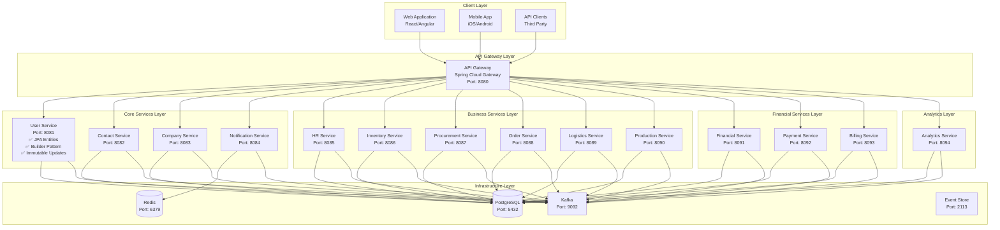
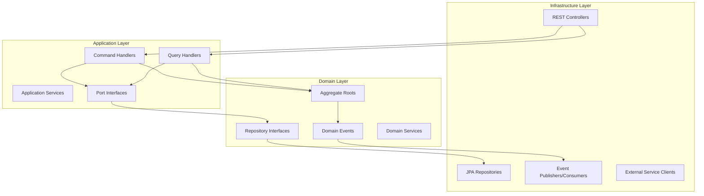
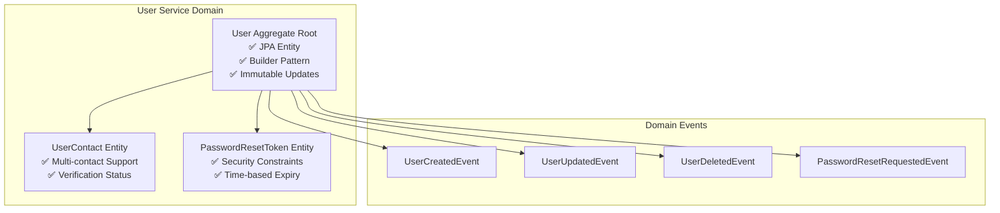
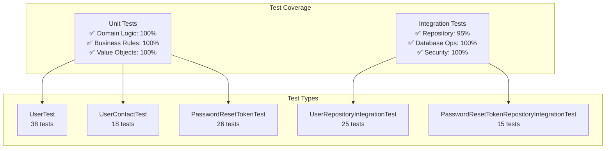
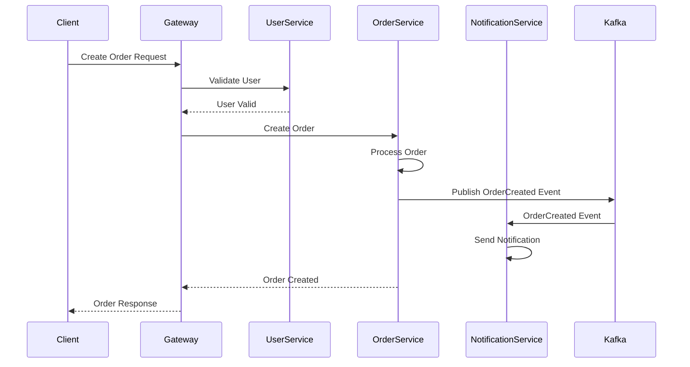
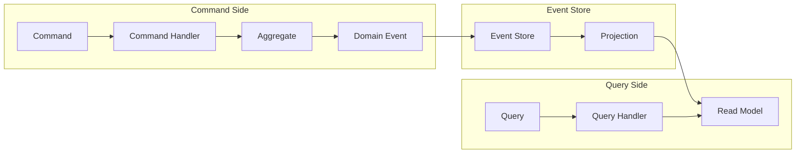
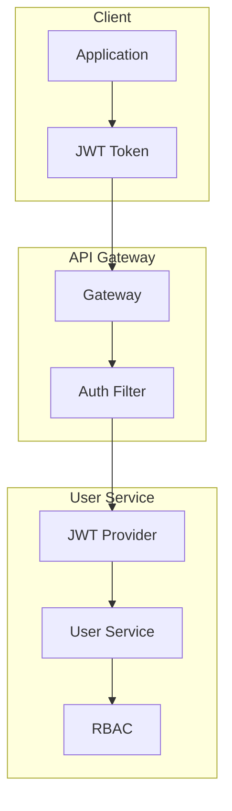
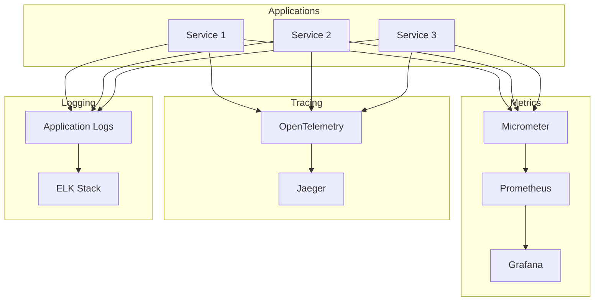
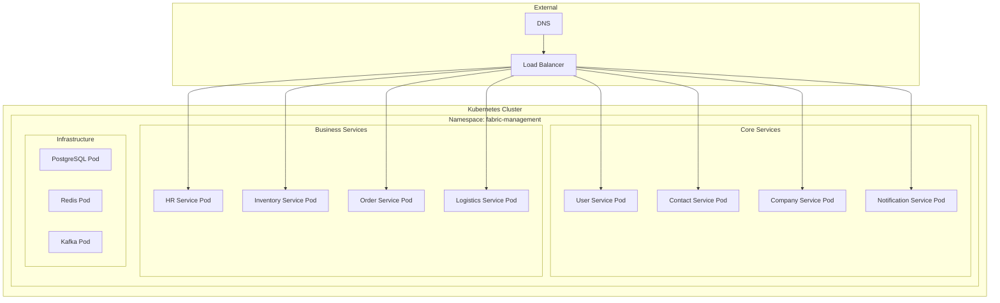

# 🏗️ System Architecture

## 📋 Overview

The Fabric Management System follows modern microservice architecture principles with Domain-Driven Design (DDD), Clean Architecture, and Event-Driven patterns. This document provides a comprehensive overview of the system architecture, design decisions, and implementation patterns.

## 🎯 Architecture Principles

### Core Principles

1. **Domain-Driven Design (DDD)** - Business logic organized around domain concepts
2. **Clean Architecture** - Separation of concerns with clear boundaries
3. **Event-Driven Architecture** - Loose coupling through events
4. **CQRS Pattern** - Command Query Responsibility Segregation
5. **Microservice Architecture** - Independent, scalable services
6. **Multi-tenancy** - Isolated tenant data and configurations

### Design Goals

- **Scalability** - Handle millions of requests
- **Reliability** - Fault-tolerant and resilient
- **Maintainability** - Easy to understand and modify
- **Performance** - Optimized for speed and efficiency
- **Security** - Enterprise-grade security
- **Observability** - Full monitoring and tracing

## 🏗️ System Architecture

### High-Level Architecture



## 🎯 Service Architecture

### Service Design Pattern

Each microservice follows the **Clean Architecture** pattern with clear separation of concerns:



### Service Responsibilities

#### Core Services

| Service                  | Port | Responsibilities                                  |
| ------------------------ | ---- | ------------------------------------------------- |
| **User Service**         | 8081 | Authentication, user profiles, session management |
| **Contact Service**      | 8082 | Contact information, communication preferences    |
| **Company Service**      | 8083 | Company management, multi-tenancy                 |
| **Notification Service** | 8084 | Email, SMS, push notifications                    |

#### Business Services

| Service                 | Port | Responsibilities                           |
| ----------------------- | ---- | ------------------------------------------ |
| **HR Service**          | 8085 | Human resources, payroll, leave management |
| **Inventory Service**   | 8086 | Stock management, product catalog, pricing |
| **Procurement Service** | 8087 | Purchase orders, supplier management       |
| **Order Service**       | 8088 | Order processing, fulfillment              |
| **Logistics Service**   | 8089 | Shipping, delivery tracking                |
| **Production Service**  | 8090 | Manufacturing, production planning         |

#### Financial Services

| Service               | Port | Responsibilities              |
| --------------------- | ---- | ----------------------------- |
| **Financial Service** | 8091 | Accounting, financial records |
| **Payment Service**   | 8092 | Payment processing, gateways  |
| **Billing Service**   | 8093 | Billing management, invoicing |

#### Analytics Service

| Service               | Port | Responsibilities                              |
| --------------------- | ---- | --------------------------------------------- |
| **Analytics Service** | 8094 | Business intelligence, reporting, AI insights |

## 🏗️ Service Architecture Details

### User Service Architecture

The User Service implements a sophisticated domain model with modern architectural patterns:

#### Domain Model



#### Key Architectural Improvements

**1. JPA Entity Implementation**

```java
@Entity
@Table(name = "users")
@Getter
@Setter
@NoArgsConstructor
@SuperBuilder
public class User extends BaseEntity {

    @Column(name = "tenant_id", nullable = false)
    private String tenantId;  // String for database compatibility

    @OneToMany(mappedBy = "userId", cascade = CascadeType.ALL, fetch = FetchType.LAZY)
    private List<UserContact> contacts;  // Proper JPA mapping

    @Transient
    private final List<Object> domainEvents = new ArrayList<>();  // Non-persistent events
}
```

**2. Builder Pattern for Immutability**

```java
// ✅ Correct: Immutable builder pattern
public static User createWithContactVerification(String contactValue, String contactType,
                                                String firstName, String lastName,
                                                String passwordHash, String userType) {
    return User.builder()
        .firstName(firstName)
        .lastName(lastName)
        .status(UserStatus.PENDING_VERIFICATION)
        .registrationType(RegistrationType.DIRECT_REGISTRATION)
        .contacts(new ArrayList<>())
        .build();
}
```

**3. Thread-Safe Updates**

```java
// ✅ Correct: Index-based updates (thread-safe)
for (int i = 0; i < this.contacts.size(); i++) {
    UserContact contact = this.contacts.get(i);
    if (contact.getContactValue().equals(contactValue)) {
        UserContact verifiedContact = UserContact.builder()
            .id(contact.getId())
            .userId(contact.getUserId())
            .contactValue(contact.getContactValue())
            .contactType(contact.getContactType())
            .isVerified(true)
            .isPrimary(contact.isPrimary())
            .verifiedAt(LocalDateTime.now())
            .build();
        this.contacts.set(i, verifiedContact);
        break;
    }
}
```

#### Test Architecture



## 🔄 Data Flow Architecture

### Event-Driven Communication



### CQRS Pattern Implementation



## 🎯 Exception Handling Architecture

### Conditional Exception Handler Pattern

The system uses Spring Boot's `@ConditionalOnMissingBean` pattern to provide flexible exception handling while maintaining microservices autonomy.

```mermaid
graph TB
    subgraph "Exception Handling Strategy"
        SHARED[Shared GlobalExceptionHandler<br/>@ConditionalOnMissingBean<br/>Default for all services]

        subgraph "Service-Specific Handlers"
            USER[UserServiceExceptionHandler<br/>@Component serviceExceptionHandler<br/>Custom authentication errors]
            COMPANY[CompanyExceptionHandler<br/>@Component serviceExceptionHandler<br/>Custom business rules]
        end

        subgraph "Services Without Custom Handlers"
            CONTACT[Contact Service<br/>Uses Shared Handler]
        end
    end

    SHARED -.->|Auto-disabled when<br/>custom handler present| USER
    SHARED -.->|Auto-disabled when<br/>custom handler present| COMPANY
    SHARED -->|Auto-enabled when<br/>no custom handler| CONTACT
```

### Exception Handler Configuration

| Service             | Handler Type  | Bean Name                 | Status     |
| ------------------- | ------------- | ------------------------- | ---------- |
| **user-service**    | Custom        | `serviceExceptionHandler` | ✅ Active  |
| **company-service** | Custom        | `serviceExceptionHandler` | ✅ Active  |
| **contact-service** | Shared        | `globalExceptionHandler`  | ✅ Active  |
| **Future services** | Auto (Shared) | `globalExceptionHandler`  | ✅ Default |

### Benefits

- ✅ **Microservices Autonomy** - Each service chooses its exception handling strategy
- ✅ **Zero Coupling** - No inheritance between service and shared handlers
- ✅ **Convention over Configuration** - Automatic, declarative configuration
- ✅ **Flexibility** - Services can add/remove custom handlers without affecting others

For detailed implementation guide, see [Bean Conflict Resolution](../troubleshooting/BEAN_CONFLICT_RESOLUTION.md).

---

## 🛡️ Security Architecture

### Authentication & Authorization



### Security Layers

1. **API Gateway** - Rate limiting, authentication
2. **JWT Tokens** - Stateless authentication
3. **RBAC** - Role-based access control
4. **OAuth2** - External authentication
5. **Audit Logging** - Security event tracking

## 📊 Observability Architecture

### Monitoring Stack



## 🚀 Deployment Architecture

### Container Orchestration



## 🔧 Technology Decisions

### Why These Technologies?

| Technology            | Purpose          | Justification                        |
| --------------------- | ---------------- | ------------------------------------ |
| **Java 21**           | Runtime          | Latest LTS, performance improvements |
| **Spring Boot 3.5.5** | Framework        | Mature, ecosystem, community         |
| **PostgreSQL 16**     | Database         | ACID compliance, JSON support        |
| **Redis 7**           | Cache            | High performance, data structures    |
| **Kafka 3.5.1**       | Messaging        | High throughput, durability          |
| **Docker**            | Containerization | Portability, consistency             |
| **Kubernetes**        | Orchestration    | Scalability, self-healing            |

## 📈 Scalability Considerations

### Horizontal Scaling

- **Stateless Services** - Easy horizontal scaling
- **Database Sharding** - Tenant-based sharding
- **Caching Strategy** - Multi-level caching
- **Load Balancing** - Round-robin, least connections

### Performance Optimization

- **Connection Pooling** - Database connections
- **Async Processing** - Non-blocking operations
- **CQRS** - Read/write optimization
- **Event Sourcing** - Audit trail, replay capability

## 🔮 Future Considerations

### Planned Enhancements

1. **GraphQL API** - Flexible data querying
2. **gRPC** - High-performance service communication
3. **Service Mesh** - Istio integration
4. **AI/ML Integration** - Predictive analytics
5. **Edge Computing** - CDN integration

### Migration Strategy

- **Gradual Migration** - Service by service
- **Blue-Green Deployment** - Zero downtime
- **Feature Flags** - Controlled rollouts
- **A/B Testing** - Performance validation

---

## 📚 Related Documentation

- [API Documentation](../api/) - REST API specifications
- [Development Guide](../development/) - Setup and coding standards
- [Deployment Guide](../deployment/) - Production deployment
- [Testing Guide](../testing/) - Testing strategies

---

_Last updated: 2024-01-XX_
_Version: 1.0.0_
