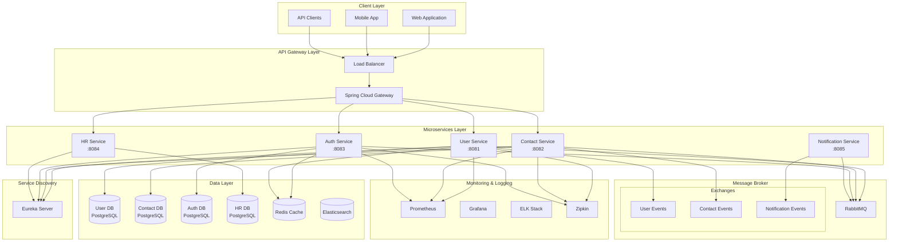

# Architecture Documentation

## 📋 Table of Contents

- [System Architecture](#system-architecture)
- [Clean Architecture Layers](#clean-architecture-layers)
- [Design Patterns](#design-patterns-used)
- [Multi-Tenancy Strategy](#multi-tenancy-strategy)
- [Security Architecture](#security-architecture)
- [Event-Driven Architecture](#event-driven-architecture)
- [Service Communication](#service-communication)
- [Data Management](#data-management)

## System Architecture

### High-Level Architecture Diagram



### Architecture Principles

- **Microservices**: Each service is independently deployable and scalable
- **Domain-Driven Design**: Business logic drives the design
- **Clean Architecture**: Clear separation of concerns with dependency inversion
- **API-First**: All services expose RESTful APIs
- **Cloud-Native**: Containerized, orchestrated, and cloud-ready
- **Event-Driven**: Asynchronous communication via events

## Clean Architecture Layers

### 🎯 Domain Layer (Core/Innermost)

The heart of the application containing pure business logic.

**Characteristics:**
- Zero framework dependencies
- Pure Java/business logic
- Highly testable
- Stable and rarely changes

**Components:**
```
domain/
├── model/
│   ├── entities/       # Business entities
│   ├── valueobjects/   # Value objects (immutable)
│   └── aggregates/     # Aggregate roots
├── events/             # Domain events
├── exceptions/         # Business exceptions
├── services/           # Domain services
└── repository/         # Repository interfaces (ports)
```

**Example:**
```java
// Entity
@Entity
public class User extends BaseEntity {
    private UserId id;
    private Username username;
    private PersonName name;
    private TenantId tenantId;
    
    // Business logic methods
    public void changeUsername(Username newUsername) {
        // Business rules validation
        this.username = newUsername;
        registerEvent(new UsernameChangedEvent(id, username));
    }
}

// Value Object
@ValueObject
public class Username {
    private final String value;
    
    public Username(String value) {
        validate(value);
        this.value = value;
    }
}
```

### 🔧 Application Layer

Orchestrates the use cases of the application.

**Characteristics:**
- Implements use cases
- Coordinates domain objects
- Manages transactions
- No business logic

**Components:**
```
application/
├── usecases/          # Use case implementations
├── dto/               # Data Transfer Objects
├── ports/             # Port interfaces
│   ├── input/        # Input ports (use cases)
│   └── output/       # Output ports (adapters)
├── mappers/          # DTO-Entity mappers
└── services/         # Application services
```

**Example:**
```java
@UseCase
@Transactional
public class CreateUserUseCase implements CreateUserInputPort {
    private final UserRepository userRepository;
    private final UserMapper mapper;
    private final EventPublisher eventPublisher;
    
    public UserDto execute(CreateUserCommand command) {
        // Validate command
        // Create domain entity
        User user = User.create(command);
        // Save via repository
        User saved = userRepository.save(user);
        // Publish events
        eventPublisher.publish(user.getDomainEvents());
        // Return DTO
        return mapper.toDto(saved);
    }
}
```

### 🏗️ Infrastructure Layer

Technical implementations and framework-specific code.

**Characteristics:**
- Framework dependencies
- External service integrations
- Database implementations
- Messaging implementations

**Components:**
```
infrastructure/
├── persistence/       # JPA/Database implementations
│   ├── entities/     # JPA entities
│   ├── repositories/ # Repository implementations
│   └── config/       # Database configuration
├── messaging/        # Message queue implementations
├── external/         # External service clients
├── security/         # Security implementations
└── config/          # Framework configurations
```

**Example:**
```java
@Repository
public class JpaUserRepository implements UserRepository {
    private final JpaUserEntityRepository jpaRepository;
    private final UserEntityMapper mapper;
    
    @Override
    public User save(User user) {
        UserEntity entity = mapper.toEntity(user);
        UserEntity saved = jpaRepository.save(entity);
        return mapper.toDomain(saved);
    }
}
```

### 🌐 Presentation Layer (Outermost)

Handles external communication and user interfaces.

**Characteristics:**
- REST controllers
- GraphQL resolvers
- WebSocket handlers
- API documentation

**Components:**
```
presentation/
├── rest/             # REST controllers
│   ├── controllers/  # Controller classes
│   ├── models/       # Request/Response models
│   └── validators/   # Input validators
├── graphql/          # GraphQL resolvers (if used)
├── websocket/        # WebSocket handlers
├── filters/          # HTTP filters
└── handlers/         # Exception handlers
```

**Example:**
```java
@RestController
@RequestMapping("/api/v1/users")
public class UserController {
    private final CreateUserInputPort createUserUseCase;
    
    @PostMapping
    @ResponseStatus(HttpStatus.CREATED)
    public ResponseEntity<UserResponse> createUser(
            @Valid @RequestBody CreateUserRequest request,
            @RequestHeader("X-Tenant-ID") String tenantId) {
        
        CreateUserCommand command = toCommand(request, tenantId);
        UserDto user = createUserUseCase.execute(command);
        return ResponseEntity.created(location(user))
                           .body(toResponse(user));
    }
}
```

## Design Patterns Used

### 1. Domain-Driven Design (DDD)

**Aggregates**
```java
@Aggregate
public class UserAggregate {
    private User root;
    private List<Contact> contacts;
    private List<Permission> permissions;
    
    // Aggregate operations ensure consistency
    public void addContact(Contact contact) {
        validateContact(contact);
        contacts.add(contact);
        root.incrementContactCount();
    }
}
```

**Value Objects**
```java
@ValueObject
@Immutable
public class Email {
    private final String value;
    
    public Email(String value) {
        if (!isValid(value)) {
            throw new InvalidEmailException(value);
        }
        this.value = value;
    }
}
```

**Domain Events**
```java
@DomainEvent
public class UserCreatedEvent {
    private final UserId userId;
    private final Username username;
    private final Instant occurredOn;
}
```

**Repository Pattern**
```java
public interface UserRepository {
    User findById(UserId id);
    User save(User user);
    void delete(UserId id);
    Page<User> findAll(Pageable pageable);
}
```

### 2. Hexagonal Architecture (Ports & Adapters)

```java
// Input Port (Use Case Interface)
public interface CreateUserInputPort {
    UserDto execute(CreateUserCommand command);
}

// Output Port (Infrastructure Interface)
public interface UserOutputPort {
    User save(User user);
    Optional<User> findById(UserId id);
}

// Adapter (Implementation)
@Adapter
public class PostgresUserAdapter implements UserOutputPort {
    // PostgreSQL specific implementation
}
```

### 3. CQRS (Command Query Responsibility Segregation)

```java
// Command Side
@Command
public class CreateUserCommand {
    private String username;
    private String firstName;
    private String lastName;
}

// Query Side
@Query
public class GetUserByIdQuery {
    private UUID userId;
}

// Command Handler
@CommandHandler
public class CreateUserCommandHandler {
    public void handle(CreateUserCommand command) {
        // Write operation logic
    }
}

// Query Handler
@QueryHandler
public class GetUserQueryHandler {
    public UserDto handle(GetUserByIdQuery query) {
        // Read operation logic
    }
}
```

### 4. Factory Pattern

```java
@Component
public class UserFactory {
    public User createUser(CreateUserCommand command) {
        return User.builder()
            .id(UserId.generate())
            .username(new Username(command.getUsername()))
            .name(new PersonName(command.getFirstName(), command.getLastName()))
            .tenantId(new TenantId(command.getTenantId()))
            .build();
    }
}
```

### 5. Strategy Pattern

```java
public interface ValidationStrategy {
    boolean validate(User user);
}

@Component
public class EmailValidationStrategy implements ValidationStrategy {
    public boolean validate(User user) {
        return EmailValidator.isValid(user.getEmail());
    }
}
```

### 6. Observer Pattern (Event-Driven)

```java
@EventListener
public class UserEventListener {
    @Async
    @TransactionalEventListener
    public void handleUserCreated(UserCreatedEvent event) {
        // React to user creation
        notificationService.sendWelcomeEmail(event.getUserId());
    }
}
```

## Multi-Tenancy Strategy

### Database Per Tenant vs Shared Database

We use **Shared Database with Row-Level Security**:

```java
@Entity
@Where(clause = "deleted = false")
@FilterDef(name = "tenantFilter", parameters = @ParamDef(name = "tenantId", type = "string"))
@Filter(name = "tenantFilter", condition = "tenant_id = :tenantId")
public abstract class BaseEntity {
    @Column(name = "tenant_id", nullable = false)
    private String tenantId;
}
```

### Tenant Context Propagation

```java
@Component
public class TenantContext {
    private static final ThreadLocal<String> CURRENT_TENANT = new ThreadLocal<>();
    
    public static void setTenantId(String tenantId) {
        CURRENT_TENANT.set(tenantId);
    }
    
    public static String getTenantId() {
        return CURRENT_TENANT.get();
    }
    
    public static void clear() {
        CURRENT_TENANT.remove();
    }
}
```

### Tenant Interceptor

```java
@Component
public class TenantInterceptor implements HandlerInterceptor {
    @Override
    public boolean preHandle(HttpServletRequest request, 
                           HttpServletResponse response, 
                           Object handler) {
        String tenantId = request.getHeader("X-Tenant-ID");
        if (tenantId != null) {
            TenantContext.setTenantId(tenantId);
        }
        return true;
    }
    
    @Override
    public void afterCompletion(HttpServletRequest request,
                              HttpServletResponse response,
                              Object handler,
                              Exception ex) {
        TenantContext.clear();
    }
}
```

## Security Architecture

### Authentication & Authorization

```yaml
Authentication Flow:
1. Client → Auth Service (credentials)
2. Auth Service → Validate & Generate JWT
3. Client → API Gateway (with JWT)
4. API Gateway → Validate JWT
5. API Gateway → Microservice (with user context)
```

### JWT Token Structure

```json
{
  "sub": "user-id",
  "username": "johndoe",
  "tenantId": "tenant-123",
  "roles": ["USER", "ADMIN"],
  "permissions": ["READ_USER", "WRITE_USER"],
  "exp": 1634567890,
  "iat": 1634564290
}
```

### Security Configuration

```java
@Configuration
@EnableWebSecurity
public class SecurityConfig {
    
    @Bean
    public SecurityFilterChain filterChain(HttpSecurity http) {
        return http
            .cors().and()
            .csrf().disable()
            .sessionManagement()
                .sessionCreationPolicy(SessionCreationPolicy.STATELESS)
            .and()
            .authorizeHttpRequests()
                .requestMatchers("/api/public/**").permitAll()
                .requestMatchers("/api/admin/**").hasRole("ADMIN")
                .anyRequest().authenticated()
            .and()
            .addFilterBefore(jwtAuthFilter, UsernamePasswordAuthenticationFilter.class)
            .build();
    }
}
```

### Rate Limiting

```java
@Component
public class RateLimitInterceptor implements HandlerInterceptor {
    private final RateLimiter rateLimiter = RateLimiter.create(100.0); // 100 requests per second
    
    @Override
    public boolean preHandle(HttpServletRequest request,
                           HttpServletResponse response,
                           Object handler) {
        if (!rateLimiter.tryAcquire()) {
            response.setStatus(HttpStatus.TOO_MANY_REQUESTS.value());
            return false;
        }
        return true;
    }
}
```

## Event-Driven Architecture

### Domain Events

```java
@Component
public class DomainEventPublisher {
    private final ApplicationEventPublisher eventPublisher;
    
    public void publish(DomainEvent event) {
        eventPublisher.publishEvent(event);
    }
}
```

### Message Queue Configuration

```yaml
spring:
  rabbitmq:
    host: localhost
    port: 5672
    username: guest
    password: guest
    virtual-host: /
```

### Event Handling

```java
@Component
public class EventHandler {
    
    @RabbitListener(queues = "user-events")
    public void handleUserEvent(UserEvent event) {
        switch (event.getType()) {
            case USER_CREATED:
                handleUserCreated(event);
                break;
            case USER_UPDATED:
                handleUserUpdated(event);
                break;
        }
    }
}
```

### Event Sourcing (Future)

```java
@Entity
public class EventStore {
    @Id
    private UUID id;
    private String aggregateId;
    private String eventType;
    private String eventData;
    private Instant occurredOn;
    private Long version;
}
```

## Service Communication

### Synchronous Communication (REST)

```java
@FeignClient(name = "user-service")
public interface UserServiceClient {
    @GetMapping("/api/v1/users/{id}")
    UserDto getUser(@PathVariable("id") UUID id);
}
```

### Asynchronous Communication (Events)

```java
@Configuration
public class RabbitMQConfig {
    
    @Bean
    public TopicExchange userExchange() {
        return new TopicExchange("user-events");
    }
    
    @Bean
    public Queue userCreatedQueue() {
        return new Queue("user-created", true);
    }
    
    @Bean
    public Binding userCreatedBinding() {
        return BindingBuilder
            .bind(userCreatedQueue())
            .to(userExchange())
            .with("user.created");
    }
}
```

## Data Management

### Database Per Service

Each microservice has its own database:

| Service | Database | Type | Purpose |
|---------|----------|------|---------|
| User Service | user_db | PostgreSQL | User management |
| Contact Service | contact_db | PostgreSQL | Contact information |
| Auth Service | auth_db | PostgreSQL | Authentication data |
| HR Service | hr_db | PostgreSQL | HR management |
| Session Cache | - | Redis | Session management |
| Search | - | Elasticsearch | Full-text search |

### Data Consistency

**Eventual Consistency** through:
- Domain Events
- Saga Pattern (for distributed transactions)
- Event Sourcing (future implementation)

### Database Migration

Using Flyway for version control:

```sql
-- V1__Create_user_table.sql
CREATE TABLE users (
    id UUID PRIMARY KEY,
    tenant_id UUID NOT NULL,
    username VARCHAR(50) NOT NULL,
    first_name VARCHAR(100),
    last_name VARCHAR(100),
    created_at TIMESTAMP NOT NULL,
    updated_at TIMESTAMP,
    deleted BOOLEAN DEFAULT FALSE,
    UNIQUE(tenant_id, username)
);

CREATE INDEX idx_users_tenant_id ON users(tenant_id);
CREATE INDEX idx_users_username ON users(username);
```

## Performance Considerations

### Caching Strategy

```java
@Cacheable(value = "users", key = "#id")
public User findById(UUID id) {
    return userRepository.findById(id);
}

@CacheEvict(value = "users", key = "#user.id")
public User update(User user) {
    return userRepository.save(user);
}
```

### Database Optimization

- Connection pooling (HikariCP)
- Query optimization
- Proper indexing
- Read replicas for queries

### API Gateway Features

- Request routing
- Load balancing
- Circuit breaker
- Rate limiting
- Response caching
- Request/Response transformation

## Monitoring & Observability

### Metrics (Prometheus)

```java
@RestController
public class MetricsController {
    private final MeterRegistry meterRegistry;
    
    @GetMapping("/api/users")
    @Timed(value = "users.get.all", description = "Time taken to fetch all users")
    public List<User> getUsers() {
        return userService.findAll();
    }
}
```

### Distributed Tracing (Zipkin)

```yaml
spring:
  sleuth:
    sampler:
      probability: 1.0
  zipkin:
    base-url: http://localhost:9411
```

### Logging (ELK Stack)

```java
@Slf4j
@Service
public class UserService {
    public User createUser(CreateUserCommand command) {
        log.info("Creating user with username: {}", command.getUsername());
        try {
            User user = userFactory.create(command);
            User saved = userRepository.save(user);
            log.info("User created successfully with id: {}", saved.getId());
            return saved;
        } catch (Exception e) {
            log.error("Failed to create user", e);
            throw e;
        }
    }
}
```

## Deployment Architecture

### Container Orchestration (Kubernetes)

```yaml
apiVersion: apps/v1
kind: Deployment
metadata:
  name: user-service
spec:
  replicas: 3
  selector:
    matchLabels:
      app: user-service
  template:
    metadata:
      labels:
        app: user-service
    spec:
      containers:
      - name: user-service
        image: fabric-system/user-service:latest
        ports:
        - containerPort: 8081
        env:
        - name: SPRING_PROFILES_ACTIVE
          value: "prod"
```

## Future Enhancements

- [ ] GraphQL API support
- [ ] WebSocket for real-time updates
- [ ] SAGA pattern for distributed transactions
- [ ] Event Sourcing implementation
- [ ] GDPR compliance features
- [ ] Multi-region deployment
- [ ] Service mesh (Istio)
- [ ] Serverless functions for specific tasks

---

**Last Updated:** January 2025  
**Version:** 1.0.0  
**Authors:** Architecture Team