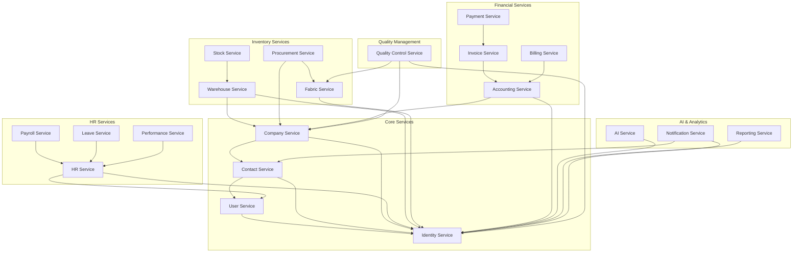

# Architecture Documentation

## 📋 Table of Contents

- [System Architecture](#system-architecture)
- [Common Modules](#common-modules)
- [Microservice Architecture](#microservice-architecture)
- [Clean Architecture Layers](#clean-architecture-layers)
- [Design Patterns](#design-patterns-used)
- [Multi-Tenancy Strategy](#multi-tenancy-strategy)
- [Security Architecture](#security-architecture)
- [Event-Driven Architecture](#event-driven-architecture)
- [Service Communication](#service-communication)
- [Data Management](#data-management)

# Architecture Documentation Hub

## 📋 Overview

Bu klasör, Fabric Management System'in tüm mimari dokümantasyonunu organize eder. Her servis kategorisi için ayrı klasörler ve detaylı dokümantasyonlar bulunur.

## 🏗️ Architecture Structure

```
architecture/
├── README.md                              # Ana mimari dokümantasyonu
├── MICROSERVICE_ARCHITECTURE_OVERVIEW.md  # Tüm servislerin genel bakışı
├── CORE_SERVICES/                         # Temel servisler
│   ├── IDENTITY_SERVICE_ARCHITECTURE.md
│   ├── USER_SERVICE_ARCHITECTURE.md
│   ├── CONTACT_SERVICE_ARCHITECTURE.md
│   └── COMPANY_SERVICE_ARCHITECTURE.md
├── HR_SERVICES/                           # İnsan kaynakları servisleri
├── INVENTORY_SERVICES/                    # Envanter yönetim servisleri
├── FINANCIAL_SERVICES/                    # Mali servisler
├── AI_ANALYTICS_SERVICES/                 # AI ve analitik servisler
└── QUALITY_SERVICES/                      # Kalite yönetim servisleri
    └── QUALITY_CONTROL_SERVICE_ARCHITECTURE.md
```

## 🎯 Service Categories

### 🔧 **Common Modules** (2 Modules)

- **Common Core** - Temel ortak bileşenler (BaseEntity, ApiResponse, GlobalExceptionHandler, Common Exceptions)
- **Common Security** - Güvenlik ortak bileşenleri (JWT, SecurityContext, Authentication)

**📚 Documentation:**

- [Common Modules Approach](../../common/COMMON_MODULES_APPROACH.md) - Over-engineering analizi ve minimalist yaklaşım

### 🏛️ **Core Services** (4 Services)

- **Identity Service** (Port: 8081) ✅
- **User Service** (Port: 8082) ✅
- **Contact Service** (Port: 8083) ✅
- **Company Service** (Port: 8084) ❌

### 👥 **HR Services** (4 Services)

- **HR Service** (Port: 8085) ❌
- **Payroll Service** (Port: 8086) ❌
- **Leave Service** (Port: 8087) ❌
- **Performance Service** (Port: 8088) ❌

### 📦 **Inventory Services** (4 Services)

- **Warehouse Service** (Port: 8089) ❌
- **Stock Service** (Port: 8090) ❌
- **Fabric Service** (Port: 8091) ❌
- **Procurement Service** (Port: 8092) ❌

### 💰 **Financial Services** (4 Services)

- **Accounting Service** (Port: 8093) ❌
- **Invoice Service** (Port: 8094) ❌
- **Payment Service** (Port: 8095) ❌
- **Billing Service** (Port: 8096) ❌

### 🤖 **AI & Analytics Services** (3 Services)

- **AI Service** (Port: 8097) ❌
- **Reporting Service** (Port: 8098) ❌
- **Notification Service** (Port: 8099) ❌

### 🔍 **Quality Services** (1 Service)

- **Quality Control Service** (Port: 8100) ✅

## 📊 Implementation Status

### **Completed Services** ✅ (5/20)

- Identity Service
- User Service
- Contact Service
- Quality Control Service
- Architecture Overview

### **Planned Services** ❌ (15/20)

- Company Service
- HR Services (4)
- Inventory Services (4)
- Financial Services (4)
- AI & Analytics Services (3)

## 🎯 Next Steps

### **Phase 1: Complete Core Services** (Priority: High)

1. Company Service Architecture

### **Phase 2: HR Management Services** (Priority: High)

1. HR Service Architecture
2. Payroll Service Architecture
3. Leave Service Architecture
4. Performance Service Architecture

### **Phase 3: Inventory Management Services** (Priority: High)

1. Warehouse Service Architecture
2. Stock Service Architecture
3. Fabric Service Architecture
4. Procurement Service Architecture

### **Phase 4: Financial Services** (Priority: High)

1. Accounting Service Architecture
2. Invoice Service Architecture
3. Payment Service Architecture
4. Billing Service Architecture

### **Phase 5: AI & Analytics Services** (Priority: Medium)

1. AI Service Architecture
2. Reporting Service Architecture
3. Notification Service Architecture

```mermaid
graph TB
    subgraph "Client Layer"
        WEB[Web Application]
        MOB[Mobile App]
        API[API Clients]
    end

    subgraph "API Gateway Layer"
        GW[Spring Cloud Gateway]
        LB[Load Balancer]
    end

    subgraph "Service Discovery"
        EUR[Eureka Server]
    end

    subgraph "Microservices Layer"
        IS[Identity Service<br/>:8081]
        US[User Service<br/>:8082]
        CS[Contact Service<br/>:8083]
        COS[Company Service<br/>:8084]
        HRS[HR Service<br/>:8085]
        PS[Payroll Service<br/>:8086]
        LS[Leave Service<br/>:8087]
        PMS[Performance Service<br/>:8088]
        WS[Warehouse Service<br/>:8089]
        SS[Stock Service<br/>:8090]
        FS[Fabric Service<br/>:8091]
        PS2[Procurement Service<br/>:8092]
        AS[Accounting Service<br/>:8093]
        IS2[Invoice Service<br/>:8094]
        PS3[Payment Service<br/>:8095]
        BS[Billing Service<br/>:8096]
        AIS[AI Service<br/>:8097]
        RS[Reporting Service<br/>:8098]
        NS[Notification Service<br/>:8099]
        QCS[Quality Control Service<br/>:8100]
    end

    subgraph "Data Layer"
        PG1[(Core DB<br/>PostgreSQL)]
        PG2[(HR DB<br/>PostgreSQL)]
        PG3[(Inventory DB<br/>PostgreSQL)]
        PG4[(Financial DB<br/>PostgreSQL)]
        PG5[(Quality DB<br/>PostgreSQL)]
        REDIS[(Redis Cache)]
        ES[(Elasticsearch)]
    end

    subgraph "Message Broker"
        RMQ[RabbitMQ]
        subgraph "Exchanges"
            UE[User Events]
            CE[Contact Events]
            NE[Notification Events]
        end
    end

    subgraph "Monitoring & Logging"
        PROM[Prometheus]
        GRAF[Grafana]
        ELK[ELK Stack]
        ZIP[Zipkin]
    end

    WEB --> LB
    MOB --> LB
    API --> LB
    LB --> GW
    GW --> US
    GW --> CS
    GW --> AS
    GW --> HS

    US --> EUR
    CS --> EUR
    AS --> EUR
    HS --> EUR

    US --> PG1
    CS --> PG2
    AS --> PG3
    HS --> PG4

    AS --> REDIS
    US --> REDIS

    US --> RMQ
    CS --> RMQ
    AS --> RMQ
    NS --> RMQ

    US --> UE
    CS --> CE
    NS --> NE

    US --> ZIP
    CS --> ZIP
    AS --> ZIP

    US --> PROM
    CS --> PROM
    AS --> PROM
```



### Architecture Principles

- **Microservices**: Each service is independently deployable and scalable
- **Domain-Driven Design**: Business logic drives the design
- **Clean Architecture**: Clear separation of concerns with dependency inversion
- **API-First**: All services expose RESTful APIs
- **Cloud-Native**: Containerized, orchestrated, and cloud-ready
- **Event-Driven**: Asynchronous communication via events

## Microservice Architecture

### 🏗️ Core Services

#### **Identity Service** (Port: 8081)

- **Purpose**: Authentication, authorization, and user identity management
- **Documentation**: [Identity Service Architecture](./IDENTITY_SERVICE_ARCHITECTURE.md)
- **Responsibilities**: JWT token management, user authentication, session management, 2FA

#### **User Service** (Port: 8082)

- **Purpose**: User profile management and user preferences
- **Documentation**: [User Service Architecture](./USER_SERVICE_ARCHITECTURE.md)
- **Responsibilities**: User profiles, preferences, settings, activity tracking

#### **Contact Service** (Port: 8083)

- **Purpose**: Contact information management and verification
- **Documentation**: [Contact Service Architecture](./CONTACT_SERVICE_ARCHITECTURE.md)
- **Responsibilities**: User contacts, company contacts, contact verification, communication preferences

#### **Company Service** (Port: 8084)

- **Purpose**: Company and organization management
- **Documentation**: [Company Service Architecture](./COMPANY_SERVICE_ARCHITECTURE.md)
- **Responsibilities**: Company profiles, company settings, multi-tenant management

### 👥 HR Management Services

#### **HR Service** (Port: 8085)

- **Purpose**: Human resources management
- **Documentation**: [HR Service Architecture](./HR_SERVICE_ARCHITECTURE.md)
- **Responsibilities**: Employee management, department management, HR policies

#### **Payroll Service** (Port: 8086)

- **Purpose**: Payroll processing and salary management
- **Documentation**: [Payroll Service Architecture](./PAYROLL_SERVICE_ARCHITECTURE.md)
- **Responsibilities**: Salary management, payroll processing, tax calculations, benefits

#### **Leave Service** (Port: 8087)

- **Purpose**: Leave management and tracking
- **Documentation**: [Leave Service Architecture](./LEAVE_SERVICE_ARCHITECTURE.md)
- **Responsibilities**: Leave requests, leave balance, approval workflow, holiday management

#### **Performance Service** (Port: 8088)

- **Purpose**: Performance management and reviews
- **Documentation**: [Performance Service Architecture](./PERFORMANCE_SERVICE_ARCHITECTURE.md)
- **Responsibilities**: Performance reviews, goal setting, KPI management, promotions

### 📦 Inventory Management Services

#### **Warehouse Service** (Port: 8089)

- **Purpose**: Warehouse management and operations
- **Documentation**: [Warehouse Service Architecture](./WAREHOUSE_SERVICE_ARCHITECTURE.md)
- **Responsibilities**: Warehouse operations, location management, inventory tracking

#### **Stock Service** (Port: 8090)

- **Purpose**: Stock management and tracking
- **Documentation**: [Stock Service Architecture](./STOCK_SERVICE_ARCHITECTURE.md)
- **Responsibilities**: Stock movements, stock alerts, stock valuation, forecasting

#### **Fabric Service** (Port: 8091)

- **Purpose**: Fabric type and quality management
- **Documentation**: [Fabric Service Architecture](./FABRIC_SERVICE_ARCHITECTURE.md)
- **Responsibilities**: Fabric types, fabric properties, fabric specifications, pricing

#### **Procurement Service** (Port: 8092)

- **Purpose**: Procurement and supplier management
- **Documentation**: [Procurement Service Architecture](./PROCUREMENT_SERVICE_ARCHITECTURE.md)
- **Responsibilities**: Purchase orders, supplier management, procurement workflow

### 💰 Financial Services

#### **Accounting Service** (Port: 8093)

- **Purpose**: Accounting and financial management
- **Documentation**: [Accounting Service Architecture](./ACCOUNTING_SERVICE_ARCHITECTURE.md)
- **Responsibilities**: General ledger, chart of accounts, financial reports, budgeting

#### **Invoice Service** (Port: 8094)

- **Purpose**: Invoice management and processing
- **Documentation**: [Invoice Service Architecture](./INVOICE_SERVICE_ARCHITECTURE.md)
- **Responsibilities**: Invoice generation, invoice management, invoice approval

#### **Payment Service** (Port: 8095)

- **Purpose**: Payment processing and management
- **Documentation**: [Payment Service Architecture](./PAYMENT_SERVICE_ARCHITECTURE.md)
- **Responsibilities**: Payment processing, payment methods, payment gateway integration

#### **Billing Service** (Port: 8096)

- **Purpose**: Billing management and automation
- **Documentation**: [Billing Service Architecture](./BILLING_SERVICE_ARCHITECTURE.md)
- **Responsibilities**: Billing cycles, billing rules, billing automation

### 🤖 AI & Analytics Services

#### **AI Service** (Port: 8097)

- **Purpose**: AI integration and machine learning
- **Documentation**: [AI Service Architecture](./AI_SERVICE_ARCHITECTURE.md)
- **Responsibilities**: ChatGPT integration, AI analytics, predictive analytics, ML models

#### **Reporting Service** (Port: 8098)

- **Purpose**: Reporting and data visualization
- **Documentation**: [Reporting Service Architecture](./REPORTING_SERVICE_ARCHITECTURE.md)
- **Responsibilities**: Report generation, dashboards, data visualization, custom reports

#### **Notification Service** (Port: 8099)

- **Purpose**: Notification management and delivery
- **Documentation**: [Notification Service Architecture](./NOTIFICATION_SERVICE_ARCHITECTURE.md)
- **Responsibilities**: Email notifications, SMS notifications, push notifications

### 🔍 Quality Management Services

#### **Quality Control Service** (Port: 8100)

- **Purpose**: Quality control and defect management
- **Documentation**: [Quality Control Service Architecture](./QUALITY_CONTROL_SERVICE_ARCHITECTURE.md)
- **Responsibilities**: Fabric quality control, defect management, supplier performance analysis

### 📊 Service Dependencies



## Clean Architecture Layers

### 🎯 Domain Layer (Core/Innermost)

The heart of the application containing pure business logic.

**Characteristics:**

- Zero framework dependencies
- Pure Java/business logic
- Highly testable
- Stable and rarely changes

**Components:**

```
domain/
├── model/
│   ├── entities/       # Business entities
│   ├── valueobjects/   # Value objects (immutable)
│   └── aggregates/     # Aggregate roots
├── events/             # Domain events
├── exceptions/         # Business exceptions
├── services/           # Domain services
└── repository/         # Repository interfaces (ports)
```

**Example:**

```java
// Entity
@Entity
public class User extends BaseEntity {
    private UserId id;
    private Username username;
    private PersonName name;
    private TenantId tenantId;

    // Business logic methods
    public void changeUsername(Username newUsername) {
        // Business rules validation
        this.username = newUsername;
        registerEvent(new UsernameChangedEvent(id, username));
    }
}

// Value Object
@ValueObject
public class Username {
    private final String value;

    public Username(String value) {
        validate(value);
        this.value = value;
    }
}
```

### 🔧 Application Layer

Orchestrates the use cases of the application.

**Characteristics:**

- Implements use cases
- Coordinates domain objects
- Manages transactions
- No business logic

**Components:**

```
application/
├── usecases/          # Use case implementations
├── dto/               # Data Transfer Objects
├── ports/             # Port interfaces
│   ├── input/        # Input ports (use cases)
│   └── output/       # Output ports (adapters)
├── mappers/          # DTO-Entity mappers
└── services/         # Application services
```

**Example:**

```java
@UseCase
@Transactional
public class CreateUserUseCase implements CreateUserInputPort {
    private final UserRepository userRepository;
    private final UserMapper mapper;
    private final EventPublisher eventPublisher;

    public UserDto execute(CreateUserCommand command) {
        // Validate command
        // Create domain entity
        User user = User.create(command);
        // Save via repository
        User saved = userRepository.save(user);
        // Publish events
        eventPublisher.publish(user.getDomainEvents());
        // Return DTO
        return mapper.toDto(saved);
    }
}
```

### 🏗️ Infrastructure Layer

Technical implementations and framework-specific code.

**Characteristics:**

- Framework dependencies
- External service integrations
- Database implementations
- Messaging implementations

**Components:**

```
infrastructure/
├── persistence/       # JPA/Database implementations
│   ├── entities/     # JPA entities
│   ├── repositories/ # Repository implementations
│   └── config/       # Database configuration
├── messaging/        # Message queue implementations
├── external/         # External service clients
├── security/         # Security implementations
└── config/          # Framework configurations
```

**Example:**

```java
@Repository
public class JpaUserRepository implements UserRepository {
    private final JpaUserEntityRepository jpaRepository;
    private final UserEntityMapper mapper;

    @Override
    public User save(User user) {
        UserEntity entity = mapper.toEntity(user);
        UserEntity saved = jpaRepository.save(entity);
        return mapper.toDomain(saved);
    }
}
```

### 🌐 Presentation Layer (Outermost)

Handles external communication and user interfaces.

**Characteristics:**

- REST controllers
- GraphQL resolvers
- WebSocket handlers
- API documentation

**Components:**

```
presentation/
├── rest/             # REST controllers
│   ├── controllers/  # Controller classes
│   ├── models/       # Request/Response models
│   └── validators/   # Input validators
├── graphql/          # GraphQL resolvers (if used)
├── websocket/        # WebSocket handlers
├── filters/          # HTTP filters
└── handlers/         # Exception handlers
```

**Example:**

```java
@RestController
@RequestMapping("/api/v1/users")
public class UserController {
    private final CreateUserInputPort createUserUseCase;

    @PostMapping
    @ResponseStatus(HttpStatus.CREATED)
    public ResponseEntity<UserResponse> createUser(
            @Valid @RequestBody CreateUserRequest request,
            @RequestHeader("X-Tenant-ID") String tenantId) {

        CreateUserCommand command = toCommand(request, tenantId);
        UserDto user = createUserUseCase.execute(command);
        return ResponseEntity.created(location(user))
                           .body(toResponse(user));
    }
}
```

## Design Patterns Used

### 1. Domain-Driven Design (DDD)

**Aggregates**

```java
@Aggregate
public class UserAggregate {
    private User root;
    private List<Contact> contacts;
    private List<Permission> permissions;

    // Aggregate operations ensure consistency
    public void addContact(Contact contact) {
        validateContact(contact);
        contacts.add(contact);
        root.incrementContactCount();
    }
}
```

**Value Objects**

```java
@ValueObject
@Immutable
public class Email {
    private final String value;

    public Email(String value) {
        if (!isValid(value)) {
            throw new InvalidEmailException(value);
        }
        this.value = value;
    }
}
```

**Domain Events**

```java
@DomainEvent
public class UserCreatedEvent {
    private final UserId userId;
    private final Username username;
    private final Instant occurredOn;
}
```

**Repository Pattern**

```java
public interface UserRepository {
    User findById(UserId id);
    User save(User user);
    void delete(UserId id);
    Page<User> findAll(Pageable pageable);
}
```

### 2. Hexagonal Architecture (Ports & Adapters)

```java
// Input Port (Use Case Interface)
public interface CreateUserInputPort {
    UserDto execute(CreateUserCommand command);
}

// Output Port (Infrastructure Interface)
public interface UserOutputPort {
    User save(User user);
    Optional<User> findById(UserId id);
}

// Adapter (Implementation)
@Adapter
public class PostgresUserAdapter implements UserOutputPort {
    // PostgreSQL specific implementation
}
```

### 3. CQRS (Command Query Responsibility Segregation)

```java
// Command Side
@Command
public class CreateUserCommand {
    private String username;
    private String firstName;
    private String lastName;
}

// Query Side
@Query
public class GetUserByIdQuery {
    private UUID userId;
}

// Command Handler
@CommandHandler
public class CreateUserCommandHandler {
    public void handle(CreateUserCommand command) {
        // Write operation logic
    }
}

// Query Handler
@QueryHandler
public class GetUserQueryHandler {
    public UserDto handle(GetUserByIdQuery query) {
        // Read operation logic
    }
}
```

### 4. Factory Pattern

```java
@Component
public class UserFactory {
    public User createUser(CreateUserCommand command) {
        return User.builder()
            .id(UserId.generate())
            .username(new Username(command.getUsername()))
            .name(new PersonName(command.getFirstName(), command.getLastName()))
            .tenantId(new TenantId(command.getTenantId()))
            .build();
    }
}
```

### 5. Strategy Pattern

```java
public interface ValidationStrategy {
    boolean validate(User user);
}

@Component
public class EmailValidationStrategy implements ValidationStrategy {
    public boolean validate(User user) {
        return EmailValidator.isValid(user.getEmail());
    }
}
```

### 6. Observer Pattern (Event-Driven)

```java
@EventListener
public class UserEventListener {
    @Async
    @TransactionalEventListener
    public void handleUserCreated(UserCreatedEvent event) {
        // React to user creation
        notificationService.sendWelcomeEmail(event.getUserId());
    }
}
```

## Multi-Tenancy Strategy

### Database Per Tenant vs Shared Database

We use **Shared Database with Row-Level Security**:

```java
@Entity
@Where(clause = "deleted = false")
@FilterDef(name = "tenantFilter", parameters = @ParamDef(name = "tenantId", type = "string"))
@Filter(name = "tenantFilter", condition = "tenant_id = :tenantId")
public abstract class BaseEntity {
    @Column(name = "tenant_id", nullable = false)
    private String tenantId;
}
```

### Tenant Context Propagation

```java
@Component
public class TenantContext {
    private static final ThreadLocal<String> CURRENT_TENANT = new ThreadLocal<>();

    public static void setTenantId(String tenantId) {
        CURRENT_TENANT.set(tenantId);
    }

    public static String getTenantId() {
        return CURRENT_TENANT.get();
    }

    public static void clear() {
        CURRENT_TENANT.remove();
    }
}
```

### Tenant Interceptor

```java
@Component
public class TenantInterceptor implements HandlerInterceptor {
    @Override
    public boolean preHandle(HttpServletRequest request,
                           HttpServletResponse response,
                           Object handler) {
        String tenantId = request.getHeader("X-Tenant-ID");
        if (tenantId != null) {
            TenantContext.setTenantId(tenantId);
        }
        return true;
    }

    @Override
    public void afterCompletion(HttpServletRequest request,
                              HttpServletResponse response,
                              Object handler,
                              Exception ex) {
        TenantContext.clear();
    }
}
```

## Security Architecture

### Authentication & Authorization

```yaml
Authentication Flow:
1. Client → Auth Service (credentials)
2. Auth Service → Validate & Generate JWT
3. Client → API Gateway (with JWT)
4. API Gateway → Validate JWT
5. API Gateway → Microservice (with user context)
```

### JWT Token Structure

```json
{
  "sub": "user-id",
  "username": "johndoe",
  "tenantId": "tenant-123",
  "roles": ["USER", "ADMIN"],
  "permissions": ["READ_USER", "WRITE_USER"],
  "exp": 1634567890,
  "iat": 1634564290
}
```

### Security Configuration

```java
@Configuration
@EnableWebSecurity
public class SecurityConfig {

    @Bean
    public SecurityFilterChain filterChain(HttpSecurity http) {
        return http
            .cors().and()
            .csrf().disable()
            .sessionManagement()
                .sessionCreationPolicy(SessionCreationPolicy.STATELESS)
            .and()
            .authorizeHttpRequests()
                .requestMatchers("/api/public/**").permitAll()
                .requestMatchers("/api/admin/**").hasRole("ADMIN")
                .anyRequest().authenticated()
            .and()
            .addFilterBefore(jwtAuthFilter, UsernamePasswordAuthenticationFilter.class)
            .build();
    }
}
```

### Rate Limiting

```java
@Component
public class RateLimitInterceptor implements HandlerInterceptor {
    private final RateLimiter rateLimiter = RateLimiter.create(100.0); // 100 requests per second

    @Override
    public boolean preHandle(HttpServletRequest request,
                           HttpServletResponse response,
                           Object handler) {
        if (!rateLimiter.tryAcquire()) {
            response.setStatus(HttpStatus.TOO_MANY_REQUESTS.value());
            return false;
        }
        return true;
    }
}
```

## Event-Driven Architecture

### Domain Events

```java
@Component
public class DomainEventPublisher {
    private final ApplicationEventPublisher eventPublisher;

    public void publish(DomainEvent event) {
        eventPublisher.publishEvent(event);
    }
}
```

### Message Queue Configuration

```yaml
spring:
  rabbitmq:
    host: localhost
    port: 5672
    username: guest
    password: guest
    virtual-host: /
```

### Event Handling

```java
@Component
public class EventHandler {

    @RabbitListener(queues = "user-events")
    public void handleUserEvent(UserEvent event) {
        switch (event.getType()) {
            case USER_CREATED:
                handleUserCreated(event);
                break;
            case USER_UPDATED:
                handleUserUpdated(event);
                break;
        }
    }
}
```

### Event Sourcing (Future)

```java
@Entity
public class EventStore {
    @Id
    private UUID id;
    private String aggregateId;
    private String eventType;
    private String eventData;
    private Instant occurredOn;
    private Long version;
}
```

## Service Communication

### Synchronous Communication (REST)

```java
@FeignClient(name = "user-service")
public interface UserServiceClient {
    @GetMapping("/api/v1/users/{id}")
    UserDto getUser(@PathVariable("id") UUID id);
}
```

### Asynchronous Communication (Events)

```java
@Configuration
public class RabbitMQConfig {

    @Bean
    public TopicExchange userExchange() {
        return new TopicExchange("user-events");
    }

    @Bean
    public Queue userCreatedQueue() {
        return new Queue("user-created", true);
    }

    @Bean
    public Binding userCreatedBinding() {
        return BindingBuilder
            .bind(userCreatedQueue())
            .to(userExchange())
            .with("user.created");
    }
}
```

## Data Management

### Database Per Service

Each microservice has its own database:

| Service         | Database   | Type          | Purpose             |
| --------------- | ---------- | ------------- | ------------------- |
| User Service    | user_db    | PostgreSQL    | User management     |
| Contact Service | contact_db | PostgreSQL    | Contact information |
| Auth Service    | auth_db    | PostgreSQL    | Authentication data |
| HR Service      | hr_db      | PostgreSQL    | HR management       |
| Session Cache   | -          | Redis         | Session management  |
| Search          | -          | Elasticsearch | Full-text search    |

### Data Consistency

**Eventual Consistency** through:

- Domain Events
- Saga Pattern (for distributed transactions)
- Event Sourcing (future implementation)

### Database Migration

Using Flyway for version control:

```sql
-- V1__Create_user_table.sql
CREATE TABLE users (
    id UUID PRIMARY KEY,
    tenant_id UUID NOT NULL,
    username VARCHAR(50) NOT NULL,
    first_name VARCHAR(100),
    last_name VARCHAR(100),
    created_at TIMESTAMP NOT NULL,
    updated_at TIMESTAMP,
    deleted BOOLEAN DEFAULT FALSE,
    UNIQUE(tenant_id, username)
);

CREATE INDEX idx_users_tenant_id ON users(tenant_id);
CREATE INDEX idx_users_username ON users(username);
```

## Performance Considerations

### Caching Strategy

```java
@Cacheable(value = "users", key = "#id")
public User findById(UUID id) {
    return userRepository.findById(id);
}

@CacheEvict(value = "users", key = "#user.id")
public User update(User user) {
    return userRepository.save(user);
}
```

### Database Optimization

- Connection pooling (HikariCP)
- Query optimization
- Proper indexing
- Read replicas for queries

### API Gateway Features

- Request routing
- Load balancing
- Circuit breaker
- Rate limiting
- Response caching
- Request/Response transformation

## Monitoring & Observability

### Metrics (Prometheus)

```java
@RestController
public class MetricsController {
    private final MeterRegistry meterRegistry;

    @GetMapping("/api/users")
    @Timed(value = "users.get.all", description = "Time taken to fetch all users")
    public List<User> getUsers() {
        return userService.findAll();
    }
}
```

### Distributed Tracing (Zipkin)

```yaml
spring:
  sleuth:
    sampler:
      probability: 1.0
  zipkin:
    base-url: http://localhost:9411
```

### Logging (ELK Stack)

```java
@Slf4j
@Service
public class UserService {
    public User createUser(CreateUserCommand command) {
        log.info("Creating user with username: {}", command.getUsername());
        try {
            User user = userFactory.create(command);
            User saved = userRepository.save(user);
            log.info("User created successfully with id: {}", saved.getId());
            return saved;
        } catch (Exception e) {
            log.error("Failed to create user", e);
            throw e;
        }
    }
}
```

## Deployment Architecture

### Container Orchestration (Kubernetes)

```yaml
apiVersion: apps/v1
kind: Deployment
metadata:
  name: user-service
spec:
  replicas: 3
  selector:
    matchLabels:
      app: user-service
  template:
    metadata:
      labels:
        app: user-service
    spec:
      containers:
        - name: user-service
          image: fabric-system/user-service:latest
          ports:
            - containerPort: 8081
          env:
            - name: SPRING_PROFILES_ACTIVE
              value: "prod"
```

## Future Enhancements

- [ ] GraphQL API support
- [ ] WebSocket for real-time updates
- [ ] SAGA pattern for distributed transactions
- [ ] Event Sourcing implementation
- [ ] GDPR compliance features
- [ ] Multi-region deployment
- [ ] Service mesh (Istio)
- [ ] Serverless functions for specific tasks

---

**Last Updated:** January 2025  
**Version:** 1.0.0  
**Authors:** Architecture Team
