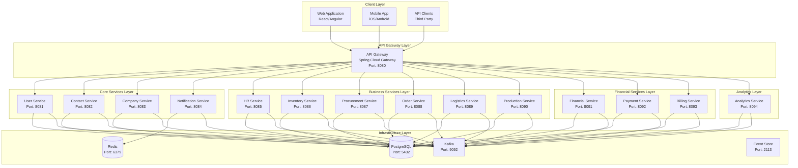

# 🏗️ System Architecture

## 📋 Overview

The Fabric Management System follows modern microservice architecture principles with Domain-Driven Design (DDD), Clean Architecture, and Event-Driven patterns. This document provides a comprehensive overview of the system architecture, design decisions, and implementation patterns.

## 🎯 Architecture Principles

### Core Principles

1. **Domain-Driven Design (DDD)** - Business logic organized around domain concepts
2. **Clean Architecture** - Separation of concerns with clear boundaries
3. **Event-Driven Architecture** - Loose coupling through events
4. **CQRS Pattern** - Command Query Responsibility Segregation
5. **Microservice Architecture** - Independent, scalable services
6. **Multi-tenancy** - Isolated tenant data and configurations

### Design Goals

- **Scalability** - Handle millions of requests
- **Reliability** - Fault-tolerant and resilient
- **Maintainability** - Easy to understand and modify
- **Performance** - Optimized for speed and efficiency
- **Security** - Enterprise-grade security
- **Observability** - Full monitoring and tracing

## 🏗️ System Architecture

### High-Level Architecture

## 🎯 Service Architecture

### Service Design Pattern

Each microservice follows the **Clean Architecture** pattern with clear separation of concerns:

### Service Responsibilities

#### Core Services

| Service                  | Port | Responsibilities                                  |
| ------------------------ | ---- | ------------------------------------------------- |
| **User Service**         | 8081 | Authentication, user profiles, session management |
| **Contact Service**      | 8082 | Contact information, communication preferences    |
| **Company Service**      | 8083 | Company management, multi-tenancy                 |
| **Notification Service** | 8084 | Email, SMS, push notifications                    |

#### Business Services

| Service                 | Port | Responsibilities                           |
| ----------------------- | ---- | ------------------------------------------ |
| **HR Service**          | 8085 | Human resources, payroll, leave management |
| **Inventory Service**   | 8086 | Stock management, product catalog, pricing |
| **Procurement Service** | 8087 | Purchase orders, supplier management       |
| **Order Service**       | 8088 | Order processing, fulfillment              |
| **Logistics Service**   | 8089 | Shipping, delivery tracking                |
| **Production Service**  | 8090 | Manufacturing, production planning         |

#### Financial Services

| Service               | Port | Responsibilities              |
| --------------------- | ---- | ----------------------------- |
| **Financial Service** | 8091 | Accounting, financial records |
| **Payment Service**   | 8092 | Payment processing, gateways  |
| **Billing Service**   | 8093 | Billing management, invoicing |

#### Analytics Service

| Service               | Port | Responsibilities                              |
| --------------------- | ---- | --------------------------------------------- |
| **Analytics Service** | 8094 | Business intelligence, reporting, AI insights |

## 🔄 Data Flow Architecture

### Event-Driven Communication

### CQRS Pattern Implementation

## 🛡️ Security Architecture

### Authentication & Authorization

### Security Layers

1. **API Gateway** - Rate limiting, authentication
2. **JWT Tokens** - Stateless authentication
3. **RBAC** - Role-based access control
4. **OAuth2** - External authentication
5. **Audit Logging** - Security event tracking

## 📊 Observability Architecture

### Monitoring Stack

## 🚀 Deployment Architecture

### Container Orchestration

## 🔧 Technology Decisions

### Why These Technologies?

| Technology            | Purpose          | Justification                        |
| --------------------- | ---------------- | ------------------------------------ |
| **Java 21**           | Runtime          | Latest LTS, performance improvements |
| **Spring Boot 3.5.5** | Framework        | Mature, ecosystem, community         |
| **PostgreSQL 16**     | Database         | ACID compliance, JSON support        |
| **Redis 7**           | Cache            | High performance, data structures    |
| **Kafka 3.5.1**       | Messaging        | High throughput, durability          |
| **Docker**            | Containerization | Portability, consistency             |
| **Kubernetes**        | Orchestration    | Scalability, self-healing            |

## 📈 Scalability Considerations

### Horizontal Scaling

- **Stateless Services** - Easy horizontal scaling
- **Database Sharding** - Tenant-based sharding
- **Caching Strategy** - Multi-level caching
- **Load Balancing** - Round-robin, least connections

### Performance Optimization

- **Connection Pooling** - Database connections
- **Async Processing** - Non-blocking operations
- **CQRS** - Read/write optimization
- **Event Sourcing** - Audit trail, replay capability

## 🔮 Future Considerations

### Planned Enhancements

1. **GraphQL API** - Flexible data querying
2. **gRPC** - High-performance service communication
3. **Service Mesh** - Istio integration
4. **AI/ML Integration** - Predictive analytics
5. **Edge Computing** - CDN integration

### Migration Strategy

- **Gradual Migration** - Service by service
- **Blue-Green Deployment** - Zero downtime
- **Feature Flags** - Controlled rollouts
- **A/B Testing** - Performance validation

---

## 📚 Related Documentation

- [API Documentation](../api/) - REST API specifications
- [Development Guide](../development/) - Setup and coding standards
- [Deployment Guide](../deployment/) - Production deployment
- [Testing Guide](../testing/) - Testing strategies

---

_Last updated: 2024-01-XX_
_Version: 1.0.0_
