# Fabric Management System - Service Relationships & Data Flow

## 🔄 Service Communication Patterns

Bu diagram, servisler arası iletişim kalıplarını ve veri akışını gösterir.

```mermaid
graph TB
    subgraph "Authentication Layer"
        AUTH[Identity Service<br/>🔐 Port: 8081<br/>✅ Complete]
    end

    subgraph "Core Business Layer"
        USER[User Service<br/>👤 Port: 8082<br/>✅ Complete]
        CONTACT[Contact Service<br/>📞 Port: 8083<br/>✅ Complete]
        COMPANY[Company Service<br/>🏢 Port: 8084<br/>✅ Complete]
    end

    subgraph "HR Management Layer"
        HR[HR Service<br/>👥 Port: 8085<br/>❌ Missing]
        PAYROLL[Payroll Service<br/>💰 Port: 8086<br/>❌ Missing]
        LEAVE[Leave Service<br/>🏖️ Port: 8087<br/>❌ Missing]
        PERFORMANCE[Performance Service<br/>📊 Port: 8088<br/>❌ Missing]
    end

    subgraph "Inventory Management Layer"
        INVENTORY[Inventory Service<br/>📦 Port: 8089<br/>❌ Missing]
        CATALOG[Catalog Service<br/>📋 Port: 8090<br/>❌ Missing]
        PRICING[Pricing Service<br/>💲 Port: 8091<br/>❌ Missing]
        PROCUREMENT[Procurement Service<br/>🛒 Port: 8092<br/>❌ Missing]
        QUALITY[Quality Control<br/>🔍 Port: 8093<br/>❌ Missing]
    end

    subgraph "Order Processing Layer"
        ORDER[Order Service<br/>📋 Port: 8094<br/>❌ Missing]
        LOGISTICS[Logistics Service<br/>🚚 Port: 8095<br/>❌ Missing]
        PRODUCTION[Production Service<br/>🏭 Port: 8096<br/>❌ Missing]
    end

    subgraph "Financial Layer"
        ACCOUNTING[Accounting Service<br/>📊 Port: 8097<br/>❌ Missing]
        INVOICE[Invoice Service<br/>🧾 Port: 8098<br/>❌ Missing]
        PAYMENT[Payment Service<br/>💳 Port: 8099<br/>❌ Missing]
        BILLING[Billing Service<br/>💸 Port: 8100<br/>❌ Missing]
    end

    subgraph "Analytics & Support Layer"
        AI[AI Service<br/>🤖 Port: 8101<br/>❌ Missing]
        REPORTING[Reporting Service<br/>📈 Port: 8102<br/>❌ Missing]
        NOTIFICATION[Notification Service<br/>📧 Port: 8103<br/>❌ Missing]
    end

    subgraph "Infrastructure Layer"
        DB[(PostgreSQL<br/>Port: 5433)]
        CACHE[(Redis<br/>Port: 6379)]
        MSG[Kafka<br/>Port: 9092]
    end

    %% Authentication flows
    AUTH -.->|JWT Tokens| USER
    AUTH -.->|JWT Tokens| CONTACT
    AUTH -.->|JWT Tokens| COMPANY
    AUTH -.->|JWT Tokens| HR
    AUTH -.->|JWT Tokens| INVENTORY
    AUTH -.->|JWT Tokens| ORDER
    AUTH -.->|JWT Tokens| ACCOUNTING
    AUTH -.->|JWT Tokens| AI

    %% Core business flows
    USER -->|User Data| HR
    USER -->|User Data| LEAVE
    USER -->|User Data| PERFORMANCE
    USER -->|User Data| REPORTING

    CONTACT -->|Contact Info| COMPANY
    CONTACT -->|Contact Info| PROCUREMENT
    CONTACT -->|Contact Info| NOTIFICATION

    COMPANY -->|Company Data| HR
    COMPANY -->|Company Data| INVENTORY
    COMPANY -->|Company Data| PROCUREMENT
    COMPANY -->|Company Data| ACCOUNTING
    COMPANY -->|Company Data| QUALITY

    %% HR management flows
    HR -->|Employee Data| PAYROLL
    HR -->|Employee Data| LEAVE
    HR -->|Employee Data| PERFORMANCE
    HR -->|HR Reports| REPORTING

    PAYROLL -->|Payroll Data| ACCOUNTING
    PAYROLL -->|Payroll Notifications| NOTIFICATION
    PAYROLL -->|Payroll Reports| REPORTING

    LEAVE -->|Leave Data| PERFORMANCE
    LEAVE -->|Leave Reports| REPORTING

    PERFORMANCE -->|Performance Data| AI
    PERFORMANCE -->|Performance Reports| REPORTING

    %% Inventory management flows
    INVENTORY -->|Stock Data| ORDER
    INVENTORY -->|Stock Data| PRODUCTION
    INVENTORY -->|Stock Data| ACCOUNTING
    INVENTORY -->|Stock Reports| REPORTING

    CATALOG -->|Product Data| ORDER
    CATALOG -->|Product Data| PRICING

    PRICING -->|Price Data| ORDER
    PRICING -->|Price Data| ACCOUNTING

    PROCUREMENT -->|Purchase Orders| INVOICE
    PROCUREMENT -->|Purchase Data| ACCOUNTING
    PROCUREMENT -->|Quality Data| QUALITY

    QUALITY -->|Quality Data| AI
    QUALITY -->|Quality Reports| REPORTING
    QUALITY -->|Quality Alerts| NOTIFICATION

    %% Order processing flows
    ORDER -->|Order Data| LOGISTICS
    ORDER -->|Order Data| PRODUCTION
    ORDER -->|Order Data| ACCOUNTING

    LOGISTICS -->|Shipping Data| PRODUCTION
    LOGISTICS -->|Shipping Data| ACCOUNTING
    LOGISTICS -->|Shipping Reports| REPORTING

    PRODUCTION -->|Production Data| ACCOUNTING
    PRODUCTION -->|Production Data| QUALITY
    PRODUCTION -->|Production Reports| REPORTING

    %% Financial flows
    ACCOUNTING -->|Accounting Data| INVOICE
    ACCOUNTING -->|Accounting Data| PAYMENT
    ACCOUNTING -->|Accounting Data| BILLING
    ACCOUNTING -->|Financial Reports| REPORTING

    INVOICE -->|Invoice Data| PAYMENT
    INVOICE -->|Invoice Data| BILLING
    INVOICE -->|Invoice Reports| REPORTING

    PAYMENT -->|Payment Data| BILLING
    PAYMENT -->|Payment Data| ACCOUNTING
    PAYMENT -->|Payment Notifications| NOTIFICATION
    PAYMENT -->|Payment Reports| REPORTING

    BILLING -->|Billing Data| ACCOUNTING
    BILLING -->|Billing Reports| REPORTING
    BILLING -->|Billing Notifications| NOTIFICATION

    %% Analytics flows
    AI -->|AI Insights| REPORTING
    AI -->|AI Notifications| NOTIFICATION

    REPORTING -->|Report Notifications| NOTIFICATION

    NOTIFICATION -->|Notifications| USER
    NOTIFICATION -->|Notifications| CONTACT

    %% Infrastructure connections
    AUTH --> DB
    AUTH --> CACHE
    AUTH --> MSG

    USER --> DB
    USER --> CACHE
    USER --> MSG

    CONTACT --> DB
    CONTACT --> CACHE
    CONTACT --> MSG

    COMPANY --> DB
    COMPANY --> CACHE
    COMPANY --> MSG

    %% Event flows (Kafka)
    USER -.->|User Events| MSG
    CONTACT -.->|Contact Events| MSG
    COMPANY -.->|Company Events| MSG
    HR -.->|HR Events| MSG
    ORDER -.->|Order Events| MSG
    PAYMENT -.->|Payment Events| MSG

    MSG -.->|Event Processing| NOTIFICATION
    MSG -.->|Event Processing| REPORTING
    MSG -.->|Event Processing| AI

    %% Styling
    classDef completed fill:#d4edda,stroke:#155724,stroke-width:3px,color:#155724
    classDef missing fill:#f8d7da,stroke:#721c24,stroke-width:2px,color:#721c24
    classDef infrastructure fill:#d1ecf1,stroke:#0c5460,stroke-width:2px,color:#0c5460
    classDef auth fill:#fff3cd,stroke:#856404,stroke-width:3px,color:#856404

    class AUTH auth
    class USER,CONTACT,COMPANY completed
    class HR,PAYROLL,LEAVE,PERFORMANCE,INVENTORY,CATALOG,PRICING,PROCUREMENT,QUALITY,ORDER,LOGISTICS,PRODUCTION,ACCOUNTING,INVOICE,PAYMENT,BILLING,AI,REPORTING,NOTIFICATION missing
    class DB,CACHE,MSG infrastructure
```



## 📊 Communication Patterns

### **1. Synchronous Communication (REST API)**

- **Direct Service Calls**: Service-to-service HTTP calls
- **Authentication**: JWT token validation
- **Data Exchange**: Real-time data requests/responses

### **2. Asynchronous Communication (Event-Driven)**

- **Event Publishing**: Services publish domain events
- **Event Consumption**: Services subscribe to relevant events
- **Message Broker**: Kafka for reliable message delivery

### **3. Data Flow Patterns**

#### **Authentication Flow**

```
Client → Identity Service → JWT Token → All Services
```

#### **User Management Flow**

```
User Service → HR Service → Payroll Service → Accounting Service
```

#### **Order Processing Flow**

```
Order Service → Inventory Service → Logistics Service → Production Service
```

#### **Financial Flow**

```
Accounting Service → Invoice Service → Payment Service → Billing Service
```

## 🔄 Event-Driven Architecture

### **Domain Events**

- **UserCreatedEvent**: Published by User Service
- **CompanyUpdatedEvent**: Published by Company Service
- **OrderPlacedEvent**: Published by Order Service
- **PaymentProcessedEvent**: Published by Payment Service

### **Event Handlers**

- **Notification Service**: Handles all notification events
- **Reporting Service**: Processes all reporting events
- **AI Service**: Analyzes performance and quality events

## 📈 Service Dependencies Analysis

### **High Dependency Services**

1. **Identity Service**: 24 dependencies (all services)
2. **Company Service**: 15 dependencies
3. **User Service**: 8 dependencies
4. **Accounting Service**: 6 dependencies

### **Medium Dependency Services**

1. **Notification Service**: 8 dependencies
2. **Reporting Service**: 7 dependencies
3. **Inventory Service**: 5 dependencies

### **Low Dependency Services**

1. **AI Service**: 2 dependencies
2. **Quality Control Service**: 3 dependencies
3. **Billing Service**: 2 dependencies

## 🎯 Implementation Strategy

### **Phase 1: Foundation (Weeks 1-2)**

1. Fix port conflicts
2. Implement API Gateway
3. Add monitoring infrastructure

### **Phase 2: Core Services (Weeks 3-6)**

1. HR Services (4 services)
2. Inventory Services (5 services)
3. Order & Logistics (2 services)

### **Phase 3: Business Services (Weeks 7-10)**

1. Production Service
2. Financial Services (4 services)
3. AI & Analytics (3 services)

### **Phase 4: Enterprise Features (Weeks 11-12)**

1. Advanced monitoring
2. CI/CD pipeline
3. Kubernetes deployment

---

**Last Updated**: 2024-01-XX  
**Version**: 1.0.0  
**Architecture**: Microservices with Event-Driven Communication
