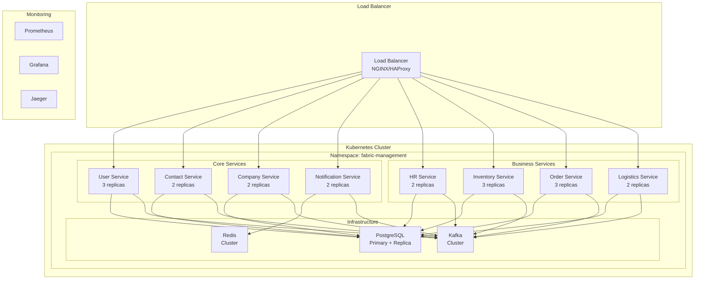

# 🚀 Deployment Guide

## 📋 Overview

This guide provides comprehensive instructions for deploying the Fabric Management System across different environments. We support multiple deployment strategies including Docker, Kubernetes, and cloud-native solutions.

## 🎯 Deployment Strategies

### Supported Environments

| Environment    | Purpose     | Infrastructure     |
| -------------- | ----------- | ------------------ |
| **Local**      | Development | Docker Compose     |
| **Staging**    | Testing     | Kubernetes         |
| **Production** | Live System | Kubernetes + Cloud |

### Deployment Architecture



## 🐳 Docker Deployment

### Prerequisites

- Docker 24.0+
- Docker Compose 2.0+
- 8GB RAM minimum
- 50GB disk space

### Local Development

1. **Clone and setup**:

```bash
git clone https://github.com/your-org/fabric-management-backend.git
cd fabric-management-backend
```

2. **Start infrastructure**:

```bash
docker-compose up -d postgres-db redis kafka
```

3. **Build and start services**:

```bash
docker-compose up -d --build
```

4. **Verify deployment**:

```bash
docker-compose ps
curl http://localhost:8080/actuator/health
```

### Production Docker

1. **Environment configuration**:

```bash
# .env.prod
POSTGRES_PASSWORD=secure_password_here
REDIS_PASSWORD=redis_password_here
JWT_SECRET=your_jwt_secret_here
SPRING_PROFILES_ACTIVE=prod
```

2. **Start production stack**:

```bash
docker-compose -f docker-compose.yml -f docker-compose.prod.yml up -d
```

## ☸️ Kubernetes Deployment

### Prerequisites

- Kubernetes 1.29+
- Helm 3.14+
- kubectl configured
- Persistent storage provisioner

### Cluster Setup

1. **Create namespace**:

```bash
kubectl create namespace fabric-management
kubectl config set-context --current --namespace=fabric-management
```

2. **Install infrastructure**:

```bash
# PostgreSQL
helm install postgresql bitnami/postgresql \
  --set auth.postgresPassword=secure_password \
  --set auth.database=fabric_management

# Redis
helm install redis bitnami/redis \
  --set auth.password=redis_password

# Kafka
helm install kafka bitnami/kafka \
  --set auth.clientProtocol=sasl \
  --set auth.interBrokerProtocol=sasl
```

### Service Deployment

1. **Deploy core services**:

```bash
# User Service
kubectl apply -f deployment/kubernetes/services/user-service.yaml

# Contact Service
kubectl apply -f deployment/kubernetes/services/contact-service.yaml

# Company Service
kubectl apply -f deployment/kubernetes/services/company-service.yaml

# Notification Service
kubectl apply -f deployment/kubernetes/services/notification-service.yaml
```

2. **Deploy business services**:

```bash
# HR Service
kubectl apply -f deployment/kubernetes/services/hr-service.yaml

# Inventory Service
kubectl apply -f deployment/kubernetes/services/inventory-service.yaml

# Order Service
kubectl apply -f deployment/kubernetes/services/order-service.yaml

# Logistics Service
kubectl apply -f deployment/kubernetes/services/logistics-service.yaml
```

3. **Deploy API Gateway**:

```bash
kubectl apply -f deployment/kubernetes/infrastructure/api-gateway.yaml
```

### Service Configuration

**Example: User Service Deployment**

```yaml
apiVersion: apps/v1
kind: Deployment
metadata:
  name: user-service
  namespace: fabric-management
spec:
  replicas: 3
  selector:
    matchLabels:
      app: user-service
  template:
    metadata:
      labels:
        app: user-service
    spec:
      containers:
        - name: user-service
          image: fabric-management/user-service:latest
          ports:
            - containerPort: 8081
          env:
            - name: SPRING_PROFILES_ACTIVE
              value: "prod"
            - name: POSTGRES_HOST
              value: "postgresql"
            - name: REDIS_HOST
              value: "redis"
            - name: KAFKA_BOOTSTRAP_SERVERS
              value: "kafka:9092"
          resources:
            requests:
              memory: "512Mi"
              cpu: "250m"
            limits:
              memory: "1Gi"
              cpu: "500m"
          livenessProbe:
            httpGet:
              path: /actuator/health
              port: 8081
            initialDelaySeconds: 60
            periodSeconds: 30
          readinessProbe:
            httpGet:
              path: /actuator/health/readiness
              port: 8081
            initialDelaySeconds: 30
            periodSeconds: 10
---
apiVersion: v1
kind: Service
metadata:
  name: user-service
  namespace: fabric-management
spec:
  selector:
    app: user-service
  ports:
    - port: 8081
      targetPort: 8081
  type: ClusterIP
```

## ☁️ Cloud Deployment

### AWS EKS

1. **Create EKS cluster**:

```bash
eksctl create cluster \
  --name fabric-management \
  --version 1.29 \
  --region us-west-2 \
  --nodegroup-name workers \
  --node-type t3.medium \
  --nodes 3 \
  --nodes-min 1 \
  --nodes-max 5
```

2. **Install AWS Load Balancer Controller**:

```bash
helm install aws-load-balancer-controller eks/aws-load-balancer-controller \
  --set clusterName=fabric-management \
  --set serviceAccount.create=false \
  --set region=us-west-2
```

3. **Deploy RDS PostgreSQL**:

```bash
aws rds create-db-instance \
  --db-instance-identifier fabric-management-db \
  --db-instance-class db.t3.micro \
  --engine postgres \
  --engine-version 16.0 \
  --master-username postgres \
  --master-user-password secure_password \
  --allocated-storage 20
```

### Google GKE

1. **Create GKE cluster**:

```bash
gcloud container clusters create fabric-management \
  --zone us-central1-a \
  --num-nodes 3 \
  --machine-type e2-medium \
  --enable-autoscaling \
  --min-nodes 1 \
  --max-nodes 10
```

2. **Deploy Cloud SQL PostgreSQL**:

```bash
gcloud sql instances create fabric-management-db \
  --database-version=POSTGRES_16 \
  --tier=db-f1-micro \
  --region=us-central1
```

### Azure AKS

1. **Create AKS cluster**:

```bash
az aks create \
  --resource-group fabric-management-rg \
  --name fabric-management \
  --node-count 3 \
  --node-vm-size Standard_B2s \
  --enable-addons monitoring \
  --generate-ssh-keys
```

2. **Deploy Azure Database for PostgreSQL**:

```bash
az postgres flexible-server create \
  --resource-group fabric-management-rg \
  --name fabric-management-db \
  --admin-user postgres \
  --admin-password secure_password \
  --sku-name Standard_B1ms \
  --tier Burstable
```

## 📊 Monitoring & Observability

### Prometheus Setup

1. **Install Prometheus**:

```bash
helm install prometheus prometheus-community/prometheus \
  --set server.persistentVolume.enabled=true \
  --set server.persistentVolume.size=10Gi
```

2. **Configure service monitoring**:

```yaml
# monitoring/prometheus-config.yaml
global:
  scrape_interval: 15s

scrape_configs:
  - job_name: "fabric-management-services"
    kubernetes_sd_configs:
      - role: endpoints
        namespaces:
          names:
            - fabric-management
    relabel_configs:
      - source_labels:
          [__meta_kubernetes_service_annotation_prometheus_io_scrape]
        action: keep
        regex: true
```

### Grafana Setup

1. **Install Grafana**:

```bash
helm install grafana grafana/grafana \
  --set persistence.enabled=true \
  --set persistence.size=5Gi \
  --set adminPassword=admin_password
```

2. **Import dashboards**:

```bash
# Import Fabric Management dashboard
kubectl port-forward svc/grafana 3000:80
# Access http://localhost:3000 and import dashboard JSON
```

### Jaeger Setup

1. **Install Jaeger**:

```bash
helm install jaeger jaegertracing/jaeger \
  --set storage.type=elasticsearch \
  --set storage.elasticsearch.host=elasticsearch
```

2. **Configure tracing**:

```yaml
# application.yml
management:
  tracing:
    sampling:
      probability: 1.0
  zipkin:
    tracing:
      endpoint: http://jaeger-collector:14268/api/traces
```

## 🔒 Security Configuration

### SSL/TLS Setup

1. **Generate certificates**:

```bash
# Using cert-manager
kubectl apply -f https://github.com/cert-manager/cert-manager/releases/download/v1.13.0/cert-manager.yaml

# Create certificate issuer
kubectl apply -f deployment/kubernetes/security/certificate-issuer.yaml
```

2. **Configure ingress with SSL**:

```yaml
apiVersion: networking.k8s.io/v1
kind: Ingress
metadata:
  name: fabric-management-ingress
  annotations:
    cert-manager.io/cluster-issuer: "letsencrypt-prod"
    nginx.ingress.kubernetes.io/ssl-redirect: "true"
spec:
  tls:
    - hosts:
        - api.fabricmanagement.com
      secretName: fabric-management-tls
  rules:
    - host: api.fabricmanagement.com
      http:
        paths:
          - path: /
            pathType: Prefix
            backend:
              service:
                name: api-gateway
                port:
                  number: 8080
```

### Secrets Management

1. **Create secrets**:

```bash
kubectl create secret generic fabric-management-secrets \
  --from-literal=postgres-password=secure_password \
  --from-literal=redis-password=redis_password \
  --from-literal=jwt-secret=jwt_secret_key
```

2. **Use secrets in deployments**:

```yaml
env:
  - name: POSTGRES_PASSWORD
    valueFrom:
      secretKeyRef:
        name: fabric-management-secrets
        key: postgres-password
```

## 🚀 CI/CD Pipeline

### GitHub Actions

```yaml
# .github/workflows/deploy.yml
name: Deploy to Production

on:
  push:
    branches: [main]

jobs:
  build-and-deploy:
    runs-on: ubuntu-latest
    steps:
      - uses: actions/checkout@v3

      - name: Set up JDK 21
        uses: actions/setup-java@v3
        with:
          java-version: "21"
          distribution: "temurin"

      - name: Build with Maven
        run: mvn clean package -DskipTests

      - name: Run Tests
        run: mvn test

      - name: Build Docker images
        run: |
          docker build -t fabric-management/user-service:latest services/user-service/
          docker build -t fabric-management/contact-service:latest services/contact-service/

      - name: Deploy to Kubernetes
        run: |
          kubectl apply -f deployment/kubernetes/
          kubectl rollout restart deployment/user-service
          kubectl rollout restart deployment/contact-service
```

### GitLab CI

```yaml
# .gitlab-ci.yml
stages:
  - build
  - test
  - deploy

build:
  stage: build
  script:
    - mvn clean package -DskipTests
  artifacts:
    paths:
      - target/*.jar

test:
  stage: test
  script:
    - mvn test
  dependencies:
    - build

deploy:
  stage: deploy
  script:
    - kubectl apply -f deployment/kubernetes/
    - kubectl rollout restart deployment/user-service
  only:
    - main
```

## 📈 Performance Optimization

### Resource Limits

```yaml
resources:
  requests:
    memory: "512Mi"
    cpu: "250m"
  limits:
    memory: "1Gi"
    cpu: "500m"
```

### Horizontal Pod Autoscaling

```yaml
apiVersion: autoscaling/v2
kind: HorizontalPodAutoscaler
metadata:
  name: user-service-hpa
spec:
  scaleTargetRef:
    apiVersion: apps/v1
    kind: Deployment
    name: user-service
  minReplicas: 2
  maxReplicas: 10
  metrics:
    - type: Resource
      resource:
        name: cpu
        target:
          type: Utilization
          averageUtilization: 70
    - type: Resource
      resource:
        name: memory
        target:
          type: Utilization
          averageUtilization: 80
```

### Database Optimization

```yaml
# PostgreSQL configuration
apiVersion: v1
kind: ConfigMap
metadata:
  name: postgresql-config
data:
  postgresql.conf: |
    max_connections = 200
    shared_buffers = 256MB
    effective_cache_size = 1GB
    maintenance_work_mem = 64MB
    checkpoint_completion_target = 0.9
    wal_buffers = 16MB
    default_statistics_target = 100
```

## 🔧 Troubleshooting

### Common Issues

1. **Service not starting**:

```bash
kubectl logs deployment/user-service
kubectl describe pod <pod-name>
```

2. **Database connection issues**:

```bash
kubectl exec -it postgresql-0 -- psql -U postgres -d fabric_management
```

3. **Memory issues**:

```bash
kubectl top pods
kubectl top nodes
```

### Health Checks

```bash
# Check service health
curl http://localhost:8080/actuator/health

# Check specific service
curl http://localhost:8081/actuator/health

# Check database connectivity
curl http://localhost:8081/actuator/health/db
```

## 📚 Additional Resources

- [Kubernetes Documentation](https://kubernetes.io/docs/)
- [Helm Documentation](https://helm.sh/docs/)
- [Docker Documentation](https://docs.docker.com/)
- [Spring Boot Production Ready](https://docs.spring.io/spring-boot/docs/current/reference/html/actuator.html)

## 📞 Support

- **DevOps Team**: devops@fabricmanagement.com
- **Emergency**: +1-555-FABRIC-1
- **Documentation**: [docs.fabricmanagement.com/deployment](https://docs.fabricmanagement.com/deployment)

---

_Last updated: 2024-01-XX_
_Version: 1.0.0_
