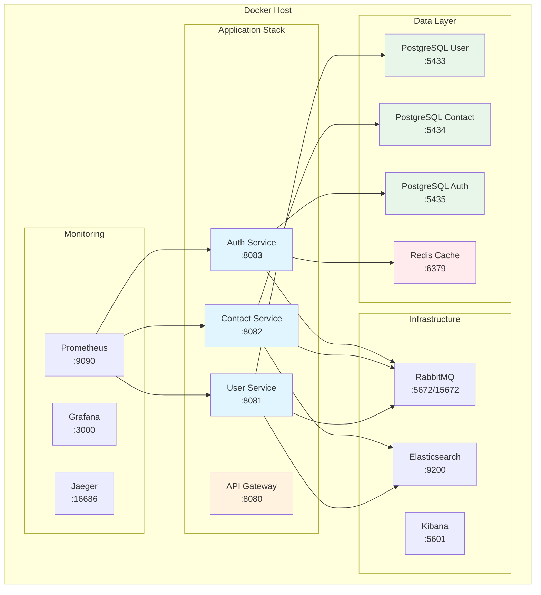

# Docker Setup Documentation

## 📋 Table of Contents

- [Overview](#overview)
- [Prerequisites](#prerequisites)
- [Docker Architecture](#docker-architecture)
- [Docker Compose Configuration](#docker-compose-configuration)
- [Service Management](#service-management)
- [Database Management](#database-management)
- [Network Configuration](#network-configuration)
- [Volume Management](#volume-management)
- [Health Checks & Monitoring](#health-checks--monitoring)
- [Development Workflow](#development-workflow)
- [Troubleshooting](#troubleshooting)
- [Production Deployment](#production-deployment)
- [Security Best Practices](#security-best-practices)
- [Performance Optimization](#performance-optimization)
- [Backup & Recovery](#backup--recovery)
- [CI/CD Integration](#cicd-integration)
- [Docker Commands Reference](#docker-commands-reference)

## Overview

This guide provides comprehensive Docker setup instructions for local development and production deployment of the Fabric Management System. Our containerized architecture ensures consistency across development, staging, and production environments.

### Key Benefits
- 🚀 **Quick Setup**: One command to start entire stack
- 🔄 **Consistency**: Same environment across all stages
- 📦 **Isolation**: Services run in isolated containers
- 🔧 **Easy Maintenance**: Simple updates and rollbacks
- 📊 **Scalability**: Easy horizontal scaling

## Prerequisites

### System Requirements

| Component | Minimum | Recommended |
|-----------|---------|-------------|
| **Docker Desktop** | 4.0+ | Latest stable |
| **Docker Compose** | 2.0+ | Latest stable |
| **RAM** | 4GB | 8GB+ |
| **CPU** | 2 cores | 4+ cores |
| **Disk Space** | 10GB | 20GB+ |
| **OS** | Windows 10/macOS 10.15/Ubuntu 20.04 | Latest versions |

### Installation

#### macOS
```bash
# Install Docker Desktop
brew install --cask docker

# Verify installation
docker --version
docker-compose --version
```

#### Windows
```powershell
# Download Docker Desktop from official website
# https://www.docker.com/products/docker-desktop/

# Verify installation
docker --version
docker-compose --version
```

#### Linux (Ubuntu/Debian)
```bash
# Install Docker
curl -fsSL https://get.docker.com -o get-docker.sh
sudo sh get-docker.sh

# Install Docker Compose
sudo apt-get install docker-compose-plugin

# Add user to docker group
sudo usermod -aG docker $USER

# Verify installation
docker --version
docker compose version
```

## Docker Architecture

### System Architecture Diagram



## Docker Compose Configuration

### Main docker-compose.yml

```yaml
version: '3.9'

services:
  # ============================================
  # Database Services
  # ============================================
  
  postgres-user:
    image: postgres:15-alpine
    container_name: fabric-user-db
    hostname: user-db
    environment:
      POSTGRES_USER: ${USER_DB_USER:-user_service}
      POSTGRES_PASSWORD: ${USER_DB_PASSWORD:-password}
      POSTGRES_DB: ${USER_DB_NAME:-user_db}
      POSTGRES_INITDB_ARGS: "--encoding=UTF8 --locale=en_US.UTF-8"
      TZ: ${TZ:-UTC}
    ports:
      - "${USER_DB_PORT:-5433}:5432"
    volumes:
      - user_db_data:/var/lib/postgresql/data
      - ./scripts/init-db/user-init.sql:/docker-entrypoint-initdb.d/01-init.sql:ro
      - ./backups/user:/backups
    networks:
      - fabric-network
    healthcheck:
      test: ["CMD-SHELL", "pg_isready -U ${USER_DB_USER:-user_service} -d ${USER_DB_NAME:-user_db}"]
      interval: 10s
      timeout: 5s
      retries: 5
      start_period: 30s
    restart: unless-stopped
    logging:
      driver: "json-file"
      options:
        max-size: "10m"
        max-file: "3"
    labels:
      - "com.fabric.service=database"
      - "com.fabric.service.name=user-database"

  postgres-contact:
    image: postgres:15-alpine
    container_name: fabric-contact-db
    hostname: contact-db
    environment:
      POSTGRES_USER: ${CONTACT_DB_USER:-contact_service}
      POSTGRES_PASSWORD: ${CONTACT_DB_PASSWORD:-password}
      POSTGRES_DB: ${CONTACT_DB_NAME:-contact_db}
      POSTGRES_INITDB_ARGS: "--encoding=UTF8 --locale=en_US.UTF-8"
      TZ: ${TZ:-UTC}
    ports:
      - "${CONTACT_DB_PORT:-5434}:5432"
    volumes:
      - contact_db_data:/var/lib/postgresql/data
      - ./scripts/init-db/contact-init.sql:/docker-entrypoint-initdb.d/01-init.sql:ro
      - ./backups/contact:/backups
    networks:
      - fabric-network
    healthcheck:
      test: ["CMD-SHELL", "pg_isready -U ${CONTACT_DB_USER:-contact_service} -d ${CONTACT_DB_NAME:-contact_db}"]
      interval: 10s
      timeout: 5s
      retries: 5
      start_period: 30s
    restart: unless-stopped
    logging:
      driver: "json-file"
      options:
        max-size: "10m"
        max-file: "3"

  # ============================================
  # Cache Service
  # ============================================
  
  redis:
    image: redis:7-alpine
    container_name: fabric-redis
    hostname: redis
    command: redis-server --appendonly yes --requirepass ${REDIS_PASSWORD:-redis_password}
    ports:
      - "${REDIS_PORT:-6379}:6379"
    volumes:
      - redis_data:/data
      - ./config/redis/redis.conf:/usr/local/etc/redis/redis.conf:ro
    networks:
      - fabric-network
    healthcheck:
      test: ["CMD", "redis-cli", "--raw", "incr", "ping"]
      interval: 10s
      timeout: 5s
      retries: 5
    restart: unless-stopped
    logging:
      driver: "json-file"
      options:
        max-size: "10m"
        max-file: "3"

  # ============================================
  # Message Broker
  # ============================================
  
  rabbitmq:
    image: rabbitmq:3.12-management-alpine
    container_name: fabric-rabbitmq
    hostname: rabbitmq
    environment:
      RABBITMQ_DEFAULT_USER: ${RABBITMQ_USER:-admin}
      RABBITMQ_DEFAULT_PASS: ${RABBITMQ_PASSWORD:-admin}
      RABBITMQ_DEFAULT_VHOST: ${RABBITMQ_VHOST:-/}
    ports:
      - "${RABBITMQ_PORT:-5672}:5672"       # AMQP port
      - "${RABBITMQ_MGMT_PORT:-15672}:15672" # Management UI
    volumes:
      - rabbitmq_data:/var/lib/rabbitmq
      - ./config/rabbitmq/rabbitmq.conf:/etc/rabbitmq/rabbitmq.conf:ro
      - ./config/rabbitmq/definitions.json:/etc/rabbitmq/definitions.json:ro
    networks:
      - fabric-network
    healthcheck:
      test: ["CMD", "rabbitmq-diagnostics", "ping"]
      interval: 10s
      timeout: 5s
      retries: 5
    restart: unless-stopped

  # ============================================
  # Search & Analytics
  # ============================================
  
  elasticsearch:
    image: docker.elastic.co/elasticsearch/elasticsearch:8.11.0
    container_name: fabric-elasticsearch
    hostname: elasticsearch
    environment:
      - discovery.type=single-node
      - "ES_JAVA_OPTS=-Xms512m -Xmx512m"
      - xpack.security.enabled=false
      - cluster.name=fabric-cluster
    ports:
      - "${ES_PORT:-9200}:9200"
      - "${ES_TRANSPORT_PORT:-9300}:9300"
    volumes:
      - elasticsearch_data:/usr/share/elasticsearch/data
    networks:
      - fabric-network
    healthcheck:
      test: ["CMD-SHELL", "curl -f http://localhost:9200/_cluster/health || exit 1"]
      interval: 30s
      timeout: 10s
      retries: 5
    restart: unless-stopped

  kibana:
    image: docker.elastic.co/kibana/kibana:8.11.0
    container_name: fabric-kibana
    hostname: kibana
    environment:
      - ELASTICSEARCH_HOSTS=http://elasticsearch:9200
      - SERVER_NAME=kibana
      - SERVER_HOST=0.0.0.0
    ports:
      - "${KIBANA_PORT:-5601}:5601"
    networks:
      - fabric-network
    depends_on:
      elasticsearch:
        condition: service_healthy
    healthcheck:
      test: ["CMD-SHELL", "curl -f http://localhost:5601/api/status || exit 1"]
      interval: 30s
      timeout: 10s
      retries: 5
    restart: unless-stopped

  # ============================================
  # Monitoring Stack
  # ============================================
  
  prometheus:
    image: prom/prometheus:latest
    container_name: fabric-prometheus
    hostname: prometheus
    command:
      - '--config.file=/etc/prometheus/prometheus.yml'
      - '--storage.tsdb.path=/prometheus'
      - '--web.console.libraries=/usr/share/prometheus/console_libraries'
      - '--web.console.templates=/usr/share/prometheus/consoles'
      - '--web.enable-lifecycle'
    ports:
      - "${PROMETHEUS_PORT:-9090}:9090"
    volumes:
      - ./config/prometheus/prometheus.yml:/etc/prometheus/prometheus.yml:ro
      - ./config/prometheus/rules:/etc/prometheus/rules:ro
      - prometheus_data:/prometheus
    networks:
      - fabric-network
    restart: unless-stopped

  grafana:
    image: grafana/grafana:latest
    container_name: fabric-grafana
    hostname: grafana
    environment:
      - GF_SECURITY_ADMIN_USER=${GRAFANA_USER:-admin}
      - GF_SECURITY_ADMIN_PASSWORD=${GRAFANA_PASSWORD:-admin}
      - GF_INSTALL_PLUGINS=grafana-clock-panel,grafana-simple-json-datasource
    ports:
      - "${GRAFANA_PORT:-3000}:3000"
    volumes:
      - ./config/grafana/provisioning:/etc/grafana/provisioning:ro
      - ./config/grafana/dashboards:/var/lib/grafana/dashboards:ro
      - grafana_data:/var/lib/grafana
    networks:
      - fabric-network
    depends_on:
      - prometheus
    restart: unless-stopped

  # ============================================
  # Tracing
  # ============================================
  
  jaeger:
    image: jaegertracing/all-in-one:latest
    container_name: fabric-jaeger
    hostname: jaeger
    environment:
      - COLLECTOR_ZIPKIN_HOST_PORT=:9411
      - COLLECTOR_OTLP_ENABLED=true
    ports:
      - "${JAEGER_UI_PORT:-16686}:16686"      # Jaeger UI
      - "${JAEGER_COLLECTOR_PORT:-14268}:14268" # Accept jaeger.thrift
      - "${JAEGER_OTLP_PORT:-4317}:4317"      # OTLP gRPC
      - "${JAEGER_OTLP_HTTP_PORT:-4318}:4318" # OTLP HTTP
    networks:
      - fabric-network
    restart: unless-stopped

  # ============================================
  # Application Services (Development)
  # ============================================
  
  # user-service:
  #   build:
  #     context: ./services/user-service
  #     dockerfile: Dockerfile
  #   container_name: fabric-user-service
  #   hostname: user-service
  #   environment:
  #     - SPRING_PROFILES_ACTIVE=docker
  #     - DB_HOST=postgres-user
  #     - DB_PORT=5432
  #     - REDIS_HOST=redis
  #     - RABBITMQ_HOST=rabbitmq
  #   ports:
  #     - "8081:8081"
  #   networks:
  #     - fabric-network
  #   depends_on:
  #     postgres-user:
  #       condition: service_healthy
  #     redis:
  #       condition: service_healthy
  #     rabbitmq:
  #       condition: service_healthy
  #   restart: unless-stopped

# ============================================
# Volumes
# ============================================

volumes:
  user_db_data:
    driver: local
    name: fabric_user_db_data
  contact_db_data:
    driver: local
    name: fabric_contact_db_data
  redis_data:
    driver: local
    name: fabric_redis_data
  rabbitmq_data:
    driver: local
    name: fabric_rabbitmq_data
  elasticsearch_data:
    driver: local
    name: fabric_elasticsearch_data
  prometheus_data:
    driver: local
    name: fabric_prometheus_data
  grafana_data:
    driver: local
    name: fabric_grafana_data

# ============================================
# Networks
# ============================================

networks:
  fabric-network:
    driver: bridge
    name: fabric_network
    ipam:
      driver: default
      config:
        - subnet: 172.25.0.0/16
```

### Environment Variables (.env)

```bash
# Database Configuration
USER_DB_USER=user_service
USER_DB_PASSWORD=secure_password_123
USER_DB_NAME=user_db
USER_DB_PORT=5433

CONTACT_DB_USER=contact_service
CONTACT_DB_PASSWORD=secure_password_456
CONTACT_DB_NAME=contact_db
CONTACT_DB_PORT=5434

# Redis Configuration
REDIS_PASSWORD=redis_secure_password
REDIS_PORT=6379

# RabbitMQ Configuration
RABBITMQ_USER=admin
RABBITMQ_PASSWORD=admin_secure_password
RABBITMQ_VHOST=/
RABBITMQ_PORT=5672
RABBITMQ_MGMT_PORT=15672

# Elasticsearch Configuration
ES_PORT=9200
ES_TRANSPORT_PORT=9300

# Kibana Configuration
KIBANA_PORT=5601

# Monitoring Configuration
PROMETHEUS_PORT=9090
GRAFANA_USER=admin
GRAFANA_PASSWORD=admin_secure_password
GRAFANA_PORT=3000

# Jaeger Configuration
JAEGER_UI_PORT=16686
JAEGER_COLLECTOR_PORT=14268

# General Configuration
TZ=UTC
```

### Development Override (docker-compose.override.yml)

```yaml
version: '3.9'

services:
  postgres-user:
    ports:
      - "5433:5432"
    environment:
      POSTGRES_PASSWORD: password  # Simple password for dev

  redis:
    command: redis-server --appendonly yes  # No password in dev
    
  rabbitmq:
    environment:
      RABBITMQ_DEFAULT_USER: guest
      RABBITMQ_DEFAULT_PASS: guest
```

### Production Configuration (docker-compose.prod.yml)

```yaml
version: '3.9'

services:
  postgres-user:
    image: postgres:15
    deploy:
      resources:
        limits:
          cpus: '2'
          memory: 2G
        reservations:
          cpus: '1'
          memory: 1G
    environment:
      POSTGRES_PASSWORD_FILE: /run/secrets/db_password
    secrets:
      - db_password
    logging:
      driver: "fluentd"
      options:
        fluentd-address: "localhost:24224"
        tag: "postgres.user"

secrets:
  db_password:
    external: true
```

## Service Management

### Starting Services

#### Start All Services
```bash
# Start all services in background
docker-compose up -d

# Start with build (if Dockerfile changed)
docker-compose up -d --build

# Start specific services
docker-compose up -d postgres-user redis rabbitmq

# Start with custom compose file
docker-compose -f docker-compose.yml -f docker-compose.prod.yml up -d
```

#### View Service Status
```bash
# List all services
docker-compose ps

# Detailed service status
docker-compose ps --services --filter "status=running"

# Check service health
docker inspect fabric-user-db --format='{{.State.Health.Status}}'
```

#### View Logs
```bash
# View all logs
docker-compose logs

# Follow logs in real-time
docker-compose logs -f

# View specific service logs
docker-compose logs -f postgres-user

# View last 100 lines
docker-compose logs --tail=100 postgres-user

# View logs with timestamps
docker-compose logs -t postgres-user
```

#### Stop Services
```bash
# Stop all services (keeps containers)
docker-compose stop

# Stop specific service
docker-compose stop postgres-user

# Stop and remove containers
docker-compose down

# Stop, remove containers and volumes (clean slate)
docker-compose down -v

# Stop with timeout
docker-compose stop -t 30
```

### Service Scaling

```bash
# Scale a service (requires service definition without container_name)
docker-compose up -d --scale user-service=3

# Check scaled instances
docker-compose ps user-service
```

## Database Management

### PostgreSQL Operations

#### Connect to Database
```bash
# Using docker exec
docker exec -it fabric-user-db psql -U user_service -d user_db

# Using psql client
psql -h localhost -p 5433 -U user_service -d user_db

# Run SQL command directly
docker exec fabric-user-db psql -U user_service -d user_db -c "SELECT COUNT(*) FROM users;"
```

#### Database Initialization Script

```sql
-- scripts/init-db/user-init.sql
-- Create extensions
CREATE EXTENSION IF NOT EXISTS "uuid-ossp";
CREATE EXTENSION IF NOT EXISTS "pgcrypto";

-- Create schema
CREATE SCHEMA IF NOT EXISTS app;

-- Set search path
ALTER DATABASE user_db SET search_path TO app, public;

-- Create audit function
CREATE OR REPLACE FUNCTION update_updated_at_column()
RETURNS TRIGGER AS $$
BEGIN
    NEW.updated_at = CURRENT_TIMESTAMP;
    RETURN NEW;
END;
$$ language 'plpgsql';

-- Create users table
CREATE TABLE IF NOT EXISTS app.users (
    id UUID PRIMARY KEY DEFAULT uuid_generate_v4(),
    tenant_id UUID NOT NULL,
    username VARCHAR(50) NOT NULL,
    first_name VARCHAR(100),
    last_name VARCHAR(100),
    email VARCHAR(255),
    status VARCHAR(20) DEFAULT 'PENDING',
    created_at TIMESTAMP WITH TIME ZONE DEFAULT CURRENT_TIMESTAMP,
    updated_at TIMESTAMP WITH TIME ZONE DEFAULT CURRENT_TIMESTAMP,
    created_by VARCHAR(100),
    updated_by VARCHAR(100),
    version BIGINT DEFAULT 1,
    deleted BOOLEAN DEFAULT FALSE,
    CONSTRAINT uk_users_username_tenant UNIQUE (username, tenant_id)
);

-- Create indices
CREATE INDEX idx_users_tenant_id ON app.users(tenant_id);
CREATE INDEX idx_users_username ON app.users(username);
CREATE INDEX idx_users_email ON app.users(email);
CREATE INDEX idx_users_status ON app.users(status);
CREATE INDEX idx_users_created_at ON app.users(created_at DESC);

-- Create trigger for updated_at
CREATE TRIGGER update_users_updated_at 
    BEFORE UPDATE ON app.users 
    FOR EACH ROW 
    EXECUTE FUNCTION update_updated_at_column();

-- Grant permissions
GRANT ALL PRIVILEGES ON SCHEMA app TO user_service;
GRANT ALL PRIVILEGES ON ALL TABLES IN SCHEMA app TO user_service;
GRANT ALL PRIVILEGES ON ALL SEQUENCES IN SCHEMA app TO user_service;
```

### Backup & Restore

#### Create Backup
```bash
# Full database backup
docker exec fabric-user-db pg_dump -U user_service -d user_db > backup_$(date +%Y%m%d_%H%M%S).sql

# Compressed backup
docker exec fabric-user-db pg_dump -U user_service -d user_db | gzip > backup_$(date +%Y%m%d_%H%M%S).sql.gz

# Backup specific tables
docker exec fabric-user-db pg_dump -U user_service -d user_db -t users -t contacts > users_backup.sql

# Backup with Docker volume
docker run --rm \
    -v fabric_user_db_data:/data \
    -v $(pwd)/backups:/backup \
    alpine tar czf /backup/postgres_data_$(date +%Y%m%d).tar.gz /data
```

#### Restore Backup
```bash
# Restore from SQL file
docker exec -i fabric-user-db psql -U user_service -d user_db < backup.sql

# Restore compressed backup
gunzip -c backup.sql.gz | docker exec -i fabric-user-db psql -U user_service -d user_db

# Restore with clean database
docker exec fabric-user-db psql -U user_service -c "DROP DATABASE IF EXISTS user_db;"
docker exec fabric-user-db psql -U user_service -c "CREATE DATABASE user_db;"
docker exec -i fabric-user-db psql -U user_service -d user_db < backup.sql
```

#### Automated Backup Script

```bash
#!/bin/bash
# scripts/backup.sh

BACKUP_DIR="./backups"
TIMESTAMP=$(date +%Y%m%d_%H%M%S)
SERVICES=("user" "contact" "auth")

# Create backup directory
mkdir -p $BACKUP_DIR

for SERVICE in "${SERVICES[@]}"; do
    DB_NAME="${SERVICE}_db"
    CONTAINER="fabric-${SERVICE}-db"
    BACKUP_FILE="$BACKUP_DIR/${DB_NAME}_${TIMESTAMP}.sql.gz"
    
    echo "Backing up $DB_NAME..."
    docker exec $CONTAINER pg_dump -U ${SERVICE}_service -d $DB_NAME | gzip > $BACKUP_FILE
    
    if [ $? -eq 0 ]; then
        echo "✅ $DB_NAME backed up successfully to $BACKUP_FILE"
    else
        echo "❌ Failed to backup $DB_NAME"
    fi
done

# Clean old backups (keep last 7 days)
find $BACKUP_DIR -name "*.sql.gz" -mtime +7 -delete
echo "🧹 Old backups cleaned"
```

## Network Configuration

### Network Overview

```bash
# List networks
docker network ls

# Inspect network
docker network inspect fabric_network

# See connected containers
docker network inspect fabric_network --format='{{range .Containers}}{{.Name}} {{end}}'
```

### Inter-Service Communication

Services can communicate using container hostnames:

```yaml
# Application configuration
spring:
  datasource:
    url: jdbc:postgresql://postgres-user:5432/user_db
  redis:
    host: redis
    port: 6379
  rabbitmq:
    host: rabbitmq
    port: 5672
```

### Custom Network Configuration

```yaml
networks:
  fabric-network:
    driver: bridge
    ipam:
      driver: default
      config:
        - subnet: 172.25.0.0/16
          gateway: 172.25.0.1
    driver_opts:
      com.docker.network.bridge.name: fabric_bridge
      com.docker.network.bridge.enable_icc: "true"
      com.docker.network.bridge.enable_ip_masquerade: "true"
```

## Volume Management

### Volume Operations

```bash
# List volumes
docker volume ls

# Inspect volume
docker volume inspect fabric_user_db_data

# Create volume manually
docker volume create --name=fabric_backup_data

# Remove unused volumes
docker volume prune

# Remove specific volume
docker volume rm fabric_user_db_data

# Backup volume
docker run --rm \
    -v fabric_user_db_data:/source:ro \
    -v $(pwd)/backup:/backup \
    alpine tar czf /backup/volume_backup.tar.gz -C /source .
```

### Volume Mounting Strategies

```yaml
volumes:
  # Named volume (managed by Docker)
  - user_db_data:/var/lib/postgresql/data
  
  # Bind mount (host directory)
  - ./scripts:/scripts:ro
  
  # Anonymous volume
  - /tmp/cache
  
  # Volume with options
  - type: volume
    source: mydata
    target: /data
    volume:
      nocopy: true
```

## Health Checks & Monitoring

### Health Check Configuration

```yaml
healthcheck:
  test: ["CMD-SHELL", "pg_isready -U user_service -d user_db"]
  interval: 10s      # How often to check
  timeout: 5s        # Timeout for each check
  retries: 5         # Consecutive failures before unhealthy
  start_period: 30s  # Grace period on startup
```

### Service Health Status

```bash
# Check health status
docker inspect fabric-user-db --format='{{json .State.Health}}' | jq

# Monitor health in real-time
watch -n 2 'docker ps --format "table {{.Names}}\t{{.Status}}"'

# Custom health check script
#!/bin/bash
for container in $(docker ps --format "{{.Names}}"); do
    health=$(docker inspect $container --format='{{.State.Health.Status}}')
    echo "$container: $health"
done
```

### Monitoring Stack Access

| Service | URL | Default Credentials |
|---------|-----|-------------------|
| **Prometheus** | http://localhost:9090 | No auth |
| **Grafana** | http://localhost:3000 | admin/admin |
| **Kibana** | http://localhost:5601 | No auth |
| **RabbitMQ Management** | http://localhost:15672 | admin/admin |
| **Jaeger UI** | http://localhost:16686 | No auth |

## Development Workflow

### Local Development Setup

```bash
# 1. Clone repository
git clone https://github.com/your-org/fabric-management.git
cd fabric-management

# 2. Copy environment template
cp .env.example .env

# 3. Start infrastructure services
docker-compose up -d postgres-user redis rabbitmq

# 4. Wait for services to be healthy
./scripts/wait-for-healthy.sh

# 5. Run database migrations
./mvnw flyway:migrate

# 6. Start application (outside Docker for hot reload)
./mvnw spring-boot:run
```

### Hot Reload Development

```yaml
# docker-compose.dev.yml
version: '3.9'

services:
  user-service:
    volumes:
      - ./services/user-service/target:/app
      - ~/.m2:/root/.m2
    environment:
      - SPRING_DEVTOOLS_RESTART_ENABLED=true
    command: ["java", "-agentlib:jdwp=transport=dt_socket,server=y,suspend=n,address=*:5005", "-jar", "/app/user-service.jar"]
```

### Testing with Docker

```bash
# Run tests in container
docker run --rm \
    --network fabric_network \
    -v $(pwd):/workspace \
    -w /workspace \
    maven:3.8-openjdk-17 \
    mvn test

# Integration tests with test containers
docker-compose -f docker-compose.test.yml up --abort-on-container-exit
```

## Troubleshooting

### Common Issues and Solutions

#### 1. Port Already in Use

**Problem**: Port 5432/5433 already in use

```bash
# Check what's using the port
lsof -i :5433              # macOS/Linux
netstat -ano | findstr :5433  # Windows

# Solution 1: Change port in docker-compose.yml
ports:
  - "5434:5432"  # Use different port

# Solution 2: Stop conflicting service
sudo service postgresql stop  # Linux
brew services stop postgresql  # macOS
```

#### 2. Container Won't Start

**Problem**: Container exits immediately

```bash
# Check container status
docker-compose ps

# View detailed logs
docker-compose logs postgres-user

# Check exit code
docker inspect fabric-user-db --format='{{.State.ExitCode}}'

# Common solutions:
# 1. Remove volume and restart
docker-compose down -v
docker-compose up -d

# 2. Check permissions
sudo chown -R $(id -u):$(id -g) ./volumes

# 3. Check configuration
docker-compose config --quiet && echo "Config OK" || echo "Config Error"
```

#### 3. Database Connection Failed

**Problem**: Application can't connect to database

```bash
# Test connection from host
pg_isready -h localhost -p 5433 -U user_service

# Test connection from container
docker exec fabric-user-db pg_isready

# Check network connectivity
docker exec fabric-user-service ping postgres-user

# Verify credentials
docker exec fabric-user-db psql -U user_service -d user_db -c "SELECT 1;"

# Check firewall rules (Linux)
sudo iptables -L -n | grep 5433
```

#### 4. Out of Disk Space

**Problem**: No space left on device

```bash
# Check disk usage
docker system df

# Clean up unused resources
docker system prune -a --volumes

# Remove old images
docker image prune -a --filter "until=24h"

# Clean build cache
docker builder prune

# Remove logs
truncate -s 0 $(docker inspect --format='{{.LogPath}}' fabric-user-db)
```

#### 5. Memory Issues

**Problem**: Container killed due to OOM

```bash
# Check memory usage
docker stats --no-stream

# Increase memory limits
services:
  postgres-user:
    deploy:
      resources:
        limits:
          memory: 2G
        reservations:
          memory: 1G

# Check Docker daemon memory
docker system info | grep Memory
```

### Debug Commands

```bash
# Enter container shell
docker exec -it fabric-user-db /bin/bash

# Copy files from container
docker cp fabric-user-db:/var/lib/postgresql/data/pg_log/postgresql.log ./

# Monitor resource usage
docker stats $(docker-compose ps -q)

# Check container processes
docker exec fabric-user-db ps aux

# Network debugging
docker exec fabric-user-db netstat -tulpn
docker exec fabric-user-db nslookup postgres-user

# File system check
docker exec fabric-user-db df -h
docker exec fabric-user-db du -sh /var/lib/postgresql/data
```

## Production Deployment

### Production Checklist

- [ ] Use specific image tags (not `latest`)
- [ ] Set resource limits and reservations
- [ ] Configure health checks
- [ ] Use secrets for sensitive data
- [ ] Enable TLS/SSL
- [ ] Configure logging
- [ ] Set up monitoring
- [ ] Configure backups
- [ ] Use read-only volumes where possible
- [ ] Disable unnecessary ports
- [ ] Use non-root users
- [ ] Enable security scanning

### Docker Swarm Deployment

```bash
# Initialize swarm
docker swarm init

# Deploy stack
docker stack deploy -c docker-compose.prod.yml fabric

# List services
docker service ls

# Scale service
docker service scale fabric_user-service=3

# Update service
docker service update --image user-service:v2 fabric_user-service

# View logs
docker service logs -f fabric_user-service
```

### Kubernetes Deployment

```yaml
# k8s/postgres-deployment.yaml
apiVersion: apps/v1
kind: Deployment
metadata:
  name: postgres-user
spec:
  replicas: 1
  selector:
    matchLabels:
      app: postgres-user
  template:
    metadata:
      labels:
        app: postgres-user
    spec:
      containers:
      - name: postgres
        image: postgres:15-alpine
        ports:
        - containerPort: 5432
        env:
        - name: POSTGRES_DB
          value: user_db
        - name: POSTGRES_USER
          valueFrom:
            secretKeyRef:
              name: postgres-secret
              key: username
        - name: POSTGRES_PASSWORD
          valueFrom:
            secretKeyRef:
              name: postgres-secret
              key: password
        volumeMounts:
        - name: postgres-storage
          mountPath: /var/lib/postgresql/data
      volumes:
      - name: postgres-storage
        persistentVolumeClaim:
          claimName: postgres-pvc
```

## Security Best Practices

### 1. Use Secrets Management

```yaml
# docker-compose with secrets
services:
  postgres-user:
    environment:
      POSTGRES_PASSWORD_FILE: /run/secrets/db_password
    secrets:
      - db_password

secrets:
  db_password:
    file: ./secrets/db_password.txt
```

### 2. Network Isolation

```yaml
networks:
  frontend:
    driver: bridge
  backend:
    driver: bridge
    internal: true  # No external access

services:
  api-gateway:
    networks:
      - frontend
      - backend
  
  postgres-user:
    networks:
      - backend  # Only backend network
```

### 3. Read-Only Root Filesystem

```yaml
services:
  user-service:
    read_only: true
    tmpfs:
      - /tmp
      - /var/run
```

### 4. Non-Root User

```dockerfile
# Dockerfile
FROM openjdk:17-alpine
RUN addgroup -S spring && adduser -S spring -G spring
USER spring:spring
```

### 5. Security Scanning

```bash
# Scan image for vulnerabilities
docker scan fabric-user-service:latest

# Use Trivy for scanning
docker run --rm -v /var/run/docker.sock:/var/run/docker.sock \
    aquasec/trivy image fabric-user-service:latest
```

## Performance Optimization

### 1. Build Optimization

```dockerfile
# Multi-stage build
FROM maven:3.8-openjdk-17 AS builder
WORKDIR /app
COPY pom.xml .
RUN mvn dependency:go-offline
COPY src ./src
RUN mvn package -DskipTests

FROM openjdk:17-alpine
COPY --from=builder /app/target/*.jar app.jar
ENTRYPOINT ["java", "-jar", "/app.jar"]
```

### 2. Layer Caching

```yaml
services:
  user-service:
    build:
      context: .
      cache_from:
        - fabric-user-service:latest
        - fabric-user-service:cache
```

### 3. Resource Limits

```yaml
services:
  postgres-user:
    deploy:
      resources:
        limits:
          cpus: '2'
          memory: 2G
        reservations:
          cpus: '1'
          memory: 1G
```

### 4. Connection Pooling

```yaml
# Application configuration
spring:
  datasource:
    hikari:
      maximum-pool-size: 10
      minimum-idle: 5
      connection-timeout: 30000
      idle-timeout: 600000
      max-lifetime: 1800000
```

## Backup & Recovery

### Automated Backup Strategy

```yaml
# docker-compose.backup.yml
services:
  postgres-backup:
    image: postgres:15-alpine
    environment:
      PGHOST: postgres-user
      PGUSER: user_service
      PGPASSWORD: password
    volumes:
      - ./backups:/backups
    command: |
      sh -c 'while true; do
        pg_dump -h postgres-user -U user_service user_db | gzip > /backups/user_db_$$(date +%Y%m%d_%H%M%S).sql.gz
        find /backups -name "*.sql.gz" -mtime +7 -delete
        sleep 86400
      done'
    networks:
      - fabric-network
```

### Disaster Recovery

```bash
#!/bin/bash
# scripts/disaster-recovery.sh

# 1. Stop services
docker-compose down

# 2. Backup current state
./scripts/backup.sh

# 3. Remove corrupted volumes
docker volume rm fabric_user_db_data

# 4. Recreate volumes
docker volume create fabric_user_db_data

# 5. Restore from backup
./scripts/restore.sh latest

# 6. Start services
docker-compose up -d

# 7. Verify health
./scripts/health-check.sh
```

## CI/CD Integration

### GitHub Actions

```yaml
# .github/workflows/docker.yml
name: Docker CI/CD

on:
  push:
    branches: [main]
  pull_request:
    branches: [main]

jobs:
  build:
    runs-on: ubuntu-latest
    steps:
    - uses: actions/checkout@v3
    
    - name: Set up Docker Buildx
      uses: docker/setup-buildx-action@v2
    
    - name: Login to DockerHub
      uses: docker/login-action@v2
      with:
        username: ${{ secrets.DOCKER_USERNAME }}
        password: ${{ secrets.DOCKER_PASSWORD }}
    
    - name: Build and test
      run: |
        docker-compose build
        docker-compose run --rm user-service mvn test
    
    - name: Push images
      if: github.ref == 'refs/heads/main'
      run: |
        docker-compose push
```

### GitLab CI

```yaml
# .gitlab-ci.yml
stages:
  - build
  - test
  - deploy

variables:
  DOCKER_DRIVER: overlay2
  DOCKER_TLS_CERTDIR: ""

build:
  stage: build
  script:
    - docker-compose build
    - docker-compose push

test:
  stage: test
  script:
    - docker-compose -f docker-compose.test.yml up --abort-on-container-exit

deploy:
  stage: deploy
  script:
    - docker stack deploy -c docker-compose.prod.yml fabric
  only:
    - main
```

## Docker Commands Reference

### Essential Commands

```bash
# Container Management
docker ps                              # List running containers
docker ps -a                           # List all containers
docker start <container>               # Start container
docker stop <container>                # Stop container
docker restart <container>             # Restart container
docker rm <container>                  # Remove container
docker rm -f <container>               # Force remove running container

# Image Management
docker images                          # List images
docker pull <image>                    # Download image
docker push <image>                    # Upload image
docker rmi <image>                     # Remove image
docker build -t <tag> .                # Build image from Dockerfile
docker tag <source> <target>           # Tag image

# Logs and Debugging
docker logs <container>                # View logs
docker logs -f <container>             # Follow logs
docker exec -it <container> /bin/bash  # Enter container shell
docker inspect <container>             # Detailed container info
docker stats                           # Real-time resource usage
docker top <container>                 # Container processes

# Volume Management
docker volume ls                       # List volumes
docker volume create <name>            # Create volume
docker volume rm <name>                # Remove volume
docker volume inspect <name>           # Volume details
docker volume prune                    # Remove unused volumes

# Network Management
docker network ls                      # List networks
docker network create <name>           # Create network
docker network rm <name>               # Remove network
docker network inspect <name>          # Network details
docker network connect <network> <container>  # Connect container to network

# System Management
docker system df                       # Disk usage
docker system prune                    # Clean up everything unused
docker system prune -a --volumes       # Clean up everything including volumes
docker system info                     # System information
docker version                         # Docker version

# Docker Compose Commands
docker-compose up                      # Start services
docker-compose up -d                   # Start in background
docker-compose down                    # Stop and remove
docker-compose ps                      # List services
docker-compose logs                    # View logs
docker-compose build                   # Build services
docker-compose pull                    # Pull images
docker-compose restart                 # Restart services
docker-compose exec <service> <cmd>    # Execute command in service
docker-compose config                  # Validate and view config
```

## Performance Monitoring

### Container Metrics

```bash
# Real-time stats
docker stats --format "table {{.Container}}\t{{.CPUPerc}}\t{{.MemUsage}}"

# Export metrics to file
docker stats --no-stream --format "{{json .}}" > metrics.json

# Custom monitoring script
#!/bin/bash
while true; do
    echo "=== Container Metrics $(date) ==="
    docker stats --no-stream --format "table {{.Container}}\t{{.CPUPerc}}\t{{.MemUsage}}\t{{.NetIO}}\t{{.BlockIO}}"
    sleep 5
done
```

### Prometheus Metrics

```yaml
# prometheus.yml
global:
  scrape_interval: 15s

scrape_configs:
  - job_name: 'docker'
    static_configs:
      - targets: ['docker-exporter:9323']
  
  - job_name: 'user-service'
    static_configs:
      - targets: ['user-service:8081']
    metrics_path: '/actuator/prometheus'
```

## Future Enhancements

- [ ] Implement Docker Swarm for production
- [ ] Add Kubernetes manifests and Helm charts
- [ ] Integrate with CI/CD pipelines
- [ ] Add centralized logging with ELK stack
- [ ] Implement service mesh with Istio
- [ ] Add distributed tracing with Jaeger
- [ ] Configure auto-scaling policies
- [ ] Add security scanning in CI/CD
- [ ] Implement GitOps with ArgoCD
- [ ] Add chaos engineering tests
- [ ] Configure multi-region deployment
- [ ] Add cost optimization monitoring

---

**Version:** 1.0.0  
**Last Updated:** January 2025  
**Maintained By:** DevOps Team  
**Support:** devops@fabricmanagement.com