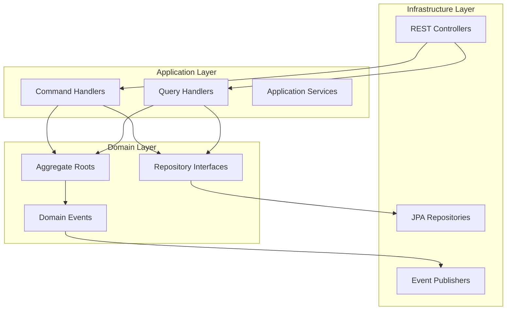

# 👨‍💻 Development Guide

## 📋 Overview

This guide provides comprehensive instructions for setting up, developing, and contributing to the Fabric Management System. Follow these guidelines to ensure consistency, quality, and maintainability across the codebase.

## 🚀 Quick Start

### Prerequisites

- **Java 21** or higher
- **Maven 3.9+**
- **Docker** and **Docker Compose**
- **Git**
- **IDE** (IntelliJ IDEA, Eclipse, VS Code)

### Environment Setup

1. **Clone the repository**:

```bash
git clone https://github.com/your-org/fabric-management-backend.git
cd fabric-management-backend
```

2. **Start infrastructure services**:

```bash
docker-compose up -d postgres-db redis kafka
```

3. **Build the project**:

```bash
mvn clean install
```

4. **Run tests**:

```bash
mvn test
```

## 🏗️ Project Structure

```
fabric-management-backend/
├── shared/                          # Shared libraries
│   ├── shared-domain/              # Domain primitives
│   ├── shared-infrastructure/      # Infrastructure utilities
│   ├── shared-application/          # Application utilities
│   └── shared-security/            # Security utilities
├── services/                        # Microservices
│   ├── user-service/               # User management
│   ├── contact-service/            # Contact management
│   ├── company-service/            # Company management
│   └── ...                         # Other services
├── infrastructure/                  # Infrastructure services
│   ├── api-gateway/                # API Gateway
│   ├── service-discovery/          # Service Discovery
│   └── config-server/              # Config Server
├── deployment/                      # Deployment configurations
├── docs/                           # Documentation
└── scripts/                        # Automation scripts
```

## 🎯 Development Standards

### Code Style

We follow **Google Java Style Guide** with some modifications:

```java
// ✅ Good: Clear, descriptive naming
public class UserService {
    private final UserRepository userRepository;

    public UserResponse createUser(CreateUserRequest request) {
        // Implementation
    }
}

// ❌ Bad: Unclear naming
public class UsrSvc {
    private final UsrRepo repo;

    public UsrResp crtUsr(CrtUsrReq req) {
        // Implementation
    }
}
```

### Naming Conventions

| Element       | Convention       | Example                            |
| ------------- | ---------------- | ---------------------------------- |
| **Classes**   | PascalCase       | `UserService`, `CreateUserRequest` |
| **Methods**   | camelCase        | `createUser()`, `findByEmail()`    |
| **Variables** | camelCase        | `userName`, `isActive`             |
| **Constants** | UPPER_SNAKE_CASE | `MAX_RETRY_ATTEMPTS`               |
| **Packages**  | lowercase        | `com.fabricmanagement.user`        |

### File Organization

Each service follows this structure:

```
service-name/
├── src/main/java/com/fabricmanagement/service/
│   ├── ServiceApplication.java
│   ├── domain/                      # Domain layer
│   │   ├── aggregate/              # Aggregate roots
│   │   ├── event/                  # Domain events
│   │   ├── repository/             # Repository interfaces
│   │   └── service/                # Domain services
│   ├── application/                # Application layer
│   │   ├── command/                # Commands
│   │   ├── query/                  # Queries
│   │   ├── handler/                # Command/Query handlers
│   │   ├── service/                # Application services
│   │   └── port/                   # Port interfaces
│   └── infrastructure/             # Infrastructure layer
│       ├── persistence/            # Database
│       ├── web/                    # REST controllers
│       ├── messaging/              # Event handling
│       └── config/                 # Configuration
└── src/test/java/                  # Tests
```

## 🧪 Testing Strategy

### Test Types

1. **Unit Tests** - Test individual components
2. **Integration Tests** - Test service interactions
3. **Contract Tests** - Test API contracts
4. **End-to-End Tests** - Test complete workflows

### Test Structure

```java
@ExtendWith(MockitoExtension.class)
class UserServiceTest {

    @Mock
    private UserRepository userRepository;

    @InjectMocks
    private UserService userService;

    @Test
    @DisplayName("Should create user successfully")
    void shouldCreateUser() {
        // Given
        CreateUserRequest request = CreateUserRequest.builder()
            .contactValue("john.doe@company.com")
            .contactType("EMAIL")
            .firstName("John")
            .lastName("Doe")
            .build();

        User savedUser = User.builder()
            .id("user-123")
            .contactValue("john.doe@company.com")
            .firstName("John")
            .lastName("Doe")
            .status(UserStatus.PENDING_VERIFICATION)
            .build();

        when(userRepository.save(any(User.class))).thenReturn(savedUser);

        // When
        UserResponse response = userService.createUser(request);

        // Then
        assertThat(response).isNotNull();
        assertThat(response.getContactValue()).isEqualTo("john.doe@company.com");
        verify(userRepository).save(any(User.class));
    }
}
```

### Domain Entity Testing Standards

**All domain entities MUST have comprehensive tests:**

#### 1. Unit Tests for Aggregates

```java
@DisplayName("User Aggregate Tests")
class UserTest {

    @Nested
    @DisplayName("User Creation Tests")
    class UserCreationTests {

        @Test
        @DisplayName("Should create user with contact verification successfully")
        void shouldCreateUserWithContactVerification() {
            // When
            User user = User.createWithContactVerification(
                "test@example.com", "EMAIL", "John", "Doe", "hashedPassword", "EMPLOYEE"
            );

            // Then
            assertThat(user).isNotNull();
            assertThat(user.getFirstName()).isEqualTo("John");
            assertThat(user.getStatus()).isEqualTo(UserStatus.PENDING_VERIFICATION);
            assertThat(user.getContacts()).hasSize(1);
        }

        @Test
        @DisplayName("Should throw exception when contact value is null")
        void shouldThrowExceptionWhenContactValueIsNull() {
            // When & Then
            assertThatThrownBy(() ->
                User.createWithContactVerification(null, "EMAIL", "John", "Doe", "password", "EMPLOYEE")
            ).isInstanceOf(IllegalArgumentException.class)
             .hasMessage("Contact value cannot be null or empty");
        }
    }
}
```

#### 2. Value Object Testing

```java
@DisplayName("UserContact Tests")
class UserContactTest {

    @Test
    @DisplayName("Should create email contact successfully")
    void shouldCreateEmailContactSuccessfully() {
        // When
        UserContact contact = UserContact.email("user123", "test@example.com", true, true);

        // Then
        assertThat(contact).isNotNull();
        assertThat(contact.getContactValue()).isEqualTo("test@example.com");
        assertThat(contact.getContactType()).isEqualTo(UserContact.ContactType.EMAIL);
        assertThat(contact.isVerified()).isTrue();
        assertThat(contact.isPrimary()).isTrue();
    }
}
```

#### 3. Repository Integration Testing

```java
@DataJpaTest
@ActiveProfiles("test")
@DisplayName("User Repository Integration Tests")
class UserRepositoryIntegrationTest {

    @Autowired
    private TestEntityManager entityManager;

    @Autowired
    private UserRepository userRepository;

    @Test
    @DisplayName("Should save and retrieve user successfully")
    void shouldSaveAndRetrieveUserSuccessfully() {
        // Given
        User user = User.createWithContactVerification(
            "test@example.com", "EMAIL", "John", "Doe", "password", "EMPLOYEE"
        );
        entityManager.persistAndFlush(user);

        // When
        Optional<User> foundUser = userRepository.findByContactValue("test@example.com");

        // Then
        assertThat(foundUser).isPresent();
        assertThat(foundUser.get().getFirstName()).isEqualTo("John");
    }
}
```

### Test Coverage Requirements

- **Domain Logic**: 100% coverage
- **Business Rules**: 100% coverage
- **Repository Methods**: 95% coverage
- **Service Layer**: 90% coverage
- **Controller Layer**: 80% coverage

### Test Data Management

```java
// ✅ Correct: Use builders for test data
User testUser = User.builder()
    .id("test-user-123")
    .firstName("John")
    .lastName("Doe")
    .status(UserStatus.ACTIVE)
    .build();

// ❌ Wrong: Hard-coded test data
User testUser = new User();
testUser.setFirstName("John");
testUser.setLastName("Doe");
```

### Test Coverage

- **Minimum Coverage**: 80%
- **Critical Paths**: 95%
- **Domain Logic**: 100%

### Running Tests

```bash
# Run all tests
mvn test

# Run specific test class
mvn test -Dtest=UserServiceTest

# Run integration tests
mvn verify

# Generate coverage report
mvn jacoco:report
```

## 🔧 Development Workflow

### Git Workflow

1. **Create feature branch**:

```bash
git checkout -b feature/user-authentication
```

2. **Make changes and commit**:

```bash
git add .
git commit -m "feat: add user authentication endpoint"
```

3. **Push and create PR**:

```bash
git push origin feature/user-authentication
```

### Commit Message Format

We use **Conventional Commits**:

```
<type>[optional scope]: <description>

[optional body]

[optional footer(s)]
```

**Types**:

- `feat`: New feature
- `fix`: Bug fix
- `docs`: Documentation changes
- `style`: Code style changes
- `refactor`: Code refactoring
- `test`: Adding tests
- `chore`: Maintenance tasks

**Examples**:

```
feat(user): add user registration endpoint
fix(auth): resolve JWT token expiration issue
docs(api): update authentication documentation
```

### Code Review Process

1. **Self-review** your changes
2. **Run tests** and ensure they pass
3. **Create pull request** with clear description
4. **Request review** from team members
5. **Address feedback** and make changes
6. **Merge** after approval

## 🏗️ Domain Entity Standards

### JPA Entity Implementation

**All domain entities MUST follow these standards:**

#### 1. Entity Annotation Requirements

```java
@Entity
@Table(name = "table_name")
@Getter
@Setter
@NoArgsConstructor
@SuperBuilder
public class DomainEntity extends BaseEntity {
    // Implementation
}
```

#### 2. Field Mapping Standards

```java
// ✅ Correct: Proper JPA annotations
@Column(name = "field_name", nullable = false)
private String fieldName;

@Enumerated(EnumType.STRING)
@Column(name = "status", nullable = false)
private EntityStatus status;

@OneToMany(mappedBy = "parentId", cascade = CascadeType.ALL, fetch = FetchType.LAZY)
private List<ChildEntity> children;

// ❌ Wrong: Missing annotations
private String fieldName; // No @Column
private EntityStatus status; // No @Enumerated
```

#### 3. Builder Pattern Usage

```java
// ✅ Correct: Immutable builder pattern
public static DomainEntity create(String name, String type) {
    return DomainEntity.builder()
        .name(name)
        .type(type)
        .status(EntityStatus.ACTIVE)
        .build();
}

// ❌ Wrong: Constructor usage
public DomainEntity(String name, String type) {
    this.name = name;
    this.type = type;
}
```

#### 4. Immutable Updates

```java
// ✅ Correct: Index-based updates (thread-safe)
for (int i = 0; i < this.items.size(); i++) {
    Item item = this.items.get(i);
    if (item.getId().equals(itemId)) {
        Item updatedItem = Item.builder()
            .id(item.getId())
            .name(newName)
            .status(item.getStatus())
            .build();
        this.items.set(i, updatedItem);
        break;
    }
}

// ❌ Wrong: List manipulation (not thread-safe)
this.items.remove(item);
this.items.add(newItem);
```

#### 5. ID Type Standards

```java
// ✅ Correct: String IDs for database compatibility
@Column(name = "tenant_id", nullable = false)
private String tenantId;

@Column(name = "user_id", nullable = false)
private String userId;

// ❌ Wrong: UUID fields (database compatibility issues)
private UUID tenantId;
private UUID userId;
```

#### 6. Domain Events Handling

```java
// ✅ Correct: Transient domain events
@Transient
private final List<Object> domainEvents = new ArrayList<>();

private void addDomainEvent(Object event) {
    this.domainEvents.add(event);
}

public List<Object> getAndClearDomainEvents() {
    List<Object> events = new ArrayList<>(this.domainEvents);
    this.domainEvents.clear();
    return events;
}
```

### Value Object Standards

**Value Objects MUST be immutable:**

```java
@Value
@Builder
public class ContactInfo {
    String contactValue;
    ContactType contactType;
    boolean isVerified;
    boolean isPrimary;

    public static ContactInfo email(String userId, String email, boolean verified, boolean primary) {
        return ContactInfo.builder()
            .userId(userId)
            .contactValue(email)
            .contactType(ContactType.EMAIL)
            .isVerified(verified)
            .isPrimary(primary)
            .build();
    }
}
```

### Repository Standards

**Repository interfaces MUST follow these patterns:**

```java
@Repository
public interface UserRepository extends JpaRepository<User, String> {

    // ✅ Correct: Specific query methods
    Optional<User> findByContactValue(String contactValue);

    List<User> findByStatusAndDeletedFalse(UserStatus status);

    @Query("SELECT u FROM User u WHERE u.tenantId = :tenantId AND u.deleted = false")
    List<User> findActiveUsersByTenant(@Param("tenantId") String tenantId);

    // ❌ Wrong: Generic methods without business context
    List<User> findAll();
    Optional<User> findById(String id); // Use inherited method
}
```

## 🏗️ Architecture Patterns

### Clean Architecture



### CQRS Implementation

```java
// Command
public class CreateUserCommand {
    private String username;
    private String email;
    // getters, setters
}

// Command Handler
@Component
public class CreateUserCommandHandler {

    public UserResponse handle(CreateUserCommand command) {
        // Command handling logic
    }
}

// Query
public class GetUserQuery {
    private UUID userId;
    // getters, setters
}

// Query Handler
@Component
public class GetUserQueryHandler {

    public UserResponse handle(GetUserQuery query) {
        // Query handling logic
    }
}
```

### Event Sourcing

```java
// Domain Event
public class UserCreatedEvent extends DomainEvent {
    private String username;
    private String email;

    public UserCreatedEvent(String username, String email) {
        super();
        this.username = username;
        this.email = email;
    }
}

// Event Handler
@Component
public class UserCreatedEventHandler {

    @EventListener
    public void handle(UserCreatedEvent event) {
        // Handle the event
    }
}
```

## 🔒 Security Guidelines

### Authentication

```java
@RestController
@RequestMapping("/api/v1/users")
@PreAuthorize("hasRole('USER')")
public class UserController {

    @GetMapping("/me")
    @PreAuthorize("hasRole('USER')")
    public ResponseEntity<UserResponse> getCurrentUser() {
        // Implementation
    }
}
```

### Input Validation

```java
public class CreateUserRequest {

    @NotBlank(message = "Username is required")
    @Size(min = 3, max = 50, message = "Username must be between 3 and 50 characters")
    private String username;

    @NotBlank(message = "Email is required")
    @Email(message = "Email must be valid")
    private String email;

    // getters, setters
}
```

### Data Protection

- **Never log sensitive data** (passwords, tokens)
- **Use parameterized queries** to prevent SQL injection
- **Validate all inputs** at API boundaries
- **Implement rate limiting** for public endpoints

## 📊 Performance Guidelines

### Database Optimization

```java
// ✅ Good: Use specific queries
@Query("SELECT u FROM User u WHERE u.email = :email AND u.deleted = false")
Optional<User> findByEmailAndDeletedFalse(@Param("email") String email);

// ❌ Bad: Load all data
List<User> users = userRepository.findAll();
```

### Caching Strategy

```java
@Service
public class UserService {

    @Cacheable(value = "users", key = "#userId")
    public UserResponse getUser(UUID userId) {
        // Implementation
    }

    @CacheEvict(value = "users", key = "#userId")
    public UserResponse updateUser(UUID userId, UpdateUserRequest request) {
        // Implementation
    }
}
```

### Async Processing

```java
@Service
public class NotificationService {

    @Async
    public CompletableFuture<Void> sendEmail(String email, String message) {
        // Async email sending
        return CompletableFuture.completedFuture(null);
    }
}
```

## 🐛 Debugging

### Logging

```java
@Slf4j
@Service
public class UserService {

    public UserResponse createUser(CreateUserRequest request) {
        log.info("Creating user with username: {}", request.getUsername());

        try {
            User user = userRepository.save(user);
            log.info("User created successfully with ID: {}", user.getId());
            return userMapper.toResponse(user);
        } catch (Exception e) {
            log.error("Failed to create user: {}", e.getMessage(), e);
            throw new UserCreationException("Failed to create user", e);
        }
    }
}
```

### Debug Configuration

```yaml
# application-local.yml
logging:
  level:
    com.fabricmanagement: DEBUG
    org.springframework.web: DEBUG
    org.hibernate.SQL: DEBUG
    org.hibernate.type.descriptor.sql.BasicBinder: TRACE
```

## 🔧 IDE Configuration

### IntelliJ IDEA

1. **Install plugins**:

   - Lombok Plugin
   - MapStruct Plugin
   - Spring Boot Plugin

2. **Code style settings**:

   - Import `google-java-style.xml`
   - Enable "Reformat code on save"

3. **Run configurations**:
   - Create Spring Boot run configurations
   - Set VM options: `-Xmx2g -Xms1g`

### VS Code

1. **Install extensions**:

   - Extension Pack for Java
   - Spring Boot Extension Pack
   - Lombok Annotations Support

2. **Settings**:

```json
{
  "java.format.settings.url": "https://raw.githubusercontent.com/google/styleguide/gh-pages/eclipse-java-google-style.xml",
  "java.saveActions.organizeImports": true
}
```

## 📚 Resources

### Documentation

- [Spring Boot Reference](https://docs.spring.io/spring-boot/docs/current/reference/htmlsingle/)
- [Spring Security Reference](https://docs.spring.io/spring-security/reference/)
- [JPA Specification](https://jakarta.ee/specifications/persistence/)

### Tools

- [Postman](https://www.postman.com/) - API testing
- [DBeaver](https://dbeaver.io/) - Database management
- [RedisInsight](https://redis.com/redis-enterprise/redis-insight/) - Redis management

### Learning

- [Clean Architecture](https://blog.cleancoder.com/uncle-bob/2012/08/13/the-clean-architecture.html)
- [Domain-Driven Design](https://martinfowler.com/bliki/DomainDrivenDesign.html)
- [CQRS Pattern](https://martinfowler.com/bliki/CQRS.html)

## 🤝 Contributing

### Getting Started

1. **Fork the repository**
2. **Create feature branch**: `git checkout -b feature/amazing-feature`
3. **Make your changes**
4. **Add tests** for new functionality
5. **Run tests**: `mvn test`
6. **Commit changes**: `git commit -m 'feat: add amazing feature'`
7. **Push to branch**: `git push origin feature/amazing-feature`
8. **Open Pull Request**

### Pull Request Guidelines

- **Clear description** of changes
- **Reference issues** if applicable
- **Include tests** for new features
- **Update documentation** if needed
- **Ensure CI passes**

## 📞 Support

- **Slack**: #fabric-management-dev
- **Email**: dev-team@fabricmanagement.com
- **Office Hours**: Tuesday & Thursday 2-4 PM
- **Documentation**: [docs.fabricmanagement.com](https://docs.fabricmanagement.com)

---

_Last updated: 2024-01-XX_
_Version: 1.0.0_
