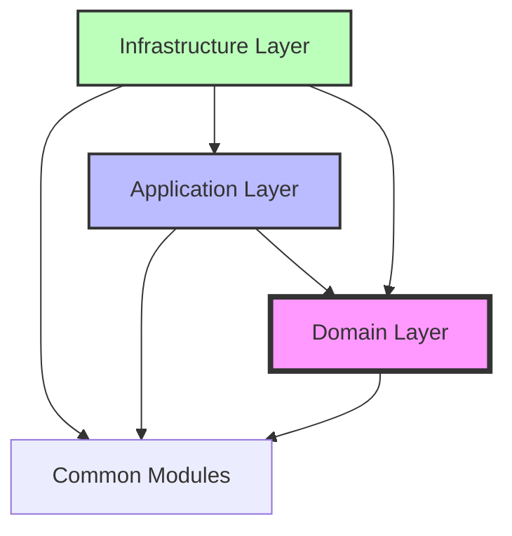

# Project Structure Documentation

## 📋 Table of Contents

- [Overview](#overview)
- [Directory Structure](#directory-structure)
- [Layer Architecture](#layer-architecture)
- [Module Descriptions](#module-descriptions)
- [Design Principles](#design-principles)
- [Naming Conventions](#naming-conventions)
- [Testing Structure](#testing-structure)
- [Configuration Management](#configuration-management)
- [Package Dependencies](#package-dependencies)
- [Best Practices](#best-practices)

## Overview

This project implements a **Microservices Architecture** following **Clean Architecture** and **Domain-Driven Design (DDD)** principles. The structure ensures:

- ✅ **Clear separation of concerns** across different layers
- ✅ **Independent deployability** of services
- ✅ **Testability** at all levels
- ✅ **Maintainability** through consistent patterns
- ✅ **Scalability** via microservices decomposition

## Directory Structure

```
fabric-management-backend/
├── 📦 common/                                  # Shared libraries (published as JARs)
│   ├── common-core/                           # Core shared structures
│   │   └── src/main/java/com/fabricmanagement/common/core/
│   │       ├── domain/                        # Base domain classes
│   │       │   ├── AggregateRoot.java        # DDD Aggregate base class
│   │       │   ├── BaseEntity.java           # Base entity with audit fields
│   │       │   ├── DomainEvent.java          # Domain event interface
│   │       │   ├── ValueObject.java          # Value object base class
│   │       │   └── Identifier.java           # Base identifier class
│   │       ├── exception/                     # Base exceptions
│   │       │   ├── DomainException.java      # Domain layer exceptions
│   │       │   ├── BusinessException.java    # Business rule violations
│   │       │   ├── ErrorCode.java            # Error code enumeration
│   │       │   └── ValidationException.java  # Validation exceptions
│   │       ├── specification/                 # Specification pattern
│   │       │   ├── Specification.java        # Base specification
│   │       │   └── CompositeSpecification.java
│   │       └── annotation/                    # Custom annotations
│   │           ├── DomainService.java
│   │           └── UseCase.java
│   │
│   ├── common-persistence/                    # Database utilities
│   │   └── src/main/java/com/fabricmanagement/common/persistence/
│   │       ├── entity/
│   │       │   ├── BaseJpaEntity.java        # JPA base entity
│   │       │   └── TenantAwareEntity.java    # Multi-tenant entity
│   │       ├── audit/
│   │       │   ├── AuditorAwareImpl.java     # Spring auditing
│   │       │   └── AuditingConfig.java       # Audit configuration
│   │       ├── config/
│   │       │   ├── BaseJpaConfig.java        # Base JPA configuration
│   │       │   └── FlywayConfig.java         # Migration configuration
│   │       ├── repository/
│   │       │   ├── BaseRepository.java       # Base repository interface
│   │       │   └── TenantAwareRepository.java
│   │       └── converter/
│   │           └── JsonAttributeConverter.java
│   │
│   └── common-web/                            # REST API utilities
│       └── src/main/java/com/fabricmanagement/common/web/
│           ├── dto/
│           │   ├── ApiResponse.java          # Standard API response wrapper
│           │   ├── ApiError.java             # Error response structure
│           │   ├── PageRequest.java          # Pagination request
│           │   ├── PageResponse.java         # Pagination response
│           │   └── ValidationError.java      # Validation error details
│           ├── exception/
│           │   ├── GlobalExceptionHandler.java
│           │   └── RestExceptionHandler.java
│           ├── filter/
│           │   ├── TenantFilter.java         # Multi-tenancy filter
│           │   └── RequestLoggingFilter.java
│           └── validator/
│               └── CommonValidators.java
│
├── 🚀 services/                               # Microservices
│   ├── user-service/
│   │   └── src/main/java/com/fabricmanagement/user/
│   │       ├── 🎯 UserServiceApplication.java # Spring Boot main class
│   │       │
│   │       ├── 📦 domain/                     # Domain Layer (Pure business logic)
│   │       │   ├── model/
│   │       │   │   ├── User.java             # User aggregate root
│   │       │   │   ├── UserProfile.java      # User profile entity
│   │       │   │   └── UserPreferences.java  # User preferences entity
│   │       │   ├── valueobject/
│   │       │   │   ├── UserId.java           # User ID value object
│   │       │   │   ├── Username.java         # Username value object
│   │       │   │   ├── Email.java            # Email value object
│   │       │   │   ├── PhoneNumber.java      # Phone number value object
│   │       │   │   ├── PersonName.java       # Person name value object
│   │       │   │   ├── TenantId.java         # Tenant ID value object
│   │       │   │   └── UserStatus.java       # User status enum
│   │       │   ├── event/                     # Domain events
│   │       │   │   ├── UserDomainEvent.java  # Base user event
│   │       │   │   ├── UserCreatedEvent.java
│   │       │   │   ├── UserActivatedEvent.java
│   │       │   │   ├── UserDeactivatedEvent.java
│   │       │   │   ├── UserSuspendedEvent.java
│   │       │   │   └── UserDeletedEvent.java
│   │       │   ├── exception/                 # Domain exceptions
│   │       │   │   ├── UserNotFoundException.java
│   │       │   │   ├── DuplicateUsernameException.java
│   │       │   │   ├── InvalidUserStateException.java
│   │       │   │   └── UserErrorCode.java
│   │       │   ├── repository/                # Repository interfaces (Ports)
│   │       │   │   ├── UserRepository.java
│   │       │   │   └── UserQueryRepository.java
│   │       │   ├── service/                   # Domain services
│   │       │   │   ├── UserDomainService.java
│   │       │   │   └── UserValidationService.java
│   │       │   └── specification/             # Business rules
│   │       │       ├── ActiveUserSpecification.java
│   │       │       └── UniqueUsernameSpecification.java
│   │       │
│   │       ├── 🔧 application/                # Application Layer (Use Cases)
│   │       │   ├── port/                      # Hexagonal Architecture Ports
│   │       │   │   ├── in/                    # Inbound ports (Use case interfaces)
│   │       │   │   │   ├── command/
│   │       │   │   │   │   ├── CreateUserUseCase.java
│   │       │   │   │   │   ├── UpdateUserUseCase.java
│   │       │   │   │   │   ├── DeleteUserUseCase.java
│   │       │   │   │   │   ├── ActivateUserUseCase.java
│   │       │   │   │   │   └── DeactivateUserUseCase.java
│   │       │   │   │   └── query/
│   │       │   │   │       ├── GetUserUseCase.java
│   │       │   │   │       ├── GetAllUsersUseCase.java
│   │       │   │   │       └── SearchUsersUseCase.java
│   │       │   │   └── out/                   # Outbound ports
│   │       │   │       ├── UserRepositoryPort.java
│   │       │   │       ├── EventPublisherPort.java
│   │       │   │       └── NotificationPort.java
│   │       │   ├── service/                   # Use case implementations
│   │       │   │   ├── command/
│   │       │   │   │   ├── CreateUserService.java
│   │       │   │   │   ├── UpdateUserService.java
│   │       │   │   │   └── DeleteUserService.java
│   │       │   │   └── query/
│   │       │   │       ├── GetUserService.java
│   │       │   │       └── SearchUserService.java
│   │       │   ├── dto/                       # Application DTOs
│   │       │   │   ├── command/               # Write operations
│   │       │   │   │   ├── CreateUserCommand.java
│   │       │   │   │   ├── UpdateUserCommand.java
│   │       │   │   │   └── BulkCreateUsersCommand.java
│   │       │   │   ├── query/                 # Read operations
│   │       │   │   │   ├── UserResponse.java
│   │       │   │   │   ├── UserDetailResponse.java
│   │       │   │   │   └── UserSearchCriteria.java
│   │       │   │   └── event/                 # Event DTOs
│   │       │   │       └── UserEventDto.java
│   │       │   ├── mapper/                    # DTO mappers
│   │       │   │   ├── UserApplicationMapper.java
│   │       │   │   └── UserEventMapper.java
│   │       │   └── saga/                      # Saga pattern (if needed)
│   │       │       └── UserCreationSaga.java
│   │       │
│   │       ├── 🏗️ infrastructure/            # Infrastructure Layer
│   │       │   ├── adapter/
│   │       │   │   ├── in/                    # Inbound adapters
│   │       │   │   │   ├── web/               # REST API
│   │       │   │   │   │   ├── controller/
│   │       │   │   │   │   │   ├── UserController.java
│   │       │   │   │   │   │   └── UserQueryController.java
│   │       │   │   │   │   ├── facade/        # Controller helpers
│   │       │   │   │   │   │   └── UserFacadeService.java
│   │       │   │   │   │   ├── dto/           # Web layer DTOs
│   │       │   │   │   │   │   ├── request/
│   │       │   │   │   │   │   │   ├── CreateUserRequest.java
│   │       │   │   │   │   │   │   ├── UpdateUserRequest.java
│   │       │   │   │   │   │   │   └── UserSearchRequest.java
│   │       │   │   │   │   │   └── response/
│   │       │   │   │   │   │       ├── UserWebResponse.java
│   │       │   │   │   │   │       └── UserListResponse.java
│   │       │   │   │   │   └── mapper/
│   │       │   │   │   │       └── UserWebMapper.java
│   │       │   │   │   ├── messaging/         # Message queue listeners
│   │       │   │   │   │   ├── UserEventListener.java
│   │       │   │   │   │   └── config/
│   │       │   │   │   │       └── RabbitMQConfig.java
│   │       │   │   │   └── scheduler/         # Scheduled tasks
│   │       │   │   │       └── UserCleanupScheduler.java
│   │       │   │   └── out/                   # Outbound adapters
│   │       │   │       ├── persistence/       # Database
│   │       │   │       │   ├── adapter/
│   │       │   │       │   │   └── UserRepositoryAdapter.java
│   │       │   │       │   ├── entity/        # JPA entities
│   │       │   │       │   │   ├── UserJpaEntity.java
│   │       │   │       │   │   └── UserProfileJpaEntity.java
│   │       │   │       │   ├── repository/    # Spring Data repositories
│   │       │   │       │   │   ├── UserJpaRepository.java
│   │       │   │       │   │   └── UserCustomRepository.java
│   │       │   │       │   ├── mapper/        # Entity mappers
│   │       │   │       │   │   └── UserPersistenceMapper.java
│   │       │   │       │   └── specification/ # JPA Specifications
│   │       │   │       │       └── UserJpaSpecification.java
│   │       │   │       ├── messaging/         # Message publishing
│   │       │   │       │   └── EventPublisherAdapter.java
│   │       │   │       └── external/          # External services
│   │       │   │           ├── NotificationServiceAdapter.java
│   │       │   │           └── client/
│   │       │   │               └── EmailServiceClient.java
│   │       │   └── config/                    # Infrastructure configs
│   │       │       ├── JpaConfig.java
│   │       │       ├── SecurityConfig.java
│   │       │       ├── SwaggerConfig.java
│   │       │       ├── AsyncConfig.java
│   │       │       └── CacheConfig.java
│   │       │
│   │       └── 🔧 common/                     # Service-specific utilities
│   │           ├── constants/
│   │           │   ├── UserConstants.java
│   │           │   ├── ErrorCodes.java
│   │           │   └── ApiPaths.java
│   │           ├── util/
│   │           │   ├── StringUtils.java
│   │           │   └── DateUtils.java
│   │           └── annotation/
│   │               └── LogExecutionTime.java
│   │
│   ├── contact-service/                       # Contact management service
│   ├── auth-service/                          # Authentication service
│   └── notification-service/                  # Notification service
│
├── 🔧 infrastructure/                         # Infrastructure services
│   ├── api-gateway/                          # Spring Cloud Gateway
│   ├── service-discovery/                    # Eureka Server
│   ├── config-server/                        # Configuration Server
│   └── monitoring/                           # Monitoring stack
│       ├── prometheus/
│       ├── grafana/
│       └── zipkin/
│
├── 📦 deployment/                             # Deployment configurations
│   ├── docker/
│   │   ├── docker-compose.yml               # Local development
│   │   ├── docker-compose.prod.yml          # Production setup
│   │   └── dockerfiles/
│   │       ├── user-service.Dockerfile
│   │       └── base.Dockerfile
│   ├── kubernetes/                          # K8s configurations
│   │   ├── namespace.yaml
│   │   ├── configmaps/
│   │   ├── secrets/
│   │   ├── deployments/
│   │   ├── services/
│   │   └── ingress/
│   └── helm/                                # Helm charts
│       └── fabric-system/
│
├── 📚 docs/                                  # Documentation
│   ├── architecture/
│   ├── api/
│   ├── development/
│   └── deployment/
│
├── 🧪 tests/                                # End-to-end tests
│   ├── e2e/
│   ├── performance/
│   └── contract/
│
└── 📄 Configuration Files
    ├── .gitignore
    ├── .editorconfig
    ├── pom.xml                              # Parent POM
    ├── README.md
    ├── CONTRIBUTING.md
    └── LICENSE
```

## Layer Architecture

### 🎯 1. Domain Layer (Core Business)

**Purpose**: Contains core business logic and rules  
**Dependencies**: None (pure Java/business logic)  
**Principles**: Rich domain model, DDD tactical patterns

#### Components:
- **Entities & Aggregates**: Core business objects with identity
- **Value Objects**: Immutable objects without identity
- **Domain Events**: Business events that have happened
- **Domain Services**: Business logic that doesn't fit in entities
- **Repository Interfaces**: Contracts for data persistence
- **Specifications**: Business rules and validations

#### Example:
```java
// Domain Entity
@Entity
public class User extends AggregateRoot<UserId> {
    private UserId id;
    private Username username;
    private Email email;
    private UserStatus status;
    private TenantId tenantId;
    
    // Business logic
    public void activate() {
        if (this.status != UserStatus.PENDING) {
            throw new InvalidUserStateException("User must be pending to activate");
        }
        this.status = UserStatus.ACTIVE;
        registerEvent(new UserActivatedEvent(this.id));
    }
}
```

### 🔧 2. Application Layer (Use Cases)

**Purpose**: Orchestrates use cases and coordinates domain objects  
**Dependencies**: Domain layer only  
**Principles**: One class per use case, CQRS pattern

#### Components:
- **Use Cases**: Application-specific business rules
- **DTOs**: Data transfer objects for communication
- **Ports**: Interfaces defining boundaries (Hexagonal Architecture)
- **Mappers**: Convert between domain and DTOs
- **Application Services**: Orchestrate domain objects

#### Example:
```java
@UseCase
@Transactional
public class CreateUserService implements CreateUserUseCase {
    private final UserRepository userRepository;
    private final EventPublisherPort eventPublisher;
    private final UserDomainService domainService;
    
    @Override
    public UserResponse execute(CreateUserCommand command) {
        // Validate command
        domainService.validateUsername(command.getUsername());
        
        // Create domain object
        User user = User.create(
            new Username(command.getUsername()),
            new Email(command.getEmail())
        );
        
        // Persist
        User savedUser = userRepository.save(user);
        
        // Publish events
        eventPublisher.publish(user.getUncommittedEvents());
        
        // Return response
        return UserMapper.toResponse(savedUser);
    }
}
```

### 🏗️ 3. Infrastructure Layer (Technical Implementation)

**Purpose**: Implements technical requirements and external integrations  
**Dependencies**: Application and Domain layers  
**Principles**: Dependency inversion, adapter pattern

#### Components:
- **Web Adapters**: REST controllers, GraphQL resolvers
- **Persistence Adapters**: Database implementations
- **Messaging Adapters**: Message queue integrations
- **External Service Adapters**: Third-party service clients
- **Configuration**: Framework and infrastructure setup

#### Example:
```java
@RestController
@RequestMapping(ApiPaths.USERS)
public class UserController {
    private final CreateUserUseCase createUserUseCase;
    private final UserWebMapper mapper;
    
    @PostMapping
    @ResponseStatus(HttpStatus.CREATED)
    public ApiResponse<UserWebResponse> createUser(
            @Valid @RequestBody CreateUserRequest request,
            @RequestHeader("X-Tenant-ID") String tenantId) {
        
        CreateUserCommand command = mapper.toCommand(request, tenantId);
        UserResponse response = createUserUseCase.execute(command);
        
        return ApiResponse.success(
            mapper.toWebResponse(response),
            "User created successfully"
        );
    }
}
```

### 📦 4. Common Layer (Shared Components)

**Purpose**: Shared utilities and base classes  
**Dependencies**: Minimal, framework-agnostic where possible  
**Principles**: DRY, single source of truth

#### Components:
- **Base Classes**: Common entity and value object bases
- **Shared DTOs**: Common response structures
- **Utilities**: Helper functions and common operations
- **Exceptions**: Base exception hierarchy

## Module Descriptions

### Common Modules

| Module | Purpose | Key Classes |
|--------|---------|-------------|
| `common-core` | Core domain primitives | `BaseEntity`, `ValueObject`, `DomainEvent` |
| `common-persistence` | JPA utilities | `BaseJpaEntity`, `BaseRepository` |
| `common-web` | REST utilities | `ApiResponse`, `GlobalExceptionHandler` |

### Service Modules

| Service | Purpose | Port | Status |
|---------|---------|------|--------|
| `user-service` | User management | 8081 | ✅ Active |
| `contact-service` | Contact information | 8082 | 🚧 In Progress |
| `auth-service` | Authentication & Authorization | 8083 | 📋 Planned |
| `notification-service` | Email/SMS notifications | 8084 | 📋 Planned |

### Infrastructure Modules

| Module | Purpose | Technology |
|--------|---------|------------|
| `api-gateway` | Request routing | Spring Cloud Gateway |
| `service-discovery` | Service registry | Eureka Server |
| `config-server` | Centralized configuration | Spring Cloud Config |

## Design Principles

### SOLID Principles

#### Single Responsibility Principle (SRP)
- Each class has one reason to change
- Controllers only handle HTTP concerns
- Services contain only business logic
- Repositories only handle data access

#### Open/Closed Principle (OCP)
- Open for extension, closed for modification
- Use interfaces and abstract classes
- Strategy pattern for varying behavior

#### Liskov Substitution Principle (LSP)
- Subtypes must be substitutable for base types
- Proper inheritance hierarchies

#### Interface Segregation Principle (ISP)
- Many specific interfaces over one general interface
- Separate read and write operations (CQRS)

#### Dependency Inversion Principle (DIP)
- Depend on abstractions, not concretions
- Use dependency injection
- Domain doesn't depend on infrastructure

### Clean Architecture Principles

1. **Independence of Frameworks**: Business logic doesn't depend on Spring
2. **Testability**: Business rules can be tested without external elements
3. **Independence of UI**: Business rules don't know about web layer
4. **Independence of Database**: Business rules don't know about database
5. **Independence of External Services**: Business rules are isolated

### Domain-Driven Design Patterns

- **Aggregate Pattern**: Consistency boundaries
- **Repository Pattern**: Abstract data access
- **Value Object Pattern**: Immutable domain concepts
- **Domain Event Pattern**: Decouple domain logic
- **Specification Pattern**: Encapsulate business rules

## Naming Conventions

### Package Naming

```java
com.fabricmanagement.{service}.{layer}.{feature}.{subfeature}

// Examples:
com.fabricmanagement.user.domain.model
com.fabricmanagement.user.application.service
com.fabricmanagement.user.infrastructure.adapter.web
```

### Class Naming

| Type | Convention | Example |
|------|------------|---------|
| **Entity** | Noun | `User`, `Order`, `Product` |
| **Value Object** | Descriptive Noun | `UserId`, `Email`, `Money` |
| **Aggregate Root** | Noun + Aggregate | `UserAggregate`, `OrderAggregate` |
| **Use Case** | Action + UseCase | `CreateUserUseCase` |
| **Service** | Feature + Service | `UserService`, `PaymentService` |
| **Controller** | Feature + Controller | `UserController` |
| **Repository** | Entity + Repository | `UserRepository` |
| **DTO** | Purpose + Type | `CreateUserCommand`, `UserResponse` |
| **Mapper** | Source + To + Target + Mapper | `UserToUserResponseMapper` |
| **Exception** | Problem + Exception | `UserNotFoundException` |
| **Event** | Entity + Action + Event | `UserCreatedEvent` |

### Method Naming

```java
// Commands (void or return created/updated entity)
createUser(CreateUserCommand command)
updateUser(UpdateUserCommand command)
deleteUser(UserId id)

// Queries (return data)
findById(UserId id)
findByUsername(Username username)
findAll(Pageable pageable)
existsByEmail(Email email)

// Business operations
activateUser()
suspendAccount(Reason reason)
calculateDiscount(Order order)

// Validation
validateUsername(Username username)
isEligibleForPromotion()
canBeDeleted()
```

## Testing Structure

```
src/test/java/
├── unit/                              # Unit tests (no Spring context)
│   ├── domain/                       # Domain logic tests
│   │   ├── model/
│   │   │   └── UserTest.java
│   │   ├── service/
│   │   │   └── UserDomainServiceTest.java
│   │   └── specification/
│   │       └── ActiveUserSpecificationTest.java
│   ├── application/                  # Use case tests
│   │   ├── service/
│   │   │   └── CreateUserServiceTest.java
│   │   └── mapper/
│   │       └── UserMapperTest.java
│   └── infrastructure/               # Infrastructure unit tests
│       └── mapper/
│           └── UserPersistenceMapperTest.java
│
├── integration/                       # Integration tests (Spring context)
│   ├── repository/                   # Database tests
│   │   └── UserRepositoryIT.java
│   ├── web/                         # API tests
│   │   └── UserControllerIT.java
│   └── messaging/                   # Message queue tests
│       └── UserEventPublisherIT.java
│
├── architecture/                     # Architecture tests (ArchUnit)
│   ├── LayerDependencyTest.java
│   ├── NamingConventionTest.java
│   └── CodingRulesTest.java
│
├── e2e/                             # End-to-end tests
│   └── UserJourneyTest.java
│
└── fixtures/                        # Test data builders
    ├── UserFixture.java
    └── CreateUserCommandFixture.java
```

### Test Naming Convention

```java
// Unit tests
@Test
void shouldCreateUser_WhenValidDataProvided()
@Test
void shouldThrowException_WhenUsernameAlreadyExists()

// Integration tests
@Test
@Sql("/test-data/users.sql")
void shouldPersistUser_WhenSaved()

// Architecture tests
@Test
void domainLayer_ShouldNotDependOn_InfrastructureLayer()
```

## Configuration Management

### Application Configuration

```
src/main/resources/
├── 📄 application.yml                 # Base configuration
├── 📄 application-dev.yml             # Development profile
├── 📄 application-test.yml            # Test profile
├── 📄 application-staging.yml         # Staging profile
├── 📄 application-prod.yml            # Production profile
├── 📄 bootstrap.yml                   # Cloud config
├── 🗄️ db/
│   └── migration/                    # Flyway migrations
│       ├── V1__create_user_table.sql
│       ├── V2__add_user_indices.sql
│       └── V3__add_user_metadata.sql
├── 📊 static/                        # Static resources
├── 📋 templates/                     # Email templates
└── 🔐 certificates/                  # SSL certificates
```

### Environment-Specific Configurations

#### Development
```yaml
spring:
  profiles: dev
  datasource:
    url: jdbc:postgresql://localhost:5433/user_db
  jpa:
    show-sql: true
logging:
  level:
    com.fabricmanagement: DEBUG
```

#### Production
```yaml
spring:
  profiles: prod
  datasource:
    url: ${DB_URL}
  jpa:
    show-sql: false
logging:
  level:
    com.fabricmanagement: INFO
```

## Package Dependencies

### Dependency Rules



### Maven Module Dependencies

```xml
<!-- Domain module -->
<dependencies>
    <dependency>
        <groupId>com.fabricmanagement</groupId>
        <artifactId>common-core</artifactId>
    </dependency>
    <!-- No framework dependencies! -->
</dependencies>

<!-- Application module -->
<dependencies>
    <dependency>
        <groupId>com.fabricmanagement</groupId>
        <artifactId>user-domain</artifactId>
    </dependency>
    <dependency>
        <groupId>org.springframework</groupId>
        <artifactId>spring-context</artifactId>
    </dependency>
</dependencies>

<!-- Infrastructure module -->
<dependencies>
    <dependency>
        <groupId>com.fabricmanagement</groupId>
        <artifactId>user-application</artifactId>
    </dependency>
    <dependency>
        <groupId>org.springframework.boot</groupId>
        <artifactId>spring-boot-starter-web</artifactId>
    </dependency>
    <dependency>
        <groupId>org.springframework.boot</groupId>
        <artifactId>spring-boot-starter-data-jpa</artifactId>
    </dependency>
</dependencies>
```

## Best Practices

### Code Organization

1. **Package by Layer, then by Feature**
   ```
   ✅ com.fabricmanagement.user.domain.model
   ❌ com.fabricmanagement.model.user
   ```

2. **Keep Classes Small and Focused**
    - Maximum 200 lines per class
    - Maximum 20 lines per method
    - Maximum 5 parameters per method

3. **Use Meaningful Names**
   ```java
   ✅ UserNotFoundException
   ❌ Exception1, UserEx, UNFE
   ```

### Domain Layer Best Practices

1. **Rich Domain Models**
   ```java
   // ✅ Good - Business logic in domain
   user.activate();
   
   // ❌ Bad - Anemic domain model
   userService.setUserStatus(user, "ACTIVE");
   ```

2. **Immutable Value Objects**
   ```java
   @Value
   public class Email {
       String value;
       
       public Email(String value) {
           validate(value);
           this.value = value;
       }
   }
   ```

3. **Domain Events for Side Effects**
   ```java
   public void activate() {
       this.status = UserStatus.ACTIVE;
       registerEvent(new UserActivatedEvent(this.id));
   }
   ```

### Application Layer Best Practices

1. **Single Use Case per Class**
   ```java
   ✅ CreateUserUseCase, UpdateUserUseCase
   ❌ UserUseCase with multiple methods
   ```

2. **Use DTOs for Communication**
   ```java
   // Never expose domain entities directly
   public UserResponse createUser(CreateUserCommand command) {
       User user = // ... create user
       return mapper.toResponse(user); // Return DTO
   }
   ```

3. **Transaction Boundaries**
   ```java
   @Transactional
   public class CreateUserService {
       // Transaction starts and ends here
   }
   ```

### Infrastructure Layer Best Practices

1. **Thin Controllers**
   ```java
   @PostMapping
   public ResponseEntity<UserResponse> createUser(@RequestBody Request request) {
       // Only handle HTTP concerns
       return ResponseEntity.ok(useCase.execute(toCommand(request)));
   }
   ```

2. **Adapter Pattern for External Services**
   ```java
   // Port (in application layer)
   public interface NotificationPort {
       void sendEmail(EmailMessage message);
   }
   
   // Adapter (in infrastructure layer)
   @Component
   public class EmailServiceAdapter implements NotificationPort {
       // Implementation details
   }
   ```

3. **Repository Implementation**
   ```java
   @Repository
   public class UserRepositoryAdapter implements UserRepository {
       private final JpaUserRepository jpaRepository;
       private final UserPersistenceMapper mapper;
       
       @Override
       public User save(User user) {
           UserEntity entity = mapper.toEntity(user);
           UserEntity saved = jpaRepository.save(entity);
           return mapper.toDomain(saved);
       }
   }
   ```

### Testing Best Practices

1. **Test Pyramid**
    - 70% Unit tests (fast, isolated)
    - 20% Integration tests (database, API)
    - 10% E2E tests (complete flow)

2. **Test Data Builders**
   ```java
   User user = UserFixture.aUser()
       .withUsername("john.doe")
       .withStatus(UserStatus.ACTIVE)
       .build();
   ```

3. **Meaningful Test Names**
   ```java
   @Test
   void shouldActivateUser_WhenUserIsPending()
   
   @Test
   void shouldThrowException_WhenUserAlreadyActive()
   ```

### Security Best Practices

1. **Input Validation**
   ```java
   @NotNull @Size(min = 3, max = 50)
   private String username;
   ```

2. **Tenant Isolation**
   ```java
   @Where(clause = "deleted = false")
   @Filter(name = "tenantFilter", condition = "tenant_id = :tenantId")
   public class UserEntity extends BaseEntity {
       // Multi-tenant entity
   }
   ```

3. **Audit Logging**
   ```java
   @EntityListeners(AuditingEntityListener.class)
   public abstract class BaseEntity {
       @CreatedBy
       private String createdBy;
       
       @CreatedDate
       private Instant createdAt;
   }
   ```

## Continuous Integration

### Build Pipeline

```yaml
stages:
  - build
  - test
  - code-quality
  - package
  - deploy

build:
  script:
    - mvn clean compile

unit-tests:
  script:
    - mvn test

integration-tests:
  script:
    - mvn verify

sonar-analysis:
  script:
    - mvn sonar:sonar

docker-build:
  script:
    - docker build -t user-service:$CI_COMMIT_SHA .
```

## Monitoring & Observability

### Key Metrics

1. **Application Metrics**
    - Request rate
    - Response time
    - Error rate
    - Active users

2. **Business Metrics**
    - Users created per day
    - User activation rate
    - Feature usage

3. **Infrastructure Metrics**
    - CPU usage
    - Memory usage
    - Database connections
    - Queue size

### Logging Strategy

```java
@Slf4j
public class UserService {
    public User createUser(CreateUserCommand command) {
        log.info("Creating user with username: {}", command.getUsername());
        
        try {
            User user = // ... create logic
            log.info("User created successfully with id: {}", user.getId());
            return user;
        } catch (Exception e) {
            log.error("Failed to create user", e);
            throw e;
        }
    }
}
```

## Migration Guide

### Adding a New Service

1. Create service directory structure
2. Copy base configuration from template
3. Define domain model
4. Implement use cases
5. Add infrastructure adapters
6. Write tests
7. Update documentation
8. Add to docker-compose
9. Configure in API Gateway

### Upgrading Dependencies

1. Update parent POM version
2. Run dependency analysis
3. Fix breaking changes
4. Run full test suite
5. Update documentation
6. Deploy to staging first

## Troubleshooting

### Common Issues

| Issue | Cause | Solution |
|-------|-------|----------|
| Bean not found | Missing annotation | Add `@Component`, `@Service`, etc. |
| Transaction not working | Wrong layer | Move `@Transactional` to application layer |
| Mapper not generating | Annotation processing | Enable in IDE settings |
| Test context fails | Missing configuration | Add `@SpringBootTest` |

## Resources

### Documentation
- [Spring Boot Reference](https://spring.io/projects/spring-boot)
- [Clean Architecture Book](https://www.amazon.com/Clean-Architecture-Craftsmans-Software-Structure/dp/0134494164)
- [Domain-Driven Design Book](https://www.amazon.com/Domain-Driven-Design-Tackling-Complexity-Software/dp/0321125215)
- [Microservices Patterns](https://microservices.io/patterns/)

### Tools
- [ArchUnit](https://www.archunit.org/) - Architecture testing
- [MapStruct](https://mapstruct.org/) - Code generation for mappers
- [Lombok](https://projectlombok.org/) - Boilerplate reduction
- [Flyway](https://flywaydb.org/) - Database migrations

---

**Version:** 1.0.0  
**Last Updated:** January 2025  
**Maintained By:** Architecture Team  
**Contact:** architecture@fabricmanagement.com