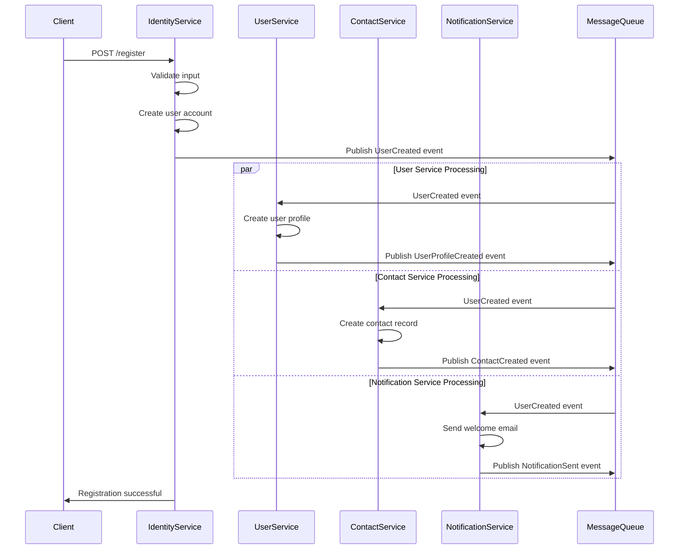
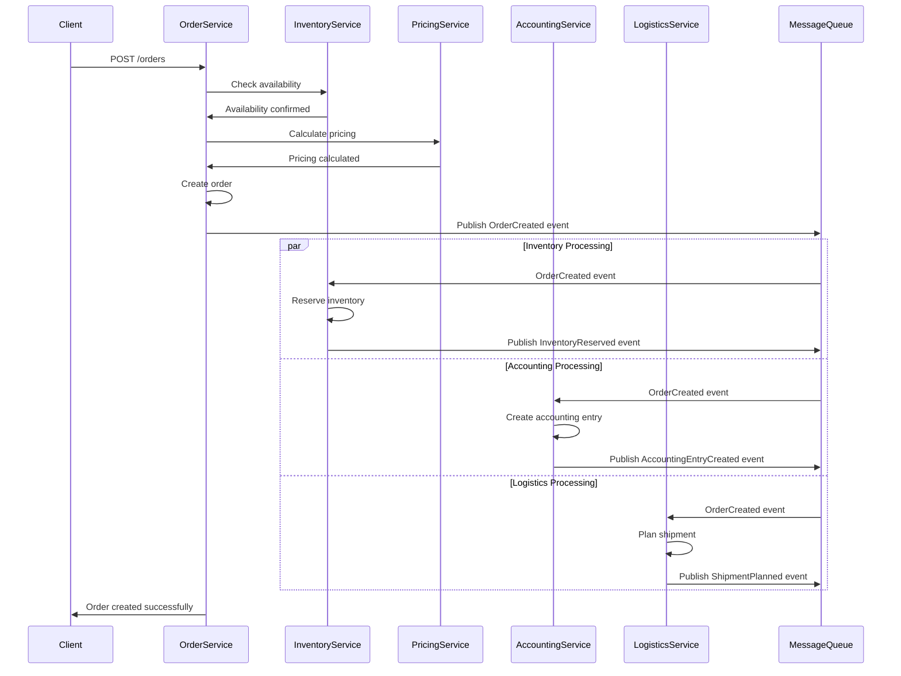
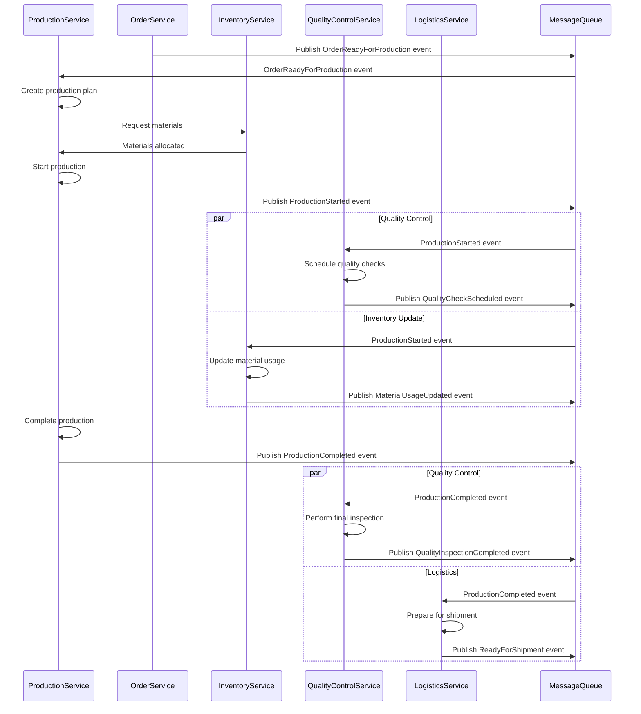
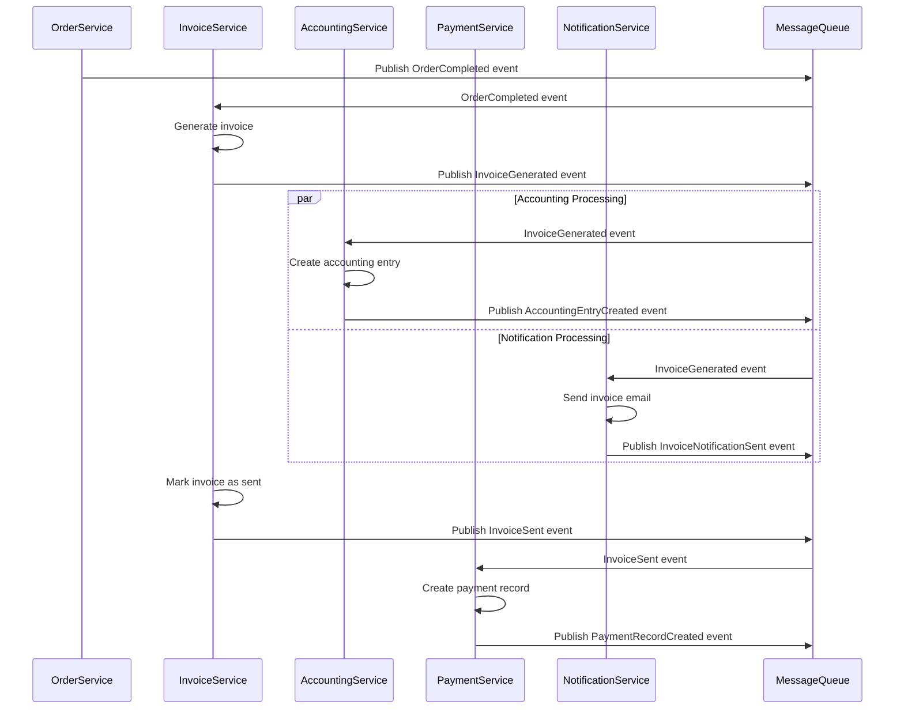
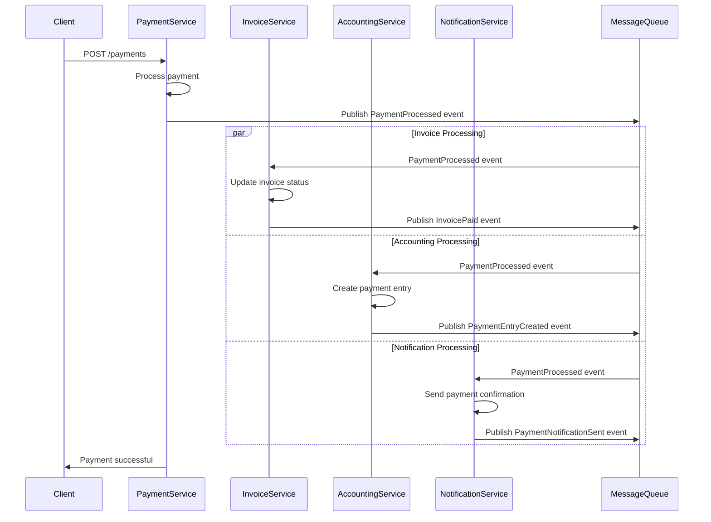
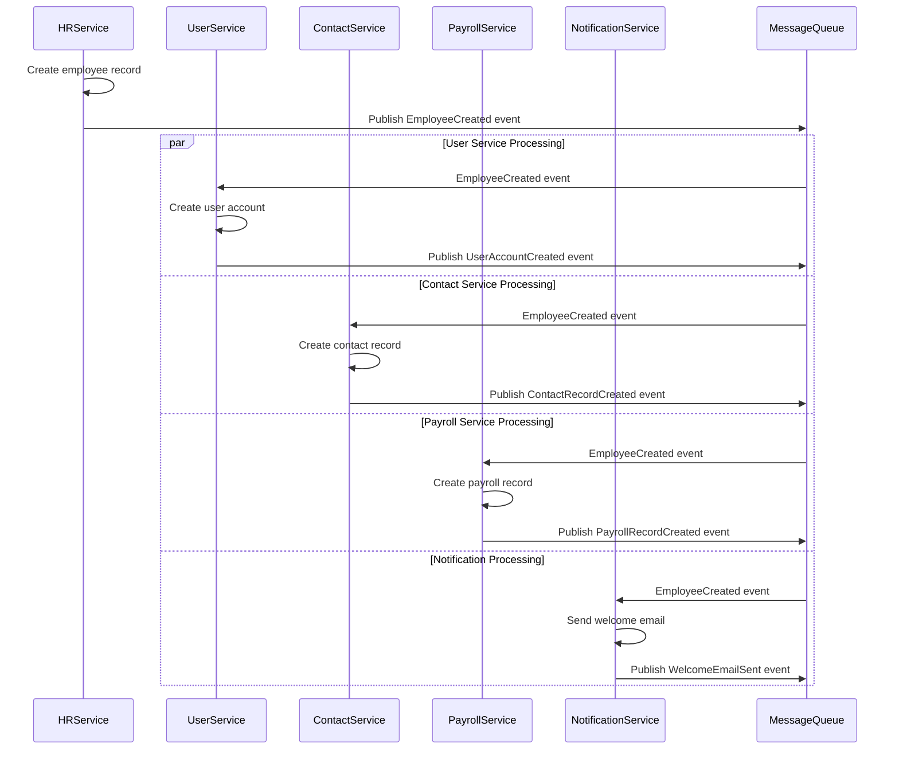
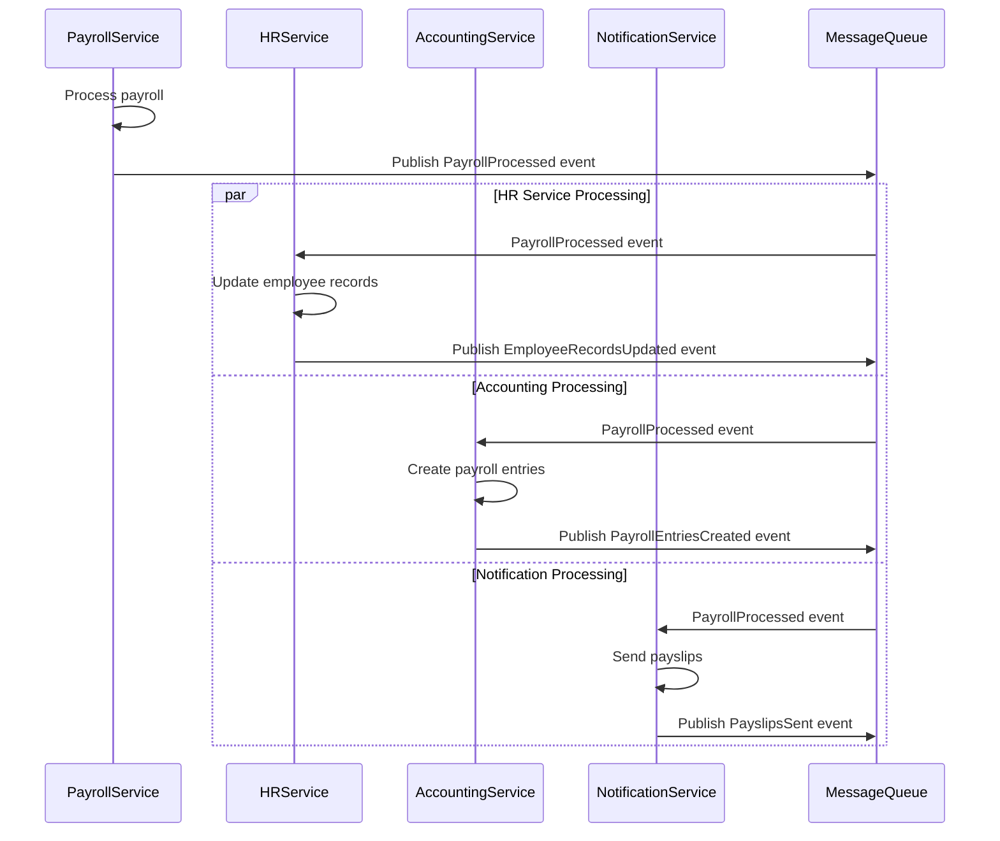
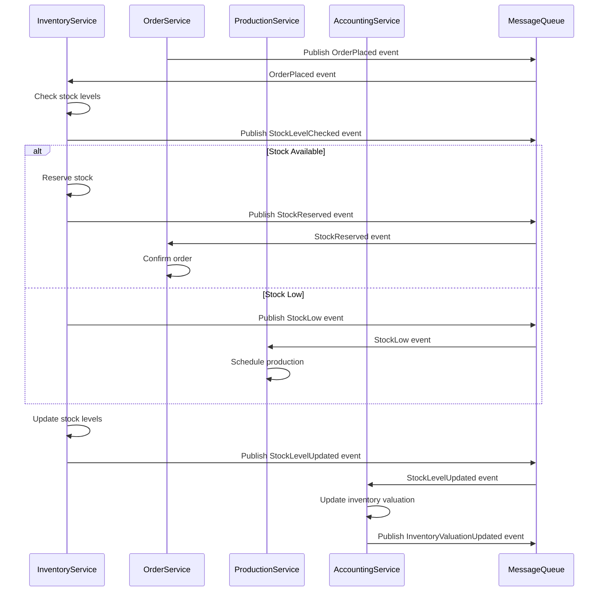
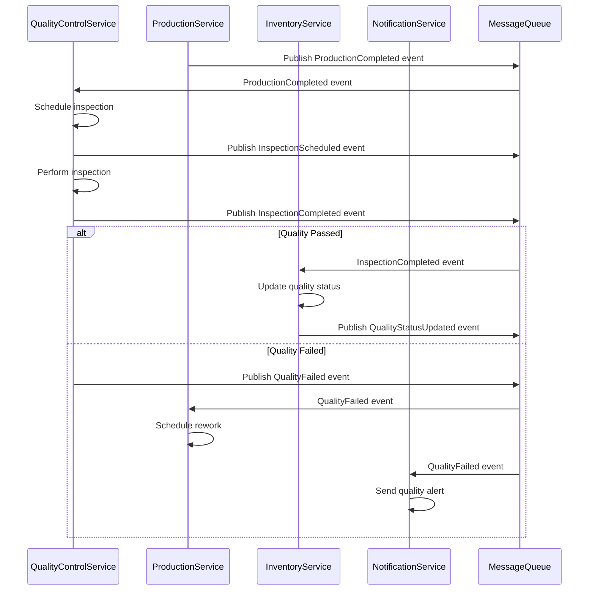
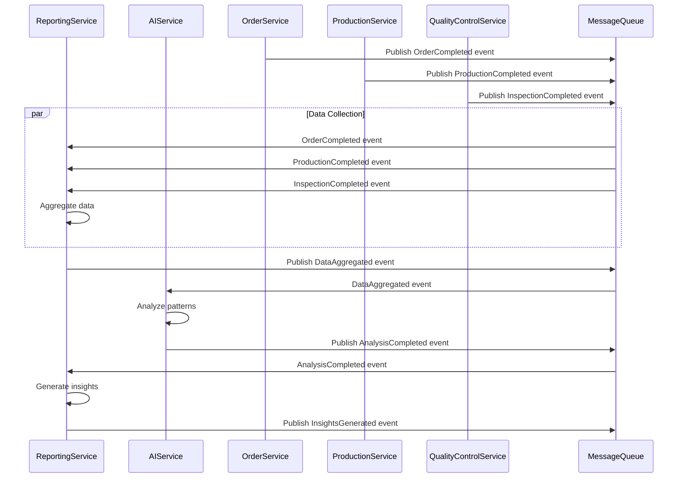

# Inter-Service Event Flow Diagrams

## 📋 Overview

This document provides comprehensive event flow diagrams showing how different services communicate through events in the Fabric Management System. These diagrams illustrate the asynchronous communication patterns and event-driven architecture.

## 🏗️ Event Architecture Overview

### **Event Types**

- **Domain Events**: Business logic events (UserCreated, OrderPlaced, etc.)
- **Integration Events**: Service-to-service communication events
- **System Events**: Infrastructure events (HealthCheck, ServiceDown, etc.)

### **Event Flow Patterns**

- **Request-Response**: Synchronous communication via REST APIs
- **Event-Driven**: Asynchronous communication via message queues
- **Saga Pattern**: Distributed transaction coordination
- **CQRS**: Command Query Responsibility Segregation

## 📊 Core Service Event Flows

### **1. User Registration Flow**



### **2. Order Processing Flow**



### **3. Production Workflow**



## 🔄 Financial Service Event Flows

### **4. Invoice Processing Flow**



### **5. Payment Processing Flow**



## 🏭 HR Service Event Flows

### **6. Employee Onboarding Flow**



### **7. Payroll Processing Flow**



## 📦 Inventory Service Event Flows

### **8. Stock Movement Flow**



## 🔍 Quality Control Event Flows

### **9. Quality Inspection Flow**



## 🤖 AI & Analytics Event Flows

### **10. Analytics Processing Flow**



## 📊 Event Flow Summary

### **Event Categories**

| Category             | Events                                     | Services Involved                            |
| -------------------- | ------------------------------------------ | -------------------------------------------- |
| **User Management**  | UserCreated, UserUpdated, UserDeleted      | Identity, User, Contact, Notification        |
| **Order Management** | OrderCreated, OrderUpdated, OrderCompleted | Order, Inventory, Pricing, Accounting        |
| **Production**       | ProductionStarted, ProductionCompleted     | Production, Inventory, Quality, Logistics    |
| **Financial**        | InvoiceGenerated, PaymentProcessed         | Invoice, Payment, Accounting, Notification   |
| **HR**               | EmployeeCreated, PayrollProcessed          | HR, User, Payroll, Accounting, Notification  |
| **Inventory**        | StockReserved, StockLevelUpdated           | Inventory, Order, Production, Accounting     |
| **Quality**          | InspectionCompleted, QualityFailed         | Quality, Production, Inventory, Notification |
| **Analytics**        | DataAggregated, InsightsGenerated          | Reporting, AI, All Business Services         |

### **Event Flow Patterns**

1. **Fan-Out Pattern**: One event triggers multiple services
2. **Fan-In Pattern**: Multiple events aggregate into one service
3. **Saga Pattern**: Long-running transactions across services
4. **Event Sourcing**: State changes stored as events
5. **CQRS**: Separate read and write models

### **Message Queue Topics**

| Topic               | Purpose                 | Services                                     |
| ------------------- | ----------------------- | -------------------------------------------- |
| `user-events`       | User lifecycle events   | Identity, User, Contact, Notification        |
| `order-events`      | Order processing events | Order, Inventory, Production, Logistics      |
| `financial-events`  | Financial transactions  | Invoice, Payment, Accounting, Notification   |
| `hr-events`         | HR operations           | HR, Payroll, User, Accounting                |
| `inventory-events`  | Stock management        | Inventory, Order, Production, Quality        |
| `production-events` | Production workflow     | Production, Inventory, Quality, Logistics    |
| `quality-events`    | Quality control         | Quality, Production, Inventory, Notification |
| `analytics-events`  | Data analysis           | Reporting, AI, All Services                  |

## 🚀 Implementation Guidelines

### **Event Design Principles**

1. **Immutable Events**: Events should not be modified after creation
2. **Versioned Events**: Support event schema evolution
3. **Idempotent Handlers**: Handle duplicate events gracefully
4. **Event Ordering**: Maintain event order where necessary
5. **Dead Letter Queues**: Handle failed event processing

### **Event Naming Conventions**

- **Past Tense**: Events represent completed actions
- **Descriptive**: Clear and unambiguous names
- **Consistent**: Follow established patterns
- **Versioned**: Include version information

### **Event Schema Standards**

```json
{
  "eventId": "uuid",
  "eventType": "UserCreated",
  "eventVersion": "1.0",
  "timestamp": "2025-01-01T00:00:00Z",
  "source": "identity-service",
  "data": {
    "userId": "uuid",
    "username": "string",
    "email": "string",
    "tenantId": "uuid"
  },
  "metadata": {
    "correlationId": "uuid",
    "causationId": "uuid"
  }
}
```

---

**Last Updated**: January 2025  
**Version**: 1.0.0  
**Status**: Active - Implementation in progress
