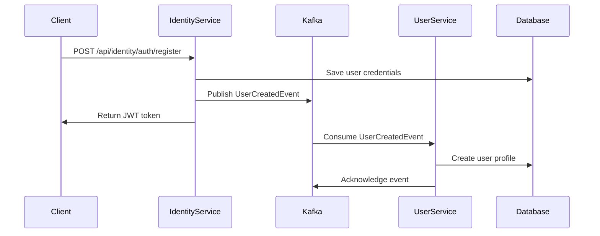
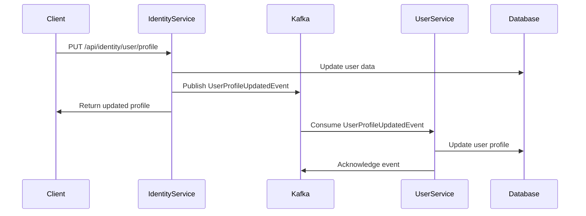

# 🔗 Identity-User Service Integration

## 📋 Overview

This document describes the event-driven integration between the Identity Service and User Service in the Fabric Management System. The integration ensures loose coupling while maintaining data consistency across services.

## 🎯 Integration Goals

- **Loose Coupling**: Services communicate via events, not direct API calls
- **Data Consistency**: User data synchronized across services
- **Fault Tolerance**: Services can operate independently
- **Scalability**: Each service can scale independently
- **Maintainability**: Clear separation of concerns

## 🏗️ Architecture Pattern

### **Event-Driven Architecture**

- **Publisher**: Identity Service publishes domain events
- **Consumer**: User Service consumes events and updates local data
- **Message Broker**: Apache Kafka handles event streaming
- **Event Store**: Events persisted for reliability

## 🔄 Integration Flow

### **User Registration Flow**



### **User Profile Update Flow**



## 📡 Event Schema

### **UserCreatedEvent**

```json
{
  "eventId": "uuid",
  "eventType": "UserCreatedEvent",
  "timestamp": "2024-01-01T00:00:00Z",
  "userId": "uuid",
  "tenantId": "uuid",
  "username": "string"
}
```

### **UserProfileUpdatedEvent**

```json
{
  "eventId": "uuid",
  "eventType": "UserProfileUpdatedEvent",
  "timestamp": "2024-01-01T00:00:00Z",
  "userId": "uuid"
}
```

## 🔧 Implementation Details

### **Identity Service (Publisher)**

#### **Event Publisher**

```java
@Component
@RequiredArgsConstructor
@Slf4j
public class IdentityEventPublisher {
    private final KafkaTemplate<String, Object> kafkaTemplate;

    public void publishUserCreatedEvent(UserCreatedEvent event) {
        log.info("Publishing UserCreatedEvent for user ID: {}", event.getUserId());
        kafkaTemplate.send("user.created", event.getUserId().toString(), event);
    }
}
```

#### **Event Publishing in Services**

```java
// In AuthenticationService.register()
user = userRepository.save(user);
eventPublisher.publishUserCreatedEvent(
    new UserCreatedEvent(user.getId().getValue(), user.getTenantId(), user.getUsername())
);
```

### **User Service (Consumer)**

#### **Event Consumer**

```java
@Component
@RequiredArgsConstructor
@Slf4j
public class IdentityEventConsumer {
    private final UserApplicationService userApplicationService;

    @KafkaListener(topics = "user.created", groupId = "user-service")
    public void listenUserCreated(UserCreatedEvent event, Acknowledgment acknowledgment) {
        log.info("Received UserCreatedEvent: {}", event);
        userApplicationService.createUserProfileFromEvent(event);
        acknowledgment.acknowledge();
    }
}
```

#### **Event Processing**

```java
// In UserApplicationService
public void createUserProfileFromEvent(UserCreatedEvent event) {
    User user = new User();
    user.setId(event.getUserId());
    user.setTenantId(event.getTenantId());
    user.setUsername(event.getUsername());
    user.setStatus(UserStatus.ACTIVE);

    userRepository.save(user);
}
```

## ⚙️ Configuration

### **Kafka Producer Configuration (Identity Service)**

```yaml
spring:
  kafka:
    bootstrap-servers: ${KAFKA_BOOTSTRAP_SERVERS:localhost:9092}
    producer:
      client-id: identity-service
      key-serializer: org.apache.kafka.common.serialization.StringSerializer
      value-serializer: org.springframework.kafka.support.serializer.JsonSerializer
      acks: all
      retries: 3
      enable-idempotence: true
```

### **Kafka Consumer Configuration (User Service)**

```yaml
spring:
  kafka:
    bootstrap-servers: ${KAFKA_BOOTSTRAP_SERVERS:localhost:9092}
    consumer:
      group-id: user-service
      key-deserializer: org.apache.kafka.common.serialization.StringDeserializer
      value-deserializer: org.springframework.kafka.support.serializer.JsonDeserializer
      auto-offset-reset: earliest
      enable-auto-commit: false
```

## 🛡️ Error Handling

### **Event Publishing Errors**

- **Retry Logic**: Automatic retry with exponential backoff
- **Dead Letter Queue**: Failed events sent to DLQ for manual processing
- **Circuit Breaker**: Prevents cascade failures

### **Event Consumption Errors**

- **Manual Acknowledgment**: Events acknowledged only after successful processing
- **Error Logging**: Detailed error logs for troubleshooting
- **Poison Message Handling**: Malformed events handled gracefully

## 🔍 Monitoring and Observability

### **Metrics**

- Event publishing rate
- Event consumption rate
- Processing latency
- Error rates
- Queue depth

### **Logging**

- Structured logging with correlation IDs
- Event traceability
- Performance metrics
- Error details

### **Health Checks**

- Kafka connectivity
- Event processing health
- Service dependencies
- Resource utilization

## 🚀 Deployment Considerations

### **Kafka Configuration**

- **Replication Factor**: 3 for production
- **Partition Count**: Based on expected load
- **Retention Policy**: 7 days for events
- **Compression**: GZIP for efficiency

### **Service Dependencies**

- Identity Service can start without User Service
- User Service requires Kafka for event consumption
- Graceful degradation when services are unavailable

## 🔧 Troubleshooting

### **Common Issues**

#### **Events Not Being Published**

- Check Kafka connectivity
- Verify producer configuration
- Check event serialization
- Review error logs

#### **Events Not Being Consumed**

- Check consumer group status
- Verify topic configuration
- Check deserialization settings
- Review consumer logs

#### **Data Inconsistency**

- Check event processing logs
- Verify database transactions
- Review event ordering
- Check for duplicate events

### **Debugging Commands**

```bash
# Check Kafka topics
kafka-topics --bootstrap-server localhost:9092 --list

# Check consumer group status
kafka-consumer-groups --bootstrap-server localhost:9092 --group user-service --describe

# Monitor event flow
kafka-console-consumer --bootstrap-server localhost:9092 --topic user.created --from-beginning
```

## 📚 Related Documentation

- [Identity Service Documentation](../services/identity-service/README.md)
- [User Service Documentation](../services/user-service/README.md)
- [Kafka Configuration Guide](../deployment/kafka-configuration.md)
- [Event Schema Registry](../integration/event-schema-registry.md)
