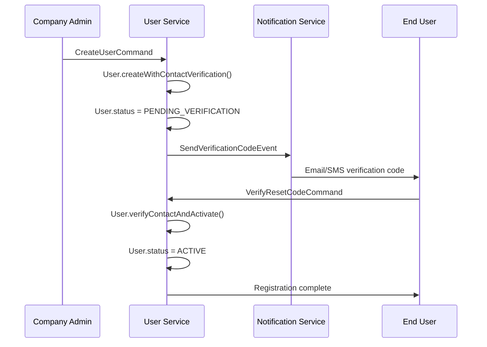
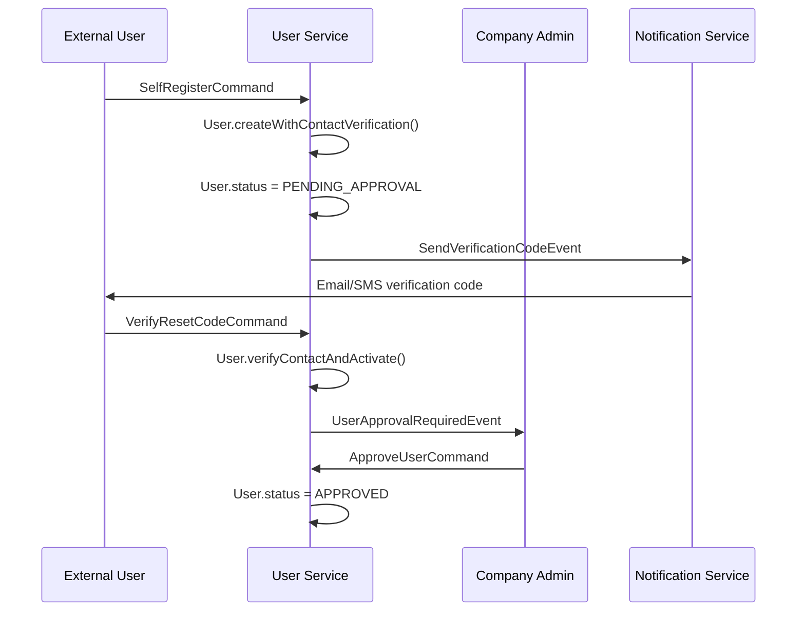
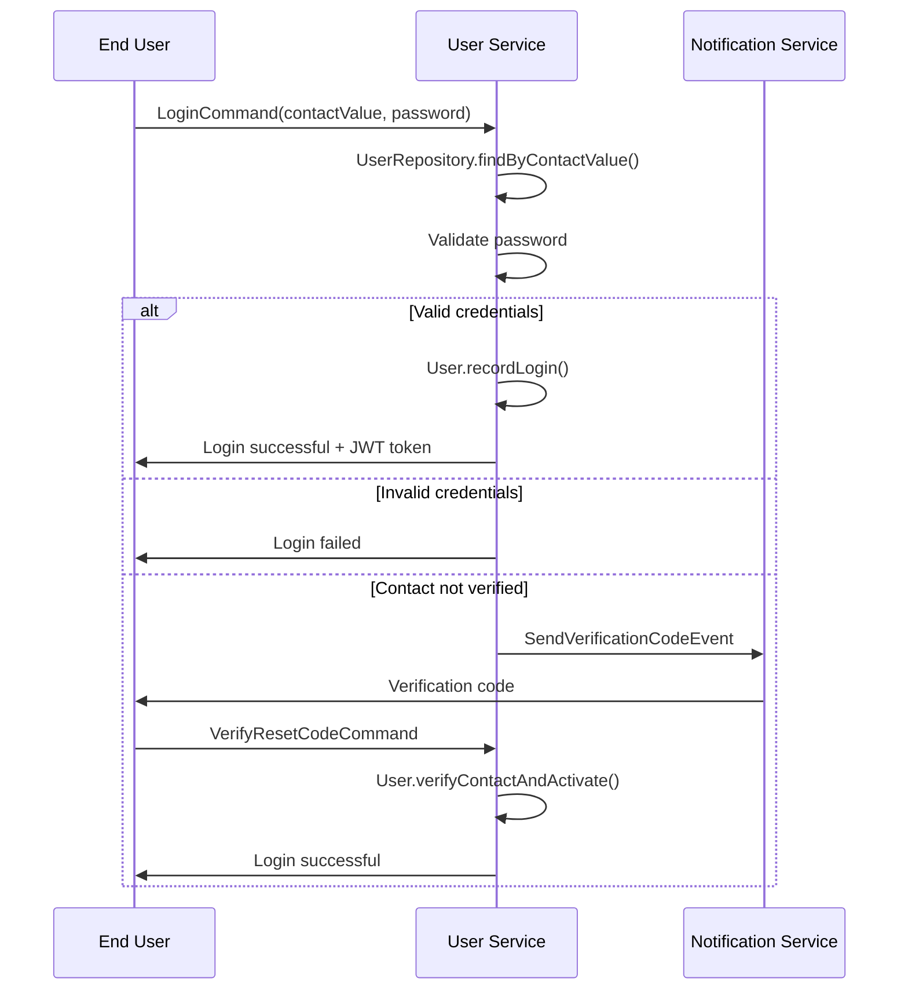
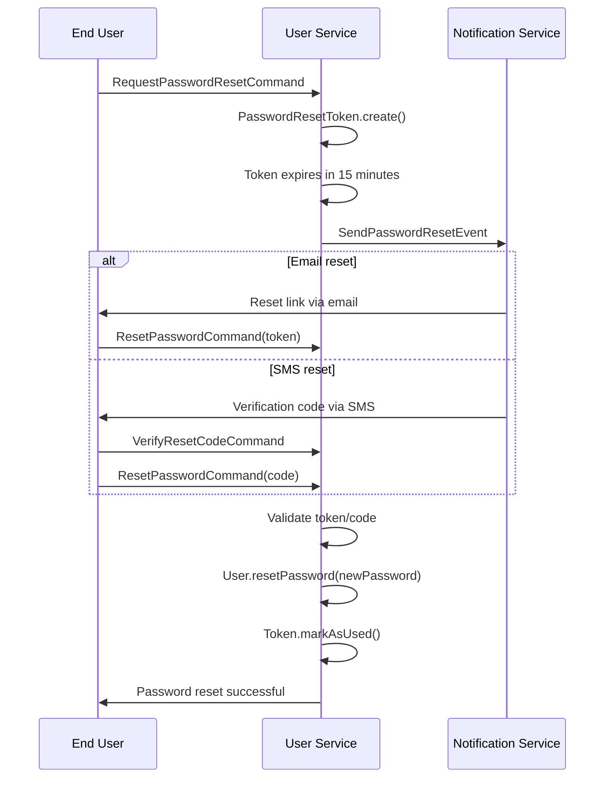

# 👤 User Service Documentation

## 📋 Overview

The User Service is a comprehensive microservice responsible for user management, authentication, and authorization within the Fabric Management System. It implements modern architectural patterns including Clean Architecture, CQRS, Event Sourcing, and Domain-Driven Design.

## 🏗️ Architecture

### Domain Model

The User Service follows a sophisticated domain model with the following key components:

#### 1. User Aggregate Root

```java
@Entity
@Table(name = "users")
@Getter
@Setter
@NoArgsConstructor
@SuperBuilder
public class User extends BaseEntity {

    @Column(name = "tenant_id", nullable = false)
    private String tenantId;

    @Column(name = "first_name", nullable = false)
    private String firstName;

    @Column(name = "last_name", nullable = false)
    private String lastName;

    @Enumerated(EnumType.STRING)
    @Column(name = "status", nullable = false)
    private UserStatus status;

    @Enumerated(EnumType.STRING)
    @Column(name = "registration_type", nullable = false)
    private RegistrationType registrationType;

    @OneToMany(mappedBy = "userId", cascade = CascadeType.ALL, fetch = FetchType.LAZY)
    private List<UserContact> contacts;

    @Transient
    private final List<Object> domainEvents = new ArrayList<>();
}
```

#### 2. UserContact Entity

```java
@Entity
@Table(name = "user_contacts")
@Getter
@Setter
@NoArgsConstructor
@SuperBuilder
public class UserContact extends BaseEntity {

    @Column(name = "user_id", nullable = false)
    private String userId;

    @Column(name = "contact_value", nullable = false, unique = true)
    private String contactValue;

    @Enumerated(EnumType.STRING)
    @Column(name = "contact_type", nullable = false)
    private ContactType contactType;

    @Column(name = "is_verified", nullable = false)
    private boolean isVerified;

    @Column(name = "is_primary", nullable = false)
    private boolean isPrimary;

    @Column(name = "verified_at")
    private LocalDateTime verifiedAt;
}
```

#### 3. PasswordResetToken Entity

```java
@Entity
@Table(name = "password_reset_tokens")
@Getter
@Setter
@NoArgsConstructor
@SuperBuilder
public class PasswordResetToken extends BaseEntity {

    @Column(name = "user_id", nullable = false)
    private String userId;

    @Column(name = "contact_value", nullable = false)
    private String contactValue;

    @Column(name = "token", nullable = false, unique = true)
    private String token;

    @Enumerated(EnumType.STRING)
    @Column(name = "reset_method", nullable = false)
    private ResetMethod resetMethod;

    @Column(name = "expires_at", nullable = false)
    private LocalDateTime expiresAt;

    @Column(name = "attempts_remaining", nullable = false)
    private int attemptsRemaining;

    @Column(name = "is_used", nullable = false)
    private boolean isUsed;
}
```

## 🔄 Business Flows

### 1. User Registration Flow

#### Direct Registration (Company Users)



#### Self-Registration (External Partners)



### 2. Login Flow



### 3. Password Reset Flow



## 🎯 Key Features

### 1. Multi-Contact Authentication

- **Email-based login**: Primary contact method
- **Phone-based login**: Secondary contact method
- **Contact verification**: Required for activation
- **Contact management**: Users can add/verify additional contacts

### 2. Flexible Registration

- **Direct registration**: Company admins create users
- **Self-registration**: External partners register themselves
- **Approval workflow**: Admin approval for self-registered users
- **Contact verification**: Email/SMS verification required

### 3. Password Security

- **Secure reset**: 15-minute token expiry
- **Attempt limiting**: 3 attempts per token
- **Multiple methods**: Email link or SMS code
- **Password invalidation**: Old passwords completely removed

### 4. Role-Based Access

- **Employee roles**: Internal company users
- **Partner roles**: External business partners
- **Admin roles**: System administrators
- **Custom roles**: Company-specific roles

## 🗄️ Database Schema

### Users Table

```sql
CREATE TABLE users (
    id UUID PRIMARY KEY DEFAULT gen_random_uuid(),
    tenant_id VARCHAR(255) NOT NULL,
    first_name VARCHAR(100) NOT NULL,
    last_name VARCHAR(100) NOT NULL,
    display_name VARCHAR(200),
    status VARCHAR(50) NOT NULL,
    registration_type VARCHAR(50) NOT NULL,
    invitation_token VARCHAR(255),
    password_hash VARCHAR(255),
    role VARCHAR(100),
    last_login_at TIMESTAMP,
    last_login_ip VARCHAR(45),
    created_at TIMESTAMP NOT NULL DEFAULT CURRENT_TIMESTAMP,
    updated_at TIMESTAMP NOT NULL DEFAULT CURRENT_TIMESTAMP,
    created_by VARCHAR(100),
    updated_by VARCHAR(100),
    deleted BOOLEAN DEFAULT FALSE,
    version INTEGER DEFAULT 0
);
```

### User Contacts Table

```sql
CREATE TABLE user_contacts (
    id UUID PRIMARY KEY DEFAULT gen_random_uuid(),
    user_id VARCHAR(255) NOT NULL,
    contact_value VARCHAR(255) NOT NULL UNIQUE,
    contact_type VARCHAR(20) NOT NULL,
    is_verified BOOLEAN NOT NULL DEFAULT FALSE,
    is_primary BOOLEAN NOT NULL DEFAULT FALSE,
    verified_at TIMESTAMP,
    created_at TIMESTAMP NOT NULL DEFAULT CURRENT_TIMESTAMP,
    updated_at TIMESTAMP NOT NULL DEFAULT CURRENT_TIMESTAMP,
    created_by VARCHAR(100),
    updated_by VARCHAR(100),
    deleted BOOLEAN DEFAULT FALSE,
    version INTEGER DEFAULT 0,

    FOREIGN KEY (user_id) REFERENCES users(id) ON DELETE CASCADE
);
```

### Password Reset Tokens Table

```sql
CREATE TABLE password_reset_tokens (
    id UUID PRIMARY KEY DEFAULT gen_random_uuid(),
    user_id VARCHAR(255) NOT NULL,
    contact_value VARCHAR(255) NOT NULL,
    token VARCHAR(255) NOT NULL UNIQUE,
    reset_method VARCHAR(20) NOT NULL,
    expires_at TIMESTAMP NOT NULL,
    attempts_remaining INTEGER NOT NULL DEFAULT 3,
    is_used BOOLEAN NOT NULL DEFAULT FALSE,
    used_at TIMESTAMP,
    created_at TIMESTAMP NOT NULL DEFAULT CURRENT_TIMESTAMP,
    updated_at TIMESTAMP NOT NULL DEFAULT CURRENT_TIMESTAMP,
    created_by VARCHAR(100),
    updated_by VARCHAR(100),
    deleted BOOLEAN DEFAULT FALSE,
    version INTEGER DEFAULT 0,

    FOREIGN KEY (user_id) REFERENCES users(id) ON DELETE CASCADE
);
```

## 🧪 Testing Strategy

### Test Coverage

- **Domain Logic**: 100% coverage (38 tests)
- **Value Objects**: 100% coverage (44 tests)
- **Repository Operations**: 95% coverage (40 tests)
- **Business Rules**: 100% coverage
- **Security Constraints**: 100% coverage

### Test Structure

```
src/test/java/com/fabricmanagement/user/
├── domain/
│   ├── aggregate/
│   │   └── UserTest.java                    # 38 unit tests
│   └── valueobject/
│       ├── UserContactTest.java             # 18 unit tests
│       └── PasswordResetTokenTest.java      # 26 unit tests
└── infrastructure/
    └── repository/
        ├── UserRepositoryIntegrationTest.java           # 25 integration tests
        └── PasswordResetTokenRepositoryIntegrationTest.java  # 15 integration tests
```

### Test Examples

#### Domain Aggregate Testing

```java
@DisplayName("User Aggregate Tests")
class UserTest {

    @Nested
    @DisplayName("User Creation Tests")
    class UserCreationTests {

        @Test
        @DisplayName("Should create user with contact verification successfully")
        void shouldCreateUserWithContactVerification() {
            // When
            User user = User.createWithContactVerification(
                "test@example.com", "EMAIL", "John", "Doe", "hashedPassword", "EMPLOYEE"
            );

            // Then
            assertThat(user).isNotNull();
            assertThat(user.getFirstName()).isEqualTo("John");
            assertThat(user.getStatus()).isEqualTo(UserStatus.PENDING_VERIFICATION);
            assertThat(user.getContacts()).hasSize(1);
        }
    }
}
```

#### Repository Integration Testing

```java
@DataJpaTest
@ActiveProfiles("test")
@DisplayName("User Repository Integration Tests")
class UserRepositoryIntegrationTest {

    @Test
    @DisplayName("Should find user by contact value")
    void shouldFindUserByContactValue() {
        // Given
        User user = User.createWithContactVerification(
            "test@example.com", "EMAIL", "John", "Doe", "password", "EMPLOYEE"
        );
        entityManager.persistAndFlush(user);

        // When
        Optional<User> foundUser = userRepository.findByContactValue("test@example.com");

        // Then
        assertThat(foundUser).isPresent();
        assertThat(foundUser.get().getFirstName()).isEqualTo("John");
    }
}
```

## 🔒 Security Features

### 1. Password Security

- **BCrypt hashing**: Industry-standard password hashing
- **Salt generation**: Unique salt per password
- **Password strength**: Configurable complexity requirements
- **Password history**: Prevention of password reuse

### 2. Token Security

- **Short expiry**: 15-minute token lifetime
- **Attempt limiting**: 3 attempts per token
- **Unique tokens**: Cryptographically secure token generation
- **Token invalidation**: Immediate invalidation after use

### 3. Contact Verification

- **Email verification**: SMTP-based verification
- **SMS verification**: SMS gateway integration
- **Code expiry**: Time-limited verification codes
- **Rate limiting**: Prevention of spam/abuse

### 4. Access Control

- **JWT tokens**: Stateless authentication
- **Role-based authorization**: Granular permissions
- **Tenant isolation**: Multi-tenant data separation
- **Audit logging**: Complete audit trail

## 📊 Performance Considerations

### 1. Database Optimization

- **Indexed queries**: Optimized contact lookups
- **Lazy loading**: Efficient relationship loading
- **Query optimization**: Specific query methods
- **Connection pooling**: Efficient database connections

### 2. Caching Strategy

- **User data caching**: Redis-based user caching
- **Token caching**: In-memory token validation
- **Session caching**: Distributed session storage
- **Query result caching**: Frequently accessed data

### 3. Scalability

- **Horizontal scaling**: Stateless service design
- **Database sharding**: Tenant-based data partitioning
- **Load balancing**: Multiple service instances
- **Async processing**: Non-blocking operations

## 🚀 Deployment

### Docker Configuration

```dockerfile
FROM openjdk:21-jdk-slim

WORKDIR /app
COPY target/user-service-*.jar app.jar

EXPOSE 8080

ENTRYPOINT ["java", "-jar", "app.jar"]
```

### Environment Variables

```yaml
# application.yml
server:
  port: 8080

spring:
  datasource:
    url: jdbc:postgresql://${POSTGRES_HOST:localhost}:5432/user_service
    username: ${POSTGRES_USER:user_service}
    password: ${POSTGRES_PASSWORD:password}

  redis:
    host: ${REDIS_HOST:localhost}
    port: ${REDIS_PORT:6379}

  kafka:
    bootstrap-servers: ${KAFKA_BOOTSTRAP_SERVERS:localhost:9092}

user-service:
  security:
    jwt:
      secret: ${JWT_SECRET:your-secret-key}
      expiration: 86400000 # 24 hours
    password:
      reset-token-expiry: 900000 # 15 minutes
      max-attempts: 3
```

## 📈 Monitoring & Observability

### Metrics

- **User registration rate**: New user creation metrics
- **Login success rate**: Authentication success metrics
- **Password reset rate**: Password reset frequency
- **Contact verification rate**: Verification success metrics

### Logging

```java
@Slf4j
@Service
public class UserService {

    public UserResponse createUser(CreateUserRequest request) {
        log.info("Creating user with contact: {}", request.getContactValue());

        try {
            User user = userRepository.save(user);
            log.info("User created successfully with ID: {}", user.getId());
            return userMapper.toResponse(user);
        } catch (Exception e) {
            log.error("Failed to create user: {}", e.getMessage(), e);
            throw new UserCreationException("Failed to create user", e);
        }
    }
}
```

### Health Checks

- **Database connectivity**: PostgreSQL connection health
- **Redis connectivity**: Cache service health
- **Kafka connectivity**: Message broker health
- **External services**: Notification service health

## 🔧 Configuration

### Application Properties

```yaml
# application.yml
user-service:
  registration:
    require-verification: true
    allow-self-registration: true
    require-admin-approval: true

  security:
    password:
      min-length: 8
      require-uppercase: true
      require-lowercase: true
      require-numbers: true
      require-special-chars: true

    token:
      reset-expiry-minutes: 15
      max-attempts: 3
      cleanup-interval-hours: 24

  notification:
    email:
      enabled: true
      from-address: noreply@fabricmanagement.com
    sms:
      enabled: true
      provider: twilio
```

## 📚 API Documentation

### REST Endpoints

#### User Management

- `POST /api/v1/users` - Create user
- `GET /api/v1/users/{id}` - Get user by ID
- `PUT /api/v1/users/{id}` - Update user
- `DELETE /api/v1/users/{id}` - Delete user
- `GET /api/v1/users/search` - Search users

#### Authentication

- `POST /api/v1/auth/login` - User login
- `POST /api/v1/auth/logout` - User logout
- `POST /api/v1/auth/refresh` - Refresh token

#### Password Management

- `POST /api/v1/auth/password/reset` - Request password reset
- `POST /api/v1/auth/password/verify-code` - Verify reset code
- `POST /api/v1/auth/password/change` - Change password

#### Contact Management

- `POST /api/v1/users/{id}/contacts` - Add contact
- `PUT /api/v1/users/{id}/contacts/{contactId}` - Update contact
- `DELETE /api/v1/users/{id}/contacts/{contactId}` - Remove contact
- `POST /api/v1/users/{id}/contacts/{contactId}/verify` - Verify contact

## 🤝 Integration Points

### Dependencies

- **Contact Service**: Contact information management
- **Company Service**: Company and tenant management
- **Notification Service**: Email and SMS notifications
- **Identity Service**: JWT token management

### Events Published

- `UserCreatedEvent`: User registration completed
- `UserUpdatedEvent`: User profile updated
- `UserDeletedEvent`: User account deleted
- `PasswordResetRequestedEvent`: Password reset initiated
- `PasswordResetCompletedEvent`: Password reset completed

### Events Consumed

- `CompanyCreatedEvent`: New company created
- `TenantUpdatedEvent`: Tenant information updated
- `ContactVerifiedEvent`: Contact verification completed

## 🐛 Troubleshooting

### Common Issues

#### 1. User Creation Fails

```bash
# Check database connectivity
curl http://localhost:8080/actuator/health

# Check logs
docker logs user-service
```

#### 2. Password Reset Not Working

```bash
# Verify notification service
curl http://localhost:8080/actuator/health/notifications

# Check token expiry
SELECT * FROM password_reset_tokens WHERE contact_value = 'user@example.com';
```

#### 3. Contact Verification Issues

```bash
# Check email/SMS configuration
curl http://localhost:8080/actuator/configprops | grep notification

# Verify contact status
SELECT * FROM user_contacts WHERE contact_value = 'user@example.com';
```

### Debug Configuration

```yaml
# application-debug.yml
logging:
  level:
    com.fabricmanagement.user: DEBUG
    org.springframework.web: DEBUG
    org.hibernate.SQL: DEBUG
    org.hibernate.type.descriptor.sql.BasicBinder: TRACE

management:
  endpoints:
    web:
      exposure:
        include: "*"
  endpoint:
    health:
      show-details: always
```

---

_Last updated: 2024-01-XX_  
_Version: 1.0.0_  
_Service: User Service_
